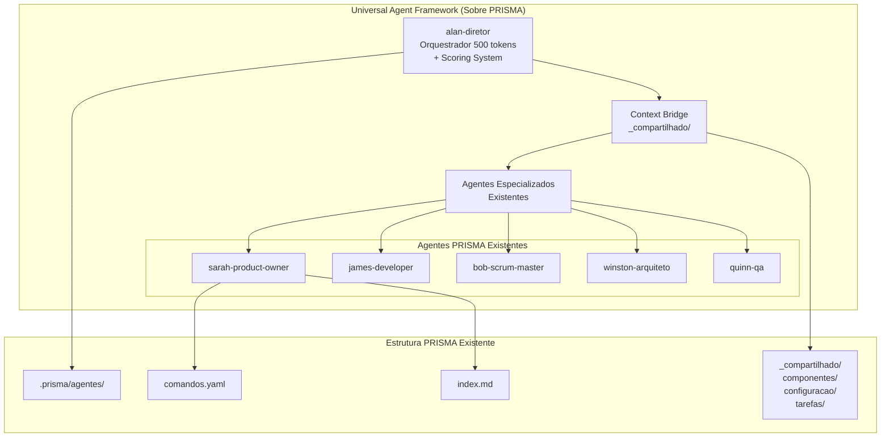
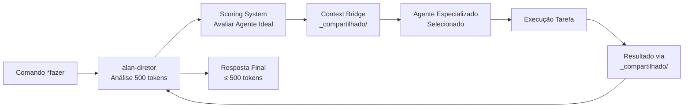
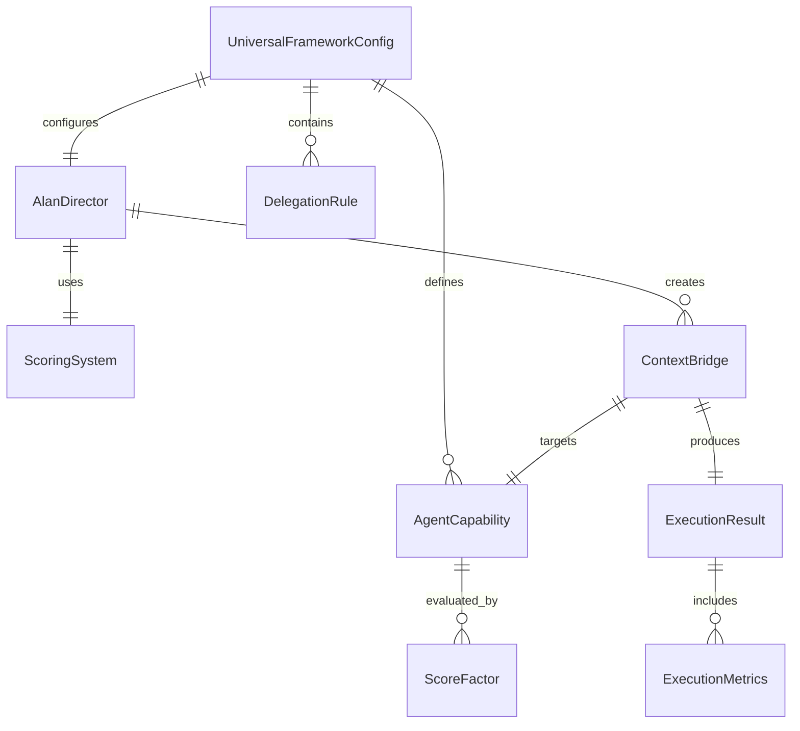
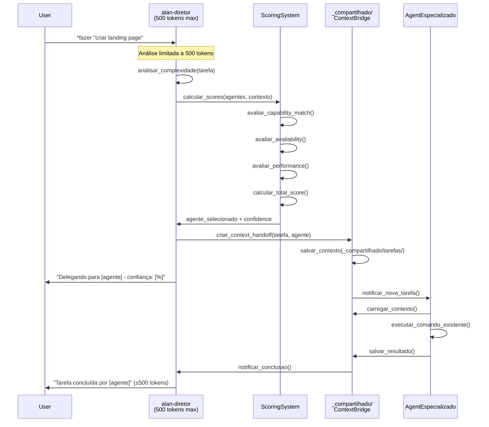
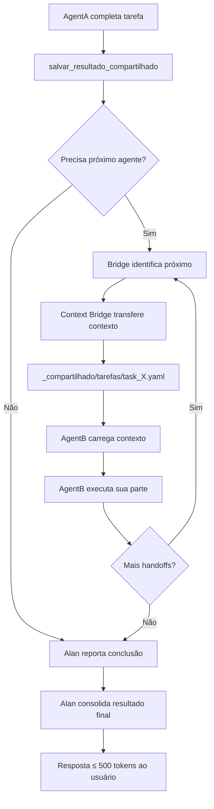
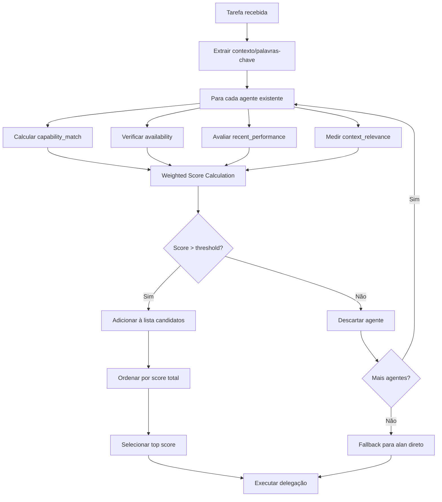

# Design Document - Universal Agent Framework

## Overview

O Universal Agent Framework é um sistema de orquestração inteligente que **estende o sistema PRISMA existente** sem criar novos arquivos ou estruturas. O framework utiliza o alan-diretor como orquestrador central com limite de 500 tokens, integrando sistema de scoring e context bridge através da estrutura _compartilhado/ existente.

### Objetivos do Design
- Implementar framework universal **SOBRE** o sistema PRISMA existente
- Usar alan-diretor como orquestrador inteligente com limite rígido de 500 tokens
- Integrar agentes especializados existentes (bob, sarah, james, quinn, winston)
- Implementar sistema de scoring no alan-diretor
- Usar estrutura _compartilhado/ como context bridge
- Funcionar através dos comandos *comando já estabelecidos
- Estender arquivos .md e .yaml existentes como configuração

## Architecture Design

### System Architecture Diagram



### Data Flow Diagram



## Component Design

### Alan-Diretor (Orquestrador Inteligente)

**Localização**: `.prisma/agentes/alan-diretor/`

**Responsabilidades**:
- Orquestração com limite rígido de 500 tokens por resposta
- Sistema de scoring integrado para seleção de agentes
- Análise de contexto e delegação inteligente
- Monitoramento de execução através de _compartilhado/

**Interfaces**:
```yaml
interface_alan:
  entrada:
    - comando: string (ex: "*fazer criar landing page")
    - contexto: object (do _compartilhado/)

  processamento:
    - analise_500_tokens: limitado a 500 tokens de análise
    - scoring_system: calculo de score para cada agente
    - delegacao: seleção baseada em score

  saida:
    - delegacao_agente: agente_id + contexto
    - resposta_usuario: ≤ 500 tokens
```

**Dependências**:
- `alan-diretor/comandos.yaml` (existente)
- `alan-diretor/index.md` (existente)
- `_compartilhado/configuracao/` (context bridge)

### Context Bridge (_compartilhado/)

**Localização**: `.prisma/agentes/_compartilhado/`

**Responsabilidades**:
- Transferência de contexto entre alan-diretor e agentes especializados
- Persistência de estado entre execuções
- Configurações globais do framework

**Interfaces**:
```yaml
interface_context_bridge:
  componentes/universal_framework.yaml:
    - scoring_weights: configuração pesos
    - agent_capabilities: mapa capacidades
    - delegation_rules: regras delegação

  configuracao/framework_config.yaml:
    - token_limits: limites por agente
    - execution_modes: modos execução
    - fallback_strategies: estratégias erro

  tarefas/active_tasks.yaml:
    - current_executions: execuções ativas
    - context_handoffs: transferências contexto
    - result_aggregation: agregação resultados
```

**Dependências**:
- Estrutura _compartilhado/ existente
- Agentes especializados existentes

### Agentes Especializados (Estendidos)

**Responsabilidades**:
- Manter funcionalidade original intacta
- Receber contexto via _compartilhado/
- Reportar resultados via _compartilhado/

**Interfaces**:
```yaml
interface_agente_estendido:
  entrada_universal:
    - contexto_task: via _compartilhado/tarefas/
    - config_framework: via _compartilhado/configuracao/

  processamento_existente:
    - manter_logica_original: true
    - usar_comandos_existentes: true
    - preservar_especializacao: true

  saida_universal:
    - resultado_task: via _compartilhado/tarefas/
    - metricas_execucao: via _compartilhado/componentes/
```

## Data Model

### Core Data Structure Definitions

```typescript
// Estruturas de dados do Universal Agent Framework
// Implementadas em YAML nos arquivos _compartilhado/

interface UniversalFrameworkConfig {
  version: string;
  alan_director: {
    token_limit: 500;
    scoring_enabled: true;
    context_bridge_path: "_compartilhado/";
  };
  agents: AgentCapability[];
  delegation_rules: DelegationRule[];
}

interface AgentCapability {
  agent_id: string; // "sarah-product-owner", "james-developer", etc.
  specialization: string[];
  trigger_patterns: string[];
  score_factors: ScoreFactor[];
  existing_commands: string[];
}

interface ScoringSystem {
  task_context: string;
  agent_scores: {
    [agent_id: string]: {
      capability_match: number;  // 0-100
      availability: number;      // 0-100
      recent_performance: number; // 0-100
      context_relevance: number; // 0-100
      total_score: number;       // weighted average
    };
  };
  selected_agent: string;
  confidence: number;
}

interface ContextBridge {
  task_id: string;
  source_agent: "alan-diretor";
  target_agent: string;
  context_payload: {
    task_description: string;
    user_input: string;
    relevant_files: string[];
    execution_mode: "sequential" | "parallel" | "conditional";
  };
  handoff_timestamp: string;
  result_expected: boolean;
}

interface ExecutionResult {
  task_id: string;
  agent_id: string;
  status: "completed" | "failed" | "needs_handoff";
  result_payload: any;
  execution_metrics: {
    duration_ms: number;
    tokens_used: number;
    files_modified: string[];
    commands_executed: string[];
  };
  next_handoff?: string; // próximo agente se necessário
}
```

### Data Model Diagrams



## Business Process

### Process 1: Comando Universal (*fazer)



### Process 2: Handoff Entre Agentes



### Process 3: Sistema de Scoring Integrado



## Error Handling Strategy

### Níveis de Recuperação

```yaml
error_handling:
  nivel_1_agente:
    - timeout_agente: 5min
    - fallback: tentar_comando_alternativo
    - escalacao: retornar_para_alan

  nivel_2_bridge:
    - context_corruption: restaurar_backup
    - handoff_failure: direct_execution
    - escalacao: modo_degradado

  nivel_3_alan:
    - scoring_failure: usar_delegacao_default
    - 500_token_exceeded: truncar_resposta_inteligente
    - total_failure: executar_direto_sem_delegacao
```

### Estratégias de Recuperação

1. **Agent Timeout**: Se agente não responde em 5min, alan retoma controle
2. **Context Bridge Failure**: Fallback para execução direta do alan
3. **Scoring System Error**: Usar regras de delegação padrão do comandos.yaml
4. **Token Limit Exceeded**: Truncamento inteligente preservando informações críticas

## Testing Strategy

### Testes de Integração

```yaml
integration_tests:
  alan_director:
    - test_500_token_limit: verificar truncamento
    - test_scoring_accuracy: precisão seleção agente
    - test_fallback_mechanisms: recuperação de erros

  context_bridge:
    - test_handoff_integrity: integridade transferência contexto
    - test_concurrent_tasks: múltiplas tarefas simultâneas
    - test_persistence: recuperação após reinicialização

  agent_extensions:
    - test_backward_compatibility: compatibilidade com comandos existentes
    - test_universal_integration: integração sem quebrar funcionalidade
    - test_result_reporting: retorno correto de resultados
```

### Testes de Performance

```yaml
performance_tests:
  alan_response_time:
    - target: <2s para decisão de delegação
    - token_analysis: <500ms para análise de 500 tokens

  context_bridge_latency:
    - handoff_time: <100ms para transferência
    - persistence_write: <50ms para salvar estado

  end_to_end:
    - simple_task: <10s total
    - complex_task: <5min com múltiplos handoffs
```

## Implementation Plan

### Fase 1: Extensão Alan-Diretor

1. **Adicionar Scoring System ao alan-diretor/index.md**
   - Seção de scoring integrado
   - Configuração de pesos
   - Limite de 500 tokens enforcement

2. **Estender alan-diretor/comandos.yaml**
   - Novos comandos universais
   - Regras de delegação baseadas em score
   - Fallback strategies

### Fase 2: Context Bridge Setup

1. **Criar estruturas em _compartilhado/**
   - `_compartilhado/componentes/universal_framework.yaml`
   - `_compartilhado/configuracao/framework_config.yaml`
   - `_compartilhado/tarefas/` (diretório para tarefas ativas)

### Fase 3: Agent Extensions

1. **Estender cada agente existente**
   - Adicionar seção Universal Framework aos index.md
   - Configurar compatibilidade com context bridge
   - Manter 100% compatibilidade com comandos existentes

### Fase 4: Testing & Validation

1. **Testes de integração completa**
2. **Validação de performance**
3. **Testes de backwards compatibility**
4. **Documentation updates**

---

**Framework Status**: Design Phase Complete
**Next Step**: Implementation Plan Approval
**Integration**: PRISMA System Compatible
**File Changes**: Extensions Only (No New Files)