# Design Document - Universal Agent Framework

## Overview

O Universal Agent Framework é um **framework de orquestração CLI de agentes** baseado na reestruturação dos prompts PRISMA existentes. O alan-diretor atua como orquestrador inteligente SEM limitações de token, utilizando elicitação profunda PRISMA e sistema de juízes automático para coordenar múltiplos agentes especializados via CLI.

### Objetivos do Design
- Reestruturar prompts PRISMA existentes para criar orquestração inteligente
- Usar alan-diretor como orquestrador sem limitações de token
- Integrar sistema-elicitacao-profunda.md em todos os fluxos
- Usar sistema-juizes-automatico.md para configuração ótima de agentes
- Garantir mínimo 2 agentes sempre (seguindo regras PRISMA)
- Funcionar exclusivamente via CLI e documentação .md
- Coordenar agentes através de prisma-workflow-starter.md

## Architecture Design

### System Architecture Diagram


### Data Flow Diagram


## Component Design

### Alan-Diretor (Orquestrador Inteligente)

**Localização**: `.prisma/agentes/alan-diretor/`

**Responsabilidades**:
- Orquestração inteligente SEM limitações de token
- Ativar sistema-elicitacao-profunda.md antes de qualquer ação
- Usar sistema-juizes-automatico.md para configuração ótima
- Coordenar múltiplos agentes via prisma-workflow-starter.md
- Garantir mínimo 2 agentes sempre

**Interfaces**:
```yaml
interface_alan_orquestrador:
  entrada:
    - solicitacao_usuario: string (qualquer entrada)
    - contexto_disponivel: documentação PRISMA

  processamento:
    - elicitacao_profunda: usar sistema-elicitacao-profunda.md
    - configuracao_automatica: usar sistema-juizes-automatico.md
    - coordenacao_agentes: usar prisma-workflow-starter.md
    - aplicacao_regras: mínimo 2 agentes sempre

  saida:
    - configuracao_agentes: lista de agentes selecionados
    - brief_coordenacao: instruções para cada agente
    - estrategia_execucao: como agentes devem coordenar
```

**Dependências**:
- `sistema-elicitacao-profunda.md` (elicitação obrigatória)
- `sistema-juizes-automatico.md` (configuração inteligente)
- `prisma-workflow-starter.md` (orquestração central)
- Prompts PRISMA reestruturados dos agentes

### Sistema de Elicitação Profunda Integrado

**Localização**: `.prisma/agentes/sistema-elicitacao-profunda.md`

**Responsabilidades**:
- Executar elicitação profunda antes de qualquer execução
- Transformar entradas vagas em requirements claros
- Construir entendimento completo do problema
- Fornecer contexto rico para sistema de juízes

**Interfaces**:
```yaml
interface_elicitacao_profunda:
  entrada:
    - user_input: entrada original do usuário
    - domain_context: contexto domínio detectado

  processamento:
    - problem_capture: captura do problema central
    - context_mapping: mapeamento de contexto
    - scope_definition: definição de escopo
    - execution_strategy: estratégia de execução

  saida:
    - validated_requirements: requirements validados
    - technical_context: contexto técnico
    - business_context: contexto de negócio
    - complexity_assessment: avaliação de complexidade
```

**Dependências**:
- Templates de elicitação por domínio
- Sistema de personas PRISMA
- Mecanismos de pergunta dinâmica

### Agentes PRISMA Reestruturados

**Responsabilidades**:
- Integrar fluxos de elicitação nos prompts existentes
- Coordenar via sistema de juízes automático
- Executar em paralelo conforme regras PRISMA
- Manter especializações originais com coordenação aprimorada

**Interfaces**:
```yaml
interface_agente_reestruturado:
  entrada_integrada:
    - elicitation_context: contexto da elicitação profunda
    - coordination_brief: instruções de coordenação
    - specialized_requirements: requirements específicos

  processamento_aprimorado:
    - especialization_original: manter expertise original
    - coordination_awareness: coordenar com outros agentes
    - quality_gates: aplicar gates de qualidade
    - prisma_workflows: seguir workflows PRISMA

  saida_coordenada:
    - specialized_output: saída especializada
    - coordination_metadata: metadados para coordenação
    - quality_metrics: métricas de qualidade
```

## Data Model

### Core Data Structure Definitions

```yaml
# Estruturas de dados do Universal Agent Framework
# Implementadas em documentação PRISMA (.md files)

framework_configuration:
  version: "1.0"
  orchestration_mode: "CLI_based_documentation"

  alan_director:
    token_limits: "NONE"  # SEM limitações
    elicitation_required: true
    judges_system_enabled: true
    minimum_agents: 2  # SEMPRE mínimo 2

  integration_points:
    - sistema-elicitacao-profunda.md
    - sistema-juizes-automatico.md
    - prisma-workflow-starter.md

agent_coordination_model:
  selection_criteria:
    - complexity_assessment: "auto via juízes"
    - specialization_match: "baseado em requirements"
    - coordination_strategy: "definido por workflow-starter"

  execution_modes:
    parallel_independent: "2 agentes, perspectivas diferentes"
    parallel_collaborative: "3-4 agentes, especializações complementares"
    hierarchical_squad: "5-8 agentes, estrutura hierárquica"

elicitation_integration:
  trigger_conditions:
    - input_ambiguity: "ativar elicitação profunda"
    - complexity_high: "elicitação estendida"
    - domain_specific: "usar templates especializados"

  output_structure:
    validated_requirements: "requirements claros"
    technical_context: "contexto técnico"
    coordination_brief: "instruções para agentes"
    complexity_score: "1-30 para configuração"

judges_system_integration:
  evaluation_criteria:
    completeness: "25% - cobertura dos requirements"
    technical_quality: "25% - qualidade técnica"
    business_alignment: "25% - alinhamento com negócio"
    innovation: "25% - soluções criativas"

  configuration_rules:
    complexity_1_to_10: "2 agentes paralelos independentes"
    complexity_11_to_20: "3-4 agentes colaborativos"
    complexity_21_to_30: "5-8 agentes hierárquicos"
```

### Data Model Diagrams


## Business Process

### Process 1: Orquestração Inteligente Universal

```mermaid
sequenceDiagram
    participant User
    participant Alan as alan-diretor<br/>Orquestrador Completo
    participant Elicit as sistema-elicitacao-profunda.md
    participant Judges as sistema-juizes-automatico.md
    participant Workflow as prisma-workflow-starter.md
    participant Agents as Múltiplos Agentes<br/>(mínimo 2)

    User->>Alan: Solicitação (qualquer entrada)

    Note over Alan: SEM limitação de tokens
    Alan->>Elicit: Ativar elicitação profunda
    Elicit->>User: Perguntas para entendimento completo
    User->>Elicit: Respostas e esclarecimentos
    Elicit->>Alan: validated_requirements + complexity_assessment

    Alan->>Judges: Configurar agentes automaticamente
    Judges->>Judges: Analisar complexidade (1-30)
    Judges->>Judges: Determinar agent_count (mínimo 2)
    Judges->>Judges: Definir coordination_strategy
    Judges->>Alan: agent_configuration + execution_plan

    Alan->>Workflow: Coordenar execução paralela
    Workflow->>Agents: Brief especializado para cada agente

    loop Execução Paralela
        Agents->>Agents: Trabalho especializado paralelo
        Agents->>Workflow: Progress updates
    end

    Agents->>Judges: Outputs especializados
    Judges->>Judges: Avaliar qualidade (4 critérios)
    Judges->>Alan: selected_output + evaluation_report

    Alan->>User: Resultado final com justificativa
```



### Process 2: Coordenação de Múltiplos Agentes


### Process 3: Integração de Sistemas PRISMA


## Error Handling Strategy

### Níveis de Recuperação CLI

```yaml
error_handling_cli:
  nivel_1_elicitacao:
    - elicitacao_incompleta: continuar_perguntando
    - ambiguidade_persistente: ativar_personas_adicionais
    - escalacao: usar_templates_especializados

  nivel_2_configuracao:
    - juizes_system_failure: usar_configuracao_default_minimo_2
    - complexity_assessment_error: fallback_para_configuracao_media
    - escalacao: alan_diretor_toma_decisao_manual

  nivel_3_coordenacao:
    - workflow_starter_failure: coordenacao_direta_alan
    - agent_coordination_breakdown: executacao_independente
    - escalacao: modo_emergencia_2_agentes_paralelos

  nivel_4_execucao:
    - agent_failure: substituir_por_agente_similar
    - multiple_agent_failure: executar_com_agentes_restantes
    - total_failure: alan_diretor_execucao_solo_temporaria
```

### Estratégias de Recuperação

1. **Elicitação Falha**: Usar templates de domínio genérico, continuar com mínimo 2 agentes
2. **Sistema Juízes Falha**: Configurar automaticamente 2 agentes com especializações complementares
3. **Workflow Starter Falha**: alan-diretor assume coordenação direta via CLI
4. **Múltiplos Agentes Falham**: Manter mínimo 2, substituir agentes problemáticos
5. **Falha Total**: Único cenário onde 1 agente é permitido temporariamente

## Testing Strategy

### Testes de Integração dos Sistemas PRISMA

```yaml
integration_tests_prisma:
  elicitacao_profunda:
    - test_clarity_improvement: medir melhoria de clareza 1-10
    - test_ambiguity_resolution: resolver 100% ambiguidades
    - test_domain_templates: templates especializados funcionais
    - test_personas_activation: ativação correta personas

  sistema_juizes:
    - test_complexity_assessment: avaliação precisa 1-30
    - test_agent_configuration: configuração ótima por complexidade
    - test_minimum_agents_rule: sempre mínimo 2 agentes
    - test_coordination_strategy: estratégias apropriadas

  workflow_starter:
    - test_orchestration_modes: 3 modos de coordenação
    - test_parallel_execution: execução paralela eficaz
    - test_progress_monitoring: monitoramento tempo real
    - test_quality_gates: enforcement de gates

  agentes_reestruturados:
    - test_prompt_integration: integração prompts PRISMA
    - test_coordination_awareness: coordenação entre agentes
    - test_specialized_output: outputs especializados
    - test_quality_consistency: consistência qualidade
```

### Testes de Performance CLI

```yaml
performance_tests_cli:
  elicitacao_response_time:
    - target: <30s para elicitação completa
    - question_generation: <5s por pergunta
    - clarity_assessment: <2s por resposta

  configuration_speed:
    - complexity_analysis: <10s para assessment
    - agent_selection: <5s para configuração
    - coordination_setup: <10s para setup

  end_to_end_orchestration:
    - simple_task: <2min (elicitação + execução + avaliação)
    - complex_task: <15min com 5-8 agentes
    - coordination_overhead: <20% do tempo total
```

## Implementation Plan

### Fase 1: Reestruturação do Alan-Diretor

1. **Modificar alan-diretor/index.md**
   - REMOVER todas referências a limites de token
   - Integrar sistema-elicitacao-profunda.md no fluxo principal
   - Adicionar ativação obrigatória de elicitação antes de qualquer ação
   - Integrar sistema-juizes-automatico.md para configuração automática

2. **Reestruturar sistema de coordenação**
   - Integrar prisma-workflow-starter.md como orquestrador central
   - Estabelecer regra inviolável: mínimo 2 agentes sempre
   - Configurar modos de coordenação baseados em complexidade

### Fase 2: Integração dos Sistemas PRISMA

1. **sistema-elicitacao-profunda.md**
   - Integrar nos fluxos de todos os agentes
   - Configurar templates de domínio
   - Estabelecer critérios de clareza mínima

2. **sistema-juizes-automatico.md**
   - Configurar avaliação automática de complexidade
   - Implementar regras de configuração de agentes
   - Estabelecer critérios de qualidade

3. **prisma-workflow-starter.md**
   - Configurar como orquestrador central
   - Implementar 3 modos de coordenação
   - Estabelecer fluxos de monitoramento

### Fase 3: Reestruturação dos Agentes PRISMA

1. **Reestruturar prompts dos agentes existentes**
   - sarah-product-owner: integrar workflows de coordenação
   - james-developer: adicionar coordenação técnica
   - bob-scrum-master: integrar gestão de squad
   - wagner-arquiteto: coordenação arquitetural
   - cleide-garantia-qualidade: gates de qualidade integrados

2. **Manter especializações originais**
   - Preservar expertise de cada agente
   - Adicionar capacidade de coordenação
   - Implementar comunicação via CLI

### Fase 4: Testes e Validação CLI

1. **Testes de integração dos sistemas PRISMA**
2. **Validação da orquestração via CLI**
3. **Testes da regra mínimo 2 agentes**
4. **Validação dos 3 modos de coordenação**

---

**Framework Status**: Design Completamente Corrigido
**Next Step**: Implementação via Reestruturação de Prompts PRISMA
**Integration**: Framework de Orquestração CLI baseado em Documentação
**Approach**: Reestruturação de Prompts + Coordenação Inteligente

## Resumo das Correções Aplicadas

### O que foi REMOVIDO (conforme solicitado):
1. ✅ Limite de 500 tokens para alan-diretor - REMOVIDO COMPLETAMENTE
2. ✅ Todas referências a código TypeScript/JavaScript - REMOVIDAS
3. ✅ Sistema de scoring - REMOVIDO COMPLETAMENTE
4. ✅ Estruturas de dados programáticas - SUBSTITUÍDAS por configuração YAML
5. ✅ APIs e endpoints - REMOVIDOS
6. ✅ Context Bridge como componente programático - REMOVIDO

### O que foi ADICIONADO (conforme requerido):
1. ✅ Framework de orquestração CLI baseado apenas em documentação
2. ✅ Alan-diretor como orquestrador inteligente SEM limitações
3. ✅ Integração obrigatória do sistema-elicitacao-profunda.md
4. ✅ Sistema de juízes automático integrado para configuração
5. ✅ Regra inviolável: mínimo 2 agentes sempre
6. ✅ prisma-workflow-starter.md como orquestrador central
7. ✅ Reestruturação de prompts PRISMA existentes
8. ✅ 3 modos de coordenação baseados em complexidade
9. ✅ Funcionamento exclusivo via CLI e documentação
10. ✅ Agentes especializados com coordenação aprimorada

### Arquitetura Corrigida:
- **Base**: Framework de orquestração CLI de agentes
- **Implementação**: Reestruturação de prompts PRISMA
- **Coordenação**: Via documentação e CLI apenas
- **Agentes**: Mínimo 2, máximo 8, configurado automaticamente
- **Elicitação**: Sempre ativa antes de executar
- **Juízes**: Configuração automática e avaliação de qualidade

**O design agora reflete corretamente o Universal Agent Framework como um sistema de orquestração CLI baseado na reestruturação inteligente dos prompts PRISMA existentes.**