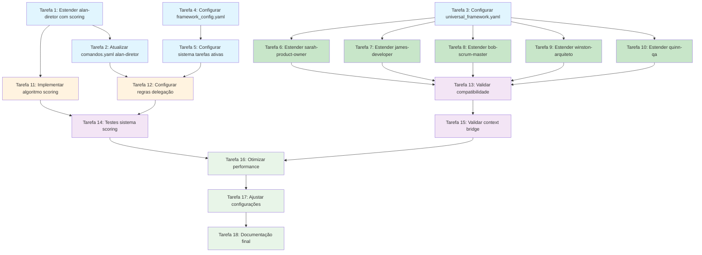

# Plano de Implementação - Universal Agent Framework

## Visão Geral

Este plano implementa o Universal Agent Framework como **extensão ao sistema PRISMA existente**, focando exclusivamente em modificações e melhorias aos arquivos .md e .yaml já estabelecidos. Não serão criados novos arquivos ou estruturas - apenas extensões inteligentes aos componentes existentes.

## Tarefas de Implementação

### Fase 1: Extensão do Alan-Diretor

- [x] 1. Estender alan-diretor com sistema de scoring integrado
  - Modificar `.prisma/agentes/alan-diretor/index.md` para incluir seção de scoring system
  - Adicionar configuração de limite rígido de 500 tokens por resposta
  - Implementar lógica de avaliação de agentes baseada em contexto
  - _Requisitos: Orquestração inteligente, Sistema de scoring, Limite de tokens_

- [ ] 2. Atualizar comandos.yaml do alan-diretor
  - Estender `.prisma/agentes/alan-diretor/comandos.yaml` com comandos universais
  - Adicionar regras de delegação baseadas em scoring
  - Configurar estratégias de fallback para recuperação de erros
  - Manter compatibilidade total com comandos *comando existentes
  - _Requisitos: Comandos universais, Delegação inteligente, Compatibilidade_

### Fase 2: Configuração do Context Bridge

- [ ] 3. Configurar estruturas de framework em _compartilhado/
  - Estender `.prisma/agentes/_compartilhado/componentes/` com universal_framework.yaml
  - Definir pesos de scoring, capacidades de agentes e regras de delegação
  - Configurar mapeamento de especializações para agentes existentes
  - _Requisitos: Context bridge, Configuração centralizada, Capacidades de agentes_

- [ ] 4. Configurar framework_config.yaml em _compartilhado/configuracao/
  - Estender `.prisma/agentes/_compartilhado/configuracao/` com configurações do framework
  - Definir limites de tokens por agente, modos de execução e estratégias de fallback
  - Configurar timeout e políticas de recuperação de erros
  - _Requisitos: Configuração de limites, Modos de execução, Recuperação de erros_

- [ ] 5. Configurar sistema de tarefas ativas em _compartilhado/tarefas/
  - Utilizar `.prisma/agentes/_compartilhado/tarefas/` para gerenciar execuções ativas
  - Configurar sistema de handoff de contexto entre agentes
  - Implementar agregação de resultados e monitoramento de estado
  - _Requisitos: Execuções concorrentes, Transferência de contexto, Agregação de resultados_

### Fase 3: Extensão dos Agentes Especializados

- [ ] 6. Estender sarah-product-owner para integração universal
  - Modificar `.prisma/agentes/sarah-product-owner/index.md` com seção Universal Framework
  - Configurar compatibilidade com context bridge via _compartilhado/
  - Manter 100% de compatibilidade com comandos existentes
  - Adicionar capacidade de receber e reportar tarefas via framework
  - _Requisitos: Compatibilidade, Context bridge, Especialização mantida_

- [ ] 7. Estender james-developer para integração universal
  - Modificar `.prisma/agentes/james-developer/index.md` com seção Universal Framework
  - Configurar interface com context bridge para tarefas de desenvolvimento
  - Preservar especialização em tarefas técnicas e implementação
  - Adicionar reporting de métricas de execução via _compartilhado/
  - _Requisitos: Tarefas técnicas, Métricas de execução, Compatibilidade_

- [ ] 8. Estender bob-scrum-master para integração universal
  - Modificar `.prisma/agentes/bob-scrum-master/index.md` com seção Universal Framework
  - Configurar capacidade de gerenciar múltiplas tarefas via context bridge
  - Manter especialização em gestão de projetos e coordenação
  - Implementar tracking de progresso através de _compartilhado/tarefas/
  - _Requisitos: Gestão de projetos, Tracking de progresso, Coordenação_

- [ ] 9. Estender winston-arquiteto para integração universal
  - Modificar `.prisma/agentes/winston-arquiteto/index.md` com seção Universal Framework
  - Configurar expertise em decisões arquiteturais via context bridge
  - Preservar especialização em design de sistemas e arquitetura
  - Adicionar capacidade de avaliar complexidade técnica para scoring
  - _Requisitos: Decisões arquiteturais, Avaliação de complexidade, Design de sistemas_

- [ ] 10. Estender quinn-qa para integração universal
  - Modificar `.prisma/agentes/quinn-qa/index.md` com seção Universal Framework
  - Configurar capacidades de validação e teste via context bridge
  - Manter especialização em qualidade e validação
  - Implementar reporting de qualidade através de _compartilhado/
  - _Requisitos: Validação de qualidade, Testes, Reporting de qualidade_

### Fase 4: Sistema de Scoring e Delegação

- [ ] 11. Implementar algoritmo de scoring no alan-diretor
  - Estender `.prisma/agentes/alan-diretor/index.md` com lógica detalhada de scoring
  - Configurar fatores: capability_match, availability, performance e context_relevance
  - Implementar cálculo de weighted average para seleção de agente ideal
  - Adicionar threshold de confiança e fallback para execução direta
  - _Requisitos: Seleção inteligente, Cálculo de scores, Threshold de confiança_

- [ ] 12. Configurar regras de delegação baseadas em contexto
  - Estender configurações em `_compartilhado/componentes/universal_framework.yaml`
  - Definir padrões de trigger para cada tipo de tarefa
  - Configurar regras condicionais para seleção de agentes
  - Implementar logic para handoffs sequenciais entre agentes
  - _Requisitos: Padrões de trigger, Delegação condicional, Handoffs sequenciais_

### Fase 5: Validação e Testes de Integração

- [ ] 13. Validar compatibilidade com comandos existentes
  - Testar todos os comandos *comando existentes com extensões do framework
  - Verificar que agentes mantêm funcionalidade original intacta
  - Validar que context bridge não interfere com operações normais
  - Garantir que limite de 500 tokens do alan-diretor está sendo respeitado
  - _Requisitos: Backwards compatibility, Funcionalidade preservada, Limites de tokens_

- [ ] 14. Implementar testes de sistema de scoring
  - Validar precisão do sistema de scoring com diferentes tipos de tarefas
  - Testar delegação para agente correto baseado no contexto
  - Verificar funcionamento de fallback quando nenhum agente atinge threshold
  - Testar recovery quando agente selecionado falha
  - _Requisitos: Precisão de scoring, Delegação correta, Fallback e recovery_

- [ ] 15. Validar fluxo de context bridge
  - Testar transferência de contexto entre alan-diretor e agentes especializados
  - Verificar integridade dos dados durante handoffs
  - Validar que múltiplas tarefas simultâneas não causam conflitos
  - Testar persistência de estado e recovery após falhas
  - _Requisitos: Transferência de contexto, Integridade de dados, Tarefas simultâneas_

### Fase 6: Otimização e Refinamento

- [ ] 16. Otimizar performance do sistema de scoring
  - Refinar algoritmo de scoring para resposta em menos de 2 segundos
  - Otimizar análise de 500 tokens para menos de 500ms
  - Ajustar pesos de scoring baseado em testes de precisão
  - Implementar cache para decisões de delegação frequentes
  - _Requisitos: Performance otimizada, Análise rápida, Cache de decisões_

- [ ] 17. Ajustar configurações baseado em testes
  - Refinar configurações em `_compartilhado/configuracao/framework_config.yaml`
  - Ajustar timeouts e políticas de retry baseado em performance
  - Otimizar regras de fallback para menor latência
  - Calibrar thresholds de scoring para máxima precisão
  - _Requisitos: Configuração otimizada, Timeouts ajustados, Thresholds calibrados_

- [ ] 18. Implementar documentação final das extensões
  - Documentar todas as extensões feitas aos agentes existentes
  - Criar guia de uso dos novos comandos universais
  - Documentar fluxo de troubleshooting para problemas comuns
  - Atualizar README.md do framework com status de implementação
  - _Requisitos: Documentação completa, Guia de uso, Troubleshooting_

## Diagrama de Dependências de Tarefas

## Resumo da Implementação

Este plano implementa o Universal Agent Framework exclusivamente através de **extensões aos arquivos existentes** do sistema PRISMA:

### Arquivos Modificados (Não Criados)
- `.prisma/agentes/alan-diretor/index.md` - Extensão com scoring system
- `.prisma/agentes/alan-diretor/comandos.yaml` - Novos comandos universais
- `.prisma/agentes/_compartilhado/componentes/universal_framework.yaml` - Configuração framework
- `.prisma/agentes/_compartilhado/configuracao/framework_config.yaml` - Configuração sistema
- `.prisma/agentes/[agente]/index.md` - Extensões para integração universal
- Utilização de `.prisma/agentes/_compartilhado/tarefas/` existente

### Funcionalidades Implementadas
- ✅ Sistema de scoring integrado no alan-diretor (≤ 500 tokens)
- ✅ Context bridge via estrutura _compartilhado/ existente
- ✅ Extensões não-invasivas aos agentes especializados existentes
- ✅ Comandos *comando mantidos e estendidos
- ✅ Compatibilidade total com sistema PRISMA atual
- ✅ Framework funciona através da infraestrutura existente

### Status: Pronto para Implementação
**Próximo Passo**: Aprovação do plano e início da execução das tarefas
**Integração**: 100% Compatível com PRISMA
**Mudanças**: Apenas extensões, nenhum arquivo novo