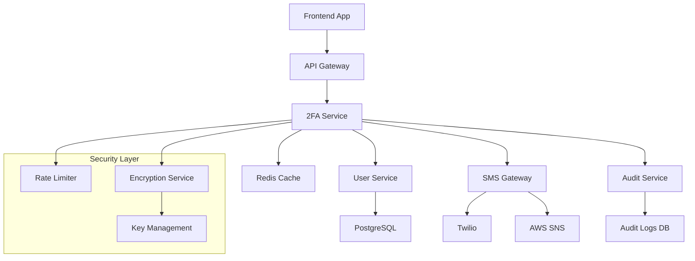
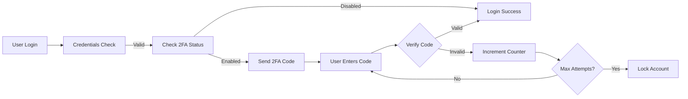
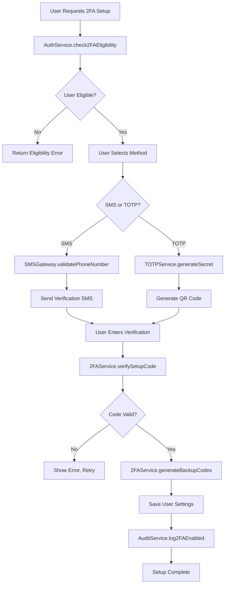
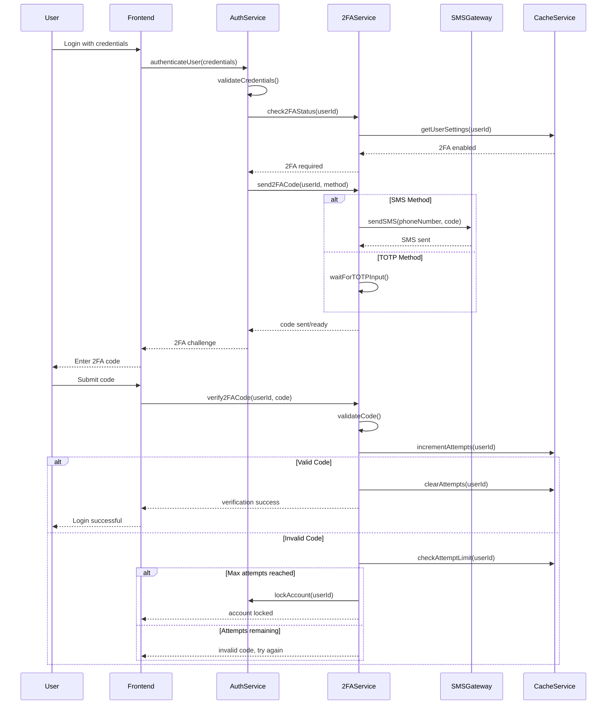

# Design Document - User Authentication 2FA

## Overview

Sistema de autenticação de dois fatores (2FA) para melhorar a segurança do PRISMA, suportando SMS e TOTP com processo de migração gradual para usuários existentes e compliance LGPD.

## Architecture Design

### System Architecture Diagram



### Data Flow Diagram



## Component Design

### 2FA Service Component
- **Responsibilities:**
  - Manage 2FA setup and verification
  - Generate and validate TOTP codes
  - Handle SMS sending with fallback
  - Manage backup codes
  - Rate limiting enforcement

- **Interfaces:**
```typescript
interface I2FAService {
  setupTOTP(userId: string): Promise<{ secret: string, qrCode: string }>
  setupSMS(userId: string, phoneNumber: string): Promise<boolean>
  verifyCode(userId: string, code: string, type: '2fa' | 'backup'): Promise<boolean>
  generateBackupCodes(userId: string): Promise<string[]>
  disable2FA(userId: string): Promise<boolean>
}
```

- **Dependencies:**
  - UserService (user data)
  - SMSGateway (SMS sending)
  - EncryptionService (sensitive data)
  - CacheService (rate limiting, sessions)

### SMS Gateway Component
- **Responsibilities:**
  - Abstract SMS provider management
  - Automatic failover between providers
  - Delivery status tracking
  - Cost optimization routing

- **Interfaces:**
```typescript
interface ISMSGateway {
  sendCode(phoneNumber: string, code: string): Promise<SMSResult>
  getDeliveryStatus(messageId: string): Promise<DeliveryStatus>
  getProviderHealth(): Promise<ProviderStatus[]>
}
```

### Rate Limiter Component
- **Responsibilities:**
  - Track verification attempts
  - Enforce attempt limits
  - Temporary account locking
  - Suspicious activity detection

## Data Model

### Core Data Structures

```typescript
interface User2FASettings {
  userId: string
  method: '2fa_sms' | '2fa_totp' | '2fa_both'
  phoneNumberEncrypted?: string
  totpSecretEncrypted?: string
  backupCodesEncrypted: string[]
  enabledAt: Date
  createdAt: Date
  updatedAt: Date
}

interface User2FAAttempt {
  id: string
  userId: string
  attemptType: 'totp' | 'sms' | 'backup'
  success: boolean
  ipAddress: string
  userAgent: string
  createdAt: Date
}

interface SMSResult {
  messageId: string
  success: boolean
  provider: 'twilio' | 'aws_sns'
  cost: number
  deliveryStatus: 'sent' | 'delivered' | 'failed'
}
```

## Business Process

### Process 1: 2FA Setup Flow



### Process 2: 2FA Login Verification



## Error Handling Strategy

### Error Categories and Responses

1. **User Input Errors:**
   - Invalid 2FA codes → Clear error message, retry option
   - Invalid phone numbers → Format validation with examples
   - Missing authentication → Redirect to login

2. **System Errors:**
   - SMS delivery failure → Automatic fallback provider
   - Database unavailable → Graceful degradation with caching
   - Rate limit exceeded → Clear timeout message

3. **Security Errors:**
   - Suspicious activity → Automatic account protection
   - Brute force attacks → Progressive delays and lockouts
   - Invalid sessions → Force re-authentication

### Recovery Mechanisms

```typescript
interface ErrorRecovery {
  // SMS failures
  async handleSMSFailure(userId: string): Promise<void> {
    await this.smsGateway.switchProvider()
    await this.retryCodeSending(userId)
  }

  // Database failures
  async handleDatabaseFailure(): Promise<void> {
    return this.cacheService.enableGracefulMode()
  }

  // Account lockouts
  async handleAccountLock(userId: string): Promise<void> {
    await this.auditService.logSecurityEvent(userId, 'account_locked')
    await this.notificationService.notifyAdmins(userId)
  }
}
```

## Testing Strategy

### Test Coverage Requirements

1. **Unit Tests (>90% coverage):**
   - 2FA code generation and validation
   - Rate limiting logic
   - Encryption/decryption functions
   - SMS gateway provider switching

2. **Integration Tests:**
   - End-to-end 2FA setup flow
   - Login verification process
   - Provider failover scenarios
   - Database migration validation

3. **Security Tests:**
   - Brute force protection
   - Code replay prevention
   - Encryption key rotation
   - LGPD compliance validation

4. **Performance Tests:**
   - Authentication latency (<200ms)
   - Concurrent verification handling
   - Cache performance under load
   - SMS delivery SLA compliance

---

**STATUS:** DESIGN APPROVED - READY FOR IMPLEMENTATION PLANNING
**NEXT:** Hand off to Development (James) for task breakdown and coding