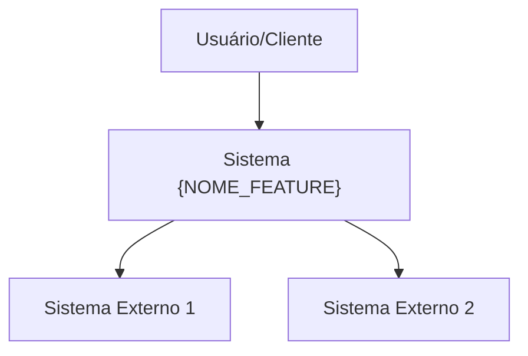
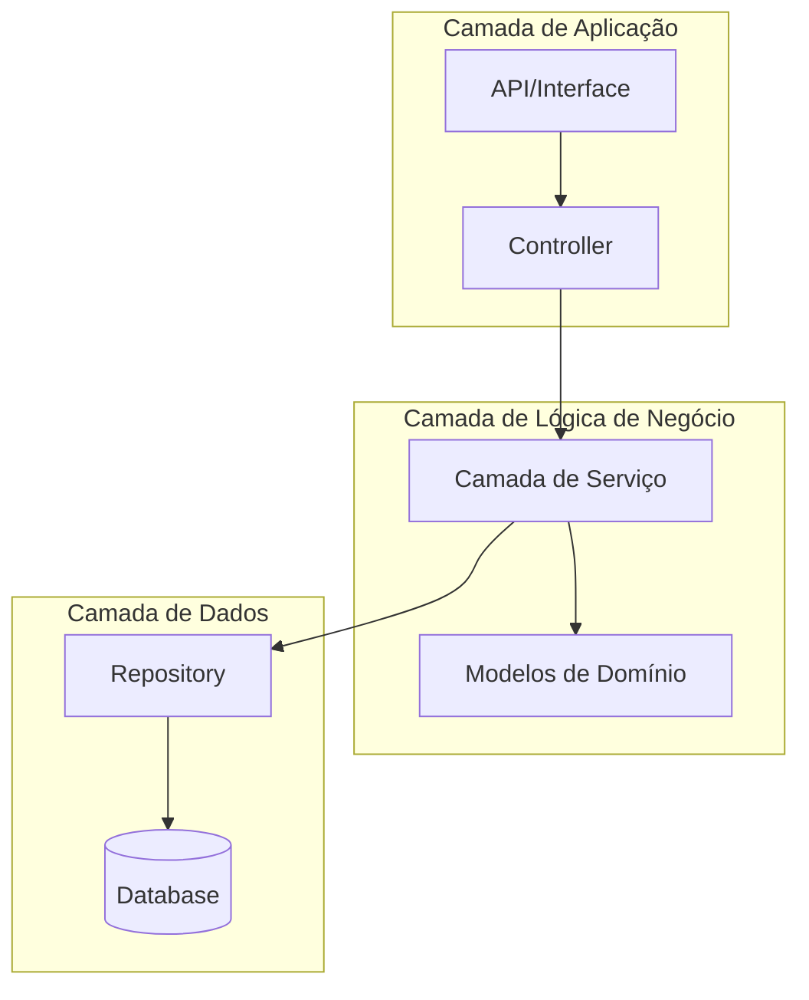
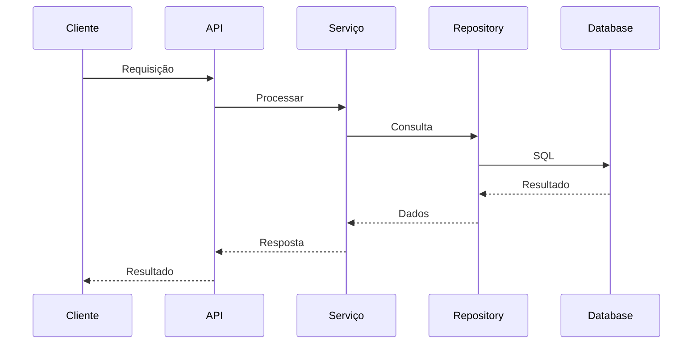
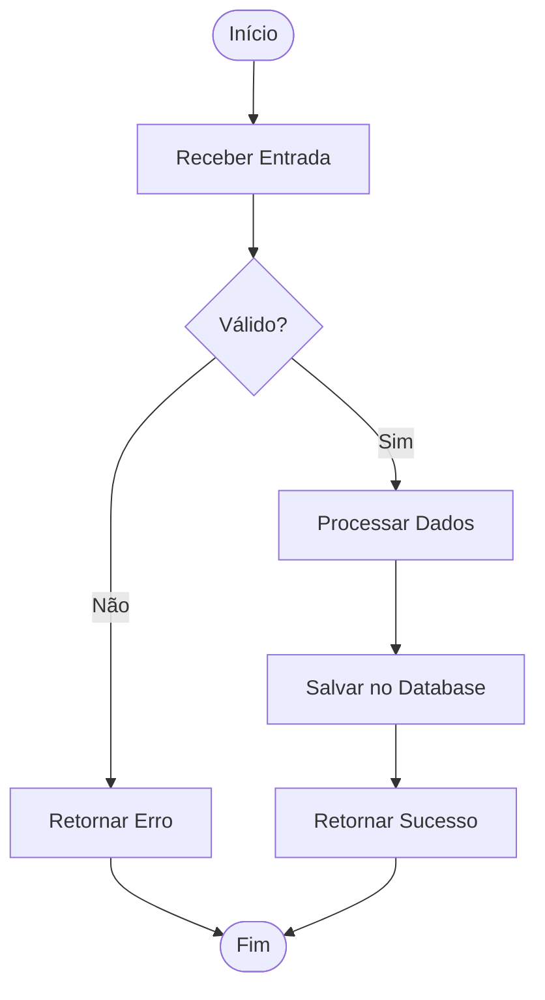
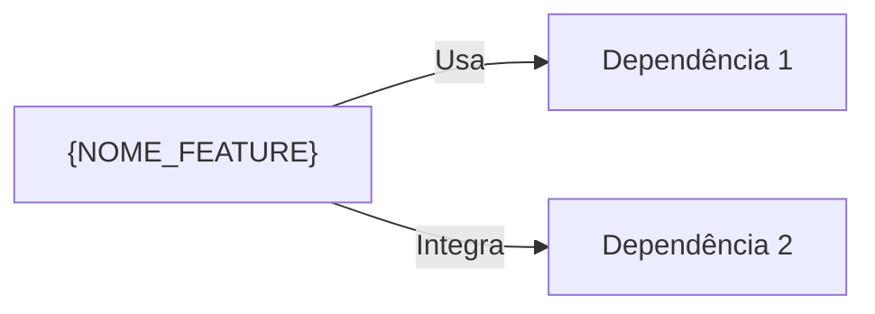

# Documento de Design - {NOME_FEATURE}

## Metadados

- **Nome da Feature**: {NOME_FEATURE}
- **Criado em**: {DATA}
- **Última Atualização**: {DATA}
- **Status**: Rascunho
- **Versão**: 0.1.0
- **Baseado em Requisitos**: requisitos.md v{VERSAO}

## Resumo Executivo

<!-- Resumo de alto nível do design desta feature -->

## Visão Geral da Arquitetura

### Contexto do Sistema



### Arquitetura de Componentes



## Design Detalhado

### Componente 1: {Nome do Componente}

#### Responsabilidade

<!-- O que este componente faz? -->

#### Interface

```javascript
// Definição da API/Interface
class NomeDoComponente {
  /**
   * Descrição do método
   * @param {Type} param1 - Descrição
   * @returns {Type} Descrição
   */
  nomeDoMetodo(param1) {
    // Detalhes da implementação
  }
}
```

#### Detalhes de Implementação

<!-- Detalhes de como o componente funciona internamente -->

#### Dependências

- {Dependência 1}
- {Dependência 2}

### Componente 2: {Nome do Componente}

#### Responsabilidade

<!-- O que este componente faz? -->

#### Interface

```javascript
// Definição da API/Interface
```

#### Detalhes de Implementação

<!-- Detalhes de como o componente funciona internamente -->

## Design de Dados

### Modelos de Dados

#### Modelo 1: {Nome do Modelo}

```javascript
{
  id: "string (UUID)",
  name: "string",
  description: "string",
  status: "enum: active|inactive|deleted",
  metadata: {
    createdAt: "timestamp",
    updatedAt: "timestamp",
    createdBy: "string (user_id)"
  }
}
```

**Regras de Validação**:

- `id`: Obrigatório, único, formato UUID
- `name`: Obrigatório, máximo 255 caracteres
- `status`: Obrigatório, um de: active, inactive, deleted

### Schema do Database

```sql
CREATE TABLE {table_name} (
  id UUID PRIMARY KEY DEFAULT gen_random_uuid(),
  name VARCHAR(255) NOT NULL,
  description TEXT,
  status VARCHAR(20) NOT NULL DEFAULT 'active',
  created_at TIMESTAMP NOT NULL DEFAULT NOW(),
  updated_at TIMESTAMP NOT NULL DEFAULT NOW(),
  created_by UUID REFERENCES users(id)
);

CREATE INDEX idx_{table_name}_status ON {table_name}(status);
CREATE INDEX idx_{table_name}_created_at ON {table_name}(created_at);
```

### Fluxo de Dados



## Design da API

### Endpoint 1: {Nome do Endpoint}

**Método**: GET | POST | PUT | DELETE
**Caminho**: `/api/v1/resource/{id}`
**Autenticação**: Obrigatória | Opcional | Nenhuma

**Requisição**:

```json
{
  "field1": "value",
  "field2": "value"
}
```

**Resposta** (200 OK):

```json
{
  "success": true,
  "data": {
    "id": "123",
    "field1": "value"
  }
}
```

**Resposta de Erro** (400 Bad Request):

```json
{
  "success": false,
  "error": {
    "code": "VALIDATION_ERROR",
    "message": "Entrada inválida",
    "details": []
  }
}
```

## Lógica de Negócio

### Fluxo de Processo 1: {Nome do Processo}



**Passos**:

1. Receber e validar entrada
2. Processar lógica de negócio
3. Persistir dados
4. Retornar resultado

### Regras de Negócio

#### RN-001: {Nome da Regra}

**Regra**: {Descrição da regra de negócio}
**Implementação**: {Como esta regra é aplicada no código}

## Design de Segurança

### Autenticação

<!-- Como a autenticação é implementada? -->

### Autorização

<!-- Como a autorização é implementada? -->

### Proteção de Dados

<!-- Como os dados sensíveis são protegidos? -->

### Considerações de Segurança

- {Consideração de segurança 1}
- {Consideração de segurança 2}

## Design de Performance

### Requisitos de Performance

- {Requisito 1}: < Xms tempo de resposta
- {Requisito 2}: Suportar X usuários simultâneos

### Estratégias de Otimização

- **Caching**: {Estratégia de caching}
- **Database**: {Otimização de database}
- **API**: {Otimização de API}

### Monitoramento de Performance

- {Métrica 1 para monitorar}
- {Métrica 2 para monitorar}

## Tratamento de Erros

### Categorias de Erro

#### Erros do Cliente (4xx)

- `400 Bad Request`: Entrada inválida
- `401 Unauthorized`: Autenticação necessária
- `403 Forbidden`: Permissões insuficientes
- `404 Not Found`: Recurso não encontrado

#### Erros do Servidor (5xx)

- `500 Internal Server Error`: Erro inesperado
- `503 Service Unavailable`: Serviço temporariamente indisponível

### Formato de Resposta de Erro

```javascript
{
  success: false,
  error: {
    code: "ERROR_CODE",
    message: "Mensagem legível para humanos",
    details: [], // Detalhes adicionais opcionais
    timestamp: "ISO 8601 timestamp",
    requestId: "UUID"
  }
}
```

## Estratégia de Testes

### Testes Unitários

- Testar componentes individuais em isolamento
- Simular dependências (mock)
- Meta de cobertura: 80%

### Testes de Integração

- Testar interações entre componentes
- Usar database de testes
- Testar endpoints da API

### Testes E2E

- Testar fluxos completos de usuário
- Testar caminhos críticos

## Considerações de Deploy

### Variáveis de Ambiente

```bash
FEATURE_ENABLED=true
FEATURE_CACHE_TTL=3600
FEATURE_MAX_REQUESTS=1000
```

### Migrações de Database

<!-- Lista de migrations necessárias -->

### Configuração

<!-- Configurações necessárias -->

## Monitoramento e Observabilidade

### Métricas para Rastrear

- {Métrica 1}: {Descrição}
- {Métrica 2}: {Descrição}

### Logs

- {O que logar}
- Nível de log: INFO | WARN | ERROR

### Alertas

- {Condição de alerta 1}
- {Condição de alerta 2}

## Dependências e Integração

### Dependências Internas

- {Módulo/Serviço 1}
- {Módulo/Serviço 2}

### Dependências Externas

- {Serviço Externo 1}: {Propósito}
- {Serviço Externo 2}: {Propósito}

### Pontos de Integração



## Migração e Rollback

### Plano de Migração

1. {Passo 1}
2. {Passo 2}

### Plano de Rollback

1. {Passo de rollback 1}
2. {Passo de rollback 2}

### Migração de Dados

<!-- Se aplicável, descreva a estratégia de migração de dados -->

## Designs Alternativos Considerados

### Alternativa 1: {Nome da Alternativa}

**Prós**:

- {Prós 1}

**Contras**:

- {Contra 1}

**Por que não foi escolhido**: {Razão}

## Questões em Aberto

- [ ] {Questão 1}
- [ ] {Questão 2}

## Aprovação

### Revisão Técnica

- [ ] Arquiteto
- [ ] Tech Lead
- [ ] Time de Segurança

### Data de Aprovação

{Data quando o design foi aprovado}

---

**Princípios de Design Aplicados**:

- Princípios SOLID
- Clean Architecture
- DRY (Don't Repeat Yourself)
- KISS (Keep It Simple, Stupid)
