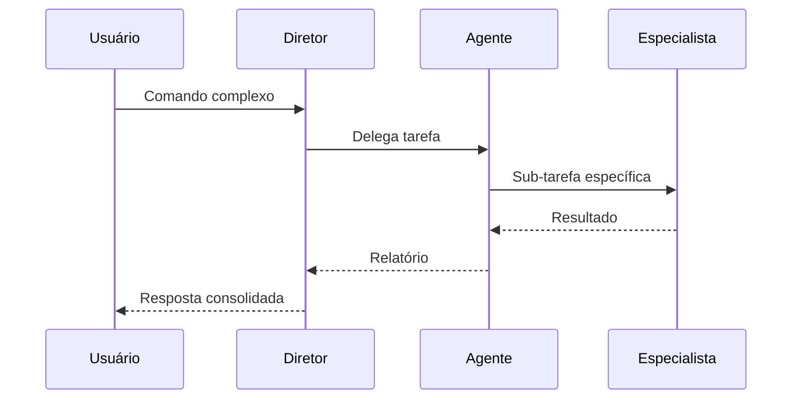
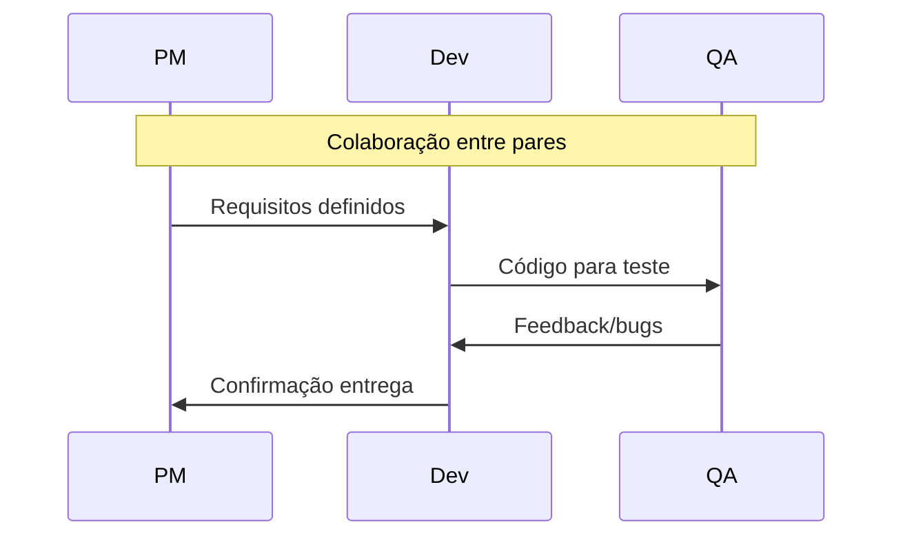

# Hierarquia de Agentes PRISMA

## 📌 Estrutura Organizacional PRISMA-BMad

```mermaid
graph TD
    D["🎬 ALAN - DIRETOR<br/>📋 Orquestrador Principal<br/>🎯 Coordenação Geral"]

    D --> SM["📋 BOB<br/>🎯 Scrum Master<br/>📊 Gestão de Histórias<br/>🔧 prisma-sm"]
    D --> AN["📊 GABRIEL<br/>📊 Analista<br/>📈 Business & Data Analysis<br/>🔧 prisma-an"]
    D --> PM["📊 DIOGO<br/>🎯 Product Manager<br/>🚀 Estratégia de Produto<br/>🔧 prisma-pm"]
    D --> PO["✅ SARAH<br/>🎯 Product Owner<br/>💼 Validação de Negócio<br/>🔧 prisma-po"]
    D --> HR["👥 HELOISA<br/>🎯 Recursos Humanos<br/>🤝 Gestão de Talentos<br/>🔧 prisma-hr"]
    D --> UX["🎨 CECÍLIA<br/>🎯 UX Expert<br/>✨ Design & Experiência<br/>🔧 prisma-ux"]
    D --> ARQ["🏗️ WAGNER<br/>🎯 Arquiteto<br/>🏛️ Design de Sistema<br/>🔧 prisma-arch"]
    D --> DEV["💻 JAMES<br/>🎯 Desenvolvedor<br/>⚡ Implementação<br/>🔧 prisma-dev"]
    D --> QA["🧪 CLEIDE<br/>🎯 Garantia de Qualidade<br/>🛡️ Arquiteta de Testes<br/>🔧 prisma-qa"]

    subgraph "🎭 Subagentes BMad (Claude Code)"
        direction TB
        SM
        AN
        PM
        PO
        HR
        UX
        ARQ
        DEV
        QA
    end

    subgraph "📊 Especializações por Área"
        direction TB
        SM --> SMT["📋 Templates de Histórias<br/>📈 Quebra de Épicos<br/>🎯 Gestão de Backlog"]
        AN --> ANT["📈 Análise de Negócios<br/>🤔 Brainstorming Facilitado<br/>🔮 Pesquisa Estratégica"]
        PM --> PMT["🚀 Estratégia de Produto<br/>🔍 Pesquisa de Mercado<br/>📊 Roadmap e Visão"]
        PO --> POV["💰 Validação de Valor<br/>📊 Métricas de Negócio<br/>🎯 ROI e Priorização"]
        HR --> HRT["👥 Gestão de Talentos<br/>🤝 Cultura e Engajamento<br/>📈 Desenvolvimento de Equipe"]
        UX --> UXT["🎨 Design de Interface<br/>🔍 Pesquisa de Usuários<br/>♿ Acessibilidade"]
        ARQ --> ARCH["📐 ADRs e Padrões<br/>🏗️ Design de Sistema<br/>🔧 Arquitetura Técnica"]
        DEV --> DEVT["⚡ Tarefas Sequenciais<br/>💻 Implementação<br/>🔧 Código e Testes"]
        QA --> QAT["🔍 Análise de Riscos<br/>🛡️ Portões de Qualidade<br/>📊 Métricas de Testes"]
    end

    classDef directorStyle fill:#ff6b6b,stroke:#fff,stroke-width:3px,color:#fff
    classDef scrumStyle fill:#4ecdc4,stroke:#fff,stroke-width:2px,color:#fff
    classDef poStyle fill:#9b59b6,stroke:#fff,stroke-width:2px,color:#fff
    classDef archStyle fill:#45b7d1,stroke:#fff,stroke-width:2px,color:#fff
    classDef devStyle fill:#96ceb4,stroke:#fff,stroke-width:2px,color:#fff
    classDef qaStyle fill:#ffeaa7,stroke:#333,stroke-width:2px,color:#333
    classDef analystStyle fill:#2ecc71,stroke:#fff,stroke-width:2px,color:#fff
    classDef hrStyle fill:#e74c3c,stroke:#fff,stroke-width:2px,color:#fff
    classDef uxStyle fill:#f39c12,stroke:#fff,stroke-width:2px,color:#fff
    classDef specStyle fill:#f8f9fa,stroke:#333,stroke-width:1px,color:#333

    class D directorStyle
    class SM scrumStyle
    class PM,PO poStyle
    class ARQ archStyle
    class DEV devStyle
    class QA qaStyle
    class AN analystStyle
    class HR hrStyle
    class UX uxStyle
    class SMT,ANT,PMT,POV,HRT,UXT,ARCH,DEVT,QAT specStyle
```



## 🎭 Níveis Hierárquicos

### Nível 0: Alan (Diretor - Orquestrador Principal)
```yaml
alan:
  nome: "Alan"
  papel: "Diretor PRISMA - Maestro da Orquestração"
  autoridade: maxima
  responsabilidades:
    - coordenacao_geral_subagents
    - resolucao_conflitos_workflow
    - delegacao_inteligente
    - visao_holistica_projeto
    - orquestracao_bmad_cycles
  poderes:
    - ativar_qualquer_subagent
    - override_decisoes_quando_necessario
    - criar_pipelines_bmad
    - coordenar_handoffs_automaticos
    - manter_continuous_activation
  especializacao: "Nunca executa tarefas diretas - apenas coordena e delega"
  filosofia: "Documentação é código + Subagents sempre ativos"
```

### Nível 1: Subagents (Claude Code Continuous Activation)
```yaml
subagents_overview:
  conceito: "5 agentes especializados sempre ativos"
  arquitetura: "Contextos isolados + handoffs automáticos"
  localizacao: "Cada agente tem pasta própria com detalhes completos"

  agentes:
    bob: "📋 Scrum Master (bob-scrum-master/)"
    gabriel: "📊 Analista (gabriel-analista/)"
    diogo: "📊 Product Manager (diogo-product-manager/)"
    sarah: "✅ Product Owner (sarah-product-owner/)"
    heloisa: "👥 Recursos Humanos (heloisa-recursos-humanos/)"
    cecilia: "🎨 UX Expert (cecilia-ux-expert/)"
    james: "💻 Developer (james-developer/)"
    cleide: "🧪 Garantia de Qualidade (cleide-garantia-qualidade/)"
    wagner: "🏗️ Arquiteto (wagner-arquiteto/)"

  detalhes_completos:
    local: "Cada agente em sua pasta individual"
    conteudo: "Especialização, comandos, workflows, métricas"
    principio: "Componentes autônomos e self-contained"
```

### Componentes de Apoio
```yaml
componentes_sistema:
  _compartilhado:
    conteudo: "Recursos shared entre todos agentes"
    exemplos: ["hierarquia.md", "workflows globais", "configs compartilhadas"]

  templates:
    localizacao: ".prisma/templates/"
    uso: "Templates reutilizáveis por todos agentes"

  diretor:
    papel: "Orquestrador que carrega hierarquia.md"
    responsabilidade: "Coordenação geral + delegação automática"
```

## 🔄 Fluxos de Comunicação

### Comunicação Vertical (Hierárquica)


### Comunicação Horizontal (Colaborativa)


## 🎯 Matriz de Responsabilidades (RACI)

| Atividade | Diretor | PM | Arquiteto | Dev | QA | Doc |
|-----------|---------|-----|-----------|-----|-----|-----|
| **Definir Requisitos** | A | R | C | I | C | I |
| **Design Sistema** | A | C | R | C | I | I |
| **Implementar** | A | I | C | R | C | I |
| **Testar** | A | I | I | C | R | I |
| **Documentar** | A | C | C | C | C | R |
| **Deploy** | R | A | C | C | C | I |

**Legenda:**
- R = Responsável (faz o trabalho)
- A = Aprovador (aprova o resultado)
- C = Consultado (fornece input)
- I = Informado (é notificado)

## 🚦 Regras de Delegação

### Delegação Automática Inteligente
```yaml
delegacao_overview:
  principio: "Diretor analisa contexto e delega automaticamente"
  base: "Palavras-chave + tipo de tarefa + contexto atual"

  mapeamento_geral:
    story_management: "Bob (prisma-sm)"
    data_analysis: "Gabriel (prisma-ds)"
    product_strategy: "Diogo (prisma-pm)"
    business_validation: "Sarah (prisma-po)"
    team_management: "Heloisa (prisma-hr)"
    user_experience: "Cecília (prisma-ux)"
    implementation: "James (prisma-dev)"
    quality_assurance: "Cleide (prisma-qa)"
    architecture: "Wagner (prisma-arch)"

  comandos_especiais:
    "*" commands: "Direcionados automaticamente para Quinn"
    exemplo: "*risk, *design, *review, *gate → Quinn"

  workflow_coordination:
    conceito: "Fases coordenadas automaticamente"
    sequencia: "Planning → Development → Quality → Repeat"
    handoffs: "Automáticos baseados em outputs"

  detalhes_especificos:
    local: "Cada agente define seus triggers específicos"
    implementacao: "Ver pasta individual de cada agente"
```

### Escalação
```yaml
escalacao:
  nivel_1:
    timeout: 5min
    acao: notificar_supervisor

  nivel_2:
    timeout: 15min
    acao: escalar_diretor

  nivel_3:
    timeout: 30min
    acao: intervencao_manual
```

## 🤝 Protocolos de Colaboração

### Handoff entre Agentes
```yaml
protocolo_handoff:
  1_preparacao:
    - salvar_contexto
    - documentar_decisoes
    - listar_pendencias

  2_transferencia:
    - passar_contexto
    - explicar_estado
    - transferir_arquivos

  3_confirmacao:
    - validar_recebimento
    - confirmar_entendimento
    - assumir_responsabilidade
```

### Resolução de Conflitos
```yaml
resolucao_conflitos:
  desacordo_tecnico:
    1: discussao_entre_agentes
    2: consulta_arquiteto
    3: decisao_diretor

  conflito_prioridade:
    1: avaliar_impacto
    2: consultar_pm
    3: decisao_diretor

  recurso_disputado:
    1: verificar_urgencia
    2: time_sharing
    3: escalacao_diretor
```

## 📊 Métricas por Agente

### KPIs Individuais
```yaml
metricas_agentes:
  pm:
    - requisitos_definidos
    - clareza_backlog
    - satisfacao_stakeholder

  arquiteto:
    - decisoes_tecnicas
    - debt_evitado
    - patterns_aplicados

  dev:
    - linhas_codigo
    - bugs_introduzidos
    - velocity

  qa:
    - bugs_encontrados
    - cobertura_testes
    - tempo_validacao

  doc:
    - paginas_escritas
    - freshness_docs
    - clareza_medida
```

## 🔐 Permissões e Limitações

### Matriz de Permissões
```yaml
permissoes:
  diretor:
    criar: [tudo]
    modificar: [tudo]
    deletar: [com_confirmacao]
    executar: [tudo]

  agentes_nivel1:
    criar: [propria_area]
    modificar: [propria_area]
    deletar: [nao_permitido]
    executar: [comandos_aprovados]

  agentes_nivel2:
    criar: [com_aprovacao]
    modificar: [limitado]
    deletar: [nao_permitido]
    executar: [basico]
```

## 🎬 Ativação em Cadeia

### Pipeline de Desenvolvimento
```yaml
pipeline_overview:
  conceito: "Fluxo coordenado entre os 5 subagents"
  gestao: "Diretor coordena handoffs automáticos"

  fases_principais:
    1_criacao: "Bob cria histórias"
    2_validacao: "Sarah valida valor"
    3_implementacao: "James desenvolve"
    4_qualidade: "Quinn assegura qualidade"
    5_arquitetura: "Winston orienta quando necessário"

  caracteristicas:
    continuous_activation: "Agentes sempre ativos"
    isolated_contexts: "Contextos independentes"
    automatic_handoffs: "Transições automáticas"
    persistent_memory: "Documentação como memória"

  detalhamento:
    workflows_especificos: "Ver pasta individual de cada agente"
    comandos_detalhados: "Definidos nos agentes específicos"
    metricas_tracking: "Por agente individual"
```

---

*Hierarquia PRISMA - Organização clara para execução eficiente*
*Versão 1.0.0*