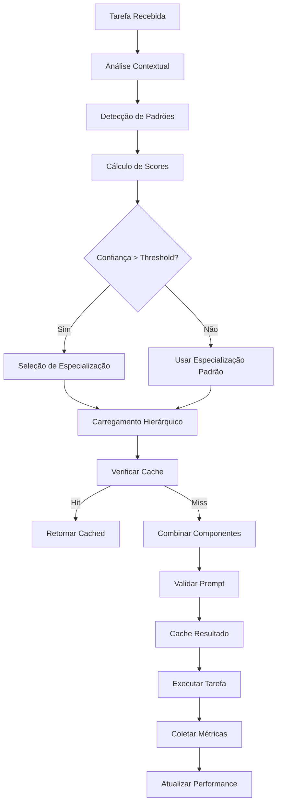
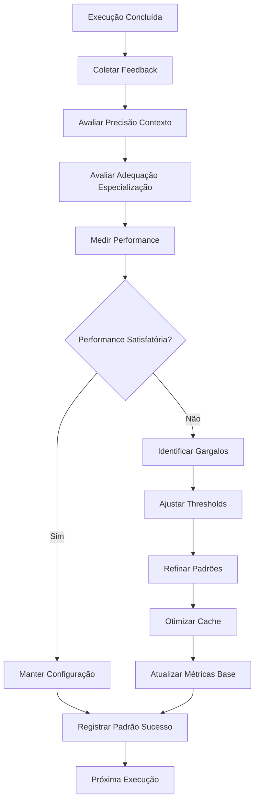

# 🔄 Sistema de Carregamento Dinâmico de Prompts PRISMA

## 📌 Identificação

**Nome**: Sistema de Carregamento Dinâmico PRISMA
**Função**: Carregador dinâmico e hierárquico de prompts por contexto
**Sistema**: PRISMA v3.0 + Universal Agent Framework
**Baseado em**: Sistema KFC + arquitetura-modular.yaml
**Localização**: `_compartilhado/componentes/sistema-carregamento-dinamico.md`

## 🎯 Missão

Este sistema implementa o **carregamento dinâmico de prompts** baseado no contexto da tarefa, combinando hierarquicamente:
1. **Comportamentos base** (`_compartilhado/comportamentos-base.md`) - sempre carregado
2. **Agente específico** (`{agent_id}/index.md`) - personalidade do agente
3. **Especialização contextual** (`{agent_id}/especialidades/{specialization}.md`) - quando aplicável
4. **Contexto específico** (`{agent_id}/contextos/{context}.md`) - adaptação situacional

## 🧠 Algoritmo de Decisão Contextual

### Mapeamento de Contextos por Padrões
```yaml
context_detection_patterns:
  desenvolvimento_codigo:
    file_extensions: [".js", ".ts", ".py", ".java", ".cs", ".go", ".rs", ".cpp"]
    filenames: ["main", "index", "app", "server"]
    keywords: ["implementar", "código", "função", "classe", "método", "debug", "refatorar"]
    primary_agents: ["james-developer"]
    specializations: ["implementacao", "debug", "otimizacao", "testes_unitarios"]
    confidence_weight: 0.6

  analise_requisitos:
    file_extensions: [".md", ".doc", ".pdf", ".docx"]
    filenames: ["requirements", "stories", "backlog", "prd", "user-stories"]
    keywords: ["requisito", "funcionalidade", "usuário", "negócio", "valor", "história"]
    primary_agents: ["sarah-product-owner"]
    specializations: ["requisitos_negocio", "valor_negocio", "priorizacao", "criterios_aceitacao"]
    confidence_weight: 0.4

  arquitetura_design:
    file_extensions: [".md", ".adr", ".drawio"]
    filenames: ["architecture", "design", "adr-", "technical-decision", "system-design"]
    keywords: ["arquitetura", "design", "padrão", "decisão", "sistema", "componente"]
    primary_agents: ["winston-arquiteto"]
    specializations: ["decisoes_tecnicas", "design_sistema", "adr_management", "scalability"]
    confidence_weight: 0.8

  testes_qualidade:
    file_extensions: [".test.js", ".spec.js", ".test.py", ".spec.ts", ".feature"]
    filenames: ["test", "spec", "qa", "quality"]
    keywords: ["teste", "qualidade", "validação", "cobertura", "qa", "risco", "gate"]
    primary_agents: ["quinn-qa"]
    specializations: ["testes_automatizados", "analise_riscos", "quality_gates", "nfr_validation"]
    confidence_weight: 0.5

  gestao_coordenacao:
    file_extensions: [".md", ".csv", ".xlsx", ".json"]
    filenames: ["sprint", "backlog", "planning", "roadmap", "timeline"]
    keywords: ["sprint", "história", "épico", "planning", "coordenação", "scrum", "kanban"]
    primary_agents: ["bob-scrum-master"]
    specializations: ["coordenacao_equipe", "planning_sprints", "story_creation", "process_improvement"]
    confidence_weight: 0.3
```

### Processo de Decisão Contextual
```yaml
decision_algorithm:
  entrada:
    - task_description: string
    - input_files: array
    - agent_id: string
    - user_context: object

  etapas:
    1_analise_arquivos:
      processo: "Analisar extensões, nomes e padrões de arquivos"
      peso: 0.4
      saida: "context_scores baseado em arquivos"

    2_analise_keywords:
      processo: "Extrair e mapear palavras-chave da tarefa"
      peso: 0.3
      saida: "context_scores baseado em keywords"

    3_analise_complexidade:
      processo: "Avaliar complexidade e domínio técnico"
      peso: 0.2
      saida: "context_scores baseado em complexidade"

    4_contexto_usuario:
      processo: "Considerar contexto e preferências do usuário"
      peso: 0.1
      saida: "context_scores baseado em contexto do usuário"

    5_selecao_contexto:
      processo: "Combinar scores e selecionar contexto primário"
      criterio: "max(weighted_scores)"
      threshold: 0.3

    6_selecao_especializacao:
      processo: "Escolher especialização baseada no contexto e agente"
      criterio: "match entre agente e contexto primário"

  saida:
    - primary_context: string
    - specialization: string
    - confidence: float (0.0-1.0)
    - reasoning: array
```

## 🔗 Sistema Hierárquico de Carregamento

### Estrutura de Herança
```yaml
prompt_hierarchy:
  nivel_1_base:
    arquivo: "_compartilhado/comportamentos-base.md"
    obrigatorio: true
    conteudo: "Comportamentos universais de todos agentes PRISMA"
    prioridade: 1

  nivel_2_agente:
    arquivo: "{agent_id}/index.md"
    obrigatorio: true
    conteudo: "Personalidade, especialidades e capacidades específicas"
    prioridade: 2

  nivel_3_especializacao:
    arquivo: "{agent_id}/especialidades/{specialization}.md"
    obrigatorio: false
    condicional: "Se especialização detectada != 'default'"
    conteudo: "Conhecimento específico da especialização"
    prioridade: 3

  nivel_4_contexto:
    arquivo: "{agent_id}/contextos/{context}.md"
    obrigatorio: false
    condicional: "Se contexto específico detectado"
    conteudo: "Adaptações para contexto específico"
    prioridade: 4

  nivel_5_template:
    arquivo: "{agent_id}/templates/{response_template}.md"
    obrigatorio: false
    condicional: "Se template de resposta específico necessário"
    conteudo: "Template de formato de resposta"
    prioridade: 5
```

### Algoritmo de Combinação
```yaml
combination_algorithm:
  entrada:
    - components: object (arquivos carregados)
    - agent_id: string
    - context_metadata: object

  processamento:
    1_validacao:
      - verificar_componentes_obrigatorios
      - validar_sintaxe_markdown
      - confirmar_compatibilidade

    2_resolucao_conflitos:
      - identificar_secoes_sobrepostas
      - aplicar_prioridade_hierarquica
      - resolver_referencias_circulares

    3_aplicacao_heranca:
      - herdar_comportamentos_base
      - aplicar_overrides_especializacao
      - integrar_adaptacoes_contexto

    4_combinacao_sequencial:
      - base_behaviors (sempre)
      - agent_specific (sempre)
      - specialization (condicional)
      - context_adaptations (condicional)
      - response_template (condicional)

  saida:
    - final_prompt: string
    - metadata: object
    - components_loaded: array
    - load_time: number
```

## 🎯 Integração com Universal Framework

### Ponte com Sistema de Scoring
```yaml
universal_framework_integration:
  scoring_enhancement:
    entrada_scoring:
      - context_analysis_result
      - available_agents_list
      - task_requirements

    processamento:
      - extract_requirements_from_context
      - map_context_to_agent_capabilities
      - calculate_enhanced_scores
      - combine_with_universal_scoring

    saida_scoring:
      - enhanced_agent_scores
      - context_relevance_factor
      - specialization_recommendation

  performance_feedback:
    metricas_coletadas:
      - context_detection_accuracy
      - specialization_match_success
      - prompt_loading_performance
      - user_satisfaction_proxy

    feedback_loop:
      - atualizar_context_patterns
      - ajustar_confidence_thresholds
      - otimizar_keyword_mappings
      - refinar_file_pattern_matching
```

### Handoff com Alan-Diretor
```yaml
alan_director_coordination:
  recebimento_delegacao:
    1: "Receber task via _compartilhado/tarefas/task_{id}.yaml"
    2: "Carregar contexto da tarefa"
    3: "Aplicar carregamento dinâmico baseado em contexto"
    4: "Executar com especialização detectada"

  comunicacao_resultado:
    1: "Salvar resultado em _compartilhado/tarefas/result_{id}.yaml"
    2: "Incluir métricas de performance na resposta"
    3: "Sugerir próximas ações baseadas no contexto"
    4: "Atualizar scores de performance para Universal Framework"

  context_bridge_usage:
    leitura: "_compartilhado/tarefas/ para contexto da tarefa"
    escrita: "_compartilhado/tarefas/ para resultados"
    configuracao: "_compartilhado/configuracao/ para parâmetros"
    componentes: "_compartilhado/componentes/ para recursos compartilhados"
```

## 📊 Sistema de Cache e Performance

### Cache Inteligente
```yaml
cache_system:
  cache_levels:
    L1_memory:
      tipo: "in-memory"
      ttl: 300_seconds
      max_entries: 50
      key_format: "{agent_id}_{specialization}_{context_hash}"

    L2_persistent:
      tipo: "file_system"
      location: "_compartilhado/cache/prompts/"
      ttl: 3600_seconds
      max_entries: 200

  cache_strategy:
    write_through: "Cache após combinação bem-sucedida"
    invalidation: "Quando arquivos fonte são modificados"
    preload: "Contextos e especializações mais frequentes"
    compression: "Prompts grandes comprimidos em cache"

  performance_targets:
    context_detection: "<100ms"
    prompt_loading: "<500ms"
    cache_hit_ratio: ">70%"
    total_response_time: "<2s"
```

### Métricas e Monitoramento
```yaml
metrics_tracking:
  context_detection:
    - detection_accuracy: "% contexto detectado corretamente"
    - confidence_distribution: "distribuição de scores de confiança"
    - false_positive_rate: "contextos detectados incorretamente"
    - detection_time: "tempo médio para detectar contexto"

  specialization_selection:
    - match_accuracy: "% especialização apropriada selecionada"
    - agent_context_alignment: "alinhamento entre agente e contexto"
    - fallback_rate: "% vezes que fallback foi usado"

  prompt_loading:
    - loading_time: "tempo médio de carregamento"
    - component_availability: "% componentes encontrados"
    - cache_efficiency: "hit ratio do cache"
    - prompt_size_distribution: "distribuição de tamanhos de prompt"

  user_satisfaction:
    - response_relevance: "relevância da resposta gerada"
    - context_accuracy_feedback: "feedback sobre precisão do contexto"
    - specialization_appropriateness: "adequação da especialização"
```

## 🔧 API de Uso pelos Agentes

### Interface Principal
```typescript
interface PromptLoaderAPI {
    // Método principal para carregar prompt contextual
    loadContextualPrompt(
        agent_id: string,
        task_description: string,
        input_files?: string[],
        user_context?: object
    ): Promise<ContextualPromptResult>;

    // Análise de contexto sem carregamento
    analyzeContext(
        task_description: string,
        input_files?: string[]
    ): ContextAnalysis;

    // Obter estatísticas de performance
    getPerformanceStats(): PerformanceStats;

    // Limpar cache
    clearCache(pattern?: string): void;
}

interface ContextualPromptResult {
    prompt: string;
    metadata: {
        agent_id: string;
        specialization: string;
        context: string;
        confidence: number;
        load_time_ms: number;
        cache_hit: boolean;
        reasoning: string[];
        components_loaded: string[];
    };
}
```

### Exemplo de Uso
```javascript
// No início de qualquer agente PRISMA
const dynamic_prompt = await loadContextualPrompt(
    'james-developer',
    'implementar sistema de autenticação OAuth2',
    ['auth.js', 'user.test.js', 'oauth-config.md'],
    { project_phase: 'development', urgency: 'high' }
);

console.log(`Contexto detectado: ${dynamic_prompt.metadata.context}`);
console.log(`Especialização: ${dynamic_prompt.metadata.specialization}`);
console.log(`Confiança: ${dynamic_prompt.metadata.confidence}`);

// Usar o prompt carregado
const response = await processWithContextualPrompt(
    dynamic_prompt.prompt,
    user_request
);
```

## 🚀 Workflows de Integração

### Workflow Completo: Detecção → Carregamento → Execução


### Workflow de Feedback e Otimização


---

## 📋 Status de Implementação

```yaml
implementacao_status:
  algoritmo_decisao_contextual: ✅ especificado
  sistema_hierarquico: ✅ definido
  integracao_universal_framework: ✅ projetada
  cache_system: ✅ arquitetado
  api_usage: ✅ documentada
  workflows_integration: ✅ mapeados
  performance_monitoring: ✅ planejado

proximos_passos:
  1: "Implementar ContextDecisionEngine"
  2: "Criar sistema de cache físico"
  3: "Desenvolver API para agentes"
  4: "Integrar com alan-diretor"
  5: "Testes de performance e precisão"
  6: "Deploy para agentes existentes"
```

---

*Sistema de Carregamento Dinâmico v1.0 - PRISMA Modular*
*"Contexto inteligente, especialização automática, performance otimizada"*
*Baseado no sistema KFC com adaptações para Universal Agent Framework*