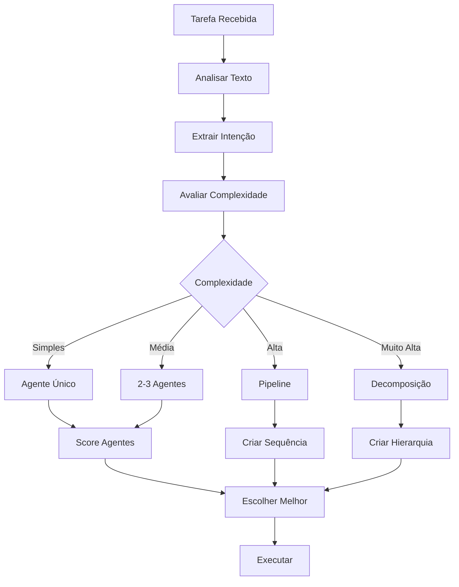

# Sistema de Delegação Inteligente - Diretor PRISMA

## 📌 Visão Geral

O Sistema de Delegação é o cérebro decisório do Diretor. Ele analisa cada tarefa e decide automaticamente qual agente ou combinação de agentes é mais adequada para executá-la.

## 🧠 Motor de Análise

### Análise de Complexidade
```yaml
analisador_complexidade:
  simples:
    criterios:
      - tarefa_unica
      - sem_dependencias
      - tempo < 30min
    acao: executar_direto_ou_1_agente

  media:
    criterios:
      - 2-3_subtarefas
      - poucas_dependencias
      - tempo < 4h
    acao: delegar_1-2_agentes

  alta:
    criterios:
      - multiplas_subtarefas
      - dependencias_complexas
      - tempo > 4h
    acao: criar_pipeline_completo

  muito_alta:
    criterios:
      - projeto_completo
      - multiplos_sistemas
      - tempo > dias
    acao: decomposicao_hierarchica
```

### Detecção de Intenção
```yaml
detector_intencao:
  # Análise por verbos
  verbos:
    criar: [pm, arquiteto]
    implementar: [dev]
    testar: [qa]
    documentar: [doc]
    analisar: [analista, arquiteto]
    revisar: [qa, arquiteto]
    corrigir: [dev, qa]
    otimizar: [arquiteto, dev-senior]

  # Análise por substantivos
  substantivos:
    requisito: pm
    arquitetura: arquiteto
    codigo: dev
    teste: qa
    bug: [qa, dev]
    documentacao: doc
    seguranca: seguranca
    performance: [arquiteto, dev-senior]

  # Análise por contexto
  contexto:
    erro_producao: [qa, dev, arquiteto]
    nova_feature: [pm, arquiteto, dev]
    refatoracao: [arquiteto, dev]
    auditoria: [qa, seguranca]
```

## 🎯 Algoritmo de Delegação



## 📊 Sistema de Scoring

### Cálculo de Adequação
```yaml
score_agente:
  formula: (expertise * 0.4) + (disponibilidade * 0.3) + (historico * 0.2) + (contexto * 0.1)

  fatores:
    expertise:
      perfeito: 1.0
      muito_bom: 0.8
      bom: 0.6
      razoavel: 0.4
      inadequado: 0.0

    disponibilidade:
      livre: 1.0
      pouco_ocupado: 0.7
      ocupado: 0.4
      muito_ocupado: 0.1
      indisponivel: 0.0

    historico:
      excelente: 1.0
      bom: 0.7
      medio: 0.5
      ruim: 0.2
      sem_historico: 0.5

    contexto:
      ja_trabalhando: 1.0
      conhece_projeto: 0.7
      similar: 0.5
      novo: 0.3
```

### Exemplo de Cálculo
```yaml
exemplo_calculo:
  tarefa: "Implementar sistema de autenticação"

  candidatos:
    dev:
      expertise: 0.8 (muito_bom)
      disponibilidade: 1.0 (livre)
      historico: 0.7 (bom)
      contexto: 0.7 (conhece_projeto)
      score_final: 0.81

    dev_senior:
      expertise: 1.0 (perfeito)
      disponibilidade: 0.4 (ocupado)
      historico: 1.0 (excelente)
      contexto: 0.5 (similar)
      score_final: 0.73

  decisao: dev (score 0.81 > 0.73)
```

## 🔄 Padrões de Delegação

### Delegação Simples
```yaml
padrao_simples:
  entrada: "corrigir bug no login"
  analise:
    tipo: correção
    area: autenticação
    complexidade: simples
  decisao:
    agente: dev
    backup: qa
  execucao:
    - dev: corrige_bug
    - qa: valida_correcao
```

### Delegação Sequencial
```yaml
padrao_sequencial:
  entrada: "criar nova funcionalidade de relatórios"
  analise:
    tipo: nova_feature
    area: reporting
    complexidade: media
  decisao:
    sequencia: [pm, arquiteto, dev, qa]
  execucao:
    - pm: define_requisitos
    - arquiteto: desenha_solucao
    - dev: implementa
    - qa: testa_valida
```

### Delegação Paralela
```yaml
padrao_paralelo:
  entrada: "preparar release 2.0"
  analise:
    tipo: release
    area: multipla
    complexidade: alta
  decisao:
    paralelo:
      - [dev: finalizar_features]
      - [qa: executar_regressao]
      - [doc: atualizar_docs]
  execucao:
    simultaneo: true
    sincronizacao: checkpoints
```

### Delegação Hierárquica
```yaml
padrao_hierarquico:
  entrada: "migrar sistema legado para cloud"
  analise:
    tipo: projeto_grande
    area: infraestrutura
    complexidade: muito_alta
  decisao:
    coordenador: arquiteto
    times:
      - analise: [analista, pm]
      - migracao: [dev-senior, dev]
      - validacao: [qa, seguranca]
      - documentacao: [doc]
  execucao:
    fases: sequencial
    dentro_fase: paralelo
```

## 🎭 Personas de Delegação

### O Estrategista
```yaml
estrategista:
  quando: tarefa_complexa
  comportamento:
    - analisa_profundamente
    - cria_plano_detalhado
    - define_checkpoints
    - monitora_riscos
  exemplo: "redesenhar arquitetura completa"
```

### O Pragmático
```yaml
pragmatico:
  quando: tarefa_urgente
  comportamento:
    - escolhe_caminho_rapido
    - foca_essencial
    - aceita_divida_tecnica
    - entrega_rapido
  exemplo: "hotfix em produção"
```

### O Perfeccionista
```yaml
perfeccionista:
  quando: tarefa_critica
  comportamento:
    - maximiza_qualidade
    - multiplas_revisoes
    - testes_exaustivos
    - documentacao_completa
  exemplo: "sistema de pagamentos"
```

## 📈 Otimização Contínua

### Aprendizado por Feedback
```yaml
aprendizado:
  coleta_dados:
    - tempo_real_vs_estimado
    - qualidade_entrega
    - retrabalho_necessario
    - satisfacao_usuario

  ajustes:
    - pesos_scoring
    - preferencias_agentes
    - templates_delegacao
    - heuristicas_decisao

  metricas_sucesso:
    - acerto_primeira: > 80%
    - tempo_medio: < estimado
    - qualidade: > 4.5/5
    - retrabalho: < 10%
```

### Cache de Decisões
```yaml
cache_decisoes:
  armazena:
    - padrao_tarefa
    - agentes_escolhidos
    - resultado_obtido
    - satisfacao

  reutiliza:
    - tarefas_similares
    - contexto_similar
    - boost_confianca

  invalida:
    - mudanca_equipe
    - feedback_negativo
    - mudanca_contexto
```

## 🚨 Tratamento de Exceções

### Agente Indisponível
```yaml
agente_indisponivel:
  deteccao: status_check
  acoes:
    1: verificar_backup
    2: redistribuir_carga
    3: ativar_substituto
    4: escalar_diretor
```

### Conflito de Delegação
```yaml
conflito_delegacao:
  deteccao: multiplos_scores_altos
  resolucao:
    1: aplicar_desempate
    2: consultar_historico
    3: dividir_tarefa
    4: decisao_manual
```

### Falha na Execução
```yaml
falha_execucao:
  deteccao: erro_reportado
  recuperacao:
    1: analisar_causa
    2: tentar_outro_agente
    3: modificar_abordagem
    4: escalar_problema
```

## 🎮 Interface de Delegação

### Comandos Manuais
```bash
# Forçar agente específico
/prisma delegar --agente dev "implementar feature"

# Ver análise de delegação
/prisma delegar --explicar "criar sistema de logs"

# Simular delegação
/prisma delegar --simular "refatorar backend"

# Override automático
/prisma delegar --manual "tarefa complexa"
```

### Feedback ao Usuário
```yaml
feedback_delegacao:
  inicio: |
    🎯 Analisando tarefa...
    📊 Complexidade: {nivel}
    👥 Agentes candidatos: {lista}
    🏆 Escolhido: {agente} (score: {score})

  progresso: |
    ⏳ {agente} trabalhando...
    [████████░░] 80% concluído
    ⏱️ Tempo restante: ~5 min

  conclusao: |
    ✅ Tarefa concluída!
    👤 Executado por: {agente}
    ⏱️ Tempo total: {tempo}
    📈 Qualidade: {score}/5
```

---

*Sistema de Delegação PRISMA - Inteligência na alocação de recursos*
*"O agente certo, na tarefa certa, no momento certo"*
*Versão 1.0.0*