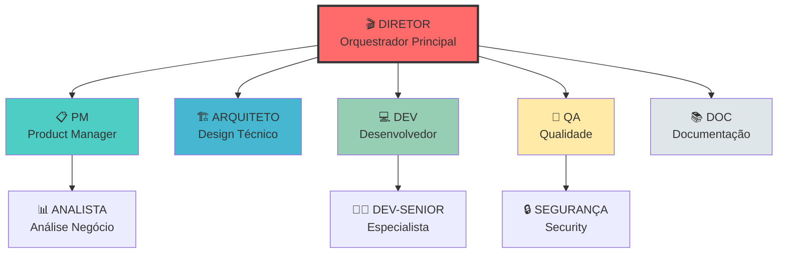
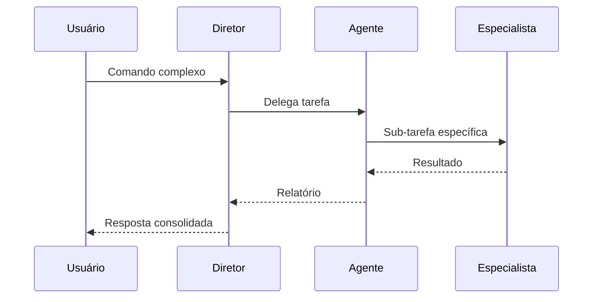
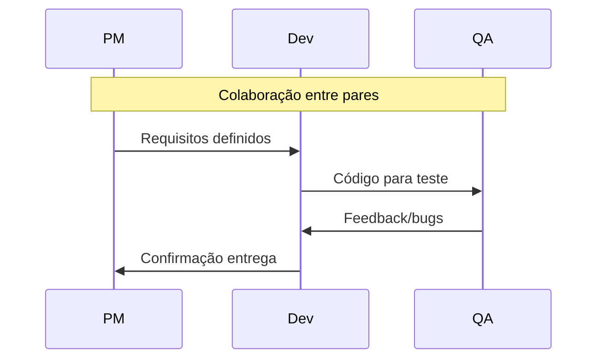

# Hierarquia de Agentes PRISMA

## 📌 Estrutura Organizacional



## 🎭 Níveis Hierárquicos

### Nível 0: Orquestrador
```yaml
diretor:
  autoridade: maxima
  responsabilidades:
    - coordenacao_geral
    - resolucao_conflitos
    - alocacao_recursos
    - visao_holistica
  poderes:
    - ativar_qualquer_agente
    - override_decisoes
    - criar_pipelines
    - definir_prioridades
```

### Nível 1: Agentes Principais
```yaml
agentes_principais:
  pm:
    foco: requisitos_negocio
    autoridade: decisoes_produto
    reporta: diretor
    coordena: [analista]

  arquiteto:
    foco: design_sistema
    autoridade: decisoes_tecnicas
    reporta: diretor
    coordena: [dev-senior]

  dev:
    foco: implementacao
    autoridade: decisoes_codigo
    reporta: diretor
    coordena: [dev-junior, dev-senior]

  qa:
    foco: qualidade
    autoridade: criterios_aceitacao
    reporta: diretor
    coordena: [seguranca, performance]

  doc:
    foco: documentacao
    autoridade: padroes_docs
    reporta: diretor
    coordena: []
```

### Nível 2: Agentes Especializados
```yaml
agentes_especializados:
  analista:
    supervisor: pm
    foco: analise_detalhada
    autonomia: media

  dev_senior:
    supervisor: dev/arquiteto
    foco: implementacao_complexa
    autonomia: alta

  seguranca:
    supervisor: qa
    foco: vulnerabilidades
    autonomia: alta

  dev_junior:
    supervisor: dev
    foco: tarefas_simples
    autonomia: baixa
```

## 🔄 Fluxos de Comunicação

### Comunicação Vertical (Hierárquica)


### Comunicação Horizontal (Colaborativa)


## 🎯 Matriz de Responsabilidades (RACI)

| Atividade | Diretor | PM | Arquiteto | Dev | QA | Doc |
|-----------|---------|-----|-----------|-----|-----|-----|
| **Definir Requisitos** | A | R | C | I | C | I |
| **Design Sistema** | A | C | R | C | I | I |
| **Implementar** | A | I | C | R | C | I |
| **Testar** | A | I | I | C | R | I |
| **Documentar** | A | C | C | C | C | R |
| **Deploy** | R | A | C | C | C | I |

**Legenda:**
- R = Responsável (faz o trabalho)
- A = Aprovador (aprova o resultado)
- C = Consultado (fornece input)
- I = Informado (é notificado)

## 🚦 Regras de Delegação

### Delegação Automática
```yaml
regras_automaticas:
  por_palavra_chave:
    "requisito|história|backlog": pm
    "arquitetura|design|estrutura": arquiteto
    "implementar|código|desenvolver": dev
    "testar|qualidade|bug": qa
    "documentar|readme|manual": doc

  por_tipo_arquivo:
    "*.md": doc
    "*.test.*": qa
    "*.spec.*": pm
    "*config*": arquiteto
    "*.tsx|*.ts": dev

  por_contexto:
    erro_producao: [qa, dev, arquiteto]
    nova_feature: [pm, arquiteto, dev]
    refatoracao: [arquiteto, dev, qa]
    documentacao: [doc, pm]
```

### Escalação
```yaml
escalacao:
  nivel_1:
    timeout: 5min
    acao: notificar_supervisor

  nivel_2:
    timeout: 15min
    acao: escalar_diretor

  nivel_3:
    timeout: 30min
    acao: intervencao_manual
```

## 🤝 Protocolos de Colaboração

### Handoff entre Agentes
```yaml
protocolo_handoff:
  1_preparacao:
    - salvar_contexto
    - documentar_decisoes
    - listar_pendencias

  2_transferencia:
    - passar_contexto
    - explicar_estado
    - transferir_arquivos

  3_confirmacao:
    - validar_recebimento
    - confirmar_entendimento
    - assumir_responsabilidade
```

### Resolução de Conflitos
```yaml
resolucao_conflitos:
  desacordo_tecnico:
    1: discussao_entre_agentes
    2: consulta_arquiteto
    3: decisao_diretor

  conflito_prioridade:
    1: avaliar_impacto
    2: consultar_pm
    3: decisao_diretor

  recurso_disputado:
    1: verificar_urgencia
    2: time_sharing
    3: escalacao_diretor
```

## 📊 Métricas por Agente

### KPIs Individuais
```yaml
metricas_agentes:
  pm:
    - requisitos_definidos
    - clareza_backlog
    - satisfacao_stakeholder

  arquiteto:
    - decisoes_tecnicas
    - debt_evitado
    - patterns_aplicados

  dev:
    - linhas_codigo
    - bugs_introduzidos
    - velocity

  qa:
    - bugs_encontrados
    - cobertura_testes
    - tempo_validacao

  doc:
    - paginas_escritas
    - freshness_docs
    - clareza_medida
```

## 🔐 Permissões e Limitações

### Matriz de Permissões
```yaml
permissoes:
  diretor:
    criar: [tudo]
    modificar: [tudo]
    deletar: [com_confirmacao]
    executar: [tudo]

  agentes_nivel1:
    criar: [propria_area]
    modificar: [propria_area]
    deletar: [nao_permitido]
    executar: [comandos_aprovados]

  agentes_nivel2:
    criar: [com_aprovacao]
    modificar: [limitado]
    deletar: [nao_permitido]
    executar: [basico]
```

## 🎬 Ativação em Cadeia

### Exemplo de Pipeline
```yaml
pipeline_feature_completa:
  1_descoberta:
    agente: pm
    acao: definir_requisitos
    output: prd.md

  2_design:
    agente: arquiteto
    input: prd.md
    acao: criar_arquitetura
    output: design.md

  3_implementacao:
    agente: dev
    input: [prd.md, design.md]
    acao: codificar
    output: codigo

  4_qualidade:
    agente: qa
    input: codigo
    acao: testar
    output: relatorio_testes

  5_documentacao:
    agente: doc
    input: [codigo, testes]
    acao: documentar
    output: docs/

  6_revisao:
    agente: diretor
    input: [tudo]
    acao: validar_entrega
    output: aprovacao
```

---

*Hierarquia PRISMA - Organização clara para execução eficiente*
*Versão 1.0.0*