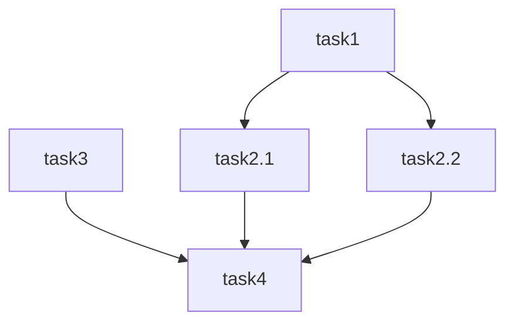

# 📋 Resumo Compreensivo: Sistema KFC/PRISMA

Baseado na análise completa dos componentes do sistema, aqui está um overview detalhado do que você tem e o que pode não estar vendo:

## 🏗️ **O Que É o Sistema KFC**

O KFC é um **framework de desenvolvimento orientado por especificações** que transforma ideias complexas em software através de um processo estruturado e automatizado. É o "motor" por trás do PRISMA.

### **Arquitetura Central:**
```
Ideia Rough → Requirements → Design → Tasks → Implementation
     ↓              ↓          ↓        ↓           ↓
  spec-req    spec-design  spec-tasks  spec-impl  spec-test
```

## 🎯 **Componentes Principais**

### **1. Workflow Controller (`spec-workflow-starter.md`)**
- **Papel**: Diretor/Orquestrador central
- **Função**: Coordena todo o fluxo de desenvolvimento
- **Poder**: Decide quando usar agentes em paralelo vs sequencial
- **Diferencial**: Sistema de avaliação em árvore com múltiplos juízes

### **2. Agentes Especializados (`.claude/agents/kfc/`)**

**spec-requirements**:
- Formato EARS (Easy Approach to Requirements Syntax)
- Gera histórias de usuário + critérios de aceitação
- Suporte paralelo com sufixos (_v1, _v2, etc.)

**spec-design**:
- Arquitetura + diagramas Mermaid
- Fluxo de dados + componentes
- Modelos de dados + processos de negócio

**spec-tasks**:
- Plano de implementação granular
- Tarefas codificáveis com dependências
- Diagrama de dependências para execução paralela

**spec-impl**:
- Execução real das tarefas
- Implementação sequencial ou paralela
- Integração com contexto preservado

**spec-judge**:
- Avaliação determinística de qualidade
- Sistema de árvore para múltiplas opções
- Seleção automática da melhor versão

**spec-test**:
- Testes automatizados
- Validação de critérios de aceitação

## 🚀 **O Que Você Pode Não Estar Vendo**

### **1. Sistema de Execução Paralela Inteligente**
```yaml
Exemplo com 10 Requirements Agents:
Round 1: 3 juízes (4+3+3 docs) → 3 outputs
Round 2: 1 juiz (3 docs) → 1 final
Resultado: Melhor requirements.md automaticamente
```

### **2. Orquestração Automática de Dependências**

O sistema executa T1+T3 em paralelo, depois T2.1+T2.2, depois T4.

### **3. Controle de Execução Adaptativo**
- **Default**: Uma tarefa por vez com aprovação
- **Paralelo**: Execução explícita de tarefas específicas
- **Auto**: Análise de dependências + execução otimizada

### **4. Sistema de Quality Gates Integrado**
```yaml
Decisões Determinísticas:
PASS: Todos testes + cobertura + NFRs
CONCERNS: Riscos médios controlados
FAIL: Riscos críticos bloqueantes
WAIVED: Aprovação documentada
```

### **5. Preservação de Contexto Entre Sessões**
- Documentação como código
- Histórico de decisões (ADRs)
- Rastreabilidade requirements → tests

## 🎛️ **Pontos de Controle Poderosos**

### **Entrada Flexível:**
```bash
# Usuário só precisa dar a ideia
"Quero um sistema de autenticação"

# Sistema pergunta automaticamente:
"Quantos spec-requirements agents usar? (1-128)"
"Quantos spec-design agents usar? (1-128)"
"Quantos spec-tasks agents usar? (1-128)"
```

### **Aprovação Explícita Obrigatória:**
- Cada documento precisa de "sim", "aprovado", "looks good"
- Ciclo feedback-revisão até aprovação
- Não avança sem aprovação explícita

### **Flexibilidade de Execução:**
```bash
# Uma tarefa
"execute task 2.1"

# Paralelo específico
"execute task 2.1 and 2.2 in parallel"

# Auto otimizado
"execute all tasks automatically"
```

## 🔥 **Vantagens Revolucionárias**

### **1. Escalabilidade Massiva**
- 1-128 agentes em paralelo
- Avaliação automática de qualidade
- Seleção da melhor opção

### **2. Zero Perda de Contexto**
- Tudo documentado em `.claude/specs/`
- Decisões arquiteturais preservadas
- Rastreabilidade completa

### **3. Qualidade Sistemática**
- Quality gates em cada fase
- Testes integrados desde o início
- Validação automática de NFRs

### **4. Adaptabilidade Total**
- Funciona com qualquer projeto
- Detecta tecnologias automaticamente
- Adapta-se aos padrões existentes

## 🎯 **O Diferencial Que Você Talvez Não Viu**

O KFC não é apenas "mais um framework de agentes". É um **sistema de desenvolvimento industrial** que:

1. **Transforma caos em ordem**: Ideia → Software funcionando
2. **Escala inteligentemente**: Mais agentes = melhor resultado
3. **Preserva conhecimento**: Cada decisão vira documentação
4. **Garante qualidade**: Quality gates impedem bugs
5. **Adapta-se ao projeto**: Não força padrões externos

É literalmente como ter uma **fábrica de software** que transforma ideias em código de produção com qualidade industrial.

## 📊 **Fluxo Detalhado do Sistema**

### **Fase 0: Inicialização**
```yaml
Input: "Quero um sistema de login"
↓
- Cria feature_name: "user-authentication"
- Cria estrutura: .claude/specs/user-authentication/
- Define tasks no TodoWrite
- Lê preferências de linguagem
```

### **Fase 1: Requirements**
```yaml
Process:
1. Pergunta: "Quantos spec-requirements agents? (1-128)"
2. Lança agentes em paralelo
3. Gera requirements_v1.md, requirements_v2.md, etc.
4. Sistema de juízes avalia automaticamente
5. Seleciona melhor versão → requirements.md
6. Pergunta aprovação explícita

Output: requirements.md aprovado
```

### **Fase 2: Design**
```yaml
Process:
1. Lê requirements.md aprovado
2. Pergunta: "Quantos spec-design agents? (1-128)"
3. Conduz pesquisa técnica
4. Gera design_v1.md, design_v2.md, etc.
5. Avaliação automática por juízes
6. Seleção final → design.md
7. Aprovação explícita obrigatória

Output: design.md com arquitetura completa
```

### **Fase 3: Tasks**
```yaml
Process:
1. Lê requirements.md + design.md
2. Pergunta: "Quantos spec-tasks agents? (1-128)"
3. Gera tasks_v1.md, tasks_v2.md, etc.
4. Cria diagramas de dependência
5. Avaliação e seleção → tasks.md
6. Aprovação explícita

Output: tasks.md com plano executável
```

### **Fase 4: Implementation (Opcional)**
```yaml
Modes:
- Default: Execute uma tarefa, aguarda aprovação
- Parallel: "execute task 2.1 and 2.2 in parallel"
- Auto: Analisa dependências, executa otimizado

Process:
1. Lê tasks.md
2. Analisa dependências (se auto mode)
3. Executa via spec-impl agents
4. Atualiza status em tasks.md
5. Quality gates automáticos via spec-test
```

## 🎪 **Sistema de Quality Gates**

### **Tree-based Judge Evaluation**
```yaml
10 documents generated:
Round 1: 3 judges (4+3+3 docs) → 3 selections
Round 2: 1 judge (3 docs) → 1 final winner
Automatic renaming: requirements_v7834.md → requirements.md
```

### **Deterministic Decisions**
```yaml
PASS:
  - todos_testes_passando: true
  - cobertura_minima: ">= 80%"
  - sem_riscos_altos: true
  - nfrs_atendidos: true

CONCERNS:
  - riscos_medios: "6 <= risco < 9"
  - cobertura_baixa: "60% <= cobertura < 80%"

FAIL:
  - riscos_criticos: "risco >= 9"
  - testes_falhando: "> 10%"

WAIVED:
  - justificativa_documentada: true
  - aprovacao_stakeholder: true
```

## 🔧 **Constraints Críticos**

### **Controles de Qualidade:**
- Aprovação explícita obrigatória em cada fase
- Não avança sem "sim", "aprovado", "looks good"
- Ciclo feedback-revisão até perfeição
- Quality gates impedem passagem de código ruim

### **Divisão de Responsabilidades:**
```yaml
Main Thread (Coordenador):
- Find/replace operations
- Format adjustments
- Small content updates
- User interaction

Sub-agents (Specialists):
- Content creation
- Structural modifications
- Professional judgment
- Domain expertise
```

### **Execução Controlada:**
```yaml
Default Mode:
- Uma tarefa por vez
- Aprovação manual para próxima
- Controle total do usuário

Auto Mode:
- Análise de dependências
- Execução paralela otimizada
- Respect task dependencies
```

## 🎭 **Por Que É Revolucionário**

### **1. Escala Industrialmente**
- 128 agentes trabalhando simultaneamente
- Quality gates automáticos
- Seleção da melhor versão sem intervenção

### **2. Preserva Conhecimento**
- Cada decisão → documentação
- ADRs para decisões arquiteturais
- Rastreabilidade completa req → test

### **3. Adapta-se Automaticamente**
- Detecta frameworks existentes
- Segue padrões do projeto
- Não força metodologias externas

### **4. Qualidade Sistemática**
- EARS format para requirements
- Mermaid diagrams para visualização
- NFRs validation automática

**O KFC/PRISMA é literalmente uma fábrica de software que transforma ideias vagas em sistemas de produção com qualidade industrial.**