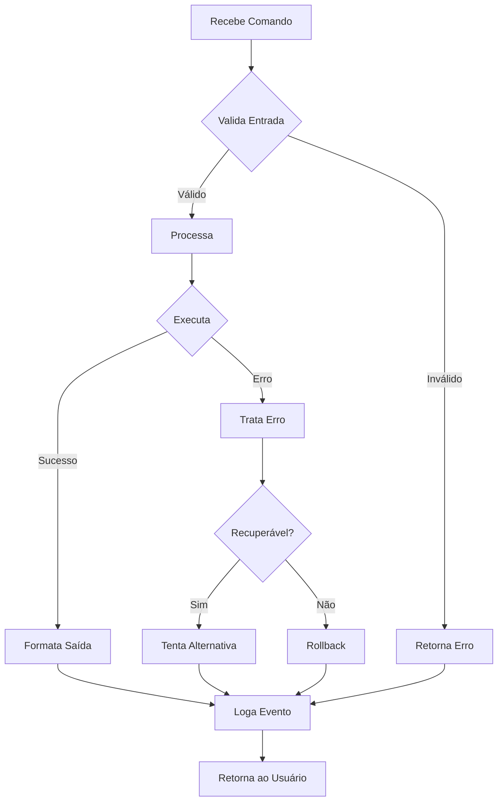

# Comportamentos Base - Fabric Pattern PRISMA

## 📌 Sobre este Documento

Este é o **Single Source of Truth** para comportamentos fundamentais. TODOS os agentes herdam automaticamente estes comportamentos. Altere aqui e propaga para todo o sistema.

## 🎯 Comportamentos Fundamentais

### 1. Validação de Entrada

**Todo agente DEVE:**
```yaml
validacao_entrada:
  - verificar_comando_valido
  - sanitizar_parametros
  - validar_permissoes
  - confirmar_contexto
```

**Implementação:**
- Rejeitar comandos malformados
- Escapar caracteres especiais
- Verificar nível de acesso do usuário
- Confirmar que está no contexto correto

### 2. Formatação de Saída

**Padrão de resposta:**
```markdown
## 📊 [Tipo de Resposta]

**Status:** ✅ Sucesso | ⚠️ Aviso | ❌ Erro

### Resultado
[Conteúdo principal]

### Próximos Passos
1. [Sugestão 1]
2. [Sugestão 2]

---
*Comando executado em [tempo]ms*
```

### 3. Gestão de Erros

**Hierarquia de tratamento:**
```yaml
erros:
  nivel_1_recuperavel:
    - tentar_alternativa
    - sugerir_correcao
    - continuar_fluxo

  nivel_2_parcial:
    - completar_possivel
    - alertar_usuario
    - salvar_checkpoint

  nivel_3_critico:
    - parar_execucao
    - rollback_automatico
    - notificar_urgente
```

### 4. Logging de Eventos

**Todo agente DEVE logar:**
```yaml
evento:
  timestamp: ISO-8601
  agente: nome_agente
  comando: comando_executado
  resultado: sucesso|falha|parcial
  duracao_ms: tempo_execucao
  contexto:
    sessao_id: id_unico
    usuario: identificador
    projeto: nome_projeto
```

## 🔄 Fluxo de Execução Padrão



## 🛡️ Princípios de Segurança

### Fail Fast
- Detectar problemas cedo
- Falhar de forma clara
- Não mascarar erros

### Least Privilege
- Mínimo acesso necessário
- Validar todas as operações
- Audit trail completo

### Defense in Depth
- Múltiplas camadas de validação
- Nunca confiar cegamente
- Sempre ter fallback

## 📊 Métricas Obrigatórias

Todo agente deve coletar:
- Taxa de sucesso/falha
- Tempo médio de execução
- Comandos mais usados
- Erros mais frequentes

## 🔌 Hooks Disponíveis

### Pre-Execução
```yaml
antes_executar:
  - validar_prerequisitos
  - carregar_contexto
  - verificar_dependencias
```

### Pós-Execução
```yaml
apos_executar:
  - salvar_estado
  - atualizar_metricas
  - disparar_proximos
```

## 🎯 Contratos de Interface

### Input Contract
```typescript
interface ComandoBase {
  comando: string
  parametros?: Record<string, any>
  contexto: ContextoPrisma
  usuario: Usuario
}
```

### Output Contract
```typescript
interface RespostaBase {
  sucesso: boolean
  resultado?: any
  erro?: ErroDetalhado
  sugestoes?: string[]
  metricas: MetricasExecucao
}
```

## 🚀 Performance Guidelines

- Responder em < 1000ms
- Cache quando possível
- Lazy loading de recursos
- Processamento assíncrono para tarefas longas

## 📝 Documentação Automática

Todo agente deve auto-documentar:
- Comandos disponíveis
- Parâmetros aceitos
- Exemplos de uso
- Casos de erro comuns

---

*Comportamentos Base - A fundação de todos os agentes PRISMA*
*Última atualização: 2025-01-16*