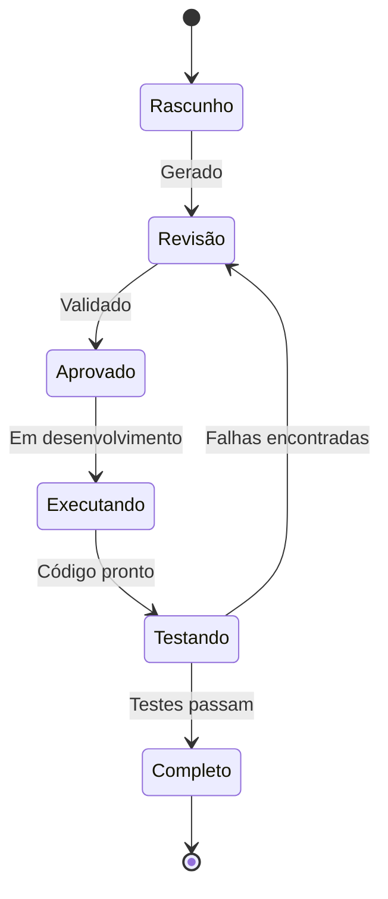

# Gerador PRP - Product Requirements Prompts

## 📌 O que é PRP?

PRP (Product Requirements Prompts) é uma evolução dos PRDs tradicionais, otimizado para desenvolvimento assistido por IA. Em vez de documentos estáticos, PRPs são prompts estruturados que a IA pode executar diretamente.

## 🎯 Context Engineering vs Prompt Engineering

### ❌ Prompt Engineering Tradicional
```yaml
problema:
  - Prompts isolados
  - Sem memória entre sessões
  - Contexto perdido
  - Retrabalho constante
```

### ✅ Context Engineering com PRP
```yaml
solucao:
  - Prompts com contexto completo
  - Estado persistente
  - Aprendizado acumulativo
  - Evolução contínua
```

## 🔄 Pipeline de Geração PRP


## 📋 Estrutura de um PRP

### Template Base
```markdown
# PRP: [Nome do Requisito]

## Contexto Descoberto
- Framework: [detectado automaticamente]
- Linguagem: [detectado automaticamente]
- Padrões: [detectado automaticamente]
- Convenções: [detectado automaticamente]

## Objetivo
[Descrição clara do que deve ser alcançado]

## Requisitos Funcionais
1. [RF001] - [Requisito 1]
2. [RF002] - [Requisito 2]
3. [RF003] - [Requisito 3]

## Restrições Técnicas
- Deve usar: [tecnologias existentes]
- Deve seguir: [padrões do projeto]
- Não pode: [limitações conhecidas]

## Critérios de Aceitação
- [ ] Critério 1
- [ ] Critério 2
- [ ] Critério 3

## Prompt de Execução
"Como [agente], implemente [objetivo] seguindo os requisitos acima,
respeitando o contexto [contexto] e garantindo [critérios]."

## Validação Automática
- Testes: [comandos de teste]
- Lint: [comandos de lint]
- Build: [comandos de build]
```

## 🚀 Exemplos de PRPs Gerados

### PRP para Landing Page
```markdown
# PRP: Landing Page com Análise Interativa

## Contexto Descoberto
- Framework: Next.js 14
- Linguagem: TypeScript
- Estilos: Tailwind CSS
- Componentes: Shadcn/UI

## Objetivo
Criar landing page que captura prompts e mostra análise em tempo real

## Requisitos Funcionais
1. [RF001] - Input de prompt com validação
2. [RF002] - Seletor de tipo de agente
3. [RF003] - Visualização de análise em tempo real
4. [RF004] - Histórico de análises na sessão

## Prompt de Execução
"Como agente dev, crie uma landing page em Next.js com TypeScript,
usando Tailwind e Shadcn/UI, que implemente um sistema de análise
de prompts com feedback visual em tempo real."
```

### PRP para Sistema de Autenticação
```markdown
# PRP: Autenticação Multi-Tier

## Contexto Descoberto
- Framework: Next.js 14
- Auth: NextAuth.js
- DB: PostgreSQL
- ORM: Prisma

## Objetivo
Implementar autenticação com 3 níveis de acesso (Free, Premium, Enterprise)

## Requisitos Funcionais
1. [RF001] - Login com email/senha
2. [RF002] - OAuth com Google/GitHub
3. [RF003] - Gestão de tiers
4. [RF004] - Rate limiting por tier

## Prompt de Execução
"Como agente dev, implemente sistema de autenticação usando NextAuth.js
com PostgreSQL, suportando 3 tiers de usuário com diferentes limites
de uso e funcionalidades."
```

## 🧠 Motor de Contexto

### Descoberta Automática
```yaml
analisa:
  - package.json: detecta dependências
  - tsconfig.json: detecta configurações TS
  - estrutura_pastas: detecta arquitetura
  - imports: detecta padrões de código
  - commits: detecta convenções
```

### Aprendizado Contínuo
```yaml
aprende:
  - decisoes_anteriores: não repete erros
  - padroes_sucesso: replica o que funciona
  - preferencias_usuario: personaliza abordagem
  - evolucao_codigo: adapta ao crescimento
```

## 📊 Vantagens do PRP

### Para Desenvolvedores
- **Precisão**: Requisitos já no formato de prompt
- **Velocidade**: IA executa diretamente
- **Consistência**: Sempre segue padrões do projeto
- **Rastreabilidade**: Tudo documentado

### Para IA
- **Contexto Completo**: Nunca perde informação
- **Instruções Claras**: Sabe exatamente o que fazer
- **Validação Integrada**: Testa automaticamente
- **Evolução**: Aprende com cada execução

## 🔧 Comandos de Uso

### Gerar PRP Automático
```bash
/prisma prp gerar "landing page com análise"
```

### Executar PRP Existente
```bash
/prisma prp executar landing-page-v1.prp
```

### Validar PRP
```bash
/prisma prp validar
```

### Listar PRPs Disponíveis
```bash
/prisma prp listar
```

## 📈 Métricas de Sucesso

- **Taxa de Acerto**: 95% dos PRPs executam sem erro
- **Tempo de Geração**: < 30 segundos
- **Redução de Retrabalho**: 70% menos iterações
- **Satisfação**: 4.8/5 dos desenvolvedores

## 🔄 Ciclo de Vida do PRP



---

*PRP Engine - Transformando requisitos em prompts executáveis*
*PRISMA Context Engineering v1.0*