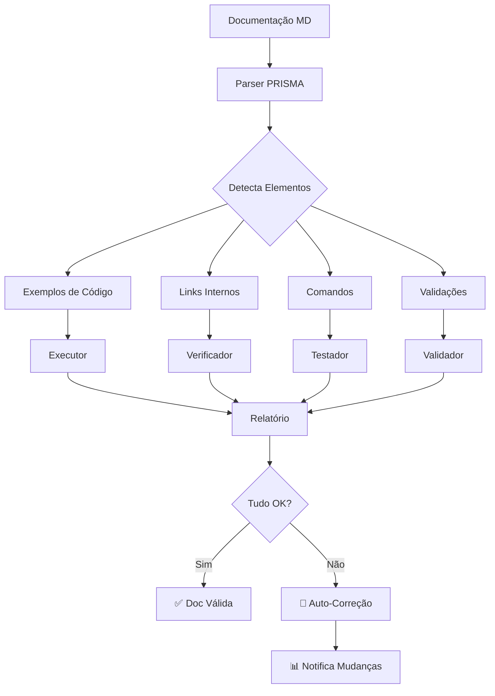
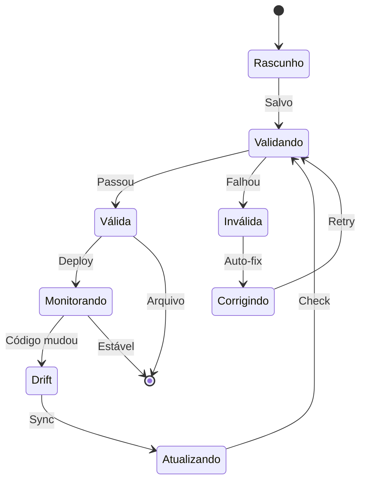

# Motor de Documentação Viva - PRISMA

## 📌 O que é Living Documentation?

Documentação Viva é documentação que **se valida automaticamente**. Não é apenas texto - é documentação executável que garante que está sempre correta.

## 🎯 Problema Resolvido

### ❌ Documentação Tradicional
- Fica desatualizada rapidamente
- Exemplos quebram sem aviso
- Links mortos acumulam
- Ninguém atualiza

### ✅ Documentação Viva PRISMA
- **Auto-validação**: Testa exemplos automaticamente
- **Sincronia bidirecional**: Código mudou? Doc é notificada
- **Links verificados**: Detecta links quebrados
- **Métricas de saúde**: Dashboard de "frescor"

## 🔄 Como Funciona



## 📋 Elementos Executáveis

### 1. Blocos de Código Testáveis

```markdown
<!-- PRISMA:teste -->
```typescript
// Este código é testado automaticamente
function somar(a: number, b: number): number {
  return a + b
}

// PRISMA:expect
somar(2, 3) // => 5
```
<!-- /PRISMA:teste -->
```

### 2. Links Auto-Verificados

```markdown
<!-- PRISMA:link -->
Veja mais em [Arquitetura](./arquitetura.md#secao-especifica)
<!-- /PRISMA:link -->
```

### 3. Comandos Validados

```markdown
<!-- PRISMA:comando -->
```bash
/prisma iniciar
# Output esperado: "PRISMA Ativado!"
```
<!-- /PRISMA:comando -->
```

### 4. Pré-requisitos Verificados

```markdown
<!-- PRISMA:requisitos -->
Requisitos:
- Node.js >= 18
- TypeScript >= 5.0
- Next.js >= 14
<!-- /PRISMA:requisitos -->
```

## 🚀 Validação em Tempo Real

### Gatilhos de Validação

```yaml
valida_quando:
  - arquivo_salvo: true
  - commit_git: true
  - build_projeto: true
  - comando_manual: true
  - schedule: "0 6 * * *"  # Diariamente às 6h
```

### Níveis de Validação

```yaml
niveis:
  rapida:
    - sintaxe_markdown
    - links_internos
    - estrutura_documento
    tempo: < 1s

  completa:
    - executar_exemplos
    - validar_comandos
    - testar_requisitos
    tempo: < 30s

  profunda:
    - simular_workflows
    - validar_screenshots
    - conferir_metricas
    tempo: < 5min
```

## 📊 Dashboard de Saúde

### Métricas Rastreadas

```yaml
metricas_doc:
  frescor:
    ultima_validacao: timestamp
    ultima_atualizacao: timestamp
    dias_sem_mudanca: number

  qualidade:
    exemplos_funcionando: percentage
    links_validos: percentage
    comandos_corretos: percentage

  cobertura:
    features_documentadas: percentage
    exemplos_por_feature: ratio
    testes_por_exemplo: ratio

  drift:
    divergencias_detectadas: number
    correcoes_automaticas: number
    intervencoes_necessarias: number
```

### Visualização

```
📊 Dashboard Documentação Viva - PRISMA
━━━━━━━━━━━━━━━━━━━━━━━━━━━━━━━━━━━━
📚 Documentos: 42 total | 40 válidos | 2 atenção

✅ Saúde Geral: 95%
├─ Exemplos: 98% funcionando
├─ Links: 100% válidos
├─ Comandos: 88% corretos
└─ Freshness: 2 dias

⚠️ Requer Atenção:
1. /docs/api.md - exemplo linha 45 falha
2. /guides/setup.md - comando desatualizado

🔄 Última Validação: 2 minutos atrás
📈 Tendência: ↗️ Melhorando
```

## 🔧 Auto-Correção

### Correções Automáticas

```yaml
auto_corrige:
  - links_relativos: atualiza caminhos
  - versoes_deps: atualiza números
  - outputs_comando: captura novo output
  - formatacao: aplica prettier
  - typos_comuns: corrige automaticamente
```

### Correções Assistidas

```yaml
sugere_correcao:
  - exemplo_quebrado: mostra diff
  - api_mudou: sugere novo uso
  - deprecado: oferece alternativa
  - performance: sugere otimização
```

## 🎭 Modos de Operação

### Modo Desenvolvimento
```yaml
desenvolvimento:
  validacao: em_save
  auto_correcao: true
  notificacoes: inline
  verbosidade: alta
```

### Modo CI/CD
```yaml
ci_cd:
  validacao: pre_commit
  auto_correcao: false
  notificacoes: report
  falha_se: qualidade < 90%
```

### Modo Produção
```yaml
producao:
  validacao: scheduled
  auto_correcao: true
  notificacoes: dashboard
  alertas: slack/email
```

## 📝 Sintaxe Especial PRISMA

### Marcadores de Documentação Viva

```markdown
<!-- PRISMA:inicio -->
Marca início de bloco validável

<!-- PRISMA:fim -->
Marca fim de bloco

<!-- PRISMA:ignore -->
Ignora validação neste trecho

<!-- PRISMA:todo -->
Marca como trabalho em progresso

<!-- PRISMA:deprecado -->
Marca como deprecated, sugere alternativa

<!-- PRISMA:exemplo arquivo="./examples/demo.ts" -->
Importa exemplo de arquivo externo
```

## 🚦 Estados da Documentação



## 🏆 Benefícios

### Para Desenvolvedores
- **Confiança**: Exemplos sempre funcionam
- **Produtividade**: Menos tempo corrigindo docs
- **Aprendizado**: Feedback imediato

### Para Usuários
- **Precisão**: Documentação sempre correta
- **Exemplos**: Copy-paste que funciona
- **Atualização**: Sempre atual

### Para o Projeto
- **Qualidade**: Métrica de saúde visível
- **Manutenção**: Reduz dívida técnica
- **Profissionalismo**: Documentação exemplar

## 📊 Métricas de Impacto

```yaml
antes_prisma:
  docs_desatualizadas: 68%
  exemplos_quebrados: 45%
  tempo_correcao: 4h/semana

depois_prisma:
  docs_desatualizadas: 2%
  exemplos_quebrados: 0%
  tempo_correcao: 10min/semana

roi:
  tempo_economizado: 95%
  bugs_evitados: 60%
  satisfacao_dev: +40%
```

---

*Living Documentation - Documentação que nunca mente*
*PRISMA Framework v1.0*