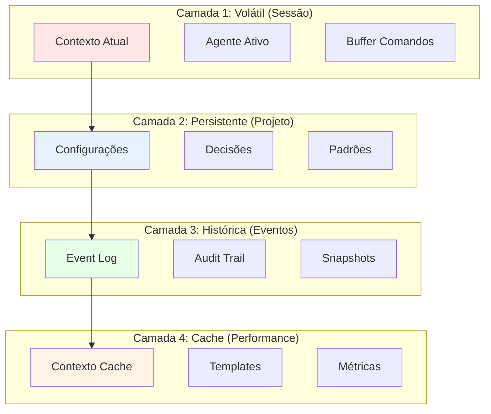
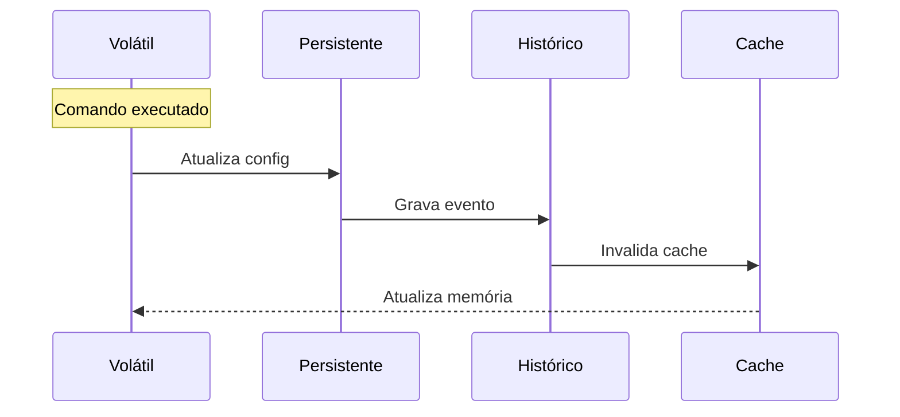

# Arquitetura de Estado Multi-Camada - PRISMA

## 📌 Visão Geral

O PRISMA usa uma arquitetura de 4 camadas de estado para garantir persistência, performance e recuperabilidade. Cada camada tem um propósito específico e tempo de vida diferente.

## 🏗️ As 4 Camadas de Estado



## 📊 Camada 1: Estado Volátil (Sessão)

### Características
- **Duração**: Durante a sessão ativa
- **Armazenamento**: Memória RAM
- **Perda**: Ao fechar Claude Code
- **Velocidade**: Instantânea

### Conteúdo
```yaml
estado_volatil:
  sessao:
    id: "sess-2025-01-16-001"
    inicio: "2025-01-16T10:00:00Z"
    usuario: "developer"

  contexto_atual:
    comando_executando: "/prisma workflow nascente"
    passo_atual: 3
    buffer_entrada: "criar landing page"

  agente_ativo:
    tipo: "dev"
    persona_carregada: true
    restricoes: ["no-delete", "no-force-push"]

  memoria_trabalho:
    ultimos_comandos: [...]
    variaveis_temporarias: {...}
    flags_execucao: {...}
```

### Operações
```bash
# Consultar estado da sessão
/prisma estado sessao

# Limpar buffer
/prisma estado limpar-volatil

# Snapshot rápido
/prisma estado snapshot-sessao
```

## 🗄️ Camada 2: Estado Persistente (Projeto)

### Características
- **Duração**: Vida do projeto
- **Armazenamento**: Arquivos YAML/JSON
- **Perda**: Apenas se deletado
- **Velocidade**: Rápida (< 10ms)

### Estrutura
```yaml
# .prisma/estado/projeto.yaml
projeto:
  nome: "zion-prompt-lab"
  criado: "2025-01-01"
  workflow: "nascente"

configuracoes:
  linguagem: "typescript"
  framework: "nextjs"
  testes: "jest"
  ci_cd: "github-actions"

decisoes_ativas:
  - id: "dec-001"
    tipo: "arquitetura"
    decisao: "Usar Tailwind CSS"
    tomada_em: "2025-01-10"
    por: "agente-pm"
    reversivel: true

padroes_descobertos:
  nomenclatura: "camelCase"
  estrutura: "feature-folders"
  commits: "conventional"

metricas:
  total_sessoes: 42
  tempo_total: "84 horas"
  comandos_executados: 1250
  taxa_sucesso: 0.96
```

### Operações
```bash
# Salvar estado do projeto
/prisma estado salvar

# Carregar estado
/prisma estado carregar

# Exportar configuração
/prisma estado exportar
```

## 📜 Camada 3: Estado Histórico (Eventos)

### Características
- **Duração**: Permanente (append-only)
- **Armazenamento**: Event Store
- **Perda**: Nunca (imutável)
- **Velocidade**: Média (100ms replay)

### Event Log
```yaml
# .prisma/estado/eventos/2025-01.yaml
eventos:
  - id: "evt-0001"
    timestamp: "2025-01-16T10:00:00Z"
    tipo: "sessao_iniciada"
    dados: {...}
    hash: "abc123..."

  - id: "evt-0002"
    timestamp: "2025-01-16T10:00:15Z"
    tipo: "decisao_tomada"
    dados:
      decisao: "Usar PostgreSQL"
      alternativas: ["MySQL", "MongoDB"]
    hash: "def456..."
```

### Snapshots
```yaml
# .prisma/estado/snapshots/checkpoint-3.yaml
snapshot:
  id: "snap-003"
  checkpoint: "Landing Page Completa"
  timestamp: "2025-01-16T14:00:00Z"
  estado_completo:
    projeto: {...}
    decisoes: [...]
    contexto: {...}
  hash_validacao: "xyz789..."
```

### Operações
```bash
# Replay desde início
/prisma estado replay --desde inicio

# Replay desde snapshot
/prisma estado replay --snapshot 3

# Validar integridade
/prisma estado validar-eventos
```

## ⚡ Camada 4: Cache (Performance)

### Características
- **Duração**: TTL configurável
- **Armazenamento**: Memória + Disco
- **Perda**: Regenerável
- **Velocidade**: Ultra-rápida (< 1ms)

### Conteúdo Cacheado
```yaml
cache_performance:
  contexto_descoberto:
    tecnologias: ["Next.js", "TypeScript", "Tailwind"]
    ttl: 3600
    hit_rate: 0.92

  templates_compilados:
    prd_template: {...}
    test_template: {...}
    ttl: 7200

  metricas_calculadas:
    velocity: 42
    bug_rate: 0.02
    coverage: 0.85
    ttl: 300

  projecoes_estado:
    estado_atual: {...}
    decisoes_ativas: [...]
    ttl: 60
```

### Estratégias de Cache
```yaml
estrategias:
  lru:  # Least Recently Used
    tamanho_max: 100MB
    items_max: 1000

  ttl:  # Time To Live
    default: 3600s
    minimo: 60s
    maximo: 86400s

  invalidacao:
    em_mudanca: true
    em_erro: true
    scheduled: "0 * * * *"
```

## 🔄 Sincronização entre Camadas



## 📊 Fluxo de Recuperação

### Inicialização do PRISMA
```yaml
sequencia_boot:
  1_carregar_historico:
    - ler_ultimo_snapshot
    - validar_integridade

  2_reconstruir_estado:
    - aplicar_snapshot
    - replay_eventos_posteriores

  3_popular_cache:
    - calcular_metricas
    - compilar_templates

  4_preparar_volatil:
    - criar_sessao
    - carregar_contexto
```

### Recuperação de Falha
```yaml
recuperacao_crash:
  detectar_estado_invalido:
    - verificar_locks
    - validar_checksums

  restaurar_ultimo_valido:
    - localizar_snapshot
    - replay_seguro

  notificar_perda:
    - comandos_nao_salvos
    - sugerir_reexecucao
```

## 🎯 Operações de Estado

### Comandos Disponíveis

```bash
# Visualizar estado completo
/prisma estado ver --camada todas

# Salvar checkpoint manual
/prisma estado checkpoint "Descrição"

# Restaurar para ponto anterior
/prisma estado restaurar --checkpoint 5

# Limpar cache
/prisma estado limpar-cache

# Compactar eventos antigos
/prisma estado compactar --antes "2024-12-01"

# Exportar para backup
/prisma estado backup --destino ./backup/

# Métricas de estado
/prisma estado metricas
```

## 📈 Métricas de Performance

```yaml
benchmarks:
  leitura_volatil: < 0.1ms
  leitura_persistente: < 10ms
  leitura_historico: < 100ms
  leitura_cache: < 1ms

  escrita_volatil: < 0.1ms
  escrita_persistente: < 50ms
  escrita_evento: < 20ms
  escrita_cache: < 5ms

  recuperacao_total: < 5s
  replay_1000_eventos: < 2s
  snapshot_completo: < 1s
```

## 🔒 Garantias ACID

### Atomicidade
- Operações são tudo-ou-nada
- Rollback automático em falha

### Consistência
- Validação antes de gravar
- Checksums em todos os níveis

### Isolamento
- Locks para escrita concorrente
- Read-after-write consistency

### Durabilidade
- Eventos nunca perdidos
- Múltiplos níveis de backup

## 🚀 Otimizações

### Escritas Batched
```yaml
batching:
  eventos:
    buffer_size: 100
    flush_interval: 1000ms

  metricas:
    agregacao: 60s
    flush: 300s
```

### Compressão
```yaml
compressao:
  eventos_antigos: gzip
  snapshots: lz4
  cache_disco: snappy
```

### Particionamento
```yaml
particoes:
  eventos:
    por: mes
    retencao: 12_meses

  snapshots:
    manter_ultimos: 10
    manter_checkpoints: todos
```

---

*Arquitetura de Estado PRISMA - 4 camadas para persistência perfeita*
*Versão 1.0.0*