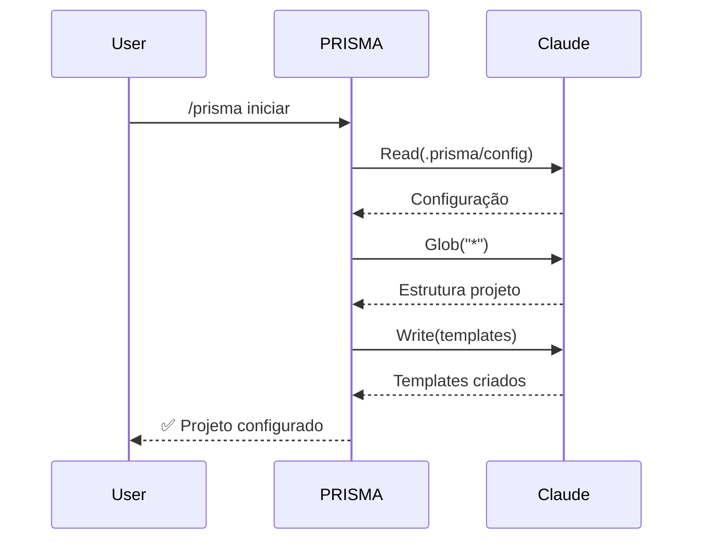
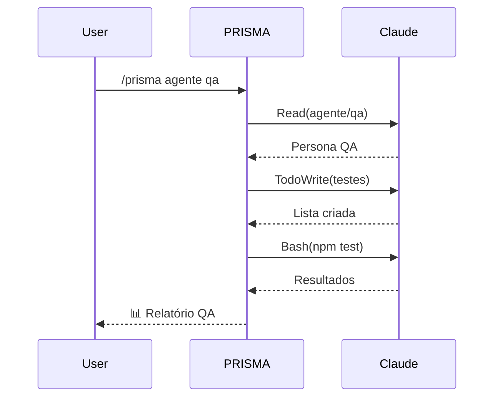

# Claude Code Bridge - Integração PRISMA

## 📌 Visão Geral

O Claude Bridge é a camada de integração entre PRISMA e Claude Code CLI. Ele traduz comandos PRISMA em ações que o Claude Code pode executar.

## 🔄 Mapeamento de Comandos

### Comandos Básicos

```yaml
prisma_para_claude:
  "/prisma iniciar":
    claude_acoes:
      - ler: .prisma/config/inicial.md
      - criar_estrutura: pastas_necessarias
      - mostrar: menu_opcoes

  "/prisma agente [tipo]":
    claude_acoes:
      - ler: .prisma/agentes/[tipo]/index.md
      - carregar: componentes_compartilhados
      - ativar: persona_agente

  "/prisma workflow [tipo]":
    claude_acoes:
      - ler: .prisma/workflows/[tipo]/index.md
      - executar: passos_sequenciais
      - validar: checkpoints

  "/prisma fragmentar [arquivo]":
    claude_acoes:
      - ler: arquivo_grande
      - dividir: chunks_100_linhas
      - criar: fragmentos_numerados
      - gerar: indice_navegacao
```

## 🎭 Sistema de Personas

### Como Ativar uma Persona

```typescript
interface PersonaAgente {
  nome: string
  comportamentos: string[]
  vocabulario: string[]
  foco: string[]
  restricoes: string[]
}

// Quando ativa agente PM
const agentePM: PersonaAgente = {
  nome: "Product Manager",
  comportamentos: [
    "Foco em requisitos de negócio",
    "Linguagem não-técnica",
    "Orientado a valor"
  ],
  vocabulario: [
    "stakeholder", "entregável",
    "milestone", "backlog"
  ],
  foco: [
    "Requisitos funcionais",
    "Experiência do usuário",
    "Métricas de sucesso"
  ],
  restricoes: [
    "Não implementar código",
    "Não decisões técnicas profundas"
  ]
}
```

## 🔌 Pontos de Integração

### 1. Leitura de Arquivos

```yaml
claude_ferramenta: Read
prisma_usa_para:
  - carregar_templates
  - ler_configuracoes
  - importar_agentes
  - verificar_contexto
```

### 2. Escrita de Arquivos

```yaml
claude_ferramenta: Write/MultiEdit
prisma_usa_para:
  - gerar_documentacao
  - salvar_estado
  - criar_prps
  - exportar_relatorios
```

### 3. Busca e Análise

```yaml
claude_ferramenta: Grep/Glob
prisma_usa_para:
  - detectar_padroes
  - encontrar_convencoes
  - analisar_estrutura
  - descobrir_contexto
```

### 4. Execução de Comandos

```yaml
claude_ferramenta: Bash
prisma_usa_para:
  - rodar_testes
  - executar_builds
  - validar_codigo
  - git_operations
```

### 5. Gestão de Tarefas

```yaml
claude_ferramenta: TodoWrite
prisma_usa_para:
  - rastrear_progresso
  - organizar_workflow
  - marcar_checkpoints
  - gerenciar_sprints
```

## 🚀 Comandos Estendidos

### Comandos que Aproveitam Claude Code

```bash
# Análise de Contexto Profunda
/prisma contexto analisar
→ Claude: Glob("**/*.{js,ts,jsx,tsx}")
→ Claude: Grep("import|require")
→ PRISMA: Gera mapa de dependências

# Geração de PRP Inteligente
/prisma prp criar "sistema de pagamento"
→ Claude: Read arquivos relevantes
→ Claude: WebSearch("best practices payment")
→ PRISMA: Gera PRP completo

# Validação de Documentação
/prisma docs validar
→ Claude: Read todos os .md
→ Claude: Bash executa exemplos
→ PRISMA: Relatório de saúde
```

## 📊 Estado da Sessão

### Persistência entre Comandos

```yaml
sessao_prisma:
  id: "sessao-2025-01-16-001"
  estado:
    agente_ativo: "dev"
    workflow_atual: "nascente"
    checkpoint: 3
    tarefas_completas: [1, 2, 3]
    contexto_descoberto:
      framework: "Next.js"
      linguagem: "TypeScript"

  # Claude Code mantém em memória
  # PRISMA salva em arquivo para persistência
```

## 🔐 Controle de Permissões

### Níveis de Acesso

```yaml
permissoes_claude:
  nivel_1_leitura:
    - Read: permitido
    - Grep: permitido
    - Glob: permitido

  nivel_2_escrita:
    - Write: com_confirmacao
    - MultiEdit: com_confirmacao
    - TodoWrite: permitido

  nivel_3_execucao:
    - Bash: com_validacao
    - Task: supervisonado
    - WebFetch: limitado

  nivel_4_total:
    - todas_ferramentas: permitido
    - sem_confirmacao: true
    - auto_aprovacao: true
```

## 🎯 Casos de Uso Específicos

### UC1: Iniciar Projeto Novo



### UC2: Análise com Agente



## 🔄 Sincronização Bidirecional

### PRISMA → Claude Code

```yaml
prisma_informa_claude:
  - contexto_projeto
  - decisoes_tomadas
  - padroes_detectados
  - restricoes_ativas
  - estado_workflow
```

### Claude Code → PRISMA

```yaml
claude_informa_prisma:
  - arquivos_modificados
  - comandos_executados
  - erros_encontrados
  - sugestoes_ia
  - metricas_performance
```

## 📈 Métricas de Integração

```yaml
metricas:
  latencia_comando: < 100ms
  taxa_sucesso: > 99%
  comandos_por_sessao: ~50
  cache_hit_rate: > 80%
  memoria_usada: < 100MB
```

## 🚦 Tratamento de Erros

### Estratégia de Fallback

```yaml
se_claude_falha:
  timeout:
    - retry_com_backoff
    - usar_cache_se_disponivel
    - notificar_usuario

  permissao_negada:
    - solicitar_aprovacao
    - oferecer_alternativa
    - log_seguranca

  arquivo_nao_encontrado:
    - sugerir_criacao
    - buscar_similar
    - criar_template

  comando_invalido:
    - mostrar_ajuda
    - sugerir_correcao
    - listar_opcoes
```

## 🔮 Evolução Futura

### Roadmap de Integração

```yaml
fase_1_atual:
  - comandos_basicos ✅
  - leitura_escrita ✅
  - personas_simples ✅

fase_2_proxima:
  - mcp_servers_custom
  - webhooks_eventos
  - api_extensoes

fase_3_futura:
  - plugins_terceiros
  - marketplace_agentes
  - federacao_prismas
```

---

*Claude Bridge - Conectando PRISMA ao poder do Claude Code*
*Versão 1.0.0*