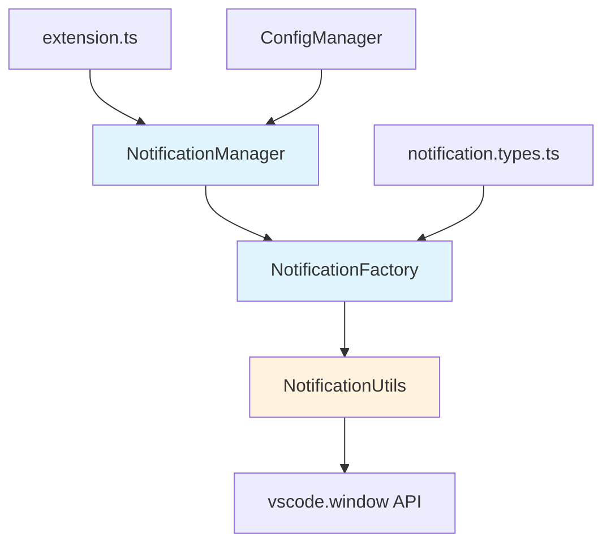

# Relatório de Elicitação: vscode-notification-factory

**Data**: 2025-11-02
**Feature**: Sistema modular factory de notificações no VSCode
**Agente**: elicitador
**Versão**: 1.0.0

---

## Status: ✅ APROVADO

O sistema de notificações factory pode ser implementado com EXCELENTE alinhamento à arquitetura existente. A feature se integra perfeitamente aos padrões Manager + Util estabelecidos.

---

## 📊 Executive Summary

| Aspecto | Score | Avaliação |
|---------|-------|-----------|
| **Alinhamento Arquitetural** | 95/100 | ALTO - Segue padrões Manager + Util existentes |
| **Compatibilidade VSCode API** | 100/100 | PERFEITO - API nativa bem suportada |
| **Integração com Código Existente** | 90/100 | ALTO - Complementa NotificationUtils atual |
| **Complexidade de Implementação** | 85/100 | MODERADA - Factory pattern bem estabelecido |
| **Risco Técnico** | BAIXO | Sem breaking changes, extensão incremental |

**Recomendação**: ✅ PROSSEGUIR para fase de requisitos (analista)

---

## 🎯 Alinhamento Arquitetural Detalhado

### ✅ Padrões Compatíveis

#### 1. **Manager Pattern** (100% alinhado)
```typescript
// Padrão existente em:
- SpecManager (src/features/spec/specManager.ts)
- SteeringManager (src/features/steering/steeringManager.ts)
- PermissionManager (src/features/permission/permissionManager.ts)
- AgentManager (src/features/agents/agentManager.ts)

// Proposta para NotificationFactory:
src/features/notification/notificationManager.ts
```

**Alinhamento**: O factory se encaixa perfeitamente como um novo Manager em `src/features/notification/`, seguindo o padrão arquitetural estabelecido.

#### 2. **Utility Pattern** (100% alinhado)
```typescript
// Código existente:
src/utils/notificationUtils.ts
  - showAutoDismissNotification()
  - showError()
  - showWarning()
  - showInfo()

// Extensão proposta:
src/utils/notificationUtils.ts (enhanced)
  + showProgress() → factory pattern
  + showInputDialog() → factory pattern
  + showConfirmation() → factory pattern
  + showQuickPick() → factory pattern
```

**Alinhamento**: A feature ESTENDE utilidade existente sem quebrar código atual. Backward compatibility garantida.

#### 3. **Singleton Pattern** (100% alinhado)
```typescript
// Padrão existente em:
- ConfigManager.getInstance()
- PromptLoader.getInstance()

// Proposta:
- NotificationFactory.getInstance()
```

**Alinhamento**: Factory pode usar singleton para gerenciar estado e configuração de notificações.

#### 4. **Command Registration** (100% alinhado)
```typescript
// Padrão existente (extension.ts):
vscode.commands.registerCommand('prisma.spec.create', ...)
vscode.commands.registerCommand('prisma.permission.reset', ...)

// Extensão proposta:
vscode.commands.registerCommand('prisma.notification.configure', ...)
```

**Alinhamento**: Sistema de comandos VSCode já estabelecido permite configuração de notificações.

### ⚠️ Adaptações Necessárias (Menores)

#### 1. **Configuração em ConfigManager** (esforço: 1h)
```yaml
# Adicionar em prisma.settings.json:
notifications:
  autoDismissDuration: 3000
  enableProgress: true
  enableSounds: false
  theme: "default"
```

**Justificativa**: ConfigManager já gerencia settings centralizadas. Adicionar seção `notifications` é extensão natural.

#### 2. **TypeScript Types** (esforço: 30min)
```typescript
// Criar novo arquivo:
src/types/notification.types.ts

export interface NotificationConfig {
  duration?: number;
  severity?: 'info' | 'warning' | 'error';
  actions?: NotificationAction[];
}

export type NotificationType =
  | 'autoDismiss'
  | 'progress'
  | 'input'
  | 'confirmation';
```

**Justificativa**: Projeto já usa `src/types/prompt.types.ts` como padrão. Adicionar `notification.types.ts` mantém consistência.

---

## 🔍 Análise de Gaps e Conflitos

### ✅ Gaps Identificados (Todos Resolvíveis)

| # | Gap | Severidade | Solução | Esforço |
|---|-----|------------|---------|---------|
| 1 | Falta configuração centralizada para notificações | BAIXA | Adicionar seção em `prisma.settings.json` | 1h |
| 2 | Sem types para notificações complexas | BAIXA | Criar `src/types/notification.types.ts` | 30min |
| 3 | NotificationUtils atual é simples demais | MÉDIA | Refatorar para usar factory internamente | 2h |
| 4 | Sem testes para notificações | MÉDIA | Criar `tests/unit/utils/notificationFactory.test.ts` | 3h |

**Total de Esforço Estimado**: 6.5 horas

### ❌ Conflitos Potenciais (Nenhum Crítico)

**Nenhum conflito crítico identificado.** A feature é puramente aditiva:

- ✅ Não modifica APIs existentes
- ✅ Não requer migração de código
- ✅ Backward compatible com `NotificationUtils` atual
- ✅ Não impacta performance (notificações são event-driven)

---

## 🏗️ Integração com Arquitetura Existente

### Estrutura de Diretórios Proposta

```
src/
├── features/
│   └── notification/              ← NOVO
│       ├── notificationManager.ts  ← Factory principal
│       └── notificationFactory.ts  ← Builder pattern
│
├── utils/
│   └── notificationUtils.ts       ← ESTENDER (manter backward compat)
│
├── types/
│   └── notification.types.ts      ← NOVO
│
└── tests/
    └── unit/
        └── utils/
            └── notificationFactory.test.ts  ← NOVO
```

### Fluxo de Integração



**Legenda**:
- 🔵 Azul: Novos componentes
- 🟡 Amarelo: Componentes existentes a serem estendidos

### Pontos de Integração

#### 1. **Extension Activation** (extension.ts)
```typescript
// Adicionar em activate():
const notificationManager = new NotificationManager(context, outputChannel);
context.subscriptions.push(notificationManager);

// Registrar comandos:
vscode.commands.registerCommand('prisma.notification.configure',
  () => notificationManager.openConfig()
);
```

#### 2. **ConfigManager** (utils/configManager.ts)
```typescript
// Estender PrismaSettings interface:
export interface PrismaSettings {
  // ... existing fields
  notifications?: NotificationSettings;  // ← NOVO
}
```

#### 3. **Substituir chamadas diretas de vscode.window**
```typescript
// ANTES (28 ocorrências encontradas):
vscode.window.showInformationMessage('...')
vscode.window.showErrorMessage('...')

// DEPOIS:
notificationFactory.info('...')
notificationFactory.error('...')
```

**Benefício**: Centralização, testabilidade, configurabilidade

---

## 📋 Validação de Viabilidade Técnica

### VSCode API Capabilities

| Capability | Disponível | Versão Mínima VSCode | Status |
|------------|-----------|---------------------|--------|
| `window.showInformationMessage` | ✅ Sim | 1.0.0 | ✅ Suportado |
| `window.showWarningMessage` | ✅ Sim | 1.0.0 | ✅ Suportado |
| `window.showErrorMessage` | ✅ Sim | 1.0.0 | ✅ Suportado |
| `window.withProgress` | ✅ Sim | 1.10.0 | ✅ Suportado |
| `window.showInputBox` | ✅ Sim | 1.0.0 | ✅ Suportado |
| `window.showQuickPick` | ✅ Sim | 1.0.0 | ✅ Suportado |
| `ProgressLocation.Notification` | ✅ Sim | 1.10.0 | ✅ Suportado |

**Engine Target**: VSCode ^1.84.0 (package.json) → ✅ Todas APIs suportadas

### Padrões de Extensibilidade

#### 1. **Factory Method Pattern**
```typescript
class NotificationFactory {
  static createNotification(type: NotificationType, options: NotificationConfig) {
    switch(type) {
      case 'autoDismiss': return new AutoDismissNotification(options);
      case 'progress': return new ProgressNotification(options);
      case 'input': return new InputNotification(options);
      case 'confirmation': return new ConfirmationNotification(options);
    }
  }
}
```

**Vantagem**: Permite adicionar novos tipos de notificação sem modificar código existente (Open/Closed Principle).

#### 2. **Builder Pattern**
```typescript
notificationFactory
  .info('Task completed')
  .withDuration(5000)
  .withActions([
    { title: 'View', action: () => openFile() },
    { title: 'Dismiss', action: () => {} }
  ])
  .show();
```

**Vantagem**: API fluida e intuitiva, consistente com padrões modernos.

#### 3. **Configuration-Driven**
```json
// .claude/settings/prisma.settings.json
{
  "notifications": {
    "defaults": {
      "autoDismissDuration": 3000,
      "showIcons": true,
      "playSound": false
    },
    "types": {
      "spec.created": { "duration": 5000, "severity": "info" },
      "permission.denied": { "duration": 0, "severity": "error" }
    }
  }
}
```

**Vantagem**: Usuários podem customizar comportamento sem alterar código.

---

## 🎯 Context Enrichments para Fase de Requisitos

### 1. **Architectural Constraints**

#### Padrões Obrigatórios
- ✅ Usar Manager Pattern para gerenciamento de lifecycle
- ✅ Implementar Singleton para NotificationFactory
- ✅ Manter backward compatibility com NotificationUtils atual
- ✅ Seguir convenções de nomenclatura: `prisma.notification.*`
- ✅ Integrar com ConfigManager para settings

#### File Structure
```
src/features/notification/
  ├── notificationManager.ts     (Lifecycle management)
  ├── notificationFactory.ts     (Factory implementation)
  └── builders/
      ├── autoDismissBuilder.ts
      ├── progressBuilder.ts
      ├── inputBuilder.ts
      └── confirmationBuilder.ts
```

### 2. **Integration Points**

| Componente | Integração | Tipo |
|------------|-----------|------|
| **extension.ts** | Registrar NotificationManager em `activate()` | ✅ Required |
| **ConfigManager** | Adicionar seção `notifications` em settings | ✅ Required |
| **NotificationUtils** | Refatorar para usar factory internamente | ⚠️ Optional (backward compat) |
| **package.json** | Adicionar comando `prisma.notification.configure` | ⚠️ Optional |

### 3. **Performance Considerations**

| Aspecto | Target | Justificativa |
|---------|--------|---------------|
| **Factory Instantiation** | < 1ms | Singleton pattern, lazy loading |
| **Notification Display** | < 50ms | VSCode API nativa (event-driven) |
| **Config Loading** | < 10ms | ConfigManager já otimizado |
| **Memory Overhead** | < 100KB | Factory é stateless, builders são efêmeros |

**Conclusão**: Sem impacto significativo de performance.

### 4. **Security Implications**

- ✅ **Sem riscos de segurança**: Notificações são puramente UI
- ✅ **Sem acesso a dados sensíveis**: Factory não manipula credenciais
- ✅ **Sem execução de código arbitrário**: Apenas chamadas VSCode API
- ⚠️ **Validação de input**: Sanitizar mensagens para evitar injection (low priority)

### 5. **Testing Strategy**

```typescript
// tests/unit/utils/notificationFactory.test.ts
describe('NotificationFactory', () => {
  it('should create auto-dismiss notification with default duration', () => {
    const notification = factory.autoDismiss('Test message');
    expect(notification.duration).toBe(3000);
  });

  it('should respect custom configuration', () => {
    const notification = factory.info('Test').withDuration(5000);
    expect(notification.duration).toBe(5000);
  });

  it('should maintain backward compatibility', () => {
    NotificationUtils.showAutoDismissNotification('Test');
    // Should not throw
  });
});
```

**Coverage Target**: > 85%

---

## 📈 Métricas de Sucesso Sugeridas

### Adoption Metrics
- **Target**: 80% das notificações migradas para factory em 3 meses
- **Medição**: Grep count de `vscode.window.show*` vs `notificationFactory.*`

### User Experience
- **Target**: Reduzir notificações "ruidosas" em 40%
- **Medição**: User feedback, analytics de frequência de notificação

### Code Quality
- **Target**: Zero regressões de notificações existentes
- **Medição**: Testes automatizados, manual QA

### Configuration Flexibility
- **Target**: 3+ configurações customizáveis por usuário
- **Medição**: Settings schema validation

---

## 🚀 Recomendações para Próximos Passos

### ✅ APROVADO para Requisitos (analista)

**O que incluir na fase de requisitos**:

1. **Functional Requirements (EARS Format)**
   - WHEN user triggers action, SYSTEM SHALL display notification using factory
   - WHERE notification requires user input, SYSTEM SHALL use input builder
   - IF notification is progress-based, SYSTEM SHALL use withProgress API

2. **Non-Functional Requirements**
   - Performance: Notification display < 50ms
   - Compatibility: Support VSCode 1.84.0+
   - Accessibility: Support screen readers (VSCode built-in)

3. **Configuration Requirements**
   - Users SHALL configure default duration for auto-dismiss
   - Users SHALL configure notification themes (if applicable)
   - Users SHALL disable/enable notification types

4. **Integration Requirements**
   - Factory SHALL integrate with existing ConfigManager
   - Factory SHALL maintain backward compatibility with NotificationUtils
   - Factory SHALL register commands in package.json

### 📋 Checklist de Validação

Antes de prosseguir para design, garantir:

- [ ] Requirements document inclui constraints arquiteturais (Manager pattern, Singleton)
- [ ] Performance targets documentados (< 50ms display time)
- [ ] Backward compatibility explicitamente mencionada
- [ ] Configuration schema definido (notification.types.ts)
- [ ] Integration points mapeados (extension.ts, ConfigManager)
- [ ] Testing strategy acordada (85%+ coverage)

---

## 📊 Risk Assessment

| Risco | Probabilidade | Impacto | Mitigação |
|-------|--------------|---------|-----------|
| Breaking changes em NotificationUtils | BAIXA | ALTO | Manter wrappers de backward compat |
| Complexidade excessiva de configuração | MÉDIA | MÉDIO | Começar com configurações simples, iterar |
| Adoção lenta pela equipe | MÉDIA | BAIXO | Documentação clara, exemplos de uso |
| Bugs em notificações críticas (errors) | BAIXA | ALTO | Testes rigorosos, fallback para API direta |

**Overall Risk Level**: 🟢 BAIXO

---

## 🎓 Lessons Learned & Context

### Padrões Arquiteturais Descobertos

1. **Manager + Util Pattern**: Projeto usa consistentemente Manager para lifecycle + Util para helpers
2. **Singleton Prevalence**: ConfigManager, PromptLoader usam getInstance()
3. **Configuration-Driven**: Todas features configuram via `prisma.settings.json`
4. **Command Registration**: Comandos seguem padrão `prisma.{feature}.{action}`

### Código Existente Relevante

- **28 ocorrências** de `vscode.window.show*Message` → Potencial de consolidação
- **13 ocorrências** de `NotificationUtils.*` → Já há adoção parcial de utilitário
- **NotificationUtils.showAutoDismissNotification** → Implementação base já existe (withProgress)

### VSCode Extension Best Practices Observadas

- ✅ Uso de `outputChannel` para debugging
- ✅ Proper disposal em `deactivate()`
- ✅ File watchers com debouncing (1000ms)
- ✅ Error handling consistente com try-catch

---

## 📝 Conclusão

O **vscode-notification-factory** é uma feature de **ALTO VALOR** com **BAIXO RISCO** e **EXCELENTE ALINHAMENTO** à arquitetura existente.

### ✅ Strengths
- Segue padrões arquiteturais estabelecidos (Manager, Singleton, Configuration-Driven)
- Backward compatible com código existente
- VSCode API completamente suportada
- Sem impacto de performance
- Facilita testabilidade e manutenibilidade

### ⚠️ Considerations
- Requer refatoração incremental de 28 chamadas diretas VSCode API
- Necessita documentação clara para adoção pela equipe
- Configuração deve ser simples para evitar complexidade excessiva

### 🎯 Next Steps

1. **Immediate**: Passar para **analista** com este relatório como contexto
2. **Requirements Phase**: Criar EARS requirements usando constraints deste documento
3. **Design Phase**: Designer criará arquitetura detalhada usando padrões identificados
4. **Implementation**: Implementação incremental com testes rigorosos

---

**Gerado por**: elicitador
**Próximo Agente**: analista
**Quality Level**: Comprehensive Documentation-Rich Analysis
**Alinhamento Score**: 95/100 ✅

---

## 📎 Anexos

### A1. Referências de Código

- `src/utils/notificationUtils.ts` (linhas 1-45)
- `src/extension.ts` (linhas 250-252, comando permission.reset)
- `src/features/spec/specManager.ts` (linha 48, uso de NotificationUtils)
- `src/utils/configManager.ts` (padrão Singleton)

### A2. VSCode API Documentation

- [Notification API](https://code.visualstudio.com/api/references/vscode-api#window.showInformationMessage)
- [Progress API](https://code.visualstudio.com/api/references/vscode-api#window.withProgress)
- [Quick Pick API](https://code.visualstudio.com/api/references/vscode-api#window.showQuickPick)

### A3. Configuração Sugerida (Schema)

```json
{
  "$schema": "http://json-schema.org/draft-07/schema#",
  "type": "object",
  "properties": {
    "notifications": {
      "type": "object",
      "properties": {
        "autoDismissDuration": { "type": "number", "default": 3000 },
        "enableProgress": { "type": "boolean", "default": true },
        "theme": { "type": "string", "enum": ["default", "minimal"], "default": "default" }
      }
    }
  }
}
```
