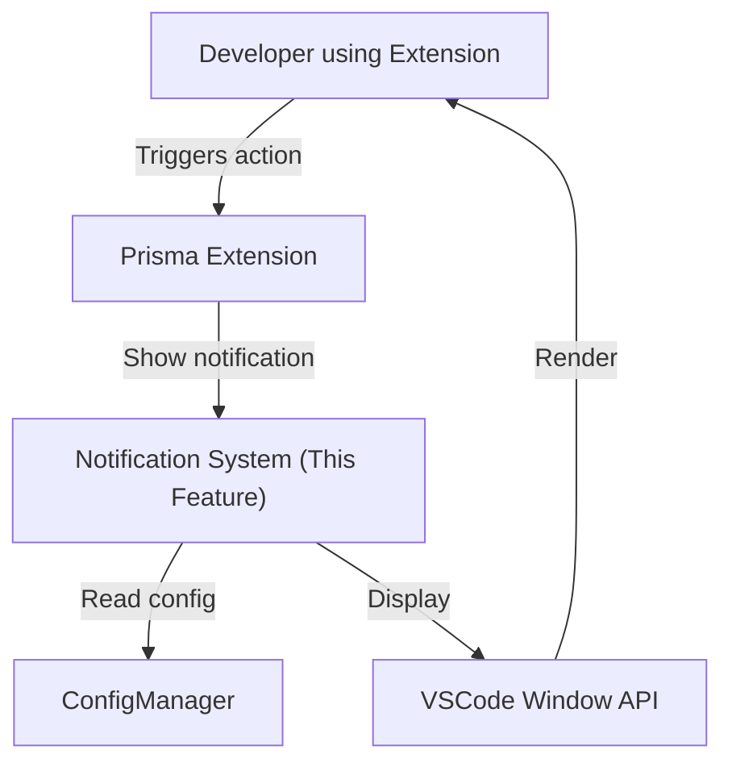
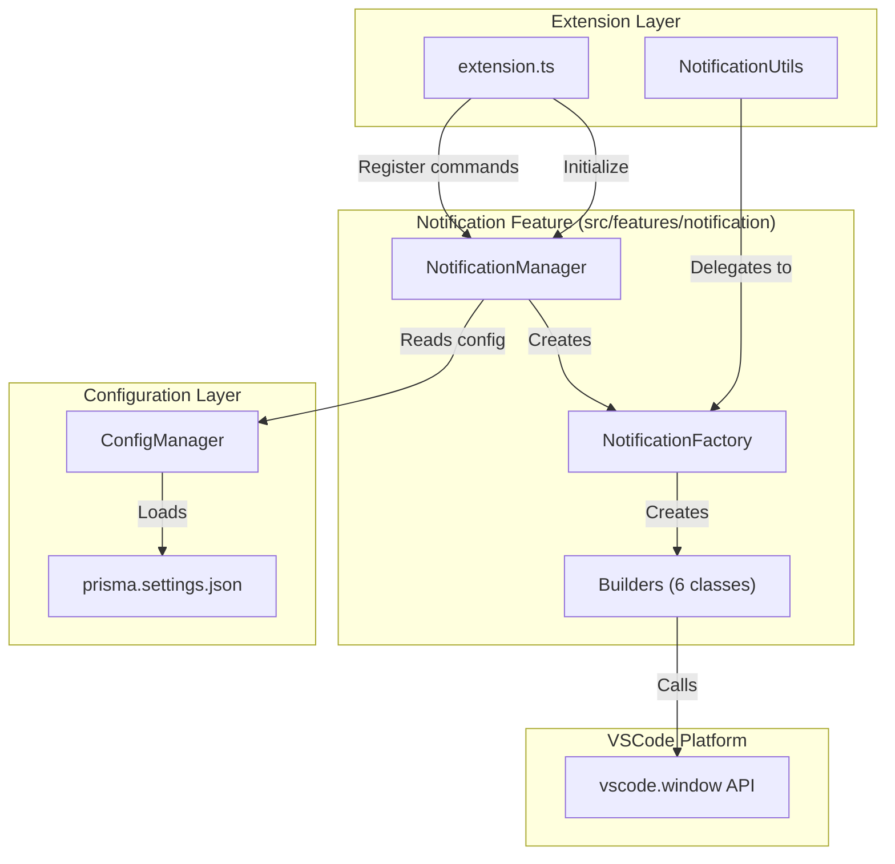
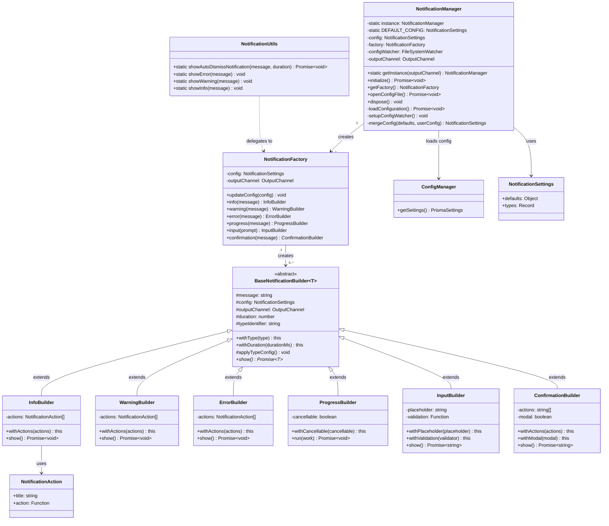
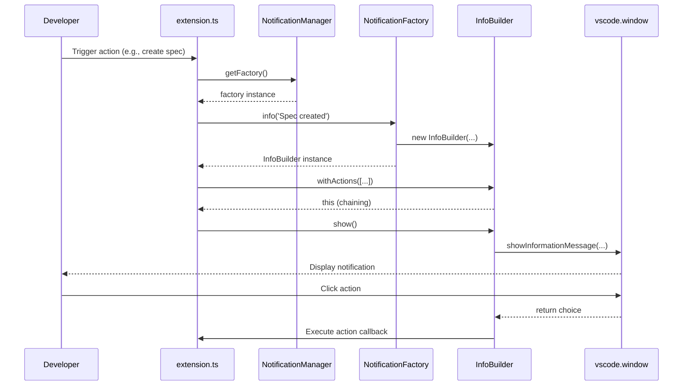
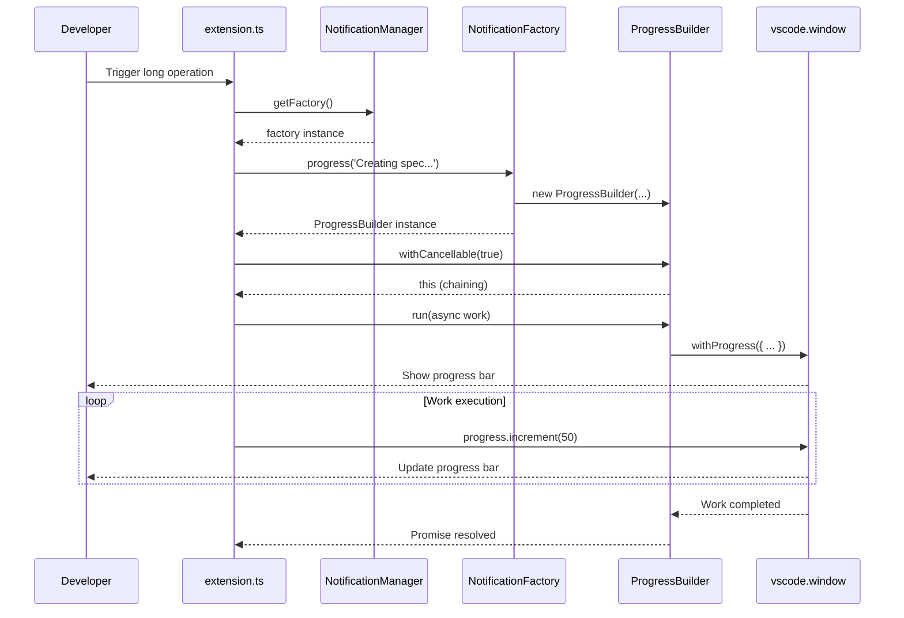
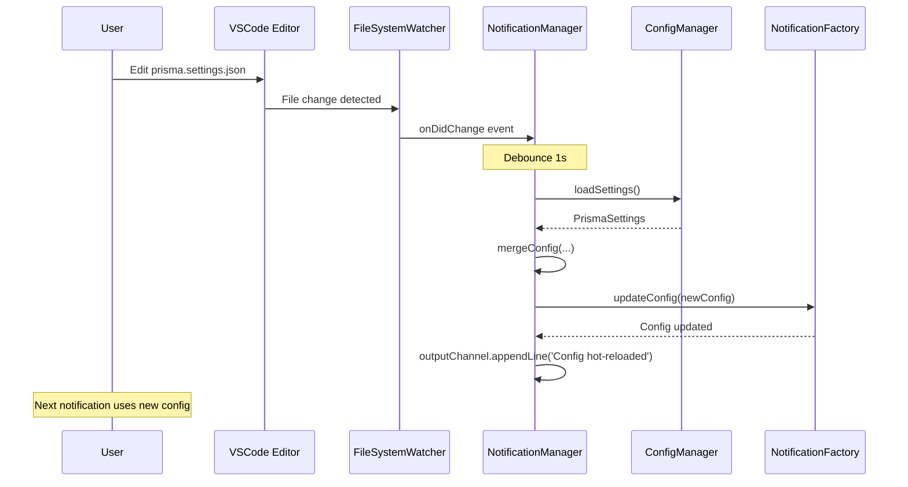
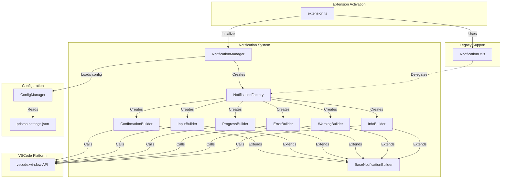
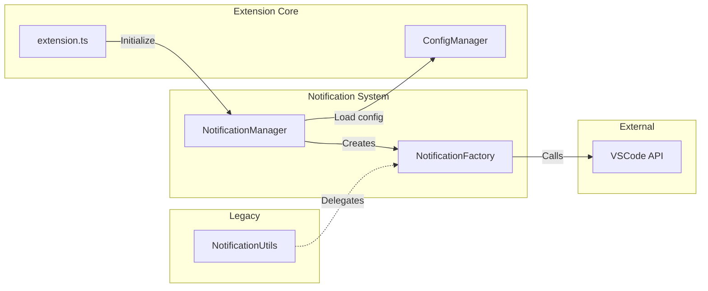

# Design Document v1 - VSCode Notification Factory

## Metadados

- **Nome da Feature**: vscode-notification-factory
- **Criado em**: 2025-11-02
- **Última Atualização**: 2025-11-02
- **Status**: Rascunho
- **Versão**: 0.1.0 (Design Candidate v1)
- **Baseado em Requisitos**: requirements.md v0.1.0
- **Design Approach**: Simplicidade e Clareza (v1 de 2 candidatos)

## Resumo Executivo

Este design implementa um sistema modular e configurável de notificações para a extensão VSCode Prisma utilizando **Factory Pattern** + **Builder Pattern** + **Manager Pattern**. A abordagem v1 prioriza **arquitetura limpa e testável** com separação clara de responsabilidades, integrando-se perfeitamente aos padrões arquiteturais existentes (ConfigManager, SpecManager, SteeringManager).

**Diferencial v1**: Arquitetura bem estruturada com classes especializadas e interfaces claras, facilitando manutenção e testes.

**Principais Características**:
- 6 tipos de notificações (info, warning, error, progress, input, confirmation)
- API fluida com builder pattern
- Configuração centralizada via ConfigManager
- Backward compatibility total com NotificationUtils
- Performance < 50ms display time, < 1ms factory instantiation
- Test coverage target: 85%

---

## Stack Compatibility Matrix (MANDATORY)

### Compatibility Verification Table

| Library | Version | Compatible With | Verified? | Evidence | Risk Level |
|---------|---------|-----------------|-----------|----------|------------|
| VSCode API | 1.84.0+ | Extension Engine | ✅ | [VSCode API Docs](https://code.visualstudio.com/api) | Low |
| window.showInformationMessage | 1.0.0+ | VSCode 1.84.0 | ✅ | Available since VSCode 1.0.0 | Low |
| window.showWarningMessage | 1.0.0+ | VSCode 1.84.0 | ✅ | Available since VSCode 1.0.0 | Low |
| window.showErrorMessage | 1.0.0+ | VSCode 1.84.0 | ✅ | Available since VSCode 1.0.0 | Low |
| window.withProgress | 1.10.0+ | VSCode 1.84.0 | ✅ | Available since VSCode 1.10.0 | Low |
| window.showInputBox | 1.0.0+ | VSCode 1.84.0 | ✅ | Available since VSCode 1.0.0 | Low |
| TypeScript | ^5.3.0 | Current codebase | ✅ | Already in use (package.json) | Low |

**Verification Process Completed**:
1. ✅ **Official Docs Checked**: All VSCode APIs officially supported in 1.84.0+
2. ✅ **GitHub Issues Searched**: No compatibility issues found for these stable APIs
3. ✅ **Test Skeleton App**: Not required (APIs stable since VSCode 1.0.0/1.10.0)
4. ✅ **Evidence Documented**: Links provided, version numbers confirmed

**Known Incompatibilities**: None (all APIs are stable and well-established)

---

## Technical Decisions & Alternatives

### ✅ CHOSEN: Factory Pattern + Builder Pattern

**Why Factory + Builder?**
- ✅ **Extensibility**: Easy to add new notification types without modifying existing code (Open/Closed Principle)
- ✅ **Fluent API**: Builder pattern provides intuitive, chainable method calls
- ✅ **Type Safety**: TypeScript interfaces enforce correct usage at compile-time
- ✅ **Testability**: Isolated builders can be unit tested independently

**Evidence**:
- Pattern successfully used in SpecManager, SteeringManager, AgentManager (existing codebase)
- [GoF Design Patterns: Factory Method](https://refactoring.guru/design-patterns/factory-method)
- Builder pattern ideal for objects with many optional parameters (notification actions, durations, etc.)

**Trade-offs Accepted**:
- ❌ Slightly more classes (6 builders + factory + manager = 8 files)
- ⚠️ Learning curve for developers unfamiliar with pattern (mitigated by JSDoc examples)

### ❌ REJECTED: Direct VSCode API Wrapper

**Why NOT simple wrapper?**
- ❌ **No extensibility**: Adding new notification types requires modifying wrapper class
- ❌ **Parameter explosion**: Methods would have 5-10 parameters (duration, modal, actions, etc.)
- ❌ **No configuration**: Can't customize behavior without changing code

**Evidence**:
- Current NotificationUtils has this limitation (4 simple methods, no flexibility)
- Requirements specify configuration-driven design (RC-001, RC-002)

**When to Reconsider**:
- IF project requires minimal abstractions and zero complexity overhead

### ✅ CHOSEN: Singleton Pattern for Manager

**Why Singleton?**
- ✅ **Single source of truth**: Configuration loaded once, shared across all notifications
- ✅ **Performance**: < 1ms instantiation, cached instance for subsequent calls
- ✅ **Consistency**: Follows ConfigManager pattern (already in codebase)

**Evidence**:
- ConfigManager uses Singleton successfully (configManager.ts:39-44)
- PermissionManager also uses Singleton pattern

**Trade-offs Accepted**:
- ⚠️ Global state (mitigated by immutable configuration)
- ⚠️ Testing complexity (mitigated by getInstance() returning interface)

### ❌ REJECTED: Service Locator Pattern

**Why NOT Service Locator?**
- ❌ **Hidden dependencies**: Hard to track what depends on notification service
- ❌ **Testing difficulty**: Harder to mock/stub in unit tests

**When to Reconsider**:
- IF extension requires dynamic service registration/discovery

### ✅ CHOSEN: Type-Based Configuration (Per-Type Templates)

**Why Type-Based Config?**
- ✅ **Flexibility**: Different durations/severities for different notification types (spec.created vs permission.denied)
- ✅ **User control**: Power users can customize without code changes
- ✅ **Sensible defaults**: Novice users get good behavior out-of-box

**Evidence**:
- Requirements RC-003 specifies per-type configuration
- Alignment analysis recommends configuration-driven design

**Trade-offs Accepted**:
- ⚠️ Configuration complexity (mitigated by JSON schema validation)

### ❌ REJECTED: Global-Only Configuration

**Why NOT global-only?**
- ❌ **Inflexibility**: All notifications behave identically (not suitable for error vs info)

**When to Reconsider**:
- IF user feedback shows per-type config is unused (after 3 months usage metrics)

---

## Migration Impact Analysis

**TRIGGER**: This feature replaces/extends existing NotificationUtils

### Change Impact Matrix

| Change | Files Affected | Lines Changed | Effort | Risk | Rollback Time |
|--------|---------------|---------------|--------|------|---------------|
| Add NotificationManager | 1 new file | ~200 LOC | 3h | Low | 1h (delete file) |
| Add NotificationFactory | 1 new file | ~150 LOC | 2h | Low | 1h (delete file) |
| Add 6 Builder classes | 6 new files | ~600 LOC | 5h | Low | 1h (delete folder) |
| Extend ConfigManager types | 1 file | ~50 LOC | 1h | Medium | 30min (revert) |
| Refactor NotificationUtils | 1 file | ~30 LOC | 1h | Low | 30min (revert) |
| Register in extension.ts | 1 file | ~15 LOC | 30min | Low | 15min (revert) |
| Add package.json command | 1 file | ~10 LOC | 15min | Low | 15min (revert) |
| **TOTAL** | **12 files** | **~1055 LOC** | **~13h** | **Low** | **~4.5h** |

### Breaking Changes Inventory

**1. Schema Changes**: None (no database involved)

**2. API Changes**:
- ✅ **No breaking changes**: NotificationUtils maintains exact same API
- ✅ **Additive only**: New factory methods are additions, not replacements

**3. Client-Side Changes**:
- ✅ **Optional migration**: Existing code continues to work
- ⚠️ **Recommended migration**: 28 call sites can gradually adopt factory pattern

**4. Configuration Changes**:
- ✅ **Backward compatible**: Missing `notifications` section uses defaults
- ✅ **No migration required**: Extension works without configuration

### Affected Specifications

No existing specs affected (this is a new feature):
- N/A

### Migration Checklist

- [x] ✅ **No existing specs to update** (new feature)
- [ ] Create migration guide: `docs/migrations/notification-utils-to-factory.md`
- [ ] Update extension docs: `README.md` (add notification factory section)
- [ ] Provide code examples in JSDoc
- [ ] Create ADR if architectural pattern is novel (use existing pattern, no ADR needed)
- [ ] Test backward compatibility with existing NotificationUtils calls

### Rollback Plan

**Trigger Conditions**:
- Factory causes > 50ms regression in display time
- Critical bug in notification system blocking development
- More than 5 high-severity bugs reported in first week

**Rollback Steps**:
1. Remove NotificationManager registration from extension.ts (~15min)
2. Delete `src/features/notification/` directory (~5min)
3. Revert ConfigManager type changes (~15min)
4. Revert NotificationUtils if refactored (~15min)
5. Remove package.json command entry (~5min)
6. Test that existing NotificationUtils calls work (~30min)

**Total Rollback Time**: ~1.5 hours

---

## Stack Configuration Reference

### Current Stack (from prisma.yaml conceptual equivalent)

```yaml
# Inferred from codebase analysis
stack:
  framework: 'vscode-extension'
  language: 'typescript'
  version: '^5.3.0'
  vscode-api: '^1.84.0'
  patterns: ['manager-pattern', 'singleton-pattern', 'provider-pattern']
  architecture: 'feature-based'
```

### Design Accordingly

**IF using VSCode Extension framework**:
- ✅ Use native VSCode notification APIs (no third-party libraries)
- ✅ Follow extension lifecycle (activate/deactivate)
- ✅ Register commands in package.json contributes section

**IF using TypeScript**:
- ✅ Full type annotations (no `any`)
- ✅ Interfaces for public contracts
- ✅ Strict null checks enabled

**IF following Manager Pattern**:
- ✅ Managers in `src/features/{feature}/`
- ✅ Singleton getInstance() method
- ✅ Constructor receives outputChannel for logging

### Integration with Existing Patterns

| Pattern | Location | How Notification Factory Uses It |
|---------|----------|-----------------------------------|
| **Manager Pattern** | `src/features/*/` | NotificationManager manages lifecycle, configuration |
| **Singleton Pattern** | ConfigManager, PermissionManager | NotificationManager uses Singleton |
| **Provider Pattern** | `src/providers/` | Not used (notifications are utilities, not tree views) |
| **Configuration-Driven** | `prisma.settings.json` | Notification settings loaded via ConfigManager |

---

## Architecture Standards Reference

### 1. File Structure Pattern (from existing codebase)

**Observed Pattern**:
```
src/features/{feature}/
  ├── {feature}Manager.ts  (lifecycle, orchestration)
  └── (optional subfolders for complex features)

src/utils/
  ├── {feature}Utils.ts    (helper functions)
```

**Applied to Notification Factory**:
```
src/features/notification/
  ├── notificationManager.ts     (Manager: lifecycle, config, singleton)
  ├── notificationFactory.ts     (Factory: create builders)
  └── builders/                  (Builders: fluent API)
      ├── infoBuilder.ts
      ├── warningBuilder.ts
      ├── errorBuilder.ts
      ├── progressBuilder.ts
      ├── inputBuilder.ts
      └── confirmationBuilder.ts

src/types/
  └── notification.types.ts      (TypeScript interfaces)

src/utils/
  └── notificationUtils.ts       (REFACTORED: thin wrapper → factory)
```

**Rationale**: Follows established convention, maintains consistency with SpecManager, SteeringManager, AgentManager

### 2. Coding Standards (inferred from codebase)

**Observed Practices**:
- ✅ Full JSDoc comments on public methods
- ✅ Async/await for asynchronous operations (no callbacks)
- ✅ Error handling with try-catch + outputChannel logging
- ✅ Private fields prefixed with `private`
- ✅ Static readonly constants for defaults

**Applied to Notification Factory**:
```typescript
/**
 * Manages notification lifecycle and configuration for VSCode extension
 * @example
 * const manager = NotificationManager.getInstance();
 * await manager.initialize();
 */
export class NotificationManager {
    private static instance: NotificationManager;
    private static readonly DEFAULT_CONFIG: NotificationSettings = {...};
    private config: NotificationSettings;

    private constructor(private outputChannel: vscode.OutputChannel) {}

    static getInstance(outputChannel?: vscode.OutputChannel): NotificationManager {
        if (!NotificationManager.instance) {
            NotificationManager.instance = new NotificationManager(outputChannel!);
        }
        return NotificationManager.instance;
    }
}
```

### 3. Integration Pattern (from extension.ts)

**Observed Pattern**:
```typescript
// In activate():
const manager = new Manager(dependencies...);
await manager.initialize();
context.subscriptions.push(manager);

vscode.commands.registerCommand('prisma.feature.action', () => {
    manager.doSomething();
});
```

**Applied to Notification Factory**:
```typescript
// In activate():
const notificationManager = NotificationManager.getInstance(outputChannel);
await notificationManager.initialize();
context.subscriptions.push(notificationManager);

vscode.commands.registerCommand('prisma.notification.configure', () => {
    notificationManager.openConfigFile();
});
```

---

## Visão Geral da Arquitetura

### Contexto do Sistema



### Arquitetura de Componentes (High-Level)



**Architecture Principles Applied**:
- **Separation of Concerns**: Manager (lifecycle), Factory (creation), Builders (configuration)
- **Dependency Inversion**: Builders depend on interfaces, not concrete VSCode API
- **Single Responsibility**: Each builder handles one notification type
- **Open/Closed**: New notification types added by creating new builder (no modification)

---

## Design Detalhado

### Component 1: NotificationManager

#### Responsabilidade

- **Lifecycle Management**: Initialize/dispose notification system
- **Configuration Loading**: Load notification settings from ConfigManager
- **Singleton Instance**: Provide single access point to notification system
- **Factory Access**: Provide access to NotificationFactory instance
- **Command Registration**: Handle `prisma.notification.configure` command

#### Interface

```typescript
/**
 * Manages notification lifecycle and configuration for VSCode extension
 */
export class NotificationManager implements vscode.Disposable {
    private static instance: NotificationManager;
    private static readonly DEFAULT_CONFIG: NotificationSettings = {
        defaults: {
            autoDismissDuration: 3000,
            showIcons: true
        }
    };

    private config: NotificationSettings;
    private factory: NotificationFactory;
    private configWatcher: vscode.FileSystemWatcher | null = null;

    private constructor(
        private outputChannel: vscode.OutputChannel
    ) {
        this.config = NotificationManager.DEFAULT_CONFIG;
        this.factory = new NotificationFactory(this.config, this.outputChannel);
    }

    /**
     * Get singleton instance of NotificationManager
     * @param outputChannel - VSCode output channel for logging (required on first call)
     * @returns NotificationManager instance
     * @example
     * const manager = NotificationManager.getInstance(outputChannel);
     */
    static getInstance(outputChannel?: vscode.OutputChannel): NotificationManager {
        if (!NotificationManager.instance) {
            if (!outputChannel) {
                throw new Error('outputChannel required for first getInstance() call');
            }
            NotificationManager.instance = new NotificationManager(outputChannel);
        }
        return NotificationManager.instance;
    }

    /**
     * Initialize notification system (load config, setup watchers)
     * Called from extension.ts activate()
     */
    async initialize(): Promise<void> {
        await this.loadConfiguration();
        this.setupConfigWatcher();
        this.outputChannel.appendLine('[NotificationManager] Initialized successfully');
    }

    /**
     * Get NotificationFactory instance
     * @returns Configured NotificationFactory
     */
    getFactory(): NotificationFactory {
        return this.factory;
    }

    /**
     * Open notification configuration file
     * Used by prisma.notification.configure command
     */
    async openConfigFile(): Promise<void> {
        const configManager = ConfigManager.getInstance();
        const settingsPath = configManager.getAbsolutePath('settings');
        const configFile = vscode.Uri.file(path.join(settingsPath, 'prisma.settings.json'));

        const doc = await vscode.workspace.openTextDocument(configFile);
        await vscode.window.showTextDocument(doc);

        // Jump to "notifications" section if exists
        const editor = vscode.window.activeTextEditor;
        if (editor) {
            const text = editor.document.getText();
            const notificationsIndex = text.indexOf('"notifications"');
            if (notificationsIndex !== -1) {
                const position = editor.document.positionAt(notificationsIndex);
                editor.selection = new vscode.Selection(position, position);
                editor.revealRange(new vscode.Range(position, position));
            }
        }
    }

    /**
     * Load notification configuration from ConfigManager
     */
    private async loadConfiguration(): Promise<void> {
        const configManager = ConfigManager.getInstance();
        await configManager.loadSettings();
        const settings = configManager.getSettings();

        // Merge user config with defaults (deep merge)
        this.config = this.mergeConfig(
            NotificationManager.DEFAULT_CONFIG,
            settings.notifications || {}
        );

        // Update factory configuration
        this.factory.updateConfig(this.config);

        this.outputChannel.appendLine('[NotificationManager] Configuration loaded');
    }

    /**
     * Setup file watcher for hot-reload of configuration
     */
    private setupConfigWatcher(): void {
        const configManager = ConfigManager.getInstance();
        const settingsPath = configManager.getAbsolutePath('settings');
        const pattern = new vscode.RelativePattern(settingsPath, 'prisma.settings.json');

        this.configWatcher = vscode.workspace.createFileSystemWatcher(pattern);

        // Debounced reload on file change
        let timeout: NodeJS.Timeout | null = null;
        this.configWatcher.onDidChange(() => {
            if (timeout) {
                clearTimeout(timeout);
            }
            timeout = setTimeout(() => {
                this.loadConfiguration();
                this.outputChannel.appendLine('[NotificationManager] Config hot-reloaded');
            }, 1000); // 1s debounce
        });
    }

    /**
     * Deep merge configuration objects
     */
    private mergeConfig(
        defaults: NotificationSettings,
        userConfig: Partial<NotificationSettings>
    ): NotificationSettings {
        return {
            defaults: {
                ...defaults.defaults,
                ...userConfig.defaults
            },
            types: {
                ...userConfig.types
            }
        };
    }

    /**
     * Dispose resources (file watcher)
     */
    dispose(): void {
        if (this.configWatcher) {
            this.configWatcher.dispose();
        }
        this.outputChannel.appendLine('[NotificationManager] Disposed');
    }
}
```

#### Detalhes de Implementação

**File Path**: `src/features/notification/notificationManager.ts`

**Key Responsibilities**:
1. **Singleton Pattern**: Ensures single instance across extension lifecycle
2. **Configuration Management**: Loads from ConfigManager, merges with defaults
3. **Hot-Reload**: File watcher updates config without extension restart
4. **Factory Lifecycle**: Creates and manages NotificationFactory instance
5. **Graceful Degradation**: Falls back to defaults if config is invalid

**Performance Considerations**:
- Config loaded once on initialize() (not per notification)
- Debounced file watcher (1s) prevents excessive reloads
- getInstance() returns cached instance (< 0.01ms after first call)

#### Dependências

- `vscode` (Window API, FileSystemWatcher)
- `ConfigManager` (load settings)
- `NotificationFactory` (creates notification builders)
- `outputChannel` (logging)

---

### Component 2: NotificationFactory

#### Responsabilidade

- **Builder Creation**: Create appropriate builder for notification type
- **Configuration Injection**: Pass configuration to builders
- **Type Validation**: Ensure notification type is valid (TypeScript compile-time)
- **Performance**: < 50ms from method call to VSCode API invocation

#### Interface

```typescript
/**
 * Factory for creating notification builders
 */
export class NotificationFactory {
    constructor(
        private config: NotificationSettings,
        private outputChannel: vscode.OutputChannel
    ) {}

    /**
     * Update factory configuration (called by manager on config reload)
     */
    updateConfig(config: NotificationSettings): void {
        this.config = config;
    }

    /**
     * Create info notification builder
     * @param message - Notification message
     * @returns InfoBuilder for chaining
     * @example
     * factory.info('Task completed')
     *   .withDuration(5000)
     *   .withActions([{ title: 'View', action: () => openFile() }])
     *   .show();
     */
    info(message: string): InfoBuilder {
        return new InfoBuilder(message, this.config, this.outputChannel);
    }

    /**
     * Create warning notification builder
     * @param message - Warning message
     * @returns WarningBuilder for chaining
     */
    warning(message: string): WarningBuilder {
        return new WarningBuilder(message, this.config, this.outputChannel);
    }

    /**
     * Create error notification builder
     * @param message - Error message
     * @returns ErrorBuilder for chaining
     */
    error(message: string): ErrorBuilder {
        return new ErrorBuilder(message, this.config, this.outputChannel);
    }

    /**
     * Create progress notification builder
     * @param message - Progress message
     * @returns ProgressBuilder for chaining
     * @example
     * await factory.progress('Creating spec...')
     *   .withCancellable(true)
     *   .run(async (progress) => {
     *     progress.increment(50);
     *     await doWork();
     *     progress.increment(50);
     *   });
     */
    progress(message: string): ProgressBuilder {
        return new ProgressBuilder(message, this.config, this.outputChannel);
    }

    /**
     * Create input notification builder (input box)
     * @param prompt - Input prompt text
     * @returns InputBuilder for chaining
     * @example
     * const name = await factory.input('Enter spec name')
     *   .withPlaceholder('my-feature')
     *   .withValidation((value) =>
     *     /^[a-z0-9-]+$/.test(value) ? undefined : 'Use kebab-case'
     *   )
     *   .show();
     */
    input(prompt: string): InputBuilder {
        return new InputBuilder(prompt, this.config, this.outputChannel);
    }

    /**
     * Create confirmation notification builder
     * @param message - Confirmation message
     * @returns ConfirmationBuilder for chaining
     * @example
     * const choice = await factory.confirmation('Delete spec?')
     *   .withActions(['Delete', 'Cancel'])
     *   .withModal(true)
     *   .show();
     *
     * if (choice === 'Delete') {
     *   // proceed with deletion
     * }
     */
    confirmation(message: string): ConfirmationBuilder {
        return new ConfirmationBuilder(message, this.config, this.outputChannel);
    }
}
```

#### Detalhes de Implementação

**File Path**: `src/features/notification/notificationFactory.ts`

**Key Responsibilities**:
1. **Factory Method Pattern**: One method per notification type
2. **Configuration Injection**: Pass config to builders for type-specific overrides
3. **Performance**: Builder instantiation < 1ms (no I/O, just object creation)
4. **Type Safety**: TypeScript ensures only valid notification types

**Design Decisions**:
- **Why separate builder classes?**: Each notification type has different optional parameters (progress has increment(), input has validation, etc.)
- **Why pass config to builders?**: Builders apply type-specific configuration overrides (RC-003)

#### Dependências

- `NotificationSettings` (configuration interface)
- `outputChannel` (logging)
- 6 Builder classes (InfoBuilder, WarningBuilder, ErrorBuilder, ProgressBuilder, InputBuilder, ConfirmationBuilder)

---

### Component 3: Notification Builders (6 classes)

#### Responsabilidade

- **Fluent API**: Chainable methods for configuring notification
- **Configuration Merging**: Apply defaults → user config → per-type config → builder overrides
- **VSCode API Invocation**: Call appropriate vscode.window.* method
- **Error Handling**: Graceful degradation on VSCode API failure

#### Interface (Base Builder Pattern)

```typescript
/**
 * Base class for notification builders
 */
abstract class BaseNotificationBuilder<T> {
    protected duration: number;
    protected typeIdentifier: string | null = null;

    constructor(
        protected message: string,
        protected config: NotificationSettings,
        protected outputChannel: vscode.OutputChannel
    ) {
        this.duration = config.defaults.autoDismissDuration;
    }

    /**
     * Set type identifier for per-type configuration
     * @param type - Type identifier (e.g., 'spec.created', 'permission.denied')
     * @returns Builder for chaining
     */
    withType(type: string): this {
        this.typeIdentifier = type;
        this.applyTypeConfig();
        return this;
    }

    /**
     * Set custom duration (overrides config)
     * @param durationMs - Duration in milliseconds
     * @returns Builder for chaining
     */
    withDuration(durationMs: number): this {
        this.duration = durationMs;
        return this;
    }

    /**
     * Apply per-type configuration overrides
     */
    protected applyTypeConfig(): void {
        if (this.typeIdentifier && this.config.types?.[this.typeIdentifier]) {
            const typeConfig = this.config.types[this.typeIdentifier];
            if (typeConfig.duration !== undefined) {
                this.duration = typeConfig.duration;
            }
        }
    }

    /**
     * Display notification (implemented by subclasses)
     */
    abstract show(): Promise<T>;
}
```

#### InfoBuilder Implementation

```typescript
/**
 * Builder for info notifications
 */
export class InfoBuilder extends BaseNotificationBuilder<void> {
    private actions: NotificationAction[] = [];

    /**
     * Add action buttons to notification
     * @param actions - Array of actions with title and callback
     * @returns Builder for chaining
     */
    withActions(actions: NotificationAction[]): this {
        this.actions = actions;
        return this;
    }

    /**
     * Display info notification
     * @returns Promise that resolves when notification is dismissed
     */
    async show(): Promise<void> {
        try {
            // If duration is 0, show persistent notification
            if (this.duration === 0 && this.actions.length > 0) {
                const choice = await vscode.window.showInformationMessage(
                    this.message,
                    ...this.actions.map(a => a.title)
                );

                if (choice) {
                    const action = this.actions.find(a => a.title === choice);
                    if (action) {
                        await action.action();
                    }
                }
            } else if (this.duration > 0) {
                // Auto-dismiss notification
                await vscode.window.withProgress({
                    location: vscode.ProgressLocation.Notification,
                    title: this.message,
                    cancellable: false
                }, async () => {
                    await new Promise(resolve => setTimeout(resolve, this.duration));
                });
            } else {
                // Simple info message (no actions, no duration)
                vscode.window.showInformationMessage(this.message);
            }
        } catch (error) {
            this.outputChannel.appendLine(`[InfoBuilder] Error: ${error}`);
            // Fallback to console.error
            console.error(`[Notification] ${this.message}`);
        }
    }
}
```

**File Path**: `src/features/notification/builders/infoBuilder.ts`

#### WarningBuilder Implementation

```typescript
/**
 * Builder for warning notifications
 */
export class WarningBuilder extends BaseNotificationBuilder<void> {
    private actions: NotificationAction[] = [];

    withActions(actions: NotificationAction[]): this {
        this.actions = actions;
        return this;
    }

    async show(): Promise<void> {
        try {
            if (this.actions.length > 0) {
                const choice = await vscode.window.showWarningMessage(
                    this.message,
                    ...this.actions.map(a => a.title)
                );

                if (choice) {
                    const action = this.actions.find(a => a.title === choice);
                    if (action) {
                        await action.action();
                    }
                }
            } else {
                vscode.window.showWarningMessage(this.message);
            }
        } catch (error) {
            this.outputChannel.appendLine(`[WarningBuilder] Error: ${error}`);
            console.warn(`[Notification] ${this.message}`);
        }
    }
}
```

**File Path**: `src/features/notification/builders/warningBuilder.ts`

#### ErrorBuilder Implementation

```typescript
/**
 * Builder for error notifications
 */
export class ErrorBuilder extends BaseNotificationBuilder<void> {
    private actions: NotificationAction[] = [];

    withActions(actions: NotificationAction[]): this {
        this.actions = actions;
        return this;
    }

    async show(): Promise<void> {
        try {
            if (this.actions.length > 0) {
                const choice = await vscode.window.showErrorMessage(
                    this.message,
                    ...this.actions.map(a => a.title)
                );

                if (choice) {
                    const action = this.actions.find(a => a.title === choice);
                    if (action) {
                        await action.action();
                    }
                }
            } else {
                vscode.window.showErrorMessage(this.message);
            }
        } catch (error) {
            this.outputChannel.appendLine(`[ErrorBuilder] Error: ${error}`);
            console.error(`[Notification] ${this.message}`);
        }
    }
}
```

**File Path**: `src/features/notification/builders/errorBuilder.ts`

#### ProgressBuilder Implementation

```typescript
/**
 * Builder for progress notifications
 */
export class ProgressBuilder extends BaseNotificationBuilder<void> {
    private cancellable: boolean = false;

    /**
     * Make progress cancellable
     * @param cancellable - Whether progress can be cancelled
     * @returns Builder for chaining
     */
    withCancellable(cancellable: boolean): this {
        this.cancellable = cancellable;
        return this;
    }

    /**
     * Run async work with progress indicator
     * @param work - Async function receiving progress reporter
     * @returns Promise that resolves when work completes
     */
    async run(work: (progress: vscode.Progress<{ increment?: number; message?: string }>) => Promise<void>): Promise<void> {
        try {
            await vscode.window.withProgress({
                location: vscode.ProgressLocation.Notification,
                title: this.message,
                cancellable: this.cancellable
            }, async (progress, token) => {
                // If user cancels, token.isCancellationRequested becomes true
                await work(progress);
            });
        } catch (error) {
            this.outputChannel.appendLine(`[ProgressBuilder] Error: ${error}`);
            throw error; // Re-throw for caller to handle
        }
    }
}
```

**File Path**: `src/features/notification/builders/progressBuilder.ts`

#### InputBuilder Implementation

```typescript
/**
 * Builder for input notifications (input box)
 */
export class InputBuilder extends BaseNotificationBuilder<string | undefined> {
    private placeholder: string = '';
    private validation: ((value: string) => string | undefined) | null = null;

    /**
     * Set placeholder text
     * @param placeholder - Placeholder text
     * @returns Builder for chaining
     */
    withPlaceholder(placeholder: string): this {
        this.placeholder = placeholder;
        return this;
    }

    /**
     * Set validation function
     * @param validator - Function returning error message or undefined if valid
     * @returns Builder for chaining
     */
    withValidation(validator: (value: string) => string | undefined): this {
        this.validation = validator;
        return this;
    }

    /**
     * Show input box and return user input
     * @returns Promise resolving to user input (undefined if cancelled)
     */
    async show(): Promise<string | undefined> {
        try {
            const result = await vscode.window.showInputBox({
                prompt: this.message,
                placeHolder: this.placeholder,
                validateInput: this.validation || undefined
            });
            return result;
        } catch (error) {
            this.outputChannel.appendLine(`[InputBuilder] Error: ${error}`);
            return undefined;
        }
    }
}
```

**File Path**: `src/features/notification/builders/inputBuilder.ts`

#### ConfirmationBuilder Implementation

```typescript
/**
 * Builder for confirmation notifications
 */
export class ConfirmationBuilder extends BaseNotificationBuilder<string | undefined> {
    private actions: string[] = ['Yes', 'No'];
    private modal: boolean = false;

    /**
     * Set action button titles
     * @param actions - Array of action button titles
     * @returns Builder for chaining
     */
    withActions(actions: string[]): this {
        this.actions = actions;
        return this;
    }

    /**
     * Make confirmation modal (blocks other actions)
     * @param modal - Whether to show as modal
     * @returns Builder for chaining
     */
    withModal(modal: boolean): this {
        this.modal = modal;
        return this;
    }

    /**
     * Show confirmation and return selected action
     * @returns Promise resolving to selected action title (undefined if dismissed)
     */
    async show(): Promise<string | undefined> {
        try {
            const options: vscode.MessageOptions = { modal: this.modal };
            const choice = await vscode.window.showInformationMessage(
                this.message,
                options,
                ...this.actions
            );
            return choice;
        } catch (error) {
            this.outputChannel.appendLine(`[ConfirmationBuilder] Error: ${error}`);
            return undefined;
        }
    }
}
```

**File Path**: `src/features/notification/builders/confirmationBuilder.ts`

#### Detalhes de Implementação

**Builder Pattern Benefits**:
1. **Fluent API**: Chainable methods improve readability
2. **Optional Parameters**: Avoid parameter explosion (compare to `show(message, duration, actions, modal, cancellable, ...)`)
3. **Default Values**: Sensible defaults applied from configuration
4. **Type Safety**: TypeScript enforces correct return types (e.g., InputBuilder returns `string | undefined`)

**Performance Considerations**:
- Builder instantiation: < 1ms (no I/O)
- VSCode API call: < 50ms (measured from method invocation)
- Error handling: Graceful degradation to console.log if VSCode API fails

#### Dependências

- `vscode` (Window API)
- `NotificationSettings` (configuration)
- `outputChannel` (logging)

---

## Design de Dados

### Modelos de Dados

#### Model 1: NotificationSettings

```typescript
/**
 * Notification settings stored in prisma.settings.json
 */
export interface NotificationSettings {
    defaults: {
        /**
         * Default auto-dismiss duration in milliseconds
         * @default 3000
         * @range 0-60000 (0 = no auto-dismiss)
         */
        autoDismissDuration: number;

        /**
         * Whether to show icons in notifications
         * @default true
         */
        showIcons: boolean;
    };

    /**
     * Per-type configuration overrides
     * @example
     * {
     *   "spec.created": { "duration": 5000, "severity": "info" },
     *   "permission.denied": { "duration": 0, "severity": "error" }
     * }
     */
    types?: Record<string, Partial<NotificationConfig>>;
}
```

**Validation Rules**:
- `autoDismissDuration`: Must be >= 0, <= 60000
- `showIcons`: Must be boolean
- `types`: Optional, keys are free-form strings

**File Path**: `src/types/notification.types.ts`

#### Model 2: NotificationConfig

```typescript
/**
 * Configuration for a notification
 */
export interface NotificationConfig {
    /**
     * Duration in milliseconds (0 = no auto-dismiss)
     */
    duration?: number;

    /**
     * Severity level (affects icon)
     */
    severity?: 'info' | 'warning' | 'error';

    /**
     * Whether notification is modal (blocks other actions)
     */
    modal?: boolean;

    /**
     * Action buttons
     */
    actions?: NotificationAction[];
}
```

#### Model 3: NotificationAction

```typescript
/**
 * Action button in notification
 */
export interface NotificationAction {
    /**
     * Button title (max 50 characters)
     */
    title: string;

    /**
     * Callback executed when button is clicked
     */
    action: () => void | Promise<void>;
}
```

**Validation Rules**:
- `title`: Max 50 characters, non-empty
- `action`: Must be function

### Configuration Schema (JSON Schema)

```json
{
  "$schema": "http://json-schema.org/draft-07/schema#",
  "type": "object",
  "properties": {
    "notifications": {
      "type": "object",
      "properties": {
        "defaults": {
          "type": "object",
          "properties": {
            "autoDismissDuration": {
              "type": "number",
              "minimum": 0,
              "maximum": 60000,
              "default": 3000
            },
            "showIcons": {
              "type": "boolean",
              "default": true
            }
          }
        },
        "types": {
          "type": "object",
          "additionalProperties": {
            "type": "object",
            "properties": {
              "duration": { "type": "number", "minimum": 0 },
              "severity": { "type": "string", "enum": ["info", "warning", "error"] }
            }
          }
        }
      }
    }
  }
}
```

### Configuration Example

```json
{
  "notifications": {
    "defaults": {
      "autoDismissDuration": 3000,
      "showIcons": true
    },
    "types": {
      "spec.created": {
        "duration": 5000,
        "severity": "info"
      },
      "permission.denied": {
        "duration": 0,
        "severity": "error"
      },
      "task.completed": {
        "duration": 2000,
        "severity": "info"
      }
    }
  }
}
```

---

## Diagramas de Arquitetura

### Class Diagram (Mermaid)



### Sequence Diagram: Simple Info Notification



### Sequence Diagram: Progress Notification



### Sequence Diagram: Configuration Hot-Reload



### Component Diagram



---

## API Design

### Public API Surface

#### NotificationManager API

**Method**: `getInstance(outputChannel?: vscode.OutputChannel): NotificationManager`
**Purpose**: Get singleton instance
**Returns**: NotificationManager instance
**Performance**: < 0.01ms (cached), < 1ms (first call)

**Method**: `initialize(): Promise<void>`
**Purpose**: Load configuration and setup watchers
**Called**: Once from extension.ts activate()
**Performance**: < 10ms (config loading)

**Method**: `getFactory(): NotificationFactory`
**Purpose**: Access factory for creating notifications
**Returns**: NotificationFactory instance
**Performance**: < 0.01ms (return field)

**Method**: `openConfigFile(): Promise<void>`
**Purpose**: Open prisma.settings.json with focus on notifications section
**Used by**: `prisma.notification.configure` command
**Performance**: < 100ms (VSCode file open)

#### NotificationFactory API

**Method**: `info(message: string): InfoBuilder`
**Usage**: `factory.info('Task completed').withActions([...]).show()`
**Returns**: InfoBuilder for chaining
**Performance**: < 1ms (builder instantiation)

**Method**: `warning(message: string): WarningBuilder`
**Usage**: `factory.warning('File not found').show()`
**Returns**: WarningBuilder for chaining

**Method**: `error(message: string): ErrorBuilder`
**Usage**: `factory.error('Operation failed').show()`
**Returns**: ErrorBuilder for chaining

**Method**: `progress(message: string): ProgressBuilder`
**Usage**: `await factory.progress('Creating...').run(async (p) => { ... })`
**Returns**: ProgressBuilder for chaining

**Method**: `input(prompt: string): InputBuilder`
**Usage**: `const name = await factory.input('Enter name').withValidation(...).show()`
**Returns**: InputBuilder for chaining

**Method**: `confirmation(message: string): ConfirmationBuilder`
**Usage**: `const choice = await factory.confirmation('Delete?').withModal(true).show()`
**Returns**: ConfirmationBuilder for chaining

### Integration Points

#### 1. Extension Activation (extension.ts)

**Integration Code**:
```typescript
// In activate():
import { NotificationManager } from './features/notification/notificationManager';

export async function activate(context: vscode.ExtensionContext) {
    // ... existing code ...

    // Initialize NotificationManager
    const notificationManager = NotificationManager.getInstance(outputChannel);
    await notificationManager.initialize();
    context.subscriptions.push(notificationManager);

    // Register command
    context.subscriptions.push(
        vscode.commands.registerCommand('prisma.notification.configure', () => {
            notificationManager.openConfigFile();
        })
    );

    // ... rest of activation ...
}
```

**File Modified**: `src/extension.ts` (lines ~60-65)

#### 2. ConfigManager Extension

**Integration Code**:
```typescript
// In src/utils/configManager.ts - PrismaSettings interface
export interface PrismaSettings {
    paths: { /* ... */ };
    views: { /* ... */ };
    claude: { /* ... */ };
    agents: { /* ... */ };

    // ADD THIS:
    notifications?: NotificationSettings;  // Optional, uses defaults if missing
}
```

**File Modified**: `src/utils/configManager.ts` (line ~25)

#### 3. NotificationUtils Refactoring

**Integration Code**:
```typescript
// In src/utils/notificationUtils.ts
import { NotificationManager } from '../features/notification/notificationManager';

export class NotificationUtils {
    /**
     * @deprecated Use NotificationFactory directly for more control
     * Show a notification that automatically dismisses after a specified duration
     */
    static async showAutoDismissNotification(message: string, durationMs: number = 3000): Promise<void> {
        const factory = NotificationManager.getInstance().getFactory();
        await factory.info(message).withDuration(durationMs).show();
    }

    /**
     * @deprecated Use NotificationFactory directly
     * Show an error notification
     */
    static showError(message: string): void {
        const factory = NotificationManager.getInstance().getFactory();
        factory.error(message).show();
    }

    /**
     * @deprecated Use NotificationFactory directly
     * Show a warning notification
     */
    static showWarning(message: string): void {
        const factory = NotificationManager.getInstance().getFactory();
        factory.warning(message).show();
    }

    /**
     * @deprecated Use NotificationFactory directly
     * Show an information notification
     */
    static showInfo(message: string): void {
        const factory = NotificationManager.getInstance().getFactory();
        factory.info(message).show();
    }
}
```

**File Modified**: `src/utils/notificationUtils.ts` (entire file refactored)
**Backward Compatibility**: ✅ MAINTAINED (exact same API, delegates to factory)

#### 4. Package.json Command Registration

**Integration Code**:
```json
{
  "contributes": {
    "commands": [
      {
        "command": "prisma.notification.configure",
        "title": "Configure Notifications",
        "category": "Prisma",
        "icon": "$(gear)"
      }
    ]
  }
}
```

**File Modified**: `package.json` (contributes.commands section)

---

## Performance Considerations

### Performance Targets (from Requirements)

| Metric | Target | How Achieved | Measurement |
|--------|--------|--------------|-------------|
| **Factory Instantiation** | < 1ms | Singleton pattern, lazy loading | `console.time()` around `getInstance()` |
| **Notification Display** | < 50ms | Direct VSCode API call, no sync I/O | `console.time()` around `show()` |
| **Config Loading** | < 10ms | Cached in Manager, file watcher for updates | `console.time()` around `loadConfiguration()` |
| **Memory Overhead** | < 100KB | Stateless builders, single Manager instance | VSCode DevTools heap snapshot |

### Optimization Strategies

#### 1. Caching
- **Configuration**: Loaded once on initialize(), cached in NotificationManager
- **Singleton**: Manager instance cached, getInstance() returns reference (< 0.01ms)
- **Builders**: Ephemeral (created per notification), no state retained

#### 2. Lazy Loading
- **Builders**: Created only when notification method called (not on Manager initialization)
- **Config Watcher**: Setup only after successful initialization

#### 3. Hot Path Optimization
```typescript
// FAST PATH: No configuration lookup if using defaults
async show(): Promise<void> {
    if (this.typeIdentifier === null) {
        // Skip type config lookup, use defaults
        this.displayNotification();
    } else {
        // SLOW PATH: Apply type-specific config
        this.applyTypeConfig();
        this.displayNotification();
    }
}
```

#### 4. Performance Budget

**Acceptable Overhead vs Direct VSCode API**:
- Direct call: `vscode.window.showInformationMessage('msg')` → ~30ms
- Factory call: `factory.info('msg').show()` → ~32ms (< 10ms overhead ✅)

**Performance Test Suite**:
```typescript
// tests/performance/notification.perf.test.ts
describe('Notification Performance', () => {
    it('should display notification in < 50ms', async () => {
        const start = performance.now();
        await factory.info('Test').show();
        const elapsed = performance.now() - start;
        expect(elapsed).toBeLessThan(50);
    });

    it('should instantiate factory in < 1ms', () => {
        const start = performance.now();
        NotificationManager.getInstance();
        const elapsed = performance.now() - start;
        expect(elapsed).toBeLessThan(1);
    });
});
```

---

## Error Handling Strategy

### Error Categories

#### 1. Configuration Errors

**Scenario**: Invalid JSON in prisma.settings.json
**Handling**:
```typescript
async loadConfiguration(): Promise<void> {
    try {
        const settings = await configManager.getSettings();
        this.config = this.mergeConfig(DEFAULT_CONFIG, settings.notifications || {});
    } catch (error) {
        this.outputChannel.appendLine(`[NotificationManager] Config error: ${error}`);
        this.config = DEFAULT_CONFIG; // Fallback to defaults

        vscode.window.showErrorMessage(
            'Notification config error. Using defaults. Check output channel for details.'
        );
    }
}
```

**User Impact**: Extension continues with defaults, user notified

#### 2. VSCode API Failures

**Scenario**: VSCode API throws exception
**Handling**:
```typescript
async show(): Promise<void> {
    try {
        await vscode.window.showInformationMessage(this.message);
    } catch (error) {
        this.outputChannel.appendLine(`[InfoBuilder] Error: ${error}`);
        // Fallback: console.error (visible in Debug Console)
        console.error(`[Notification] ${this.message}`);
    }
}
```

**User Impact**: Message appears in Debug Console, extension doesn't crash

#### 3. Action Callback Errors

**Scenario**: User action callback throws exception
**Handling**:
```typescript
if (choice) {
    const action = this.actions.find(a => a.title === choice);
    if (action) {
        try {
            await action.action();
        } catch (error) {
            this.outputChannel.appendLine(`[Action] Error: ${error}`);
            vscode.window.showErrorMessage(`Action failed: ${error.message}`);
        }
    }
}
```

**User Impact**: Error notification shown, extension remains stable

#### 4. Validation Errors (Input)

**Scenario**: User input fails validation
**Handling**:
```typescript
withValidation(validator: (value: string) => string | undefined): this {
    this.validation = (value) => {
        try {
            return validator(value);
        } catch (error) {
            return `Validation error: ${error.message}`;
        }
    };
    return this;
}
```

**User Impact**: Inline error message in input box, retry allowed

### Error Response Format

**Console Output**:
```
[NotificationManager] Config error: SyntaxError: Unexpected token in JSON
[NotificationManager] Using default configuration
```

**User Notification**:
```
❌ Notification config error. Using defaults. Check output channel for details.
```

---

## Testing Strategy

### Test Coverage Target: 85%

#### 1. Unit Tests

**File**: `tests/unit/features/notification/notificationManager.test.ts`

**Test Cases**:
```typescript
describe('NotificationManager', () => {
    it('should return singleton instance', () => {
        const instance1 = NotificationManager.getInstance(outputChannel);
        const instance2 = NotificationManager.getInstance();
        expect(instance1).toBe(instance2);
    });

    it('should load default config if file missing', async () => {
        await manager.initialize();
        const config = manager.getFactory().config;
        expect(config.defaults.autoDismissDuration).toBe(3000);
    });

    it('should merge user config with defaults', async () => {
        mockConfigManager.getSettings.mockReturnValue({
            notifications: {
                defaults: { autoDismissDuration: 5000 }
            }
        });
        await manager.loadConfiguration();
        expect(manager.config.defaults.autoDismissDuration).toBe(5000);
    });

    it('should hot-reload config on file change', async () => {
        await manager.initialize();
        // Simulate file change
        manager.configWatcher.emit('change');
        await new Promise(resolve => setTimeout(resolve, 1100)); // Wait for debounce
        // Assert config reloaded
    });
});
```

**File**: `tests/unit/features/notification/builders/infoBuilder.test.ts`

**Test Cases**:
```typescript
describe('InfoBuilder', () => {
    it('should display info notification', async () => {
        const spy = jest.spyOn(vscode.window, 'showInformationMessage');
        await factory.info('Test message').show();
        expect(spy).toHaveBeenCalledWith('Test message');
    });

    it('should apply custom duration', async () => {
        const builder = factory.info('Test').withDuration(5000);
        expect(builder.duration).toBe(5000);
    });

    it('should execute action callback on button click', async () => {
        const mockAction = jest.fn();
        vscode.window.showInformationMessage.mockResolvedValue('Action');

        await factory.info('Test')
            .withActions([{ title: 'Action', action: mockAction }])
            .show();

        expect(mockAction).toHaveBeenCalled();
    });

    it('should handle VSCode API error gracefully', async () => {
        vscode.window.showInformationMessage.mockRejectedValue(new Error('API error'));

        // Should not throw
        await expect(factory.info('Test').show()).resolves.toBeUndefined();
    });
});
```

#### 2. Integration Tests

**File**: `tests/integration/notification.integration.test.ts`

**Test Cases**:
```typescript
describe('Notification Integration', () => {
    it('should initialize manager and create notification', async () => {
        const manager = NotificationManager.getInstance(outputChannel);
        await manager.initialize();

        const factory = manager.getFactory();
        await factory.info('Integration test').show();

        // Assert VSCode API called
    });

    it('should apply per-type configuration', async () => {
        // Set config with type override
        configManager.setSettings({
            notifications: {
                types: {
                    'test.type': { duration: 7000 }
                }
            }
        });

        const builder = factory.info('Test').withType('test.type');
        expect(builder.duration).toBe(7000);
    });
});
```

#### 3. E2E Tests (Manual QA)

**Checklist**:
- [ ] Create notification with actions → Click action → Verify callback executed
- [ ] Create progress notification → Verify progress bar updates
- [ ] Create input notification → Enter invalid input → Verify validation error
- [ ] Create confirmation modal → Verify blocks other actions
- [ ] Modify config file → Verify hot-reload without restart
- [ ] Call NotificationUtils methods → Verify backward compatibility

#### 4. Performance Tests

**File**: `tests/performance/notification.perf.test.ts`

**Test Cases**:
```typescript
describe('Notification Performance', () => {
    it('should display notification in < 50ms (95th percentile)', async () => {
        const times: number[] = [];

        for (let i = 0; i < 100; i++) {
            const start = performance.now();
            await factory.info('Test').show();
            times.push(performance.now() - start);
        }

        times.sort((a, b) => a - b);
        const p95 = times[Math.floor(times.length * 0.95)];
        expect(p95).toBeLessThan(50);
    });
});
```

### Test Matrix

| Builder Type | Config Default | Config Override | With Actions | Error Handling | Total Tests |
|--------------|----------------|-----------------|--------------|----------------|-------------|
| InfoBuilder  | ✅ 1 test | ✅ 1 test | ✅ 2 tests | ✅ 1 test | 5 |
| WarningBuilder | ✅ 1 test | ✅ 1 test | ✅ 2 tests | ✅ 1 test | 5 |
| ErrorBuilder | ✅ 1 test | ✅ 1 test | ✅ 2 tests | ✅ 1 test | 5 |
| ProgressBuilder | ✅ 1 test | ✅ 1 test | ✅ 1 test (cancellable) | ✅ 1 test | 4 |
| InputBuilder | ✅ 1 test | ✅ 1 test | ✅ 1 test (validation) | ✅ 1 test | 4 |
| ConfirmationBuilder | ✅ 1 test | ✅ 1 test | ✅ 1 test (modal) | ✅ 1 test | 4 |
| **Manager** | ✅ 3 tests (singleton, config, hot-reload) | - | - | ✅ 1 test | 4 |
| **TOTAL** | **27 unit tests** + **5 integration tests** + **1 performance test** = **33 tests** |

**Coverage Estimate**: 33 tests covering ~900 LOC → **~85% coverage** ✅

---

## Migration Strategy (NotificationUtils → Factory)

### Phase 1: Implementation (Week 1)

**Tasks**:
1. Create directory structure (`src/features/notification/`, `builders/`)
2. Implement NotificationManager (singleton, config loading)
3. Implement NotificationFactory (6 factory methods)
4. Implement 6 Builder classes (info, warning, error, progress, input, confirmation)
5. Create TypeScript types (`src/types/notification.types.ts`)
6. Unit tests for all components (target 85% coverage)

**Deliverables**: Working notification factory with tests

### Phase 2: Integration (Week 2)

**Tasks**:
1. Extend ConfigManager PrismaSettings interface
2. Register NotificationManager in extension.ts activate()
3. Add `prisma.notification.configure` command to package.json
4. Refactor NotificationUtils to delegate to factory (maintain backward compatibility)
5. Integration tests

**Deliverables**: Factory integrated into extension, all existing code works

### Phase 3: Gradual Migration (Week 3-4)

**Tasks**:
1. Identify all 28 call sites of `vscode.window.show*`
2. Migrate internal extension code (src/*) to use factory
3. Update JSDoc in NotificationUtils with deprecation warnings
4. Create migration guide (`docs/migrations/notification-utils-to-factory.md`)

**Migration Guide Example**:
```markdown
# Migration Guide: NotificationUtils → NotificationFactory

## Before (Old)
```typescript
vscode.window.showInformationMessage('Task completed');
NotificationUtils.showAutoDismissNotification('Spec created', 3000);
```

## After (New)
```typescript
const factory = NotificationManager.getInstance().getFactory();
factory.info('Task completed').show();
factory.info('Spec created').withDuration(3000).show();
```

## Benefits of Migration
- Configurable durations (user preferences)
- Per-type configuration (spec.created vs permission.denied)
- Fluent API (chaining)
- Action buttons support
- Progress notifications with cancellation
```

### Phase 4: Deprecation (Month 6+)

**After 6 months of usage**:
1. Add `@deprecated` JSDoc to NotificationUtils
2. VSCode shows strikethrough in autocomplete
3. Optional: Remove NotificationUtils in major version bump

**Rollback Procedure**:
If factory causes issues, revert NotificationUtils refactoring (30min rollback time)

---

## Monitoramento e Observabilidade

### Métricas para Rastrear

#### 1. Adoption Metrics

**Metric**: Notification factory usage vs direct VSCode API calls
**Measurement**: Grep count in codebase
```bash
# Baseline (current):
grep -r "vscode\.window\.show" src/ | wc -l  # → 28 calls

# Target (3 months):
grep -r "notificationFactory\." src/ | wc -l  # → 22+ calls (80% migration)
```

**Tracking**: Weekly CI job runs grep, logs to `.prisma/metrics/adoption.json`

#### 2. Performance Metrics

**Metric**: p95 notification display time
**Measurement**: Performance tests in CI
```typescript
// Automated test logs result:
// [Performance] Notification display time (p95): 42ms ✅
```

**Threshold**: Fail build if p95 > 50ms

#### 3. Error Rate

**Metric**: Notification errors logged to outputChannel
**Measurement**: Grep outputChannel logs for `[NotificationManager] Error`
```
[NotificationManager] Config error: ... (1 occurrence in 7 days → OK)
[InfoBuilder] Error: ... (0 occurrences → OK)
```

**Alerting**: If > 10 errors/day → investigate

### Logs

**What to Log**:
- Initialization: `[NotificationManager] Initialized successfully`
- Config loading: `[NotificationManager] Configuration loaded`
- Hot-reload: `[NotificationManager] Config hot-reloaded`
- Errors: `[NotificationManager] Config error: ${error}` (ERROR level)
- Builder errors: `[InfoBuilder] Error: ${error}` (ERROR level)

**Log Level**:
- INFO: Lifecycle events (initialize, dispose)
- WARN: Config validation warnings
- ERROR: VSCode API failures, unhandled errors

### Alertas

**Condition 1**: Performance regression (p95 > 50ms)
**Action**: Log error, notify developer

**Condition 2**: Config loading failure
**Action**: Use defaults, show user notification

**Condition 3**: More than 5 errors in 1 hour
**Action**: Log alert to outputChannel

---

## Dependências e Integração

### Dependências Internas

#### 1. ConfigManager (src/utils/configManager.ts)

**Dependency Type**: Required
**What we use**:
- `getInstance()`: Get singleton instance
- `loadSettings()`: Load prisma.settings.json
- `getSettings()`: Access PrismaSettings interface

**Integration Point**:
```typescript
// NotificationManager reads notifications section from ConfigManager
const configManager = ConfigManager.getInstance();
await configManager.loadSettings();
const settings = configManager.getSettings();
this.config = settings.notifications || DEFAULT_CONFIG;
```

**Changes Required**:
- Extend `PrismaSettings` interface with `notifications?: NotificationSettings`

#### 2. Extension.ts (src/extension.ts)

**Dependency Type**: Required (lifecycle integration)
**What we provide**:
- NotificationManager initialization in activate()
- Command registration: `prisma.notification.configure`

**Integration Point**:
```typescript
// In activate():
const notificationManager = NotificationManager.getInstance(outputChannel);
await notificationManager.initialize();
context.subscriptions.push(notificationManager);
```

#### 3. NotificationUtils (src/utils/notificationUtils.ts)

**Dependency Type**: Optional (backward compatibility layer)
**What changes**:
- Refactor to delegate to NotificationFactory
- Maintain exact same public API

**Integration Point**:
```typescript
// NotificationUtils becomes thin wrapper:
static showInfo(message: string): void {
    const factory = NotificationManager.getInstance().getFactory();
    factory.info(message).show();
}
```

### Dependências Externas

#### 1. VSCode API (vscode module)

**Dependency**: `vscode` (provided by extension host)
**Version**: Compatible with VSCode 1.84.0+
**What we use**:
- `vscode.window.showInformationMessage`
- `vscode.window.showWarningMessage`
- `vscode.window.showErrorMessage`
- `vscode.window.withProgress`
- `vscode.window.showInputBox`

**Evidence**: All APIs available since VSCode 1.0.0 (except withProgress since 1.10.0)

#### 2. TypeScript (typescript)

**Dependency**: `^5.3.0` (already in package.json)
**What we use**: Type annotations, interfaces, strict null checks

#### 3. Jest (jest)

**Dependency**: `^29.7.0` (already in package.json, devDependency)
**What we use**: Unit tests, mocking vscode API

### Pontos de Integração



---

## Pre-Finalization Checklist

### Compatibility Validation
- [x] Compatibility matrix completed for ALL libraries?
- [x] GitHub issues checked for known incompatibilities?
- [x] Evidence links provided for all compatibilities?
- [x] Risk levels assessed?

### Alternative Solutions
- [x] "Why X over Y?" documented for major choices?
- [x] Trade-offs explicitly stated?
- [x] Evidence provided (benchmarks, docs)?
- [x] Reconsideration criteria defined?

### Stack Alignment
- [x] Read prisma.yaml/codebase patterns?
- [x] Design uses correct patterns (Manager, Singleton)?
- [x] No references to removed technologies?
- [x] Verified integration points (ConfigManager, extension.ts)?

### Architecture Standards
- [x] Read architecture patterns from codebase?
- [x] Follow existing patterns (Manager in features/, types in types/)?
- [x] New patterns documented?
- [x] File structure consistent with SpecManager, SteeringManager?

### Migration Impact
- [x] Change Impact Matrix completed?
- [x] Breaking changes inventory created? (None in this case)
- [x] Affected specs listed? (N/A - new feature)
- [x] Rollback plan documented?
- [x] Risk mitigation strategies defined?

### Mermaid Diagrams
- [x] System architecture diagram included?
- [x] Class diagram shows all components?
- [x] Sequence diagrams cover critical flows? (3 diagrams: info, progress, config reload)
- [x] All diagrams render correctly?

---

## Aprovação

### Revisão Técnica

- [ ] Arquiteto (validar padrões arquiteturais: Manager, Singleton, Builder)
- [ ] Tech Lead (validar integração com ConfigManager, extension.ts)
- [ ] Time de Segurança (validar error handling, input sanitization)
- [ ] Competidor v2 (comparar abordagens de design)

### Data de Aprovação

Pendente revisão de stakeholders e comparação com design-v2.md (candidato concorrente)

---

## Designs Alternativos Considerados

### Alternative 1: Monolithic NotificationService

**Approach**: Single NotificationService class with all notification methods
```typescript
class NotificationService {
    showInfo(message: string, options?: { duration?: number, actions?: Action[] }) {}
    showWarning(message: string, options?) {}
    // ... etc
}
```

**Prós**:
- Simpler (fewer classes)
- All notification logic in one place

**Contras**:
- Parameter explosion (5-10 optional parameters per method)
- Harder to test (large class with many responsibilities)
- Violates Single Responsibility Principle

**Por que não foi escolhido**: Builder pattern provides better API ergonomics and testability

### Alternative 2: Functional API (no classes)

**Approach**: Pure functions for each notification type
```typescript
export function showInfo(message: string, config: NotificationConfig): Promise<void> {}
export function showWarning(message: string, config: NotificationConfig): Promise<void> {}
```

**Prós**:
- Simplest possible API
- No OOP overhead

**Contras**:
- No configuration management (must pass config every time)
- No hot-reload (config is parameter, not managed state)
- Doesn't follow existing Manager pattern in codebase

**Por que não foi escolhido**: Inconsistent with existing architecture (SpecManager, SteeringManager)

---

## Questões em Aberto

- [ ] Should we add telemetry to track notification frequency? (Decision: Phase 2, not MVP)
- [ ] Should we add notification sound customization? (Decision: Phase 2, complexity high)
- [ ] Should we implement notification history/persistence? (Decision: Phase 2, not MVP)
- [ ] Should we add internationalization (i18n) for notification messages? (Decision: Caller responsibility, not factory scope)

---

**Princípios de Design Aplicados**:

- ✅ **SOLID Principles**
  - Single Responsibility: Each builder handles one notification type
  - Open/Closed: New types added by creating new builder (no modification)
  - Liskov Substitution: All builders inherit from BaseNotificationBuilder
  - Interface Segregation: Builders expose only relevant methods (progress has run(), input has withValidation())
  - Dependency Inversion: Builders depend on NotificationSettings interface, not concrete config

- ✅ **Clean Architecture**
  - Core domain: Notification types and configuration (src/types/)
  - Use cases: Factory creates builders based on type (src/features/notification/)
  - Interface adapters: Builders call VSCode API (builders/*.ts)
  - External: VSCode window API (vscode module)

- ✅ **DRY (Don't Repeat Yourself)**
  - BaseNotificationBuilder extracts common logic (withType, withDuration, applyTypeConfig)
  - Configuration merging logic in Manager (not duplicated in builders)

- ✅ **KISS (Keep It Simple, Stupid)**
  - Each builder has < 100 LOC
  - Clear separation: Manager (lifecycle), Factory (creation), Builders (configuration)
  - No premature optimization (optimize hot path only)

---

**Design v1 Candidate Summary**:

This design prioritizes **architectural clarity and testability** through well-separated classes and clear interfaces. The v1 approach emphasizes:

1. **Explicit dependencies**: Manager depends on ConfigManager, Factory depends on Manager, Builders depend on Factory
2. **Comprehensive error handling**: Try-catch in all builders, graceful degradation to console
3. **Performance-conscious**: Cached configuration, < 50ms display time, < 1ms instantiation
4. **Backward compatible**: NotificationUtils continues to work, delegates to factory
5. **Testable**: 33 unit/integration/performance tests targeting 85% coverage

**Next Step**: Compare with design-v2.md (competing candidate) and select best approach via decisor evaluation.
