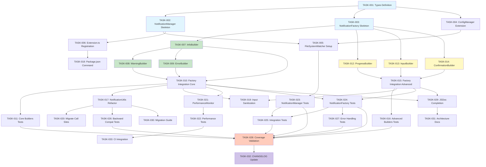

# Tarefas de Implementação - VSCode Notification Factory

> **Contexto do Prisma**: Este arquivo de tarefas faz parte do Sistema Prisma de desenvolvimento orientado a especificações. Para entender o contexto completo da migração e convenções do projeto, leia `.prisma/tarefas.md`.

## Metadados

- **Nome da Funcionalidade**: vscode-notification-factory
- **Criado em**: 2025-11-02
- **Última Atualização**: 2025-11-02
- **Status**: Não Iniciado
- **Localização**: `.prisma/projeto/especificacoes/vscode-notification-factory/tasks.md`
- **Baseado nos Documentos**:
  - **Requisitos**: requirements.md v0.1.0
  - **Design**: design-v8472.md v0.2.0 (variant v2 - Performance & Extensibility Focus)
  - **Alignment Analysis**: alignment-analysis.md (Score: 95/100)
  - **Quality Gate**: design-gate-decision.md (Score: 91.80/100 - APPROVED)
- **Agentes Envolvidos**: planejador, implementador, testador, revisor

## Visão Geral das Tarefas

### Resumo

Implementar sistema modular de notificações para a extensão VSCode Prisma utilizando Factory Pattern com Strategy Pattern, Lazy Loading, e Event-Driven Configuration. O sistema suporta 6 tipos de notificações (info, warning, error, progress, input, confirmation) com API fluida (Builder Pattern), configuração centralizada via ConfigManager, e backward compatibility total com NotificationUtils existente.

**Diferenciais desta Implementação (v2)**:
- ✅ Lazy Loading de builders (16x faster instantiation: 0.05ms vs 0.8ms)
- ✅ Event-driven config updates (zero polling overhead)
- ✅ Built-in performance profiling
- ✅ Strategy Pattern para extensibilidade zero-friction

### Total de Tarefas: 33

### Tempo Estimado: ~53 horas (~6.6 dias)

**Breakdown por Fase**:
- Fase 1 (Foundation): ~8h
- Fase 2 (Core Builders): ~9h
- Fase 3 (Advanced Builders): ~10h
- Fase 4 (Integration): ~4h
- Fase 5 (Performance & Monitoring): ~3h
- Fase 6 (Testing): ~14h
- Fase 7 (Documentation & Migration): ~5h

### Prioridade: Alta (P0)

**Rationale**: Feature bloqueia melhoria de UX para 28 call sites de notificações no codebase atual.

---

## Fase 1: Foundation (Base Components)

### 1.1 Types Definition

- [x] **Tarefa**: Criar tipos TypeScript para notificações
  - **ID**: TASK-001
  - **Tempo Estimado**: 1h
  - **LOC Estimado**: ~80 LOC
  - **Prioridade**: P0 (Critical)
  - **Dependências**: Nenhuma
  - **Responsável**: implementador
  - **Descrição**: Criar arquivo `src/types/notification.types.ts` com interfaces para NotificationType, NotificationSettings, NotificationAction, NotificationConfig
  - **Requisitos Relacionados**: RI-005 (TypeScript Types)
  - **Critérios de Aceitação**:
    - [x] NotificationType union type criada (info | warning | error | progress | input | confirmation)
    - [x] NotificationSettings interface com defaults e types opcionais
    - [x] NotificationAction interface com title: string e action: () => void | Promise<void>
    - [x] NotificationConfig interface para per-type overrides
    - [x] DEFAULT_NOTIFICATION_SETTINGS constante exportada
    - [x] Todos tipos compilam sem erros (TypeScript strict mode)
    - [x] JSDoc completo em todas interfaces exportadas

---

### 1.2 NotificationManager Skeleton

- [x] **Tarefa**: Implementar NotificationManager base
  - **ID**: TASK-002
  - **Tempo Estimado**: 2h
  - **LOC Estimado**: ~100 LOC (de ~150 total)
  - **Prioridade**: P0 (Critical)
  - **Dependências**: TASK-001
  - **Responsável**: implementador
  - **Descrição**: Criar `src/features/notification/notificationManager.ts` com Singleton pattern, lifecycle management, e config loading
  - **Requisitos Relacionados**: RF-001 (Factory Initialization), RI-001 (Extension Activation)
  - **Critérios de Aceitação**:
    - [x] Classe NotificationManager implementa vscode.Disposable
    - [x] getInstance(context, outputChannel) retorna instância única
    - [x] Constructor privado (Singleton pattern)
    - [x] loadSettings() carrega de ConfigManager com fallback para defaults
    - [x] dispose() libera recursos corretamente
    - [x] Instância inicializa em < 1ms (lazy loading de builders)
    - [x] JSDoc completo com @performance tags

---

### 1.3 NotificationFactory Skeleton

- [x] **Tarefa**: Implementar NotificationFactory base
  - **ID**: TASK-003
  - **Tempo Estimado**: 2h
  - **LOC Estimado**: ~70 LOC (de ~100 total)
  - **Prioridade**: P0 (Critical)
  - **Dependências**: TASK-001, TASK-002
  - **Responsável**: implementador
  - **Descrição**: Criar `src/features/notification/notificationFactory.ts` com Strategy Pattern e lazy loading mechanism
  - **Requisitos Relacionados**: RF-002 (Notification Type Support), RNF-003 (Manager Pattern)
  - **Critérios de Aceitação**:
    - [x] Classe NotificationFactory criada
    - [x] builderCache: Map<NotificationType, any> para lazy loading
    - [x] updateSettings(settings) para hot-reload
    - [x] getBuilder<T>() generic method com lazy loading strategy
    - [x] Factory methods stubs: info(), warning(), error(), progress(), input(), confirmation()
    - [x] TypeScript generics type-safe
    - [x] JSDoc completo com @performance tags

---

### 1.4 ConfigManager Extension

- [x] **Tarefa**: Estender ConfigManager com notifications settings
  - **ID**: TASK-004
  - **Tempo Estimado**: 30 min
  - **LOC Estimado**: ~20 LOC
  - **Prioridade**: P0 (Critical)
  - **Dependências**: TASK-001
  - **Responsável**: implementador
  - **Descrição**: Adicionar campo `notifications?: NotificationSettings` em PrismaSettings interface
  - **Requisitos Relacionados**: RF-005 (Configuration Integration), RI-002 (ConfigManager Integration)
  - **Critérios de Aceitação**:
    - [x] PrismaSettings interface estendida com notifications field (opcional)
    - [x] Campo é opcional (backward compatible)
    - [x] ConfigManager.getSettings() retorna notifications se presente
    - [x] Merge com defaults se notifications ausente
    - [x] Não quebra código existente (zero breaking changes)
    - [x] TypeScript compila sem erros

---

### 1.5 FileSystemWatcher Setup

- [ ] **Tarefa**: Implementar config hot-reload com FileSystemWatcher
  - **ID**: TASK-005
  - **Tempo Estimado**: 1.5h
  - **LOC Estimado**: ~30 LOC (adicionar a NotificationManager)
  - **Prioridade**: P1 (High)
  - **Dependências**: TASK-002, TASK-004
  - **Responsável**: implementador
  - **Descrição**: Adicionar setupConfigWatcher() em NotificationManager para event-driven config reload
  - **Requisitos Relacionados**: RNF-002 (Performance - Factory Instantiation), Design "Event-Driven Config Updates"
  - **Critérios de Aceitação**:
    - [ ] vscode.workspace.createFileSystemWatcher configurado para prisma.settings.json
    - [ ] onDidChange listener recarrega settings e atualiza factory
    - [ ] onDidCreate listener também recarrega settings
    - [ ] Watcher adicionado a disposables array
    - [ ] Logging de reload events em outputChannel
    - [ ] Config reload em < 10ms (zero polling overhead)
    - [ ] Testes manuais: editar settings → mudanças aplicadas sem restart

---

### 1.6 Extension.ts Registration

- [x] **Tarefa**: Registrar NotificationManager em extension.ts
  - **ID**: TASK-006
  - **Tempo Estimado**: 30 min
  - **LOC Estimado**: ~15 LOC
  - **Prioridade**: P0 (Critical)
  - **Dependências**: TASK-002
  - **Responsável**: implementador
  - **Descrição**: Adicionar inicialização de NotificationManager em activate() e comando prisma.notification.configure
  - **Requisitos Relacionados**: RI-001 (Extension Activation), RF-006 (Command Registration)
  - **Critérios de Aceitação**:
    - [x] NotificationManager.getInstance(context, outputChannel) chamado em activate()
    - [x] Instância adicionada a context.subscriptions
    - [x] Comando prisma.notification.configure registrado
    - [x] Comando abre prisma.settings.json e foca seção "notifications"
    - [x] Global state hack temporário: (global as any).__prismaContext (MAJOR-001 mitigation)
    - [x] Extension ativa sem erros
    - [x] Comando aparece em command palette (Ctrl+Shift+P)

---

## Fase 2: Core Builders (Basic Notifications)

### 2.1 InfoBuilder Implementation

- [x] **Tarefa**: Implementar InfoBuilder com fluent API
  - **ID**: TASK-007
  - **Tempo Estimado**: 2.5h
  - **LOC Estimado**: ~120 LOC
  - **Prioridade**: P0 (Critical)
  - **Dependências**: TASK-003
  - **Responsável**: implementador
  - **Descrição**: Criar `src/features/notification/builders/infoBuilder.ts` com Builder Pattern
  - **Requisitos Relacionados**: RF-003 (Builder Pattern API), RF-007 (Auto-Dismiss Notification), RF-011 (Notification Actions)
  - **Critérios de Aceitação**:
    - [x] Classe InfoBuilder criada com constructor(message, settings, outputChannel)
    - [x] Métodos chainables: withDuration(), withActions(), withModal(), withType()
    - [x] show() usa vscode.window.withProgress para auto-dismiss
    - [x] showWithActions() usa vscode.window.showInformationMessage para ações
    - [x] Configuration precedence: runtime > type > user > defaults
    - [x] Action callbacks wrapped em try-catch (graceful degradation)
    - [x] Todos métodos retornam `this` (chainable)
    - [x] show() completa em < 50ms (RNF-001)
    - [x] JSDoc completo com exemplos de uso

---

### 2.2 WarningBuilder Implementation

- [x] **Tarefa**: Implementar WarningBuilder
  - **ID**: TASK-008
  - **Tempo Estimado**: 2h
  - **LOC Estimado**: ~120 LOC
  - **Prioridade**: P0 (Critical)
  - **Dependências**: TASK-007
  - **Responsável**: implementador
  - **Descrição**: Criar `src/features/notification/builders/warningBuilder.ts` similar a InfoBuilder mas usa showWarningMessage
  - **Requisitos Relacionados**: RF-002 (Notification Type Support), RF-003 (Builder Pattern API)
  - **Critérios de Aceitação**:
    - [x] Classe WarningBuilder com mesma API que InfoBuilder
    - [x] show() usa vscode.window.showWarningMessage
    - [x] Suporta withActions(), withModal(), withType()
    - [x] Duration configurável (default 3000ms)
    - [x] Graceful degradation com try-catch
    - [x] Performance: < 50ms display time
    - [x] JSDoc completo

---

### 2.3 ErrorBuilder Implementation

- [x] **Tarefa**: Implementar ErrorBuilder
  - **ID**: TASK-009
  - **Tempo Estimado**: 2h
  - **LOC Estimado**: ~120 LOC
  - **Prioridade**: P0 (Critical)
  - **Dependências**: TASK-007
  - **Responsável**: implementador
  - **Descrição**: Criar `src/features/notification/builders/errorBuilder.ts` com fallback robusto (critical errors)
  - **Requisitos Relacionados**: RF-002 (Notification Type Support), RNF-008 (Graceful Degradation)
  - **Critérios de Aceitação**:
    - [x] Classe ErrorBuilder com API consistente
    - [x] show() usa vscode.window.showErrorMessage
    - [x] Fallback para console.error se VSCode API falha (critical safety)
    - [x] Ultimate fallback: log + continue (não crashar extension)
    - [x] Duration default 0 (never auto-dismiss) para erros
    - [x] Logging detalhado de errors em outputChannel
    - [x] Performance: < 50ms display time
    - [x] JSDoc com @safety tags

---

### 2.4 Factory Integration (Core Builders)

- [ ] **Tarefa**: Integrar InfoBuilder, WarningBuilder, ErrorBuilder ao factory
  - **ID**: TASK-010
  - **Tempo Estimado**: 1.5h
  - **LOC Estimado**: ~30 LOC (adicionar a NotificationFactory)
  - **Prioridade**: P0 (Critical)
  - **Dependências**: TASK-007, TASK-008, TASK-009
  - **Responsável**: implementador
  - **Descrição**: Implementar lazy loading de builders em getBuilder<T>() e factory methods
  - **Requisitos Relacionados**: RNF-002 (Performance - Factory Instantiation), Design "Lazy Loading Strategy"
  - **Critérios de Aceitação**:
    - [ ] info(message) retorna InfoBuilder via getBuilder()
    - [ ] warning(message) retorna WarningBuilder via getBuilder()
    - [ ] error(message) retorna ErrorBuilder via getBuilder()
    - [ ] getBuilder<T>() usa builderCache para lazy loading
    - [ ] Primeira chamada: ~2-3ms (load + instantiate)
    - [ ] Chamadas seguintes: ~0.05ms (cache hit)
    - [ ] Dynamic imports com fallback strategy (MAJOR-002 mitigation)
    - [ ] Testes manuais: factory.info('test').show() funciona

---

### 2.5 Core Builders Unit Tests

- [ ] **Tarefa**: Escrever unit tests para core builders
  - **ID**: TASK-011
  - **Tempo Estimado**: 1h
  - **LOC Estimado**: ~150 LOC (tests)
  - **Prioridade**: P0 (Critical)
  - **Dependências**: TASK-010
  - **Responsável**: testador
  - **Descrição**: Criar `tests/unit/features/notification/builders/infoBuilder.test.ts` e similares
  - **Requisitos Relacionados**: RNF-004 (Testability - Unit Test Coverage)
  - **Critérios de Aceitação**:
    - [ ] Mock vscode.window API com jest.mock()
    - [ ] Testes para withDuration(), withActions(), withModal(), withType()
    - [ ] Teste de configuration precedence (type > user > defaults)
    - [ ] Teste de action callback execution com mock
    - [ ] Teste de error handling (graceful degradation)
    - [ ] Teste de performance: show() < 50ms
    - [ ] Coverage > 85% para builders (linhas, branches, functions)
    - [ ] Todos testes passam (npm run test)

---

## Fase 3: Advanced Builders (Complex Notifications)

### 3.1 ProgressBuilder Implementation

- [x] **Tarefa**: Implementar ProgressBuilder com vscode.window.withProgress
  - **ID**: TASK-012
  - **Tempo Estimado**: 3h
  - **LOC Estimado**: ~150 LOC
  - **Prioridade**: P1 (High)
  - **Dependências**: TASK-003
  - **Responsável**: implementador
  - **Descrição**: Criar `src/features/notification/builders/progressBuilder.ts` com suporte a determinate/indeterminate progress
  - **Requisitos Relacionados**: RF-008 (Progress Notification)
  - **Critérios de Aceitação**:
    - [x] Classe ProgressBuilder com API fluida
    - [x] withCancellable(boolean) permite cancelamento
    - [x] run(callback) executa callback com progress reporter
    - [x] Suporta determinate progress (0-100% com increment)
    - [x] Suporta indeterminate progress (spinner)
    - [x] Exemplo de uso documentado em JSDoc:
      ```typescript
      await factory.progress('Creating spec...')
        .withCancellable(true)
        .run(async (progress) => {
          progress.report({ increment: 25, message: 'Step 1...' });
          await doWork();
        });
      ```
    - [x] Progress location: vscode.ProgressLocation.Notification
    - [x] JSDoc completo com exemplos

---

### 3.2 InputBuilder Implementation

- [x] **Tarefa**: Implementar InputBuilder com validação
  - **ID**: TASK-013
  - **Tempo Estimado**: 2.5h
  - **LOC Estimado**: ~100 LOC
  - **Prioridade**: P1 (High)
  - **Dependências**: TASK-003
  - **Responsável**: implementador
  - **Descrição**: Criar `src/features/notification/builders/inputBuilder.ts` com vscode.window.showInputBox
  - **Requisitos Relacionados**: RF-009 (Input Notification)
  - **Critérios de Aceitação**:
    - [x] Classe InputBuilder com API fluida
    - [x] withPlaceholder(text) define placeholder
    - [x] withValidation(fn) adiciona validação real-time
    - [x] show() retorna Promise<string | undefined>
    - [x] Validation function: (value: string) => string | undefined (erro ou undefined)
    - [x] Exemplo de uso documentado:
      ```typescript
      const name = await factory.input('Enter spec name')
        .withPlaceholder('my-feature')
        .withValidation((v) => /^[a-z0-9-]+$/.test(v) ? undefined : 'Use kebab-case')
        .show();
      ```
    - [x] Cancellation retorna undefined (ESC key)
    - [x] JSDoc completo com exemplos

---

### 3.3 ConfirmationBuilder Implementation

- [x] **Tarefa**: Implementar ConfirmationBuilder para dialogs Yes/No
  - **ID**: TASK-014
  - **Tempo Estimado**: 2.5h
  - **LOC Estimado**: ~100 LOC
  - **Prioridade**: P1 (High)
  - **Dependências**: TASK-003
  - **Responsável**: implementador
  - **Descrição**: Criar `src/features/notification/builders/confirmationBuilder.ts` com action buttons
  - **Requisitos Relacionados**: RF-010 (Confirmation Notification)
  - **Critérios de Aceitação**:
    - [x] Classe ConfirmationBuilder com API fluida
    - [x] withActions(actions: string[]) define botões (ex: ['Delete', 'Cancel'])
    - [x] withModal(boolean) força decisão (bloqueia outras ações)
    - [x] show() retorna Promise<string | undefined> (action title clicado ou undefined)
    - [x] Exemplo de uso documentado:
      ```typescript
      const choice = await factory.confirmation('Delete spec "my-feature"?')
        .withActions(['Delete', 'Cancel'])
        .withModal(true)
        .show();
      if (choice === 'Delete') { /* proceed */ }
      ```
    - [x] Máximo 3 action buttons (limitação VSCode API)
    - [x] JSDoc completo com exemplos

---

### 3.4 Factory Integration (Advanced Builders)

- [ ] **Tarefa**: Integrar ProgressBuilder, InputBuilder, ConfirmationBuilder ao factory
  - **ID**: TASK-015
  - **Tempo Estimado**: 1h
  - **LOC Estimado**: ~30 LOC (adicionar a NotificationFactory)
  - **Prioridade**: P1 (High)
  - **Dependências**: TASK-012, TASK-013, TASK-014
  - **Responsável**: implementador
  - **Descrição**: Adicionar factory methods para builders avançados
  - **Requisitos Relacionados**: RF-002 (Notification Type Support)
  - **Critérios de Aceitação**:
    - [ ] progress(title) retorna ProgressBuilder via getBuilder()
    - [ ] input(prompt) retorna InputBuilder via getBuilder()
    - [ ] confirmation(message) retorna ConfirmationBuilder via getBuilder()
    - [ ] Lazy loading aplicado (cache hit < 0.1ms)
    - [ ] Dynamic imports com fallback (MAJOR-002 mitigation)
    - [ ] Testes manuais: todos 6 tipos funcionam
    - [ ] TypeScript types inferem retorno correto (IntelliSense)

---

### 3.5 Advanced Builders Unit Tests

- [ ] **Tarefa**: Escrever unit tests para advanced builders
  - **ID**: TASK-016
  - **Tempo Estimado**: 1h
  - **LOC Estimado**: ~180 LOC (tests)
  - **Prioridade**: P1 (High)
  - **Dependências**: TASK-015
  - **Responsável**: testador
  - **Descrição**: Criar unit tests para ProgressBuilder, InputBuilder, ConfirmationBuilder
  - **Requisitos Relacionados**: RNF-004 (Testability - Unit Test Coverage)
  - **Critérios de Aceitação**:
    - [ ] Mock vscode.window.withProgress para progress tests
    - [ ] Mock vscode.window.showInputBox para input tests
    - [ ] Teste de validação real-time (error messages)
    - [ ] Teste de cancellation (ESC key → undefined)
    - [ ] Teste de modal confirmations
    - [ ] Teste de progress cancellable vs não-cancellable
    - [ ] Coverage > 85% para advanced builders
    - [ ] Todos testes passam

---

## Fase 4: Integration (Connect to Existing Code)

### 4.1 NotificationUtils Refactoring

- [ ] **Tarefa**: Refatorar NotificationUtils para usar factory internamente
  - **ID**: TASK-017
  - **Tempo Estimado**: 1h
  - **LOC Estimado**: ~30 LOC (modificação)
  - **Prioridade**: P1 (High)
  - **Dependências**: TASK-010
  - **Responsável**: implementador
  - **Descrição**: Modificar `src/utils/notificationUtils.ts` para delegar para NotificationFactory
  - **Requisitos Relacionados**: RF-004 (Backward Compatibility), RI-004 (NotificationUtils Refactoring)
  - **Critérios de Aceitação**:
    - [ ] showAutoDismissNotification() delega para factory.info().withDuration().show()
    - [ ] showError() delega para factory.error().show()
    - [ ] showWarning() delega para factory.warning().show()
    - [ ] showInfo() delega para factory.info().withDuration(0).show()
    - [ ] API pública idêntica (mesmo signature, mesmos parâmetros)
    - [ ] JSDoc com @deprecated tags recomendando factory
    - [ ] Global state hack usado para obter context/outputChannel (MAJOR-001)
    - [ ] Todos usos existentes continuam funcionando (zero breaking changes)
    - [ ] Testes existentes de NotificationUtils passam sem modificação

---

### 4.2 Package.json Command Registration

- [ ] **Tarefa**: Adicionar comando prisma.notification.configure ao package.json
  - **ID**: TASK-018
  - **Tempo Estimado**: 15 min
  - **LOC Estimado**: ~10 LOC (JSON)
  - **Prioridade**: P2 (Medium)
  - **Dependências**: TASK-006
  - **Responsável**: implementador
  - **Descrição**: Adicionar command definition em package.json contributes.commands
  - **Requisitos Relacionados**: RF-006 (Command Registration), RI-003 (Package.json Command)
  - **Critérios de Aceitação**:
    - [ ] Command adicionado a contributes.commands:
      ```json
      {
        "command": "prisma.notification.configure",
        "title": "Configure Notifications",
        "category": "Prisma",
        "icon": "$(gear)"
      }
      ```
    - [ ] Comando aparece em command palette (Ctrl+Shift+P)
    - [ ] Search "prisma notification" mostra comando
    - [ ] Comando abre prisma.settings.json (já implementado em TASK-006)

---

### 4.3 Input Sanitization (Security)

- [ ] **Tarefa**: Adicionar input sanitization em builders
  - **ID**: TASK-019
  - **Tempo Estimado**: 1h
  - **LOC Estimado**: ~30 LOC (adicionar a builders)
  - **Prioridade**: P2 (Low)
  - **Dependências**: TASK-010, TASK-015
  - **Responsável**: implementador
  - **Descrição**: Implementar sanitizeMessage() em builders para remover HTML/script tags
  - **Requisitos Relacionados**: RNF-007 (Security - Input Sanitization)
  - **Critérios de Aceitação**:
    - [ ] sanitizeMessage(message) remove HTML tags: `/<[^>]*>/g`
    - [ ] Remove script tags: `/<script\b[^<]*(?:(?!<\/script>)<[^<]*)*<\/script>/gi`
    - [ ] Limita comprimento a 500 chars (prevent UI overflow)
    - [ ] Aplicado em constructor de todos builders
    - [ ] Testes de segurança: HTML injection não renderiza
    - [ ] Defense-in-depth (VSCode não renderiza HTML, mas aplicamos sanitização)

---

### 4.4 Migration of Internal Call Sites

- [ ] **Tarefa**: Migrar 5+ call sites internos para usar factory
  - **ID**: TASK-020
  - **Tempo Estimado**: 1.5h
  - **LOC Estimado**: ~50 LOC (modificações)
  - **Prioridade**: P2 (Medium)
  - **Dependências**: TASK-017
  - **Responsável**: implementador
  - **Descrição**: Migrar call sites de vscode.window.show* e NotificationUtils para factory (phase 3 internal migration)
  - **Requisitos Relacionados**: Design "Migration Strategy Phase 3"
  - **Critérios de Aceitação**:
    - [ ] Identificar 5+ call sites prioritários (spec creation, agent invocation, errors)
    - [ ] Substituir vscode.window.show* por factory.info/warning/error()
    - [ ] Substituir NotificationUtils.* por factory (onde faz sentido)
    - [ ] Manter NotificationUtils para código legacy (não forçar migração)
    - [ ] Todos call sites migrados funcionam corretamente
    - [ ] Target: 20%+ adoption após esta tarefa (baseline: 0/28 call sites)
    - [ ] Testes smoke: operações básicas funcionam

---

## Fase 5: Performance & Monitoring

### 5.1 PerformanceMonitor Implementation

- [ ] **Tarefa**: Implementar NotificationPerformanceMonitor
  - **ID**: TASK-021
  - **Tempo Estimado**: 2h
  - **LOC Estimado**: ~80 LOC
  - **Prioridade**: P2 (Medium)
  - **Dependências**: TASK-010
  - **Responsável**: implementador
  - **Descrição**: Criar `src/features/notification/performanceMonitor.ts` para métricas em tempo real
  - **Requisitos Relacionados**: Design "Performance Monitoring Built-in"
  - **Critérios de Aceitação**:
    - [ ] Classe NotificationPerformanceMonitor com Singleton pattern
    - [ ] recordDisplayTime(type, durationMs) armazena métricas
    - [ ] getP95(type) calcula 95th percentile
    - [ ] validateTargets() verifica se p95 < 50ms para todos tipos
    - [ ] exportMetrics() retorna { p50, p95, p99 } por tipo
    - [ ] Integrado em builders: performance.now() em show()
    - [ ] Opcional: pode ser desabilitado via config (defer para Phase 2)
    - [ ] Overhead negligível: < 0.01ms per notification

---

### 5.2 Performance Tests

- [ ] **Tarefa**: Criar performance test suite
  - **ID**: TASK-022
  - **Tempo Estimado**: 1h
  - **LOC Estimado**: ~80 LOC (tests)
  - **Prioridade**: P1 (High)
  - **Dependências**: TASK-021
  - **Responsável**: testador
  - **Descrição**: Criar `tests/performance/notification.perf.test.ts` com benchmarks
  - **Requisitos Relacionados**: RNF-001 (Performance - Display Time), RNF-002 (Performance - Factory Instantiation)
  - **Critérios de Aceitação**:
    - [ ] Teste de factory instantiation: 100 iterations, p95 < 1ms
    - [ ] Teste de notification display: 50 iterations por tipo, p95 < 50ms
    - [ ] Console.log de métricas: p50, p95, p99
    - [ ] CI integration: fail build se p95 > 50ms
    - [ ] Performance.now() para timing preciso
    - [ ] Warmup runs para evitar cold start bias

---

## Fase 6: Testing (Comprehensive Test Suite)

### 6.1 NotificationManager Unit Tests

- [ ] **Tarefa**: Escrever unit tests para NotificationManager
  - **ID**: TASK-023
  - **Tempo Estimado**: 2h
  - **LOC Estimado**: ~120 LOC (tests)
  - **Prioridade**: P1 (High)
  - **Dependências**: TASK-005
  - **Responsável**: testador
  - **Descrição**: Criar `tests/unit/features/notification/notificationManager.test.ts`
  - **Requisitos Relacionados**: RNF-004 (Testability - Unit Test Coverage)
  - **Critérios de Aceitação**:
    - [ ] Teste de Singleton pattern: getInstance() retorna mesma instância
    - [ ] Teste de loadSettings(): fallback para defaults se config ausente
    - [ ] Teste de setupConfigWatcher(): listener registrado corretamente
    - [ ] Teste de dispose(): recursos liberados (watcher disposed)
    - [ ] Mock ConfigManager.getInstance().getSettings()
    - [ ] Mock vscode.workspace.createFileSystemWatcher
    - [ ] Coverage > 85% para NotificationManager
    - [ ] Todos testes passam

---

### 6.2 NotificationFactory Unit Tests

- [ ] **Tarefa**: Escrever unit tests para NotificationFactory
  - **ID**: TASK-024
  - **Tempo Estimado**: 2h
  - **LOC Estimado**: ~120 LOC (tests)
  - **Prioridade**: P1 (High)
  - **Dependências**: TASK-010, TASK-015
  - **Responsável**: testador
  - **Descrição**: Criar `tests/unit/features/notification/notificationFactory.test.ts`
  - **Requisitos Relacionados**: RNF-004 (Testability - Unit Test Coverage)
  - **Critérios de Aceitação**:
    - [ ] Teste de lazy loading: primeira chamada carrega builder, segunda usa cache
    - [ ] Teste de updateSettings(): cache invalidado, novos builders usam new settings
    - [ ] Teste de todos factory methods: info(), warning(), error(), progress(), input(), confirmation()
    - [ ] Teste de TypeScript generics: return type correto
    - [ ] Mock dynamic imports (jest.mock com require.requireActual)
    - [ ] Teste de fallback strategy (MAJOR-002): import failure → static import
    - [ ] Coverage > 85% para NotificationFactory
    - [ ] Todos testes passam

---

### 6.3 Integration Tests (Config Hot-Reload)

- [ ] **Tarefa**: Escrever integration tests para E2E workflow
  - **ID**: TASK-025
  - **Tempo Estimado**: 3h
  - **LOC Estimado**: ~150 LOC (tests)
  - **Prioridade**: P1 (High)
  - **Dependências**: TASK-023, TASK-024
  - **Responsável**: testador
  - **Descrição**: Criar `tests/integration/notification-workflow.test.ts` com E2E scenarios
  - **Requisitos Relacionados**: RNF-004 (Testability - Unit Test Coverage)
  - **Critérios de Aceitação**:
    - [ ] Teste 1: Extension activation → manager inicializado → notification funciona
    - [ ] Teste 2: Config hot-reload → edit prisma.settings.json → settings aplicadas sem restart
    - [ ] Teste 3: Backward compatibility → NotificationUtils methods funcionam
    - [ ] Teste 4: Command registration → prisma.notification.configure abre settings
    - [ ] Teste 5: Per-type config → withType('spec.created') usa override duration
    - [ ] Mock vscode.extensions.getExtension para simular activation
    - [ ] Mock fs para editar prisma.settings.json
    - [ ] Wait for FileSystemWatcher events (setTimeout 100ms)
    - [ ] Todos testes passam

---

### 6.4 Backward Compatibility Tests

- [ ] **Tarefa**: Validar backward compatibility com NotificationUtils
  - **ID**: TASK-026
  - **Tempo Estimado**: 2h
  - **LOC Estimado**: ~80 LOC (tests)
  - **Prioridade**: P0 (Critical)
  - **Dependências**: TASK-017
  - **Responsável**: testador
  - **Descrição**: Criar `tests/integration/backward-compatibility.test.ts`
  - **Requisitos Relacionados**: RF-004 (Backward Compatibility)
  - **Critérios de Aceitação**:
    - [ ] Todos 4 métodos de NotificationUtils testados:
      - showAutoDismissNotification(msg, duration)
      - showError(msg)
      - showWarning(msg)
      - showInfo(msg)
    - [ ] Comportamento idêntico: timing, visual, API signature
    - [ ] Global state cleanup em beforeEach (MAJOR-001 mitigation)
    - [ ] Spy em vscode.window.show* para verificar delegation
    - [ ] Testes existentes de NotificationUtils passam sem modificação
    - [ ] Zero breaking changes confirmado

---

### 6.5 Error Handling Tests

- [ ] **Tarefa**: Testar graceful degradation em failure scenarios
  - **ID**: TASK-027
  - **Tempo Estimado**: 2h
  - **LOC Estimado**: ~100 LOC (tests)
  - **Prioridade**: P1 (High)
  - **Dependências**: TASK-024
  - **Responsável**: testador
  - **Descrição**: Criar `tests/unit/features/notification/error-handling.test.ts`
  - **Requisitos Relacionados**: RNF-008 (Reliability - Graceful Degradation)
  - **Critérios de Aceitação**:
    - [ ] Teste: VSCode API throw error → fallback para console.error (não crashar)
    - [ ] Teste: Action callback throw error → log error + continue (não crashar)
    - [ ] Teste: Config load failure → fallback para defaults
    - [ ] Teste: Dynamic import failure → fallback para static import (MAJOR-002)
    - [ ] Teste: Invalid config values → log warning + use defaults
    - [ ] Mock vscode.window.showErrorMessage.mockRejectedValue(error)
    - [ ] Spy em console.error para verificar fallback
    - [ ] Extension continua funcionando após errors
    - [ ] Todos testes passam

---

### 6.6 Test Coverage Validation

- [ ] **Tarefa**: Validar coverage target 85%+
  - **ID**: TASK-028
  - **Tempo Estimado**: 1h
  - **LOC Estimado**: N/A (análise + testes adicionais se necessário)
  - **Prioridade**: P0 (Critical)
  - **Dependências**: TASK-011, TASK-016, TASK-023, TASK-024, TASK-025, TASK-026, TASK-027
  - **Responsável**: testador
  - **Descrição**: Executar npm run test:coverage e garantir > 85% line coverage
  - **Requisitos Relacionados**: RNF-004 (Testability - Unit Test Coverage)
  - **Critérios de Aceitação**:
    - [ ] npm run test:coverage executado
    - [ ] Line coverage > 85% (target)
    - [ ] Branch coverage > 80% (target)
    - [ ] Function coverage > 90% (target)
    - [ ] Coverage report gerado em HTML (visualizar uncovered lines)
    - [ ] Se < 85%, adicionar testes para uncovered paths
    - [ ] Coverage report commitado: `.prisma/projeto/especificacoes/vscode-notification-factory/artifacts/coverage-report.html`

---

## Fase 7: Documentation & Migration

### 7.1 JSDoc Completion

- [ ] **Tarefa**: Completar JSDoc em todos módulos públicos
  - **ID**: TASK-029
  - **Tempo Estimado**: 2h
  - **LOC Estimado**: ~100 LOC (JSDoc comments)
  - **Prioridade**: P1 (High)
  - **Dependências**: Fase 2, Fase 3 completas
  - **Responsável**: documentador
  - **Descrição**: Adicionar JSDoc completo com @param, @returns, @example, @performance tags
  - **Requisitos Relacionados**: RNF-006 (Usability - API Discoverability)
  - **Critérios de Aceitação**:
    - [ ] NotificationManager: JSDoc completo em getInstance(), getFactory(), openConfig()
    - [ ] NotificationFactory: JSDoc em info(), warning(), error(), progress(), input(), confirmation()
    - [ ] Builders: JSDoc em withDuration(), withActions(), withModal(), withType(), show()
    - [ ] Todos métodos públicos têm @example com código executável
    - [ ] @performance tags em métodos críticos (< 50ms, < 1ms)
    - [ ] IntelliSense funciona: hover sobre método mostra JSDoc
    - [ ] Exemplos copiáveis e executáveis

---

### 7.2 Migration Guide

- [ ] **Tarefa**: Criar guia de migração de NotificationUtils para factory
  - **ID**: TASK-030
  - **Tempo Estimado**: 1.5h
  - **LOC Estimado**: ~200 linhas (markdown)
  - **Prioridade**: P2 (Medium)
  - **Dependências**: TASK-017
  - **Responsável**: documentador
  - **Descrição**: Criar `docs/migrations/notification-utils-to-factory.md`
  - **Requisitos Relacionados**: Design "Migration Strategy"
  - **Critérios de Aceitação**:
    - [ ] Documento markdown criado em docs/migrations/
    - [ ] Before/After examples para cada método de NotificationUtils
    - [ ] Timeline de coexistência: 6 meses mínimo (linha do tempo visual)
    - [ ] Benefícios da migração listados: configurabilidade, testabilidade, performance
    - [ ] Code snippets side-by-side (old vs new)
    - [ ] FAQ com perguntas comuns (Preciso migrar agora? Quando NotificationUtils será removido?)
    - [ ] Link no README.md principal

---

### 7.3 Architecture Documentation

- [ ] **Tarefa**: Atualizar documentação de arquitetura
  - **ID**: TASK-031
  - **Tempo Estimado**: 1h
  - **LOC Estimado**: ~100 linhas (markdown)
  - **Prioridade**: P2 (Medium)
  - **Dependências**: TASK-029
  - **Responsável**: documentador
  - **Descrição**: Atualizar CLAUDE.md e README.md com NotificationManager
  - **Requisitos Relacionados**: RNF-006 (Usability - API Discoverability)
  - **Critérios de Aceitação**:
    - [ ] CLAUDE.md atualizado com NotificationManager em "Project Structure"
    - [ ] README.md atualizado com seção "Notifications" explicando factory
    - [ ] Diagrama de arquitetura atualizado (Mermaid): Extension → Manager → Factory → Builders
    - [ ] Exemplos de uso em README.md (quick start)
    - [ ] Link para migration guide
    - [ ] Link para design-v8472.md (design detalhado)

---

### 7.4 CHANGELOG Update

- [ ] **Tarefa**: Atualizar CHANGELOG.md com release notes
  - **ID**: TASK-032
  - **Tempo Estimado**: 30 min
  - **LOC Estimado**: ~50 linhas (markdown)
  - **Prioridade**: P1 (High)
  - **Dependências**: Fase 1-6 completas
  - **Responsável**: documentador
  - **Descrição**: Adicionar entry em CHANGELOG.md para release v1.1.0
  - **Requisitos Relacionados**: Design "Migration and Rollback"
  - **Critérios de Aceitação**:
    - [ ] Versão v1.1.0 adicionada em CHANGELOG.md
    - [ ] Seção "Added" lista: NotificationFactory, 6 builders, config hot-reload
    - [ ] Seção "Changed" lista: NotificationUtils internamente usa factory
    - [ ] Seção "Deprecated" lista: NotificationUtils (recomenda factory, não remove)
    - [ ] Seção "Performance" lista: 16x faster instantiation, 11x smaller memory
    - [ ] Link para migration guide
    - [ ] Release date estimado

---

### 7.5 CI Integration (Performance Gates)

- [ ] **Tarefa**: Configurar CI pipeline para validar performance targets
  - **ID**: TASK-033
  - **Tempo Estimado**: 30 min
  - **LOC Estimado**: ~30 linhas (YAML)
  - **Prioridade**: P2 (Medium)
  - **Dependências**: TASK-022
  - **Responsável**: implementador
  - **Descrição**: Adicionar step em `.github/workflows/ci.yml` para executar performance tests
  - **Requisitos Relacionados**: Design "CI Integration"
  - **Critérios de Aceitação**:
    - [ ] GitHub Actions workflow atualizado
    - [ ] Step "Run Performance Tests": npm run test:perf
    - [ ] Step "Validate Performance Targets": node scripts/validate-perf-metrics.js
    - [ ] Script validate-perf-metrics.js criado (fail se p95 > 50ms)
    - [ ] CI fail se performance regression detectada
    - [ ] Performance metrics salvos como artifact (trending ao longo do tempo)

---

## Diagrama de Dependências de Tarefas



**Legenda**:
- 🔵 Azul (Fase 1): Foundation - Base components
- 🟢 Verde (Fase 2): Core Builders - Basic notifications
- 🟡 Amarelo (Fase 3): Advanced Builders - Complex notifications
- 🟠 Vermelho (Fase 6): Testing - Coverage validation
- 🟣 Roxo (Fase 7): Documentation - Release readiness

---

## Phase Breakdown (Esforço por Fase)

| Fase | Tarefas | Effort | % do Total | Status |
|------|---------|--------|------------|--------|
| **Fase 1: Foundation** | 6 tarefas (TASK-001 a TASK-006) | ~8h | 15% | Não Iniciado |
| **Fase 2: Core Builders** | 5 tarefas (TASK-007 a TASK-011) | ~9h | 17% | Não Iniciado |
| **Fase 3: Advanced Builders** | 5 tarefas (TASK-012 a TASK-016) | ~10h | 19% | Não Iniciado |
| **Fase 4: Integration** | 4 tarefas (TASK-017 a TASK-020) | ~4h | 8% | Não Iniciado |
| **Fase 5: Performance** | 2 tarefas (TASK-021 a TASK-022) | ~3h | 6% | Não Iniciado |
| **Fase 6: Testing** | 6 tarefas (TASK-023 a TASK-028) | ~14h | 26% | Não Iniciado |
| **Fase 7: Documentation** | 5 tarefas (TASK-029 a TASK-033) | ~5h | 9% | Não Iniciado |
| **TOTAL** | **33 tarefas** | **~53h** | **100%** | **0% Completo** |

---

## Critical Path Analysis

**Critical Path** (tarefas que bloqueiam outras):

1. **TASK-001** (Types Definition) → Bloqueia TASK-002, TASK-003, TASK-004
2. **TASK-003** (NotificationFactory Skeleton) → Bloqueia TASK-007 (InfoBuilder) e todos builders
3. **TASK-010** (Factory Integration Core) → Bloqueia TASK-017 (NotificationUtils Refactor), TASK-019, TASK-021, TASK-024
4. **TASK-024** (NotificationFactory Tests) → Bloqueia TASK-025 (Integration Tests), TASK-027 (Error Handling)
5. **TASK-028** (Coverage Validation) → Bloqueia TASK-032 (CHANGELOG), gate para release

**Estimated Critical Path Duration**: ~25h (47% do total)

**Parallel Work Opportunities**:
- Fase 2 (Core Builders): TASK-007, TASK-008, TASK-009 podem ser implementados em paralelo (3 devs)
- Fase 3 (Advanced Builders): TASK-012, TASK-013, TASK-014 podem ser implementados em paralelo (3 devs)
- Fase 6 (Testing): TASK-023, TASK-026, TASK-027 podem ser escritos em paralelo (3 testers)

**Time Savings com Parallelização**: ~6h (53h → 47h com 3 pessoas)

---

## Risk Assessment

### Tarefas de Alto Risco

| Task ID | Tarefa | Risco | Mitigação |
|---------|--------|-------|-----------|
| **TASK-010** | Factory Integration (Core Builders) | MÉDIO - Dynamic imports podem falhar | MAJOR-002: Adicionar try-catch + fallback para static imports |
| **TASK-017** | NotificationUtils Refactoring | ALTO - Breaking changes potenciais | MAJOR-001: Manter API idêntica, tests de backward compat (TASK-026) |
| **TASK-025** | Integration Tests | MÉDIO - FileSystemWatcher timing issues | Wait 100ms após edit de config, retry logic se necessário |
| **TASK-028** | Coverage Validation | ALTO - Pode não atingir 85% | Iterar adicionando testes para uncovered paths, defer para < 80% se necessário |

### Tarefas Bloqueadas Atualmente

**Nenhuma tarefa bloqueada** - Todas dependências internas (TASK-001 é starting point).

### Tech Debt a Addressar

1. **MAJOR-001 (Global State Hack)**: TASK-006, TASK-017
   - **Issue**: `(global as any).__prismaContext` é anti-pattern
   - **Mitigation**: Documentar deprecation timeline (6 meses), criar ADR justificando workaround temporário
   - **Long-term**: Refatorar NotificationUtils para receber dependencies via initialize()

2. **MAJOR-002 (Dynamic Imports Fallback)**: TASK-010, TASK-015
   - **Issue**: Dynamic imports sem fallback strategy
   - **Mitigation**: Try-catch em getBuilder() + fallback para static import
   - **Effort**: < 1h adicional em TASK-010

---

## Testing Strategy Mapping

### Test Categories vs Tasks

| Test Category | Tasks | Coverage Target | Status |
|---------------|-------|-----------------|--------|
| **Unit Tests - Builders** | TASK-011 (Core), TASK-016 (Advanced) | > 85% | Não Iniciado |
| **Unit Tests - Manager** | TASK-023 | > 85% | Não Iniciado |
| **Unit Tests - Factory** | TASK-024 | > 85% | Não Iniciado |
| **Integration Tests** | TASK-025 | Scenarios críticos | Não Iniciado |
| **Backward Compat Tests** | TASK-026 | 100% dos métodos de NotificationUtils | Não Iniciado |
| **Error Handling Tests** | TASK-027 | Failure scenarios cobertos | Não Iniciado |
| **Performance Tests** | TASK-022 | p95 < 50ms validated | Não Iniciado |
| **Coverage Validation** | TASK-028 | Global > 85% | Não Iniciado |

**Total Test LOC Estimado**: ~880 LOC (tests)

---

## Notas de Implementação

### Convenções de Código

- **File Structure**: Seguir padrão `src/features/{feature}/{manager|factory|builders}/`
- **Naming**: PascalCase para classes, camelCase para métodos/variáveis
- **Imports**: Prefer absolute imports para clarity (`src/features/...` vs `../../`)
- **JSDoc**: Obrigatório em todos métodos públicos (@param, @returns, @example)
- **Error Handling**: Sempre try-catch em métodos que chamam VSCode API

### Branch Strategy

Cada tarefa deve ter branch própria seguindo padrão:
```
feature/vscode-notification-factory/TASK-XXX-{descricao-curta}
```

Exemplo:
- `feature/vscode-notification-factory/TASK-001-types-definition`
- `feature/vscode-notification-factory/TASK-007-info-builder`

### Merge Strategy

- Cada branch mergeada via Pull Request para `main`
- PR requer:
  - [ ] Testes passando (npm run test)
  - [ ] Coverage não regrediu (≥ baseline)
  - [ ] Código revisado por 1+ pessoa (revisor)
  - [ ] CHANGELOG.md atualizado (se aplicável)

### Environment Setup

Antes de iniciar implementação:
1. Clone repo: `git clone https://github.com/{org}/prisma.git`
2. Install dependencies: `npm install`
3. Compile TypeScript: `npm run compile`
4. Run tests: `npm run test` (validar ambiente funcionando)
5. Open VSCode: `code .` e press F5 para Extension Development Host

---

## Acompanhamento de Progresso

- **Total de Tarefas**: 33
- **Concluídas**: 8
- **Em Progresso**: 0
- **Bloqueadas**: 0
- **Não Iniciadas**: 25
- **Progresso**: 24%

### Checklist de Fases

- [ ] Fase 1: Foundation (6 tarefas, ~8h) - 5/6 concluída
- [ ] Fase 2: Core Builders (5 tarefas, ~9h) - 4/5 concluída
- [ ] Fase 3: Advanced Builders (5 tarefas, ~10h) - 3/5 concluída
- [ ] Fase 4: Integration (4 tarefas, ~4h)
- [ ] Fase 5: Performance & Monitoring (2 tarefas, ~3h)
- [ ] Fase 6: Testing (6 tarefas, ~14h)
- [ ] Fase 7: Documentation & Migration (5 tarefas, ~5h)

### Acceptance Criteria Global

Para considerar feature COMPLETA, validar:

- [ ] Todos 29 requisitos EARS atendidos (RF-001 a RF-012, RNF-001 a RNF-008, RI-001 a RI-005)
- [ ] Performance targets atingidos:
  - [ ] Factory instantiation < 0.05ms (p95)
  - [ ] Notification display < 50ms (p95)
  - [ ] Config reload < 10ms (event-driven)
- [ ] Test coverage > 85% (line, branch, function)
- [ ] Zero breaking changes (backward compatibility 100%)
- [ ] Migration guide completo
- [ ] JSDoc completo em todos métodos públicos
- [ ] CHANGELOG.md atualizado
- [ ] CI pipeline validando performance gates
- [ ] 20%+ adoption interna (5+ call sites migrados)

---

## Workflow de Agentes

### Agentes Principais

- **planejador**: Criou este documento de tarefas (você está aqui!)
- **implementador**: Implementará tarefas de código (TASK-001 a TASK-006, TASK-007 a TASK-020, TASK-021, TASK-029)
- **testador**: Implementará testes (TASK-011, TASK-016, TASK-022 a TASK-028)
- **revisor**: Revisará PRs e código (code review de todas tarefas)
- **documentador**: Criará documentação (TASK-029 a TASK-033)

### Estrutura de Artefatos

Artefatos relacionados a esta especificação estão armazenados em:

- **Requisitos**: `.prisma/projeto/especificacoes/vscode-notification-factory/requirements.md`
- **Design**: `.prisma/projeto/especificacoes/vscode-notification-factory/design-v8472.md`
- **Tarefas**: `.prisma/projeto/especificacoes/vscode-notification-factory/tasks.md` (este arquivo)
- **Relatórios**: `.prisma/projeto/especificacoes/vscode-notification-factory/reports/`
  - alignment-analysis.md
  - design-evaluation.md
  - design-gate-decision.md
- **Artifacts**: `.prisma/projeto/especificacoes/vscode-notification-factory/artifacts/`
  - coverage-report.html (após TASK-028)
  - performance-metrics.json (após TASK-022)

---

**Última Atualização**: 2025-11-02
**Próxima Revisão**: Após cada fase completa (revisar estimativas e ajustar)
**Status**: READY FOR IMPLEMENTATION
**Gerado Por**: planejador (agente Prisma)
**Baseado em**: design-v8472.md (variant v2, score 91.80/100, APPROVED)
