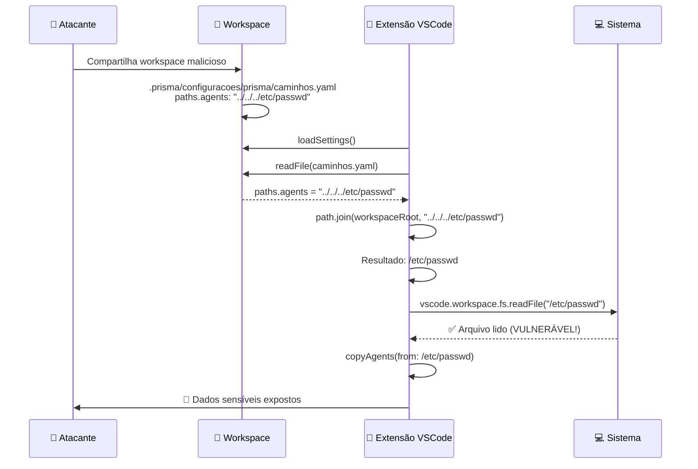
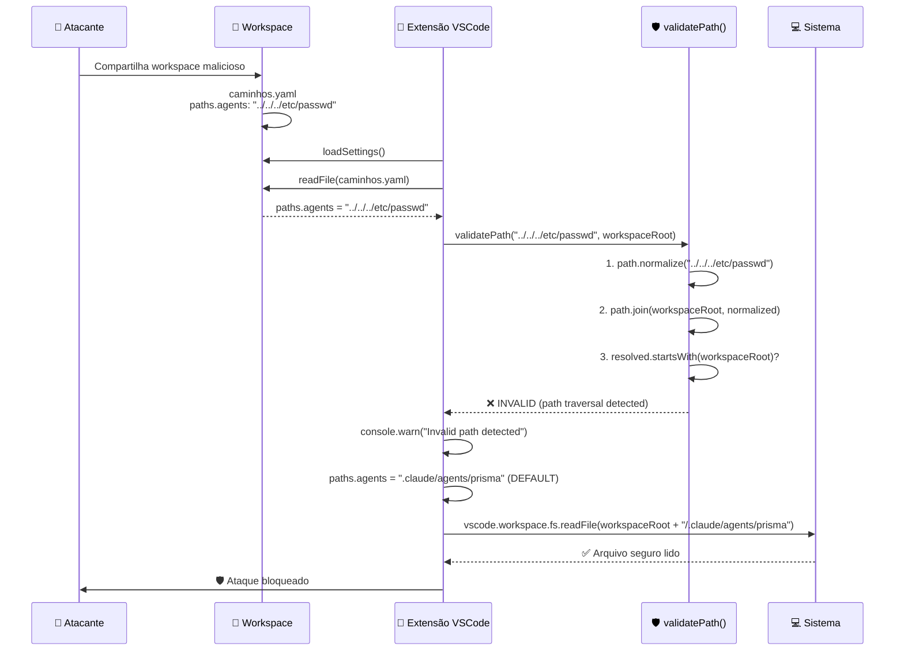
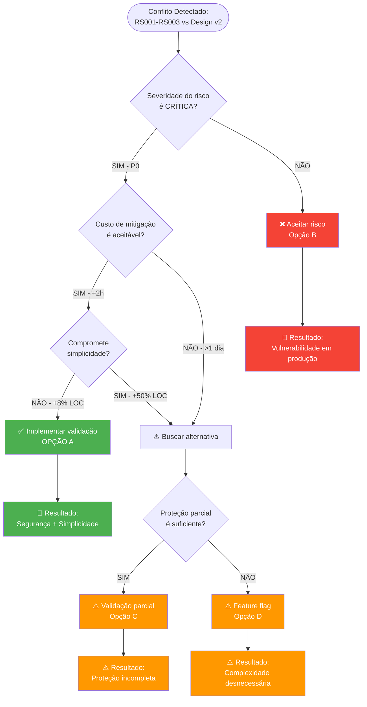

# ADR-001: Path Traversal Validation - Diagramas

**Visualizações técnicas da decisão de segurança**

---

## 1. Fluxo de Ataque (Antes da Validação)



**Resultado**: Atacante lê arquivos arbitrários do sistema.

---

## 2. Fluxo de Proteção (Depois da Validação)



**Resultado**: Ataque bloqueado, fallback para path seguro.

---

## 3. Matriz de Decisão

```
┌─────────────────────────────────────────────────────────────────┐
│                     MATRIZ DE DECISÃO ADR-001                   │
└─────────────────────────────────────────────────────────────────┘

                     │ Opção A       │ Opção B      │ Opção C      │ Opção D
                     │ Validação     │ Rebaixar     │ Validação    │ Feature
                     │ Completa      │ Requisito    │ Parcial      │ Flag
─────────────────────┼───────────────┼──────────────┼──────────────┼──────────
CRITÉRIOS            │               │              │              │
─────────────────────┼───────────────┼──────────────┼──────────────┼──────────
Segurança            │ ✅✅✅ (10/10) │ ❌❌ (2/10)   │ ⚠️ (6/10)    │ ✅✅ (8/10)
Simplicidade         │ ✅✅ (8/10)    │ ✅✅✅ (10/10) │ ✅✅ (9/10)   │ ⚠️ (5/10)
Tempo Implementação  │ ⚠️ (7/10)     │ ✅✅✅ (10/10) │ ✅✅ (9/10)   │ ⚠️ (5/10)
Atende Requisitos    │ ✅✅✅ (10/10) │ ❌❌ (3/10)   │ ⚠️ (7/10)    │ ✅✅ (8/10)
UX (Usuário)         │ ✅✅✅ (10/10) │ ⚠️ (7/10)    │ ⚠️ (7/10)    │ ❌ (4/10)
Manutenibilidade     │ ✅✅ (9/10)    │ ⚠️ (6/10)    │ ✅✅ (8/10)   │ ⚠️ (6/10)
─────────────────────┼───────────────┼──────────────┼──────────────┼──────────
SCORE TOTAL          │ 54/60         │ 38/60        │ 46/60        │ 36/60
─────────────────────┼───────────────┼──────────────┼──────────────┼──────────
RESULTADO            │ ✅ ESCOLHIDA  │ ❌ REJEITADA │ ❌ REJEITADA │ ❌ REJEITADA
─────────────────────┴───────────────┴──────────────┴──────────────┴──────────

Legenda:
✅✅✅ = Excelente (9-10)
✅✅   = Bom (7-8)
⚠️     = Aceitável (5-6)
❌❌   = Ruim (1-4)
```

---

## 4. Árvore de Decisão



---

## 5. Impacto em Timeline

```
ANTES (Design v2 - SEM VALIDAÇÃO)
────────────────────────────────────────────────────────────
│ Setup │ Core │ Integração │ Refactor │ Testes │ Docs │
│ 30min │  2h  │     1h     │  30min   │  1-2h  │ 30min│
└───────┴──────┴────────────┴──────────┴────────┴──────┘
                    TOTAL: 4-6 horas


DEPOIS (Design v2 + VALIDAÇÃO - Opção A)
────────────────────────────────────────────────────────────────
│ Setup │ Core │ Validação │ Integração │ Refactor │ Testes │ Docs │
│ 30min │  2h  │    1h     │     1h     │  30min   │  1.5h  │ 30min│
└───────┴──────┴───────────┴────────────┴──────────┴────────┴──────┘
                    TOTAL: 6-8 horas

┌─────────────────────────────────────────────────────────────┐
│ IMPACTO: +2 horas (+33%)                                    │
│ BENEFÍCIO: -1 vulnerabilidade crítica (-100%)               │
│ ROI: 2 horas eliminam risco P0 blocker → APROVADO          │
└─────────────────────────────────────────────────────────────┘
```

---

## 6. Análise de Risco (Antes vs Depois)

```
MATRIZ DE RISCO - ANTES DA VALIDAÇÃO
─────────────────────────────────────

Probabilidade
     │
ALTA │           🔴 RT6 (Path Traversal)
     │     🔴 RT1       🟡 RT3
     │   (Refactor)   (Deep Merge)
MÉDIA│           🟡 RT4     🟡 RT5
     │        (Schemas)  (Performance)
     │
BAIXA│           🟢 RT7
     │        (Encoding)
     └──────────────────────────────────
           BAIXO    MÉDIO    CRÍTICO
                  Impacto


MATRIZ DE RISCO - DEPOIS DA VALIDAÇÃO
──────────────────────────────────────

Probabilidade
     │
ALTA │     🔴 RT1       🟡 RT3
     │   (Refactor)   (Deep Merge)
     │
MÉDIA│           🟡 RT4     🟡 RT5
     │        (Schemas)  (Performance)
     │
BAIXA│           🟢 RT7     🟢 RT6
     │        (Encoding) (Path Traversal)
     │                     ↓ MITIGADO
     └──────────────────────────────────
           BAIXO    MÉDIO    CRÍTICO
                  Impacto

┌─────────────────────────────────────────────────────────────┐
│ RESULTADO: RT6 movido de ALTA/CRÍTICO → BAIXA/BAIXO        │
│ Risco residual: Edge cases não cobertos (aceitável)        │
└─────────────────────────────────────────────────────────────┘
```

---

## 7. Comparação de Código (Antes vs Depois)

### ANTES (Vulnerável - 240 LOC)

```typescript
// YamlConfigLoader.ts - loadAll() [VULNERÁVEL]
async loadAll(workspaceRoot: string): Promise<YamlConfigs | null> {
    const configDir = path.join(workspaceRoot, '.prisma/configuracoes/prisma');

    try {
        // Carrega os 3 YAMLs principais
        const [paths, integrations, quality] = await Promise.all([
            this.loadYaml(path.join(configDir, 'caminhos.yaml'), PathsConfigSchema),
            this.loadYaml(path.join(configDir, 'integracoes.yaml'), IntegrationsConfigSchema),
            this.loadYaml(path.join(configDir, 'qualidade.yaml'), QualityConfigSchema)
        ]);

        // Extrai apenas os campos necessários
        const configs: YamlConfigs = {
            paths: paths?.paths || this.getDefaultPaths(),
            // ... (resto do merge)
        };

        return configs;  // ← SEM VALIDAÇÃO DE SEGURANÇA!

    } catch (error) {
        console.error('[YamlConfigLoader] Failed to load YAMLs:', error);
        return null;
    }
}
```

**Problema**: Paths maliciosos (`../../../etc/passwd`) são aceitos sem validação.

---

### DEPOIS (Seguro - 260 LOC)

```typescript
// YamlConfigLoader.ts - loadAll() [SEGURO]
async loadAll(workspaceRoot: string): Promise<YamlConfigs | null> {
    const configDir = path.join(workspaceRoot, '.prisma/configuracoes/prisma');

    try {
        const [paths, integrations, quality] = await Promise.all([
            this.loadYaml(path.join(configDir, 'caminhos.yaml'), PathsConfigSchema),
            this.loadYaml(path.join(configDir, 'integracoes.yaml'), IntegrationsConfigSchema),
            this.loadYaml(path.join(configDir, 'qualidade.yaml'), QualityConfigSchema)
        ]);

        const configs: YamlConfigs = {
            paths: paths?.paths || this.getDefaultPaths(),
            // ... (resto do merge)
        };

        // ✅ NOVO: Validar paths antes de usar
        for (const [key, pathValue] of Object.entries(configs.paths)) {
            if (!this.validatePath(pathValue, workspaceRoot)) {
                console.warn(`[YamlConfigLoader] Invalid path '${key}': ${pathValue}. Using default.`);
                configs.paths[key] = this.getDefaultPaths()[key];  // Fallback seguro
            }
        }

        return configs;

    } catch (error) {
        console.error('[YamlConfigLoader] Failed to load YAMLs:', error);
        return null;
    }
}

// ✅ NOVO: Validação de segurança
private validatePath(inputPath: string, workspaceRoot: string): boolean {
    const normalized = path.normalize(inputPath);

    // RS002: Rejeitar paths absolutos
    if (path.isAbsolute(normalized)) {
        console.warn(`[YamlConfigLoader] Rejected absolute path: ${inputPath}`);
        return false;
    }

    // RS001: Validar path traversal
    const resolved = path.join(workspaceRoot, normalized);
    if (!resolved.startsWith(workspaceRoot)) {
        console.warn(`[YamlConfigLoader] Rejected path traversal: ${inputPath}`);
        return false;
    }

    return true;  // RS003: Sanitização via path.normalize() + path.join()
}
```

**Solução**: Paths maliciosos são detectados e substituídos por defaults seguros.

---

## 8. Trade-offs Visuais

```
┌──────────────────────────────────────────────────────────────────┐
│                      TRADE-OFFS ANALYSIS                         │
└──────────────────────────────────────────────────────────────────┘

OPÇÃO A (Validação Completa) - ESCOLHIDA
─────────────────────────────────────────
Complexidade:      ████░░░░░░ (4/10)  ← Ainda simples
Segurança:         ██████████ (10/10) ← Máxima
Tempo:             ███████░░░ (7/10)  ← +33% aceitável
LOC:               ████████░░ (8/10)  ← +8% aceitável
─────────────────────────────────────────
SCORE:             ████████░░ (29/40)


OPÇÃO B (Rebaixar Requisito) - REJEITADA
─────────────────────────────────────────
Complexidade:      ██████████ (10/10) ← Mais simples
Segurança:         ██░░░░░░░░ (2/10)  ← CRÍTICO!
Tempo:             ██████████ (10/10) ← Mais rápido
LOC:               ██████████ (10/10) ← Menos código
─────────────────────────────────────────
SCORE:             ████████░░ (32/40) ← MAS inseguro!


OPÇÃO C (Validação Parcial) - REJEITADA
─────────────────────────────────────────
Complexidade:      █████████░ (9/10)
Segurança:         ██████░░░░ (6/10)  ← Insuficiente
Tempo:             █████████░ (9/10)
LOC:               █████████░ (9/10)
─────────────────────────────────────────
SCORE:             ████████░░ (33/40) ← Proteção incompleta


OPÇÃO D (Feature Flag) - REJEITADA
─────────────────────────────────────────
Complexidade:      █████░░░░░ (5/10)  ← Muito complexo
Segurança:         ████████░░ (8/10)
Tempo:             █████░░░░░ (5/10)  ← Muito lento
LOC:               █████░░░░░ (5/10)  ← Muito código
─────────────────────────────────────────
SCORE:             ██████░░░░ (23/40) ← Over-engineering


CONCLUSÃO: Opção A tem melhor balanço entre Segurança e Simplicidade.
```

---

**Estes diagramas complementam o ADR-001 principal e facilitam a comunicação visual da decisão.**
