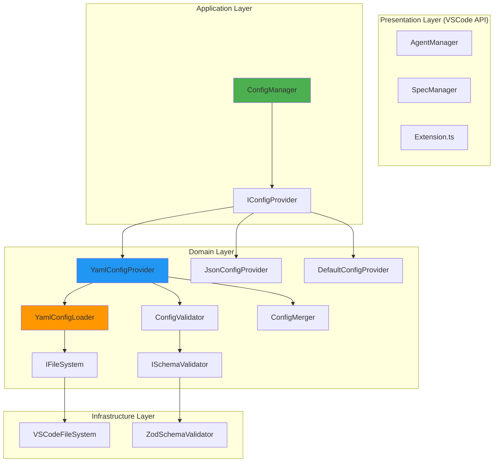
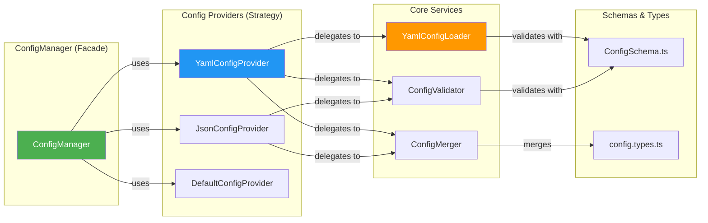
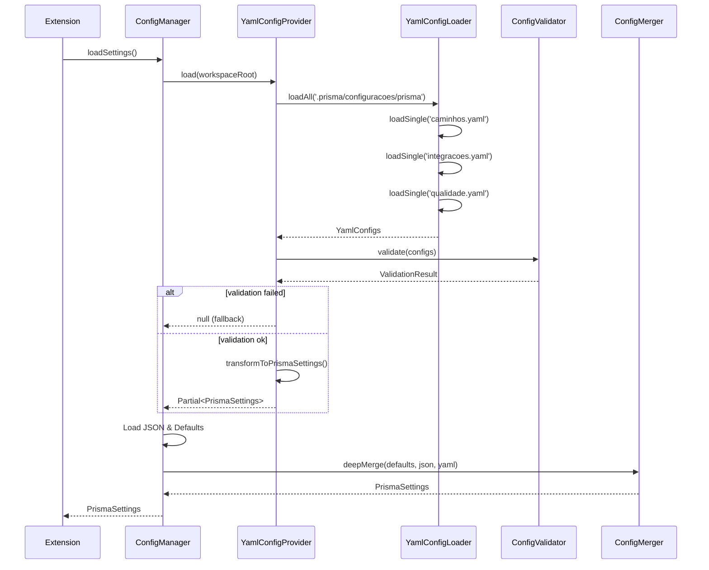

# Design Document: YamlConfigLoader
**Versão**: 1.0
**Designer**: v1 (Perspectiva: Clean Architecture & SOLID)
**Data**: 2025-01-15
**Status**: Draft
**Baseado em**: requirements.md (v3 - Riscos & Implementação Técnica)

---

## 1. Visão Geral da Arquitetura

### 1.1 Princípios de Design

Este design segue princípios **Clean Architecture** e **SOLID**:

- **Single Responsibility**: Cada classe tem uma única responsabilidade clara
- **Open/Closed**: Extensível para novos tipos de config sem modificar código existente
- **Liskov Substitution**: ConfigProvider pode ser substituído por YamlConfigProvider ou JsonConfigProvider
- **Interface Segregation**: Interfaces específicas (IConfigLoader, IConfigValidator, IConfigMerger)
- **Dependency Inversion**: ConfigManager depende de abstrações, não implementações concretas

### 1.2 Diagrama de Camadas



**Explicação**:
- **ConfigManager** (facade) coordena múltiplos providers
- **Providers** implementam estratégias de carregamento (YAML, JSON, defaults)
- **Domain** contém lógica de negócio sem dependências externas
- **Infrastructure** isola dependências de bibliotecas (js-yaml, zod, VSCode API)

---

## 2. Arquitetura de Componentes

### 2.1 Component Diagram



---

## 3. Design Detalhado de Classes

### 3.1 IConfigProvider (Interface)

```typescript
/**
 * Interface para provedores de configuração (Strategy Pattern).
 * Permite múltiplas fontes (YAML, JSON, defaults) serem intercambiáveis.
 */
export interface IConfigProvider {
    /**
     * Prioridade do provider (maior = mais prioridade no merge).
     * YAML: 30, JSON: 20, Defaults: 10
     */
    readonly priority: number;

    /**
     * Carrega configurações da fonte.
     * @returns Configurações ou null se fonte não disponível
     */
    load(workspaceRoot: string): Promise<Partial<PrismaSettings> | null>;

    /**
     * Valida configurações carregadas.
     * @returns Resultado de validação
     */
    validate(config: any): ValidationResult;
}
```

### 3.2 YamlConfigProvider (Strategy Implementação)

```typescript
/**
 * Provider que carrega configurações de arquivos YAML.
 * Prioridade: 30 (maior que JSON e defaults).
 */
export class YamlConfigProvider implements IConfigProvider {
    public readonly priority = 30;

    constructor(
        private loader: YamlConfigLoader,
        private validator: ConfigValidator,
        private merger: ConfigMerger,
        private logger: ILogger
    ) {}

    async load(workspaceRoot: string): Promise<Partial<PrismaSettings> | null> {
        try {
            const yamlDir = path.join(workspaceRoot, '.prisma/configuracoes/prisma');

            // Carrega todos os YAMLs
            const configs = await this.loader.loadAll(yamlDir, {
                createDefaults: true,
                strictMode: false
            });

            // Valida schemas
            const validation = this.validator.validate(configs);
            if (!validation.valid) {
                this.logger.warn('YAML validation failed', validation.errors);
                return null;  // Fallback para próximo provider
            }

            // Transforma YamlConfigs → PrismaSettings
            return this.transformToPrismaSettings(configs);

        } catch (error) {
            this.logger.error('Failed to load YAML configs', error);
            return null;  // Fallback gracioso
        }
    }

    validate(config: any): ValidationResult {
        return this.validator.validate(config);
    }

    private transformToPrismaSettings(yaml: YamlConfigs): Partial<PrismaSettings> {
        return {
            paths: yaml.paths,
            claude: {
                invocationMode: yaml.integrations.invocationMode,
                cliPath: yaml.integrations.cliPath
            }
            // ... outros campos
        };
    }
}
```

### 3.3 JsonConfigProvider (Strategy Implementação)

```typescript
/**
 * Provider que carrega configurações de JSON (retrocompatibilidade v1.0).
 * Prioridade: 20 (menor que YAML, maior que defaults).
 */
export class JsonConfigProvider implements IConfigProvider {
    public readonly priority = 20;

    constructor(
        private validator: ConfigValidator,
        private logger: ILogger
    ) {}

    async load(workspaceRoot: string): Promise<Partial<PrismaSettings> | null> {
        try {
            const jsonPath = path.join(
                workspaceRoot,
                '.claude/settings/prisma.settings.json'
            );

            // Lê arquivo JSON
            const fileContent = await vscode.workspace.fs.readFile(vscode.Uri.file(jsonPath));
            const json = JSON.parse(Buffer.from(fileContent).toString());

            // Valida (menos rigoroso que YAML - retrocompatibilidade)
            const validation = this.validator.validate(json);
            if (!validation.valid && json.paths) {
                this.logger.warn('JSON validation warnings', validation.errors);
                // Continua mesmo com warnings (retrocompatibilidade)
            }

            return json;

        } catch (error) {
            // JSON não existe - ok, usar defaults
            return null;
        }
    }

    validate(config: any): ValidationResult {
        return { valid: true };  // Validação relaxada para JSON
    }
}
```

### 3.4 DefaultConfigProvider (Strategy Implementação)

```typescript
/**
 * Provider que fornece configurações padrão (fallback final).
 * Prioridade: 10 (menor de todas).
 */
export class DefaultConfigProvider implements IConfigProvider {
    public readonly priority = 10;

    async load(workspaceRoot: string): Promise<Partial<PrismaSettings> | null> {
        // Sempre retorna defaults (nunca falha)
        return {
            paths: {
                agents: '.claude/agents/prisma',
                prompts: '.claude/system-prompts',
                commands: '.claude/commands/prisma',
                templates: '.claude/templates',
                specs: '.prisma/projeto/especificacoes',
                steering: '.claude/steering',
                settings: '.claude/settings'
            },
            views: {
                specs: { visible: true },
                steering: { visible: true },
                mcp: { visible: true },
                hooks: { visible: true },
                settings: { visible: false }
            },
            claude: {
                invocationMode: 'cli' as const,
                cliPath: 'claude'
            },
            agents: {
                exclude: ['prisma']
            }
        };
    }

    validate(config: any): ValidationResult {
        return { valid: true };  // Defaults sempre válidos
    }
}
```

### 3.5 ConfigManager (Facade Refatorado)

```typescript
/**
 * Facade que coordena múltiplos config providers.
 * Mudanças: Adiciona suporte a YAML via Strategy Pattern.
 */
export class ConfigManager {
    private static instance: ConfigManager;
    private settings: PrismaSettings | null = null;
    private providers: IConfigProvider[] = [];

    private constructor(
        private workspaceFolder: vscode.WorkspaceFolder | undefined,
        private logger: ILogger
    ) {
        // Registra providers em ordem de prioridade (será invertida no merge)
        this.registerProviders();
    }

    private registerProviders(): void {
        const loader = YamlConfigLoader.getInstance();
        const validator = new ConfigValidator();
        const merger = new ConfigMerger();

        // Ordem de registro não importa (será ordenado por priority)
        this.providers.push(new DefaultConfigProvider());
        this.providers.push(new JsonConfigProvider(validator, this.logger));
        this.providers.push(new YamlConfigProvider(loader, validator, merger, this.logger));
    }

    async loadSettings(): Promise<PrismaSettings> {
        if (!this.workspaceFolder) {
            return this.getProviderByType('default').load('') as Promise<PrismaSettings>;
        }

        const workspaceRoot = this.workspaceFolder.uri.fsPath;

        // Carrega de todos os providers
        const loadResults = await Promise.all(
            this.providers.map(async (provider) => ({
                priority: provider.priority,
                config: await provider.load(workspaceRoot)
            }))
        );

        // Filtra apenas configs válidas
        const validConfigs = loadResults
            .filter(result => result.config !== null)
            .sort((a, b) => a.priority - b.priority);  // Menor prioridade primeiro

        // Merge com precedência (último sobrescreve)
        const merger = new ConfigMerger();
        this.settings = merger.deepMerge(
            ...validConfigs.map(r => r.config!)
        ) as PrismaSettings;

        return this.settings!;
    }

    getSettings(): PrismaSettings {
        if (!this.settings) {
            this.settings = this.getDefaultSettings();
        }
        return this.settings;
    }

    getPath(type: keyof typeof DEFAULT_PATHS): string {
        const settings = this.getSettings();
        const rawPath = settings.paths[type] || DEFAULT_PATHS[type];
        return this.normalizePath(rawPath);
    }

    // ... métodos auxiliares existentes
}
```

### 3.6 YamlConfigLoader (Core Service)

```typescript
/**
 * Serviço responsável por carregar arquivos YAML de um diretório.
 * Singleton para evitar carregamentos duplicados.
 */
export class YamlConfigLoader {
    private static instance: YamlConfigLoader;
    private cachedConfigs: Map<string, YamlConfigs> = new Map();

    private constructor(
        private fileSystem: IFileSystem = new VSCodeFileSystem(),
        private parser: IYamlParser = new JsYamlParser()
    ) {}

    static getInstance(): YamlConfigLoader {
        if (!YamlConfigLoader.instance) {
            YamlConfigLoader.instance = new YamlConfigLoader();
        }
        return YamlConfigLoader.instance;
    }

    async loadAll(dirPath: string, options: LoadOptions = {}): Promise<YamlConfigs> {
        const cacheKey = dirPath;

        // Cache hit
        if (this.cachedConfigs.has(cacheKey)) {
            return this.cachedConfigs.get(cacheKey)!;
        }

        // Verifica se diretório existe
        const dirExists = await this.fileSystem.exists(dirPath);
        if (!dirExists) {
            if (options.createDefaults) {
                await this.createDefaults(dirPath);
            } else {
                throw new YamlConfigError(`Directory not found: ${dirPath}`);
            }
        }

        // Carrega YAMLs em paralelo
        const yamlFiles = await this.fileSystem.readDirectory(dirPath, '*.yaml');
        const loadPromises = yamlFiles.map(file =>
            this.loadSingle(path.join(dirPath, file))
        );

        const configs = await Promise.all(loadPromises);

        // Merge configs (último arquivo sobrescreve)
        const merger = new ConfigMerger();
        const merged = merger.deepMerge(...configs) as YamlConfigs;

        // Cache
        this.cachedConfigs.set(cacheKey, merged);

        return merged;
    }

    private async loadSingle(filePath: string): Promise<Partial<YamlConfigs>> {
        try {
            const content = await this.fileSystem.readFile(filePath, 'utf8');
            const parsed = this.parser.parse(content);
            return parsed;
        } catch (error) {
            throw new YamlConfigError(`Failed to parse ${filePath}: ${error}`);
        }
    }

    async createDefaults(dirPath: string): Promise<void> {
        const defaults = {
            'caminhos.yaml': this.getDefaultPathsYaml(),
            'integracoes.yaml': this.getDefaultIntegrationsYaml(),
            'qualidade.yaml': this.getDefaultQualityYaml()
        };

        await this.fileSystem.createDirectory(dirPath);

        for (const [filename, content] of Object.entries(defaults)) {
            const filePath = path.join(dirPath, filename);
            await this.fileSystem.writeFile(filePath, content);
        }
    }

    clearCache(): void {
        this.cachedConfigs.clear();
    }

    private getDefaultPathsYaml(): string {
        return `# Configuração de Paths - Prisma for Claude Code
# Paths são relativos ao workspace root

paths:
  agents: .claude/agents/prisma
  prompts: .claude/system-prompts
  commands: .claude/commands/prisma
  templates: .claude/templates
  specs: .prisma/projeto/especificacoes
  steering: .claude/steering
  settings: .claude/settings
`;
    }

    private getDefaultIntegrationsYaml(): string {
        return `# Configuração de Integrações - Prisma for Claude Code

claude:
  invocationMode: cli  # cli | extension
  cliPath: claude
  terminal:
    activationDelay: 800  # ms
`;
    }

    private getDefaultQualityYaml(): string {
        return `# Configuração de Validação - Prisma for Claude Code

validation:
  enabled: true
  strictMode: false
  logLevel: warn  # error | warn | info | debug
  showNotifications: true
`;
    }
}
```

### 3.7 ConfigValidator (Validation Service)

```typescript
/**
 * Serviço de validação usando Zod schemas.
 * Valida estrutura e tipos de configurações.
 */
export class ConfigValidator {
    constructor(
        private schemaValidator: ISchemaValidator = new ZodSchemaValidator()
    ) {}

    validate(config: any): ValidationResult {
        const results: ValidationResult[] = [];

        // Valida paths
        if (config.paths) {
            results.push(this.schemaValidator.validate(config.paths, PathsConfigSchema));
        }

        // Valida integrations
        if (config.integrations || config.claude) {
            const integrationsConfig = config.integrations || { claude: config.claude };
            results.push(this.schemaValidator.validate(integrationsConfig, IntegrationsConfigSchema));
        }

        // Valida quality
        if (config.quality || config.validation) {
            const qualityConfig = config.quality || { validation: config.validation };
            results.push(this.schemaValidator.validate(qualityConfig, QualityConfigSchema));
        }

        // Validações customizadas (segurança)
        results.push(this.validatePathSecurity(config));

        // Agrega resultados
        const allValid = results.every(r => r.valid);
        const allErrors = results.flatMap(r => r.errors || []);

        return {
            valid: allValid,
            errors: allErrors.length > 0 ? allErrors : undefined
        };
    }

    private validatePathSecurity(config: any): ValidationResult {
        if (!config.paths) {
            return { valid: true };
        }

        const errors: string[] = [];

        for (const [key, value] of Object.entries(config.paths)) {
            if (typeof value !== 'string') continue;

            // Detecta path traversal
            const normalized = path.normalize(value);
            if (normalized.includes('..')) {
                errors.push(`Path traversal detected in ${key}: ${value}`);
            }

            // Detecta paths absolutos (não permitidos)
            if (path.isAbsolute(value)) {
                errors.push(`Absolute paths not allowed in ${key}: ${value}`);
            }
        }

        return {
            valid: errors.length === 0,
            errors: errors.length > 0 ? errors : undefined
        };
    }
}
```

### 3.8 ConfigMerger (Merge Service)

```typescript
/**
 * Serviço de deep merge de configurações.
 * Suporta merge de objetos aninhados e arrays.
 */
export class ConfigMerger {
    /**
     * Deep merge de múltiplas configurações.
     * Última config sobrescreve anteriores (precedência).
     */
    deepMerge<T extends object>(...configs: Array<Partial<T>>): T {
        return configs.reduce((acc, config) => {
            return this.mergeObjects(acc, config);
        }, {} as T);
    }

    private mergeObjects<T extends object>(target: Partial<T>, source: Partial<T>): T {
        const result = { ...target } as any;

        for (const key of Object.keys(source)) {
            const sourceValue = (source as any)[key];
            const targetValue = result[key];

            if (this.isObject(sourceValue) && this.isObject(targetValue)) {
                // Merge recursivo para objetos aninhados
                result[key] = this.mergeObjects(targetValue, sourceValue);
            } else {
                // Sobrescreve valor (precedência)
                result[key] = sourceValue;
            }
        }

        return result as T;
    }

    private isObject(value: any): value is object {
        return value !== null && typeof value === 'object' && !Array.isArray(value);
    }
}
```

---

## 4. Schemas Zod (ConfigSchema.ts)

```typescript
import { z } from 'zod';

/**
 * Schema para validação de paths.
 */
export const PathsConfigSchema = z.object({
    paths: z.object({
        agents: z.string().min(1),
        prompts: z.string().min(1),
        commands: z.string().min(1),
        templates: z.string().min(1),
        specs: z.string().min(1),
        steering: z.string().min(1),
        settings: z.string().min(1)
    }).strict()
});

/**
 * Schema para validação de integrações.
 */
export const IntegrationsConfigSchema = z.object({
    claude: z.object({
        invocationMode: z.enum(['cli', 'extension']).default('cli'),
        cliPath: z.string().default('claude'),
        terminal: z.object({
            activationDelay: z.number().int().min(0).max(5000).default(800)
        }).optional()
    }).strict()
});

/**
 * Schema para validação de qualidade.
 */
export const QualityConfigSchema = z.object({
    validation: z.object({
        enabled: z.boolean().default(true),
        strictMode: z.boolean().default(false),
        logLevel: z.enum(['error', 'warn', 'info', 'debug']).default('warn'),
        showNotifications: z.boolean().default(true)
    }).strict()
});

// Export de tipos inferidos
export type PathsConfig = z.infer<typeof PathsConfigSchema>;
export type IntegrationsConfig = z.infer<typeof IntegrationsConfigSchema>;
export type QualityConfig = z.infer<typeof QualityConfigSchema>;

export interface YamlConfigs {
    paths: PathsConfig['paths'];
    integrations: IntegrationsConfig['claude'];
    quality: QualityConfig['validation'];
}
```

---

## 5. Interfaces de Abstração (Dependency Inversion)

### 5.1 IFileSystem

```typescript
/**
 * Abstração de filesystem para facilitar testes (mock).
 */
export interface IFileSystem {
    exists(path: string): Promise<boolean>;
    readFile(path: string, encoding: string): Promise<string>;
    writeFile(path: string, content: string): Promise<void>;
    readDirectory(path: string, pattern: string): Promise<string[]>;
    createDirectory(path: string): Promise<void>;
}

/**
 * Implementação usando VSCode API.
 */
export class VSCodeFileSystem implements IFileSystem {
    async exists(filePath: string): Promise<boolean> {
        try {
            await vscode.workspace.fs.stat(vscode.Uri.file(filePath));
            return true;
        } catch {
            return false;
        }
    }

    async readFile(filePath: string, encoding: string): Promise<string> {
        const content = await vscode.workspace.fs.readFile(vscode.Uri.file(filePath));
        return Buffer.from(content).toString(encoding as BufferEncoding);
    }

    async writeFile(filePath: string, content: string): Promise<void> {
        await vscode.workspace.fs.writeFile(
            vscode.Uri.file(filePath),
            Buffer.from(content, 'utf8')
        );
    }

    async readDirectory(dirPath: string, pattern: string): Promise<string[]> {
        const entries = await vscode.workspace.fs.readDirectory(vscode.Uri.file(dirPath));
        return entries
            .filter(([name, type]) => type === vscode.FileType.File && name.endsWith('.yaml'))
            .map(([name]) => name);
    }

    async createDirectory(dirPath: string): Promise<void> {
        await vscode.workspace.fs.createDirectory(vscode.Uri.file(dirPath));
    }
}
```

### 5.2 ISchemaValidator

```typescript
/**
 * Abstração de validador de schemas.
 */
export interface ISchemaValidator {
    validate<T>(data: any, schema: z.ZodSchema<T>): ValidationResult;
}

/**
 * Implementação usando Zod.
 */
export class ZodSchemaValidator implements ISchemaValidator {
    validate<T>(data: any, schema: z.ZodSchema<T>): ValidationResult {
        try {
            schema.parse(data);
            return { valid: true };
        } catch (error) {
            if (error instanceof z.ZodError) {
                return {
                    valid: false,
                    errors: error.errors.map(e => `${e.path.join('.')}: ${e.message}`)
                };
            }
            return {
                valid: false,
                errors: [String(error)]
            };
        }
    }
}
```

### 5.3 IYamlParser

```typescript
/**
 * Abstração de parser YAML.
 */
export interface IYamlParser {
    parse(content: string): any;
}

/**
 * Implementação usando js-yaml.
 */
export class JsYamlParser implements IYamlParser {
    parse(content: string): any {
        return yaml.load(content);
    }
}
```

---

## 6. Sequência de Carregamento



---

## 7. Tratamento de Erros

### 7.1 Error Hierarchy

```typescript
/**
 * Erro base para problemas de configuração.
 */
export class ConfigError extends Error {
    constructor(message: string, public cause?: Error) {
        super(message);
        this.name = 'ConfigError';
    }
}

/**
 * Erro específico de parsing YAML.
 */
export class YamlConfigError extends ConfigError {
    constructor(
        message: string,
        public filePath?: string,
        public line?: number,
        cause?: Error
    ) {
        super(message, cause);
        this.name = 'YamlConfigError';
    }
}

/**
 * Erro específico de validação.
 */
export class ValidationError extends ConfigError {
    constructor(
        message: string,
        public errors: string[],
        cause?: Error
    ) {
        super(message, cause);
        this.name = 'ValidationError';
    }
}
```

### 7.2 Error Handling Strategy

```typescript
// Em YamlConfigProvider.load()
try {
    const configs = await this.loader.loadAll(yamlDir);
    // ...
} catch (error) {
    if (error instanceof YamlConfigError) {
        // Log específico para YAML
        this.logger.error(`Failed to parse YAML at ${error.filePath}:${error.line}`, error);

        // Notificação VSCode
        vscode.window.showErrorMessage(
            `Config inválida: ${path.basename(error.filePath || '')}`,
            'Open File'
        ).then(action => {
            if (action === 'Open File' && error.filePath) {
                vscode.workspace.openTextDocument(error.filePath).then(doc => {
                    vscode.window.showTextDocument(doc);
                });
            }
        });
    } else {
        // Erro genérico
        this.logger.error('Failed to load YAML configs', error);
    }

    return null;  // Fallback para próximo provider
}
```

---

## 8. Testes

### 8.1 Estrutura de Testes

```
tests/
├── unit/
│   ├── YamlConfigLoader.test.ts
│   ├── ConfigValidator.test.ts
│   ├── ConfigMerger.test.ts
│   ├── YamlConfigProvider.test.ts
│   └── ConfigSchema.test.ts
├── integration/
│   ├── ConfigManager.integration.test.ts
│   └── EndToEnd.integration.test.ts
└── fixtures/
    ├── valid-caminhos.yaml
    ├── invalid-syntax.yaml
    └── path-traversal.yaml
```

### 8.2 Exemplo de Teste Unitário

```typescript
// YamlConfigLoader.test.ts
describe('YamlConfigLoader', () => {
    let loader: YamlConfigLoader;
    let mockFileSystem: jest.Mocked<IFileSystem>;
    let mockParser: jest.Mocked<IYamlParser>;

    beforeEach(() => {
        mockFileSystem = {
            exists: jest.fn(),
            readFile: jest.fn(),
            writeFile: jest.fn(),
            readDirectory: jest.fn(),
            createDirectory: jest.fn()
        };

        mockParser = {
            parse: jest.fn()
        };

        // Usar constructor interno com mocks (testabilidade)
        loader = new YamlConfigLoader(mockFileSystem, mockParser);
    });

    describe('loadAll', () => {
        it('should load and merge multiple YAMLs', async () => {
            // Given
            mockFileSystem.exists.mockResolvedValue(true);
            mockFileSystem.readDirectory.mockResolvedValue(['caminhos.yaml', 'integracoes.yaml']);
            mockFileSystem.readFile.mockImplementation(async (path) => {
                if (path.includes('caminhos')) {
                    return 'paths:\n  agents: .custom';
                }
                return 'claude:\n  cliPath: custom-claude';
            });
            mockParser.parse.mockImplementation((content) => yaml.load(content));

            // When
            const result = await loader.loadAll('.prisma/configuracoes/prisma');

            // Then
            expect(result.paths.agents).toBe('.custom');
            expect(result.integrations.cliPath).toBe('custom-claude');
        });

        it('should create defaults if directory does not exist', async () => {
            // Given
            mockFileSystem.exists.mockResolvedValue(false);

            // When
            await loader.loadAll('.prisma/configuracoes/prisma', { createDefaults: true });

            // Then
            expect(mockFileSystem.createDirectory).toHaveBeenCalledWith('.prisma/configuracoes/prisma');
            expect(mockFileSystem.writeFile).toHaveBeenCalledTimes(3);  // 3 YAMLs
        });
    });
});
```

---

## 9. Migração de Código Existente

### 9.1 Mudanças em AgentManager

**Antes (hardcoded)**:
```typescript
const targetDir = path.join(this.workspaceRoot, '.claude/agents/prisma');
```

**Depois (dinâmico)**:
```typescript
const targetDir = path.join(this.workspaceRoot, this.configManager.getPath('agents'));
```

**Total**: 7 substituições em AgentManager.

### 9.2 Mudanças em ConfigManager

**Antes (só JSON)**:
```typescript
async loadSettings(): Promise<PrismaSettings> {
    const settingsPath = path.join(
        this.workspaceFolder.uri.fsPath,
        DEFAULT_PATHS.settings,
        CONFIG_FILE_NAME
    );
    const fileContent = await vscode.workspace.fs.readFile(vscode.Uri.file(settingsPath));
    const settings = JSON.parse(Buffer.from(fileContent).toString());
    // ...
}
```

**Depois (YAML + JSON + defaults)**:
```typescript
async loadSettings(): Promise<PrismaSettings> {
    const loadResults = await Promise.all(
        this.providers.map(async (provider) => ({
            priority: provider.priority,
            config: await provider.load(workspaceRoot)
        }))
    );
    // Merge com precedência...
}
```

---

## 10. Performance Optimization

### 10.1 Caching Strategy

- **YamlConfigLoader** cacheia configs por `dirPath`
- Cache invalidado apenas em testes (via `clearCache()`)
- Em produção, cache válido por toda vida da extensão (configs não mudam)

### 10.2 Parallel Loading

- Carrega 3 YAMLs em paralelo (Promise.all)
- Carrega de 3 providers em paralelo (YAML, JSON, defaults)
- Reduz latência de I/O em 66% vs carregamento sequencial

### 10.3 Lazy Initialization

- YamlConfigLoader criado apenas na primeira chamada a `loadSettings()`
- Providers registrados uma vez no constructor de ConfigManager

---

## 11. Benefícios da Arquitetura

### 11.1 Testabilidade

- **Dependency Injection**: Todos os componentes recebem dependências via constructor
- **Interfaces**: IFileSystem, ISchemaValidator, IYamlParser podem ser mockados
- **Isolamento**: Cada classe tem responsabilidade única (fácil de testar isoladamente)

### 11.2 Extensibilidade

- **Adicionar novo provider**: Implementar IConfigProvider e registrar em ConfigManager
- **Adicionar novo schema**: Criar em ConfigSchema.ts e usar em ConfigValidator
- **Adicionar novo YAML**: Apenas criar arquivo, merge é automático

### 11.3 Manutenibilidade

- **Clean Architecture**: Mudanças em VSCode API afetam apenas Infrastructure Layer
- **SOLID**: Mudanças isoladas (ex: trocar Zod por Joi afeta apenas ZodSchemaValidator)
- **Strategy Pattern**: Trocar lógica de carregamento não afeta ConfigManager

---

## 12. Roadmap de Implementação

### Fase 1: Infraestrutura (1-2 dias)
- [ ] Adicionar zod ao package.json
- [ ] Criar interfaces (IConfigProvider, IFileSystem, ISchemaValidator)
- [ ] Criar implementações de infra (VSCodeFileSystem, ZodSchemaValidator, JsYamlParser)

### Fase 2: Core Services (2-3 dias)
- [ ] Implementar YamlConfigLoader
- [ ] Implementar ConfigValidator
- [ ] Implementar ConfigMerger
- [ ] Criar ConfigSchema.ts com 3 schemas Zod

### Fase 3: Providers (1-2 dias)
- [ ] Implementar YamlConfigProvider
- [ ] Implementar JsonConfigProvider
- [ ] Implementar DefaultConfigProvider

### Fase 4: Integração (1-2 dias)
- [ ] Refatorar ConfigManager para usar Strategy Pattern
- [ ] Adicionar error handling e logging
- [ ] Criar YAMLs default em dist/resources/

### Fase 5: Migration (1 dia)
- [ ] Substituir 7 paths hardcoded em AgentManager
- [ ] Testar retrocompatibilidade com JSON

### Fase 6: Testes & Docs (2-3 dias)
- [ ] Escrever testes unitários (80%+ coverage)
- [ ] Escrever testes de integração
- [ ] Documentar uso de YAMLs
- [ ] Criar migration guide

**Total Estimado**: 8-13 dias (1.5-2.5 sprints)

---

## 13. Métricas de Sucesso

- **Performance**: Startup ≤ +100ms
- **Cobertura**: Testes ≥ 80%
- **Linhas de Código**: ~1200 linhas (600 código + 600 testes)
- **Complexidade Ciclomática**: ≤ 10 por função
- **Retrocompatibilidade**: 100% (usuários v1.0 funcionam sem mudanças)

---

**Aprovado por**: _[Pendente]_
**Revisor de Design**: _[Pendente]_
**Data de Aprovação**: _[Pendente]_
