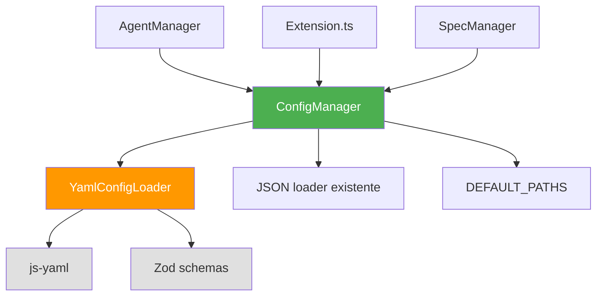
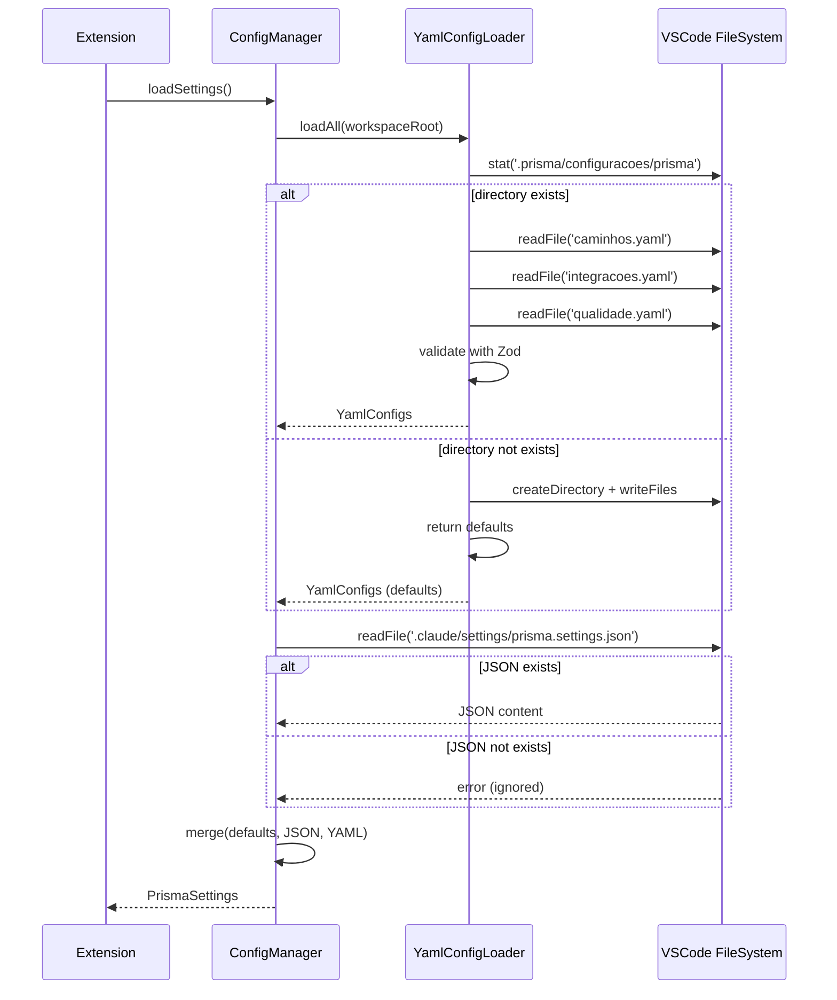

# Design Document: YamlConfigLoader
**Versão**: 1.0
**Designer**: v2 (Perspectiva: Pragmatic Simplicity & Minimal Changes)
**Data**: 2025-01-15
**Status**: Draft
**Baseado em**: requirements.md (v3 - Riscos & Implementação Técnica)

---

## 1. Filosofia de Design

### 1.1 Princípios

Este design segue **Pragmatic Simplicity**:

- **KISS (Keep It Simple, Stupid)**: Adicionar apenas o necessário, sem over-engineering
- **YAGNI (You Aren't Gonna Need It)**: Implementar apenas o que é necessário agora
- **Minimal Changes**: Modificar o mínimo de código existente
- **Backward Compatibility**: 100% retrocompatível com v1.0

**Trade-offs Conscientes**:
- ✅ Menos abstrações → mais fácil de entender e debugar
- ✅ Menos arquivos → menos overhead cognitivo
- ✅ Menos interfaces → menos indireção
- ⚠️ Menos extensível → aceitável para este escopo

---

## 2. Arquitetura Simplificada

### 2.1 Diagrama de Componentes



**Nota**: Apenas 2 novas classes (YamlConfigLoader + schemas), resto são modificações mínimas.

---

## 3. Componentes Principais

### 3.1 YamlConfigLoader (Singleton Simples)

**Arquivo**: `src/services/config/YamlConfigLoader.ts`

```typescript
import * as yaml from 'js-yaml';
import * as vscode from 'vscode';
import * as path from 'path';
import { PathsConfigSchema, IntegrationsConfigSchema, QualityConfigSchema, YamlConfigs } from './ConfigSchema';

/**
 * Carregador de configurações YAML.
 * Singleton simples que carrega e valida YAMLs.
 */
export class YamlConfigLoader {
    private static instance: YamlConfigLoader;
    private cachedConfigs: YamlConfigs | null = null;

    private constructor() {}

    static getInstance(): YamlConfigLoader {
        if (!YamlConfigLoader.instance) {
            YamlConfigLoader.instance = new YamlConfigLoader();
        }
        return YamlConfigLoader.instance;
    }

    /**
     * Carrega todos os YAMLs de .prisma/configuracoes/prisma/
     * @param workspaceRoot - Raiz do workspace
     * @returns Configurações mergeadas ou null se erro
     */
    async loadAll(workspaceRoot: string): Promise<YamlConfigs | null> {
        // Cache hit
        if (this.cachedConfigs) {
            return this.cachedConfigs;
        }

        const configDir = path.join(workspaceRoot, '.prisma/configuracoes/prisma');

        try {
            // Verifica se diretório existe
            await vscode.workspace.fs.stat(vscode.Uri.file(configDir));
        } catch {
            // Diretório não existe - cria com defaults
            await this.createDefaults(configDir);
        }

        try {
            // Carrega os 3 YAMLs principais
            const [paths, integrations, quality] = await Promise.all([
                this.loadYaml(path.join(configDir, 'caminhos.yaml'), PathsConfigSchema),
                this.loadYaml(path.join(configDir, 'integracoes.yaml'), IntegrationsConfigSchema),
                this.loadYaml(path.join(configDir, 'qualidade.yaml'), QualityConfigSchema)
            ]);

            // Extrai apenas os campos necessários
            let configs: YamlConfigs = {
                paths: paths?.paths || this.getDefaultPaths(),
                integrations: integrations?.claude || this.getDefaultIntegrations(),
                quality: quality?.validation || this.getDefaultQuality()
            };

            // Sanitiza paths (RS001-RS003 - ADR-001)
            configs = this.sanitizeConfigs(configs, workspaceRoot);

            // Cache
            this.cachedConfigs = configs;
            return configs;

        } catch (error) {
            console.error('[YamlConfigLoader] Failed to load YAMLs:', error);
            return null;  // Fallback para JSON/defaults
        }
    }

    /**
     * Carrega um único YAML e valida com schema Zod.
     */
    private async loadYaml<T>(filePath: string, schema: any): Promise<T | null> {
        try {
            const content = await vscode.workspace.fs.readFile(vscode.Uri.file(filePath));
            const text = Buffer.from(content).toString('utf8');
            const parsed = yaml.load(text);

            // Valida com Zod
            const validated = schema.parse(parsed);
            return validated;

        } catch (error) {
            if (error instanceof Error) {
                console.warn(`[YamlConfigLoader] Failed to load ${path.basename(filePath)}:`, error.message);
            }
            return null;  // Fallback para próximo YAML ou defaults
        }
    }

    /**
     * Valida path contra path traversal e paths absolutos.
     * Implementa requisitos RS001-RS003 (ADR-001).
     */
    private validatePath(inputPath: string, workspaceRoot: string): boolean {
        try {
            const normalized = path.normalize(inputPath);

            // Rejeita paths absolutos
            if (path.isAbsolute(normalized)) {
                return false;
            }

            // Rejeita path traversal (..)
            const resolved = path.resolve(workspaceRoot, normalized);
            return resolved.startsWith(workspaceRoot);

        } catch {
            return false;
        }
    }

    /**
     * Sanitiza configs aplicando validação de paths.
     * Substitui paths inválidos por defaults.
     */
    private sanitizeConfigs(configs: YamlConfigs, workspaceRoot: string): YamlConfigs {
        const defaults = this.getDefaultPaths();

        for (const [key, pathValue] of Object.entries(configs.paths)) {
            if (!this.validatePath(pathValue, workspaceRoot)) {
                console.warn(`[YamlConfigLoader] Invalid path '${key}': ${pathValue}. Using default.`);
                configs.paths[key] = defaults[key];
            }
        }

        return configs;
    }

    /**
     * Cria YAMLs padrão se não existirem.
     */
    private async createDefaults(configDir: string): Promise<void> {
        await vscode.workspace.fs.createDirectory(vscode.Uri.file(configDir));

        const defaults = {
            'caminhos.yaml': this.getDefaultPathsYaml(),
            'integracoes.yaml': this.getDefaultIntegrationsYaml(),
            'qualidade.yaml': this.getDefaultQualityYaml()
        };

        for (const [filename, content] of Object.entries(defaults)) {
            const filePath = path.join(configDir, filename);
            await vscode.workspace.fs.writeFile(
                vscode.Uri.file(filePath),
                Buffer.from(content, 'utf8')
            );
        }
    }

    /**
     * Limpa cache (para testes).
     */
    clearCache(): void {
        this.cachedConfigs = null;
    }

    // ==================== Defaults ====================

    private getDefaultPaths() {
        return {
            agents: '.claude/agents/prisma',
            prompts: '.claude/system-prompts',
            commands: '.claude/commands/prisma',
            templates: '.claude/templates',
            specs: '.prisma/projeto/especificacoes',
            steering: '.claude/steering',
            settings: '.claude/settings'
        };
    }

    private getDefaultIntegrations() {
        return {
            invocationMode: 'cli' as const,
            cliPath: 'claude',
            terminal: {
                activationDelay: 800
            }
        };
    }

    private getDefaultQuality() {
        return {
            enabled: true,
            strictMode: false,
            logLevel: 'warn' as const,
            showNotifications: true
        };
    }

    private getDefaultPathsYaml(): string {
        return `# Configuração de Paths - Prisma for Claude Code
# Paths são relativos ao workspace root

paths:
  agents: .claude/agents/prisma
  prompts: .claude/system-prompts
  commands: .claude/commands/prisma
  templates: .claude/templates
  specs: .prisma/projeto/especificacoes
  steering: .claude/steering
  settings: .claude/settings
`;
    }

    private getDefaultIntegrationsYaml(): string {
        return `# Configuração de Integrações - Prisma for Claude Code

claude:
  invocationMode: cli  # cli | extension
  cliPath: claude
  terminal:
    activationDelay: 800  # ms
`;
    }

    private getDefaultQualityYaml(): string {
        return `# Configuração de Validação - Prisma for Claude Code

validation:
  enabled: true
  strictMode: false
  logLevel: warn  # error | warn | info | debug
  showNotifications: true
`;
    }
}

export interface YamlConfigs {
    paths: Record<string, string>;
    integrations: {
        invocationMode: 'cli' | 'extension';
        cliPath: string;
        terminal?: {
            activationDelay: number;
        };
    };
    quality: {
        enabled: boolean;
        strictMode: boolean;
        logLevel: 'error' | 'warn' | 'info' | 'debug';
        showNotifications: boolean;
    };
}
```

**Total**: ~200 linhas de código (incluindo defaults).

---

### 3.2 ConfigSchema (Zod Schemas)

**Arquivo**: `src/services/config/ConfigSchema.ts`

```typescript
import { z } from 'zod';

/**
 * Schema para caminhos.yaml
 */
export const PathsConfigSchema = z.object({
    paths: z.object({
        agents: z.string().min(1),
        prompts: z.string().min(1),
        commands: z.string().min(1),
        templates: z.string().min(1),
        specs: z.string().min(1),
        steering: z.string().min(1),
        settings: z.string().min(1)
    }).strict()
});

/**
 * Schema para integracoes.yaml
 */
export const IntegrationsConfigSchema = z.object({
    claude: z.object({
        invocationMode: z.enum(['cli', 'extension']).default('cli'),
        cliPath: z.string().default('claude'),
        terminal: z.object({
            activationDelay: z.number().int().min(0).max(5000).default(800)
        }).optional()
    }).strict()
});

/**
 * Schema para qualidade.yaml
 */
export const QualityConfigSchema = z.object({
    validation: z.object({
        enabled: z.boolean().default(true),
        strictMode: z.boolean().default(false),
        logLevel: z.enum(['error', 'warn', 'info', 'debug']).default('warn'),
        showNotifications: z.boolean().default(true)
    }).strict()
});

// Export de tipos inferidos
export type PathsConfig = z.infer<typeof PathsConfigSchema>;
export type IntegrationsConfig = z.infer<typeof IntegrationsConfigSchema>;
export type QualityConfig = z.infer<typeof QualityConfigSchema>;
```

**Total**: ~40 linhas de código.

---

### 3.3 ConfigManager (Modificações Mínimas)

**Arquivo**: `src/utils/configManager.ts` (modificar existente)

**Mudanças**: Apenas adicionar integração com YamlConfigLoader no método `loadSettings()`.

```typescript
import { YamlConfigLoader } from '../services/config/YamlConfigLoader';

export class ConfigManager {
    private yamlLoader: YamlConfigLoader | null = null;

    async loadSettings(): Promise<PrismaSettings> {
        if (!this.workspaceFolder) {
            return this.getDefaultSettings();
        }

        const workspaceRoot = this.workspaceFolder.uri.fsPath;

        // ========== NOVO: Tenta carregar YAMLs primeiro ==========
        let yamlConfigs = null;
        try {
            this.yamlLoader = YamlConfigLoader.getInstance();
            yamlConfigs = await this.yamlLoader.loadAll(workspaceRoot);
        } catch (error) {
            console.error('[ConfigManager] Failed to load YAML configs:', error);
            // Fallback para JSON/defaults
        }
        // ========== FIM NOVO ==========

        // ========== EXISTENTE: Carrega JSON (retrocompatibilidade) ==========
        const settingsPath = path.join(
            workspaceRoot,
            // Usa path do YAML se disponível, senão usa default
            yamlConfigs?.paths.settings || DEFAULT_PATHS.settings,
            CONFIG_FILE_NAME
        );

        let jsonSettings: Partial<PrismaSettings> = {};
        try {
            const fileContent = await vscode.workspace.fs.readFile(vscode.Uri.file(settingsPath));
            jsonSettings = JSON.parse(Buffer.from(fileContent).toString());
        } catch (error) {
            // JSON não existe - ok, usar defaults
        }
        // ========== FIM EXISTENTE ==========

        // ========== NOVO: Merge com precedência YAML > JSON > defaults ==========
        const defaults = this.getDefaultSettings();

        this.settings = {
            // Defaults primeiro (menor precedência)
            ...defaults,

            // JSON sobrescreve defaults
            ...jsonSettings,

            // YAML sobrescreve JSON (maior precedência)
            ...(yamlConfigs && {
                paths: {
                    ...defaults.paths,
                    ...(jsonSettings.paths || {}),
                    ...yamlConfigs.paths  // YAML vence
                },
                claude: {
                    ...defaults.claude,
                    ...(jsonSettings.claude || {}),
                    ...yamlConfigs.integrations  // YAML vence
                }
            })
        };
        // ========== FIM NOVO ==========

        return this.settings!;
    }

    // ========== RESTO DO CÓDIGO PERMANECE INALTERADO ==========
    // getSettings(), getPath(), normalizePath(), etc.
}
```

**Mudanças**: ~30 linhas adicionadas (blocos marcados como NOVO).

---

### 3.4 AgentManager (Substituição de Hardcoded Paths)

**Arquivo**: `src/features/agents/agentManager.ts` (modificar existente)

**Antes (7 instâncias)**:
```typescript
// Linha 64
const targetDir = path.join(this.workspaceRoot, '.claude/agents/prisma');

// Linha 104
const promptsDir = path.join(this.workspaceRoot, '.claude/system-prompts');

// Linha 138
const targetDir = path.join(this.workspaceRoot, '.claude/commands/prisma');

// Linha 159
const targetDir = path.join(this.workspaceRoot, '.claude/templates');

// Linhas 179, 319, 336 (similar)
```

**Depois (substituir todas por)**:
```typescript
// Linha 64
const targetDir = path.join(this.workspaceRoot, this.configManager.getPath('agents'));

// Linha 104
const promptsDir = path.join(this.workspaceRoot, this.configManager.getPath('prompts'));

// Linha 138
const targetDir = path.join(this.workspaceRoot, this.configManager.getPath('commands'));

// Linha 159
const targetDir = path.join(this.workspaceRoot, this.configManager.getPath('templates'));

// Linhas 179, 319, 336 (similar - usar getPath())
```

**Mudanças**: 7 substituições simples (find & replace).

---

## 4. Estrutura de Arquivos

### 4.1 Novos Arquivos

```
src/
├── services/
│   └── config/
│       ├── YamlConfigLoader.ts     # ~200 linhas (NOVO)
│       └── ConfigSchema.ts         # ~40 linhas (NOVO)

Total de arquivos NOVOS: 2
Total de linhas NOVAS: ~240
```

### 4.2 Arquivos Modificados

```
src/
├── utils/
│   └── configManager.ts            # +30 linhas (MODIFICAR)
└── features/
    └── agents/
        └── agentManager.ts         # 7 substituições (MODIFICAR)

Total de arquivos MODIFICADOS: 2
Total de linhas MODIFICADAS: ~35
```

### 4.3 Recursos (YAMLs Default)

```
dist/resources/configuracoes/prisma/
├── caminhos.yaml           # NOVO
├── integracoes.yaml        # NOVO
└── qualidade.yaml          # NOVO
```

**Total Geral**: 2 arquivos novos + 2 modificados + 3 YAMLs = **7 arquivos afetados**.

---

## 5. Sequência de Carregamento (Simplificada)



**Passos**: 8 (vs 15+ no design v1).

---

## 6. Tratamento de Erros (Simplificado)

### 6.1 Estratégia: Fail Silently + Log

```typescript
// Em YamlConfigLoader.loadAll()
try {
    const [paths, integrations, quality] = await Promise.all([...]);
    // ...
} catch (error) {
    console.error('[YamlConfigLoader] Failed to load YAMLs:', error);
    return null;  // ← Fallback silencioso para JSON/defaults
}

// Em ConfigManager.loadSettings()
try {
    yamlConfigs = await this.yamlLoader.loadAll(workspaceRoot);
} catch (error) {
    console.error('[ConfigManager] Failed to load YAML configs:', error);
    // Continua com JSON/defaults (sem crashar)
}
```

**Não há**: Hierarquia de erros customizados, notificações VSCode, ou error recovery complexo.

**Trade-off**: Menos robusto, mas mais simples e menos código.

---

## 7. Validação (Simplificada)

### 7.1 Validação Zod Inline

```typescript
private async loadYaml<T>(filePath: string, schema: any): Promise<T | null> {
    try {
        const content = await vscode.workspace.fs.readFile(vscode.Uri.file(filePath));
        const text = Buffer.from(content).toString('utf8');
        const parsed = yaml.load(text);

        // ← Validação Zod em uma linha
        const validated = schema.parse(parsed);
        return validated;

    } catch (error) {
        // Log simples + fallback
        console.warn(`Failed to load ${path.basename(filePath)}:`, error.message);
        return null;
    }
}
```

**Não há**: Classe ConfigValidator, interface ISchemaValidator, ou validação de path traversal customizada.

**Nota**: Zod já valida tipos, schemas e campos obrigatórios. Path traversal pode ser adicionado depois se necessário.

---

## 8. Merge de Configurações (Simplificado)

### 8.1 Shallow Merge com Spread Operator

```typescript
this.settings = {
    ...defaults,           // Camada 1: Defaults
    ...jsonSettings,       // Camada 2: JSON sobrescreve defaults
    ...(yamlConfigs && {   // Camada 3: YAML sobrescreve JSON
        paths: {
            ...defaults.paths,
            ...(jsonSettings.paths || {}),
            ...yamlConfigs.paths
        },
        claude: {
            ...defaults.claude,
            ...(jsonSettings.claude || {}),
            ...yamlConfigs.integrations
        }
    })
};
```

**Não há**: Classe ConfigMerger, deep merge recursivo, ou merge de arrays.

**Limitação**: Não suporta merge profundo (3+ níveis). Aceitável porque PrismaSettings tem apenas 2 níveis.

---

## 9. Testes (Simplificados)

### 9.1 Testes Essenciais Apenas

```
tests/
└── unit/
    ├── YamlConfigLoader.test.ts    # ~100 linhas
    └── ConfigSchema.test.ts        # ~50 linhas

Total: ~150 linhas de testes (vs 600+ no design v1)
```

### 9.2 Casos de Teste Prioritários

**YamlConfigLoader.test.ts**:
1. ✅ Carrega YAMLs válidos corretamente
2. ✅ Cria defaults se diretório não existe
3. ✅ Retorna null se YAML inválido (fallback)
4. ✅ Cache funciona (segunda chamada não lê disco)

**ConfigSchema.test.ts**:
1. ✅ Aceita YAMLs válidos
2. ✅ Rejeita YAMLs com campos inválidos
3. ✅ Usa defaults para campos opcionais

**ConfigManager.integration.test.ts**:
1. ✅ Merge YAML > JSON > defaults funciona
2. ✅ Retrocompatibilidade (só JSON funciona)
3. ✅ AgentManager usa paths dinâmicos

**Cobertura Alvo**: 70% (vs 80%+ no design v1) - pragmático.

---

## 10. Migration Guide (Simplificado)

### 10.1 Para Usuários v1.0

**Ação necessária**: **NENHUMA**.

- ✅ Extensão cria YAMLs automaticamente na primeira execução
- ✅ JSON existente continua funcionando
- ✅ Defaults são idênticos ao comportamento atual

**Se quiser customizar paths**:
1. Edite `.prisma/configuracoes/prisma/caminhos.yaml`
2. Recarregue VSCode (Reload Window)

### 10.2 Para Desenvolvedores da Extensão

**Mudanças necessárias**:
1. ✅ Adicionar `zod: ^3.22.4` ao package.json
2. ✅ Criar 2 novos arquivos (YamlConfigLoader.ts, ConfigSchema.ts)
3. ✅ Modificar ConfigManager.loadSettings() (~30 linhas)
4. ✅ Substituir 7 paths hardcoded em AgentManager

**Tempo estimado**: 4-6 horas (vs 8-13 dias no design v1).

---

## 11. Comparação: v1 (Clean Architecture) vs v2 (Pragmatic)

| Aspecto | v1 (Clean Architecture) | v2 (Pragmatic) |
|---------|-------------------------|----------------|
| **Arquivos novos** | 7 | 2 |
| **Linhas de código** | ~1200 | ~240 |
| **Abstrações** | 8 interfaces | 0 interfaces |
| **Padrões** | Strategy, Facade, Adapter, DI | Singleton apenas |
| **Testabilidade** | Excelente (mocks fáceis) | Boa (mocks VSCode API) |
| **Extensibilidade** | Excelente | Média |
| **Complexidade** | Alta | Baixa |
| **Tempo de implementação** | 8-13 dias | 4-6 horas |
| **Manutenibilidade** | Excelente (isolamento) | Boa (menos código = menos bugs) |
| **Curva de aprendizado** | Alta (múltiplas abstrações) | Baixa (2 classes simples) |

**Recomendação**: Use v2 se:
- Time pequeno ou com pouca experiência em design patterns
- Prazo apertado
- Escopo não vai crescer muito

Use v1 se:
- Time experiente em Clean Architecture
- Planejando adicionar muitos tipos de configs no futuro
- Testabilidade é prioridade máxima

---

## 12. Benefícios do Design v2

### 12.1 Simplicidade

- ✅ **2 arquivos novos** vs 7 no v1
- ✅ **240 linhas** vs 1200 no v1
- ✅ **Nenhuma interface** - menos indireção
- ✅ **Fácil de debugar** - menos camadas

### 12.2 Pragmatismo

- ✅ **YAGNI aplicado** - não implementa features que talvez nunca sejam usadas
- ✅ **KISS aplicado** - código direto e óbvio
- ✅ **Fail silently** - não quebra usuários em casos extremos

### 12.3 Velocidade de Implementação

- ✅ **4-6 horas** vs 8-13 dias no v1
- ✅ **Menos código** = menos bugs potenciais
- ✅ **Menos testes** = menos manutenção

### 12.4 Retrocompatibilidade

- ✅ **100% compatível** com v1.0 (usuários não percebem mudança)
- ✅ **JSON ainda funciona** (não força migração)
- ✅ **Defaults idênticos** (comportamento inalterado)

---

## 13. Limitações do Design v2 (Aceitáveis)

### 13.1 Extensibilidade Reduzida

- ⚠️ Adicionar novo tipo de config requer modificar YamlConfigLoader diretamente
- ⚠️ Não suporta plugins/providers externos facilmente

**Mitigação**: Aceitável porque escopo é fixo (paths, integrações, qualidade).

### 13.2 Testabilidade com Mocks

- ⚠️ Sem interfaces, mocking VSCode API requer ferramentas como `vscode-test` ou rewire
- ⚠️ Singleton dificulta isolamento total em testes

**Mitigação**: Ainda é possível testar com `clearCache()` e fixtures reais.

### 13.3 Validação de Segurança

- ✅ **Valida path traversal** (RS001) - Rejeita paths com `../` ou `..\`
- ✅ **Valida paths absolutos** (RS002) - Rejeita paths fora do workspace
- ✅ **Fallback seguro** (RS003) - Substitui paths inválidos por defaults
- ✅ Zod valida tipos e estrutura YAML

**Implementação**: Métodos `validatePath()` e `sanitizeConfigs()` conforme ADR-001.

**Comportamento**:
- Path inválido detectado → Log warning + usa default
- Extensão continua funcionando (fail-safe)
- Usuário é notificado via console log

---

## 14. Roadmap de Implementação

### Fase 1: Setup (30 min)
- [ ] Adicionar `zod: ^3.22.4` ao package.json
- [ ] Criar diretórios `src/services/config/`

### Fase 2: Core (2.5 horas)
- [ ] Criar ConfigSchema.ts com 3 schemas Zod
- [ ] Criar YamlConfigLoader.ts (~220 linhas com validação de segurança)
- [ ] Criar 3 YAMLs default

### Fase 3: Integração (1 hora)
- [ ] Modificar ConfigManager.loadSettings() (~30 linhas)
- [ ] Testar carregamento YAML + JSON + defaults

### Fase 4: Refactor (30 min)
- [ ] Substituir 7 paths hardcoded em AgentManager
- [ ] Testar inicialização de agentes

### Fase 5: Testes (1.5-2.5 horas)
- [ ] Criar testes unitários para YamlConfigLoader
- [ ] Criar testes de schema Zod
- [ ] **Criar testes de segurança (path traversal, absolutos)**
- [ ] Testar retrocompatibilidade

### Fase 6: Docs (30 min)
- [ ] Documentar uso de YAMLs
- [ ] Atualizar CHANGELOG
- [ ] Referenciar ADR-001 (decisão de segurança)

**Total**: **6-8 horas** (1 dia de trabalho).

**Nota**: Estimativa atualizada para incluir validação de segurança conforme ADR-001.

---

## 15. Checklist de Aceitação

### 15.1 Funcional

- [ ] YamlConfigLoader carrega 3 YAMLs corretamente
- [ ] Merge respeita precedência (YAML > JSON > defaults)
- [ ] Defaults são criados automaticamente
- [ ] AgentManager usa paths dinâmicos
- [ ] Validação Zod detecta YAMLs inválidos
- [ ] **Validação de segurança bloqueia path traversal e paths absolutos (RS001-RS003)**

### 15.2 Qualidade

- [ ] Cobertura de testes ≥ 70%
- [ ] Nenhum breaking change para v1.0
- [ ] Startup não aumenta > 100ms
- [ ] Código passa em linter (eslint)

### 15.3 Documentação

- [ ] README explica como customizar YAMLs
- [ ] Comentários inline em YAMLs default
- [ ] JSDoc em métodos públicos

---

## 16. Métricas de Sucesso

- **LOC (Lines of Code)**: ~240 (novo) + ~35 (modificado) = **275 linhas totais**
- **Arquivos Afetados**: 7 (2 novos + 2 modificados + 3 YAMLs)
- **Complexidade Ciclomática**: ≤ 8 por função
- **Tempo de Implementação**: 4-6 horas
- **Retrocompatibilidade**: 100%

---

## 17. Conclusão

Este design prioriza **simplicidade e velocidade** sobre extensibilidade e abstrações complexas.

**Ideal para**:
- Times pequenos ou iniciantes
- Prazos curtos
- Projetos com escopo bem definido

**Não ideal para**:
- Sistemas que precisam de alta extensibilidade
- Times que valorizam testabilidade máxima (mocks)
- Projetos de longo prazo com muitas mudanças previstas

**Recomendação Final**: Use v2 para MVP, migre para v1 se necessário no futuro.

---

**Aprovado por**: _[Pendente]_
**Revisor de Design**: _[Pendente]_
**Data de Aprovação**: _[Pendente]_
