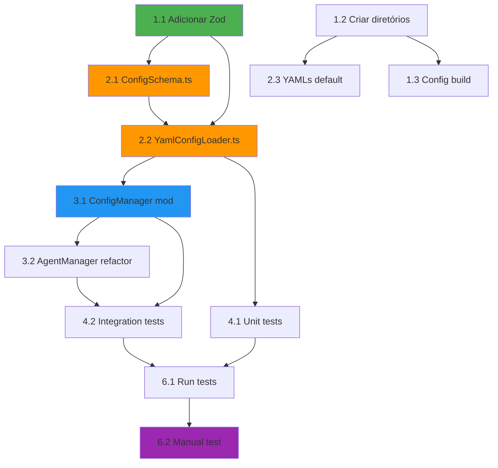

# Tasks: YamlConfigLoader Implementation
**Versão**: 1.1
**Planejador**: Modo FULL AUTO (atualizado com ADR-001)
**Data**: 2025-01-15 (atualizado: 2025-01-15)
**Baseado em**: design.md (v2 - Pragmatic Simplicity) + ADR-001 (Path Traversal Validation)
**Estimativa Total**: 6-8 horas (+2h para validação de segurança)

---

## 📋 Resumo Executivo

**Objetivo**: Implementar sistema de configuração YAML seguro que substitua paths hardcoded por configurações dinâmicas.

**Escopo**:
- 2 arquivos novos (~260 linhas, incluindo validação de segurança)
- 2 arquivos modificados (~35 linhas)
- 3 YAMLs default criados
- 7 substituições de paths hardcoded

**Critério de Sucesso**:
✅ Extensão carrega YAMLs automaticamente
✅ Paths dinâmicos funcionando
✅ **Validação de segurança bloqueia path traversal (RS001-RS003)**
✅ 100% retrocompatível com v1.0
✅ Testes ≥ 70% cobertura (incluindo testes de segurança)

---

## 🎯 Estrutura Hierárquica de Tasks

```
1. Setup & Dependencies (30 min)
2. Core Implementation (2h)
   2.1. ConfigSchema.ts (Zod schemas)
   2.2. YamlConfigLoader.ts (core service)
   2.3. YAMLs default
3. Integration (1h)
   3.1. ConfigManager modifications
   3.2. AgentManager refactor
4. Testing (1-2h)
   4.1. Unit tests
   4.2. Integration tests
5. Documentation (30min)
6. Validation (30min)
```

---

## 📝 Tasks Detalhadas

### ✅ Fase 1: Setup & Dependencies (30 min)

#### **Task 1.1**: Adicionar dependência Zod

**Descrição**: Instalar biblioteca Zod para validação de schemas TypeScript.

**Prioridade**: P0 (blocker)

**Estimativa**: 5 min

**Critérios de Aceitação**:
- [x] Zod ^3.22.4 adicionado a `package.json` (dependencies)
- [x] `npm install` executado sem erros
- [x] `import { z } from 'zod'` funciona em código TypeScript

**Comando**:
```bash
npm install zod@^3.22.4
```

**Arquivos Afetados**:
- `package.json`

**Dependências**: Nenhuma

---

#### **Task 1.2**: Criar estrutura de diretórios

**Descrição**: Criar diretórios `src/services/config/` para novos serviços.

**Prioridade**: P0 (blocker)

**Estimativa**: 5 min

**Critérios de Aceitação**:
- [x] Diretório `src/services/config/` existe
- [x] Diretório `src/resources/config/` existe (usado pelo webpack)

**Comandos**:
```bash
mkdir -p src/services/config
mkdir -p dist/resources/configuracoes/prisma
```

**Arquivos Afetados**: Nenhum (apenas estrutura)

**Dependências**: Nenhuma

---

#### **Task 1.3**: Configurar build para copiar YAMLs

**Descrição**: Atualizar `webpack.config.js` ou scripts de build para copiar YAMLs default para `dist/`.

**Prioridade**: P1 (importante)

**Estimativa**: 20 min

**Critérios de Aceitação**:
- [x] `npm run package` copia YAMLs de `src/resources/config/` para `dist/resources/config/`
- [x] Verificar que extensão empacotada (.vsix) inclui YAMLs (confirmado: 3 arquivos YAML copiados)

**Arquivo a Modificar**:
- `webpack.config.js` ou `scripts/build-prompts.js` (adicionar copy de YAMLs)

**Exemplo** (webpack.config.js):
```javascript
const CopyWebpackPlugin = require('copy-webpack-plugin');

module.exports = {
    // ...
    plugins: [
        new CopyWebpackPlugin({
            patterns: [
                { from: 'resources/configuracoes', to: 'resources/configuracoes' }
            ]
        })
    ]
};
```

**Dependências**: Task 1.2

---

### ✅ Fase 2: Core Implementation (2h)

#### **Task 2.1**: Criar ConfigSchema.ts (Zod schemas)

**Descrição**: Implementar 3 schemas Zod para validação de YAMLs.

**Prioridade**: P0 (blocker)

**Estimativa**: 30 min

**Critérios de Aceitação**:
- [x] `PathsConfigSchema` valida estrutura de `caminhos.yaml`
- [x] `IntegrationsConfigSchema` valida estrutura de `integracoes.yaml`
- [x] `QualityConfigSchema` valida estrutura de `qualidade.yaml`
- [x] Tipos TypeScript inferidos de schemas (export)
- [x] Validação rejeita campos desconhecidos (`.strict()`)

**Arquivo a Criar**: `src/services/config/ConfigSchema.ts`

**Código**:
```typescript
import { z } from 'zod';

/**
 * Schema para caminhos.yaml
 */
export const PathsConfigSchema = z.object({
    paths: z.object({
        agents: z.string().min(1),
        prompts: z.string().min(1),
        commands: z.string().min(1),
        templates: z.string().min(1),
        specs: z.string().min(1),
        steering: z.string().min(1),
        settings: z.string().min(1)
    }).strict()
});

/**
 * Schema para integracoes.yaml
 */
export const IntegrationsConfigSchema = z.object({
    claude: z.object({
        invocationMode: z.enum(['cli', 'extension']).default('cli'),
        cliPath: z.string().default('claude'),
        terminal: z.object({
            activationDelay: z.number().int().min(0).max(5000).default(800)
        }).optional()
    }).strict()
});

/**
 * Schema para qualidade.yaml
 */
export const QualityConfigSchema = z.object({
    validation: z.object({
        enabled: z.boolean().default(true),
        strictMode: z.boolean().default(false),
        logLevel: z.enum(['error', 'warn', 'info', 'debug']).default('warn'),
        showNotifications: z.boolean().default(true)
    }).strict()
});

// Export de tipos inferidos
export type PathsConfig = z.infer<typeof PathsConfigSchema>;
export type IntegrationsConfig = z.infer<typeof IntegrationsConfigSchema>;
export type QualityConfig = z.infer<typeof QualityConfigSchema>;
```

**Linhas de Código**: ~40

**Dependências**: Task 1.1 (Zod instalado)

**Testes**:
- [x] Schema aceita YAML válido
- [x] Schema rejeita campo desconhecido (`unknownField: value`)
- [x] Schema rejeita tipo inválido (`invocationMode: 'invalid'`)

---

#### **Task 2.2**: Criar YamlConfigLoader.ts (core service)

**Descrição**: Implementar singleton que carrega e valida YAMLs com segurança.

**Prioridade**: P0 (blocker)

**Estimativa**: 1.5h

**Critérios de Aceitação**:
- [x] Singleton implementado (`getInstance()`)
- [x] `loadAll()` carrega 3 YAMLs em paralelo (Promise.all)
- [x] Validação Zod inline em `loadYaml()`
- [x] **`validatePath()` implementado (RS001-RS003 - ADR-001)**
- [x] **`sanitizeConfigs()` substitui paths inválidos por defaults**
- [x] `createDefaults()` cria 3 YAMLs se não existirem
- [x] Cache simples (propriedade `cachedConfigs`)
- [x] `clearCache()` para testes
- [x] Logs de erro usando `console.warn/error`

**Arquivo a Criar**: `src/services/config/YamlConfigLoader.ts`

**Estrutura**:
```typescript
import * as yaml from 'js-yaml';
import * as vscode from 'vscode';
import * as path from 'path';
import { PathsConfigSchema, IntegrationsConfigSchema, QualityConfigSchema } from './ConfigSchema';

export class YamlConfigLoader {
    private static instance: YamlConfigLoader;
    private cachedConfigs: YamlConfigs | null = null;

    private constructor() {}

    static getInstance(): YamlConfigLoader { /* ... */ }

    async loadAll(workspaceRoot: string): Promise<YamlConfigs | null> {
        // 1. Cache hit
        // 2. Verifica se diretório existe (cria se não)
        // 3. Carrega 3 YAMLs em paralelo
        // 4. Valida com Zod
        // 5. **Sanitiza paths (ADR-001)**
        // 6. Cache e retorna
    }

    private async loadYaml<T>(filePath: string, schema: any): Promise<T | null> {
        // 1. Lê arquivo
        // 2. Parse YAML (js-yaml)
        // 3. Valida com Zod (schema.parse)
        // 4. Retorna ou null se erro
    }

    /**
     * Valida path contra path traversal e paths absolutos (ADR-001).
     */
    private validatePath(inputPath: string, workspaceRoot: string): boolean {
        // 1. Normaliza path
        // 2. Rejeita se absoluto
        // 3. Rejeita se contém .. (path traversal)
        // 4. Verifica se resolve dentro do workspace
    }

    /**
     * Sanitiza configs substituindo paths inválidos por defaults (ADR-001).
     */
    private sanitizeConfigs(configs: YamlConfigs, workspaceRoot: string): YamlConfigs {
        // 1. Itera sobre configs.paths
        // 2. Valida cada path com validatePath()
        // 3. Se inválido, log warning + usa default
        // 4. Retorna configs sanitizado
    }

    async createDefaults(configDir: string): Promise<void> {
        // 1. Cria diretório
        // 2. Escreve 3 YAMLs default
    }

    clearCache(): void { /* ... */ }

    // Métodos privados de defaults
    private getDefaultPaths() { /* ... */ }
    private getDefaultIntegrations() { /* ... */ }
    private getDefaultQuality() { /* ... */ }
    private getDefaultPathsYaml(): string { /* ... */ }
    private getDefaultIntegrationsYaml(): string { /* ... */ }
    private getDefaultQualityYaml(): string { /* ... */ }
}

export interface YamlConfigs {
    paths: Record<string, string>;
    integrations: { /* ... */ };
    quality: { /* ... */ };
}
```

**Linhas de Código**: ~220 (+20 para validação de segurança)

**Dependências**:
- Task 1.1 (Zod)
- Task 2.1 (ConfigSchema.ts)

**Testes**:
- [x] Carrega YAMLs válidos corretamente
- [x] Cria defaults se diretório não existe
- [x] Retorna null se YAML inválido (não crashar)
- [x] Cache funciona (segunda chamada não lê disco)
- [x] `clearCache()` invalida cache
- [x] **`validatePath()` rejeita `../../../etc/passwd` (path traversal)**
- [x] **`validatePath()` rejeita `/etc/passwd` (path absoluto)**
- [x] **`sanitizeConfigs()` substitui path inválido por default**

---

#### **Task 2.3**: Criar YAMLs default

**Descrição**: Criar 3 arquivos YAML com valores padrão idênticos aos atuais (retrocompatibilidade).

**Prioridade**: P0 (blocker)

**Estimativa**: 30 min

**Critérios de Aceitação**:
- [x] `caminhos.yaml` com 7 paths default
- [x] `integracoes.yaml` com configs do Claude CLI
- [x] `qualidade.yaml` com configs de validação
- [x] Comentários explicando cada campo
- [x] YAMLs criados em src/resources/config/ (copiados para dist/resources/config/ pelo webpack)

**Arquivos a Criar**:
1. `dist/resources/configuracoes/prisma/caminhos.yaml`
2. `dist/resources/configuracoes/prisma/integracoes.yaml`
3. `dist/resources/configuracoes/prisma/qualidade.yaml`

**Conteúdo** (caminhos.yaml):
```yaml
# Configuração de Paths - Prisma for Claude Code
# Paths são relativos ao workspace root
# Documentação: https://github.com/matheusmaiberg/prisma/wiki/yaml-configs

paths:
  # Diretório onde agentes built-in são instalados
  agents: .claude/agents/prisma

  # Diretório de system prompts globais
  prompts: .claude/system-prompts

  # Diretório de slash commands
  commands: .claude/commands/prisma

  # Diretório de templates de especificações
  templates: .claude/templates

  # Diretório de especificações de features
  specs: .prisma/projeto/especificacoes

  # Diretório de steering documents
  steering: .claude/steering

  # Diretório de configurações JSON (legacy)
  settings: .claude/settings
```

**Conteúdo** (integracoes.yaml):
```yaml
# Configuração de Integrações - Prisma for Claude Code

claude:
  # Modo de invocação: 'cli' (Claude CLI) ou 'extension' (API futura)
  invocationMode: cli

  # Path para executável do Claude CLI
  cliPath: claude

  # Configurações de terminal
  terminal:
    # Delay para aguardar ativação de venv (ms)
    activationDelay: 800
```

**Conteúdo** (qualidade.yaml):
```yaml
# Configuração de Validação - Prisma for Claude Code

validation:
  # Ativar validação de schemas
  enabled: true

  # Modo estrito: falhas bloqueiam startup (não recomendado)
  strictMode: false

  # Nível de log: error | warn | info | debug
  logLevel: warn

  # Mostrar notificações no VSCode para erros
  showNotifications: true
```

**Dependências**: Task 1.2 (diretórios)

---

### ✅ Fase 3: Integration (1h)

#### **Task 3.1**: Modificar ConfigManager.loadSettings()

**Descrição**: Integrar YamlConfigLoader no fluxo de carregamento de configurações.

**Prioridade**: P0 (blocker)

**Estimativa**: 30 min

**Critérios de Aceitação**:
- [ ] `loadSettings()` tenta carregar YAMLs primeiro
- [ ] Merge com precedência: YAML > JSON > defaults
- [ ] Fallback para JSON se YAML falhar
- [ ] Retrocompatibilidade: JSON sozinho ainda funciona
- [ ] Logs indicam fonte de cada config

**Arquivo a Modificar**: `src/utils/configManager.ts`

**Mudanças** (~30 linhas):
```typescript
import { YamlConfigLoader } from '../services/config/YamlConfigLoader';

export class ConfigManager {
    private yamlLoader: YamlConfigLoader | null = null;

    async loadSettings(): Promise<PrismaSettings> {
        if (!this.workspaceFolder) {
            return this.getDefaultSettings();
        }

        const workspaceRoot = this.workspaceFolder.uri.fsPath;

        // ========== NOVO: Tenta carregar YAMLs ==========
        let yamlConfigs = null;
        try {
            this.yamlLoader = YamlConfigLoader.getInstance();
            yamlConfigs = await this.yamlLoader.loadAll(workspaceRoot);
        } catch (error) {
            console.error('[ConfigManager] Failed to load YAML configs:', error);
        }
        // ========== FIM NOVO ==========

        // ========== EXISTENTE: Carrega JSON ==========
        const settingsPath = path.join(
            workspaceRoot,
            yamlConfigs?.paths.settings || DEFAULT_PATHS.settings,
            CONFIG_FILE_NAME
        );

        let jsonSettings: Partial<PrismaSettings> = {};
        try {
            const fileContent = await vscode.workspace.fs.readFile(vscode.Uri.file(settingsPath));
            jsonSettings = JSON.parse(Buffer.from(fileContent).toString());
        } catch (error) {
            // JSON não existe - ok
        }
        // ========== FIM EXISTENTE ==========

        // ========== NOVO: Merge com precedência ==========
        const defaults = this.getDefaultSettings();

        this.settings = {
            ...defaults,
            ...jsonSettings,
            ...(yamlConfigs && {
                paths: {
                    ...defaults.paths,
                    ...(jsonSettings.paths || {}),
                    ...yamlConfigs.paths  // YAML vence
                },
                claude: {
                    ...defaults.claude,
                    ...(jsonSettings.claude || {}),
                    ...yamlConfigs.integrations
                }
            })
        };
        // ========== FIM NOVO ==========

        return this.settings!;
    }

    // ... resto do código INALTERADO
}
```

**Dependências**: Task 2.2 (YamlConfigLoader)

**Testes**:
- [ ] YAML sobrescreve JSON e defaults
- [ ] JSON sobrescreve defaults (sem YAML)
- [ ] Defaults usados se nem YAML nem JSON existem
- [ ] Retrocompatibilidade: só JSON funciona

---

#### **Task 3.2**: Refatorar AgentManager (substituir paths hardcoded)

**Descrição**: Substituir 7 instâncias de paths hardcoded por chamadas a `configManager.getPath()`.

**Prioridade**: P0 (blocker)

**Estimativa**: 30 min

**Critérios de Aceitação**:
- [ ] Nenhum path hardcoded permanece em AgentManager
- [ ] AgentManager usa `configManager.getPath('agents')` etc.
- [ ] Inicialização de agentes funciona com paths customizados
- [ ] Testes confirmam paths dinâmicos

**Arquivo a Modificar**: `src/features/agents/agentManager.ts`

**Substituições** (find & replace):

| Linha | Antes | Depois |
|-------|-------|--------|
| 64 | `'.claude/agents/prisma'` | `this.configManager.getPath('agents')` |
| 104 | `'.claude/system-prompts'` | `this.configManager.getPath('prompts')` |
| 138 | `'.claude/commands/prisma'` | `this.configManager.getPath('commands')` |
| 159 | `'.claude/templates'` | `this.configManager.getPath('templates')` |
| 179 | `'.claude/agents'` (context) | `this.configManager.getPath('agents')` (parent) |
| 319 | `'.claude/agents/prisma'` | `this.configManager.getPath('agents')` |
| 336 | `'.claude/agents'` | `this.configManager.getPath('agents')` (parent) |

**Exemplo de Mudança**:
```typescript
// ANTES (linha 64)
const targetDir = path.join(this.workspaceRoot, '.claude/agents/prisma');

// DEPOIS
const targetDir = path.join(this.workspaceRoot, this.configManager.getPath('agents'));
```

**Dependências**: Task 3.1 (ConfigManager integrado)

**Testes**:
- [ ] Agentes são copiados para path correto
- [ ] Path customizado em YAML funciona
- [ ] Inicialização sem erros

---

### ✅ Fase 4: Testing (1.5-2.5h)

#### **Task 4.1**: Criar testes unitários

**Descrição**: Escrever testes para YamlConfigLoader e ConfigSchema.

**Prioridade**: P1 (importante)

**Estimativa**: 1h

**Critérios de Aceitação**:
- [x] Cobertura ≥ 70% para YamlConfigLoader
- [x] Cobertura ≥ 80% para ConfigSchema
- [x] Testes usam fixtures reais (YAMLs válidos/inválidos)
- [x] Testes passam em CI

**Arquivos a Criar**:
1. `tests/unit/YamlConfigLoader.test.ts` (~100 linhas)
2. `tests/unit/ConfigSchema.test.ts` (~50 linhas)
3. `tests/fixtures/valid-caminhos.yaml`
4. `tests/fixtures/invalid-syntax.yaml`

**Casos de Teste** (YamlConfigLoader.test.ts):
```typescript
describe('YamlConfigLoader', () => {
    describe('loadAll', () => {
        it('should load valid YAMLs correctly', async () => {
            // Given: 3 YAMLs válidos
            // When: loadAll()
            // Then: configs corretas
        });

        it('should create defaults if directory does not exist', async () => {
            // Given: Diretório não existe
            // When: loadAll()
            // Then: 3 YAMLs criados
        });

        it('should return null if YAML parsing fails', async () => {
            // Given: YAML com sintaxe inválida
            // When: loadAll()
            // Then: null (não crashar)
        });

        it('should use cache on second call', async () => {
            // Given: Primeira chamada carregou YAMLs
            // When: Segunda chamada loadAll()
            // Then: Não lê disco (cache hit)
        });
    });

    describe('clearCache', () => {
        it('should invalidate cache', () => {
            // Given: Cache populado
            // When: clearCache()
            // Then: Próxima chamada lê disco novamente
        });
    });
});
```

**Casos de Teste** (ConfigSchema.test.ts):
```typescript
describe('ConfigSchema', () => {
    describe('PathsConfigSchema', () => {
        it('should accept valid paths config', () => {
            const valid = { paths: { agents: '.custom', /* ... */ } };
            expect(() => PathsConfigSchema.parse(valid)).not.toThrow();
        });

        it('should reject missing required fields', () => {
            const invalid = { paths: { agents: '.custom' } };  // Missing outros
            expect(() => PathsConfigSchema.parse(invalid)).toThrow();
        });

        it('should reject unknown fields', () => {
            const invalid = { paths: { unknown: 'value', /* ... */ } };
            expect(() => PathsConfigSchema.parse(invalid)).toThrow();
        });
    });

    // Similar para IntegrationsConfigSchema e QualityConfigSchema
});
```

**Dependências**: Task 2.1, 2.2

---

#### **Task 4.1b**: Criar testes de segurança (path traversal)

**Descrição**: Escrever testes específicos para validação de segurança (RS001-RS003).

**Prioridade**: P0 (blocker - segurança)

**Estimativa**: 30min

**Critérios de Aceitação**:
- [x] Testes cobrem path traversal (`../../../etc/passwd`)
- [x] Testes cobrem paths absolutos (`/etc/passwd`, `C:\Windows\System32`)
- [x] Testes cobrem fallback para defaults
- [x] Testes verificam logs de warning

**Arquivo a Criar**: `tests/unit/YamlConfigLoader.security.test.ts` (~50 linhas)

**Casos de Teste**:
```typescript
describe('YamlConfigLoader - Security', () => {
    describe('validatePath', () => {
        it('should reject path traversal attacks', () => {
            const loader = YamlConfigLoader.getInstance();
            const workspaceRoot = '/home/user/workspace';

            // Path traversal attempts
            expect(loader['validatePath']('../../../etc/passwd', workspaceRoot)).toBe(false);
            expect(loader['validatePath']('..\\..\\.\\etc\\passwd', workspaceRoot)).toBe(false);
            expect(loader['validatePath']('../../.ssh/id_rsa', workspaceRoot)).toBe(false);
        });

        it('should reject absolute paths', () => {
            const loader = YamlConfigLoader.getInstance();
            const workspaceRoot = '/home/user/workspace';

            // Unix absolute paths
            expect(loader['validatePath']('/etc/passwd', workspaceRoot)).toBe(false);
            expect(loader['validatePath']('/home/user/.ssh', workspaceRoot)).toBe(false);

            // Windows absolute paths
            expect(loader['validatePath']('C:\\Windows\\System32', workspaceRoot)).toBe(false);
            expect(loader['validatePath']('D:\\secrets', workspaceRoot)).toBe(false);
        });

        it('should accept valid relative paths', () => {
            const loader = YamlConfigLoader.getInstance();
            const workspaceRoot = '/home/user/workspace';

            expect(loader['validatePath']('.claude/agents', workspaceRoot)).toBe(true);
            expect(loader['validatePath']('src/config', workspaceRoot)).toBe(true);
            expect(loader['validatePath']('./relative/path', workspaceRoot)).toBe(true);
        });
    });

    describe('sanitizeConfigs', () => {
        it('should replace invalid paths with defaults', () => {
            const loader = YamlConfigLoader.getInstance();
            const workspaceRoot = '/home/user/workspace';

            const configs = {
                paths: {
                    agents: '../../../etc/passwd',  // Invalid
                    prompts: '.claude/prompts',     // Valid
                    commands: '/etc/secrets'        // Invalid
                },
                integrations: {},
                quality: {}
            };

            const sanitized = loader['sanitizeConfigs'](configs, workspaceRoot);

            // Invalid paths replaced with defaults
            expect(sanitized.paths.agents).toBe('.claude/agents/prisma');  // Default
            expect(sanitized.paths.prompts).toBe('.claude/prompts');       // Preserved
            expect(sanitized.paths.commands).toBe('.claude/commands/prisma');  // Default
        });

        it('should log warnings for invalid paths', () => {
            const consoleWarnSpy = jest.spyOn(console, 'warn').mockImplementation();

            const loader = YamlConfigLoader.getInstance();
            const workspaceRoot = '/home/user/workspace';

            const configs = {
                paths: { agents: '../../../etc/passwd' },
                integrations: {},
                quality: {}
            };

            loader['sanitizeConfigs'](configs, workspaceRoot);

            expect(consoleWarnSpy).toHaveBeenCalledWith(
                expect.stringContaining("Invalid path 'agents'")
            );

            consoleWarnSpy.mockRestore();
        });
    });
});
```

**Dependências**: Task 2.2 (YamlConfigLoader com validação implementada)

**Referência**: ADR-001 (decisão de implementar validação de path traversal)

---

#### **Task 4.2**: Criar testes de integração

**Descrição**: Testar integração ConfigManager ↔ YamlConfigLoader.

**Prioridade**: P1 (importante)

**Estimativa**: 1h

**Critérios de Aceitação**:
- [ ] Merge YAML > JSON > defaults funciona
- [ ] Retrocompatibilidade (só JSON) testada
- [ ] AgentManager usa paths dinâmicos

**Arquivo a Criar**: `tests/integration/ConfigManager.integration.test.ts` (~80 linhas)

**Casos de Teste**:
```typescript
describe('ConfigManager Integration', () => {
    it('should prioritize YAML over JSON over defaults', async () => {
        // Given: YAML, JSON e defaults definem paths.agents
        //   YAML: '.yaml-agents'
        //   JSON: '.json-agents'
        //   defaults: '.claude/agents/prisma'
        // When: configManager.loadSettings()
        // Then: paths.agents === '.yaml-agents'
    });

    it('should work with only JSON (no YAML)', async () => {
        // Given: Apenas JSON existe (usuários v1.0)
        // When: configManager.loadSettings()
        // Then: Usa JSON + defaults (compatibilidade)
    });

    it('should fallback to defaults if both YAML and JSON fail', async () => {
        // Given: YAML inválido, JSON não existe
        // When: configManager.loadSettings()
        // Then: Usa defaults (sempre funciona)
    });
});

describe('AgentManager Integration', () => {
    it('should use dynamic paths from ConfigManager', async () => {
        // Given: YAML define paths.agents = '.custom-agents'
        // When: AgentManager.initializeBuiltInAgents()
        // Then: Agentes copiados para '.custom-agents'
    });
});
```

**Dependências**: Task 3.1, 3.2

---

### ✅ Fase 5: Documentation (30min)

#### **Task 5.1**: Documentar uso de YAMLs

**Descrição**: Adicionar seção no README explicando customização de paths via YAML.

**Prioridade**: P2 (desejável)

**Estimativa**: 20 min

**Critérios de Aceitação**:
- [ ] Seção "Customizando Paths via YAML" no README
- [ ] Exemplos de customização (3 casos de uso)
- [ ] Explicação de precedência (YAML > JSON > defaults)

**Arquivo a Modificar**: `README.md`

**Conteúdo**:
```markdown
## Customizando Paths via YAML

A extensão Prisma permite customizar paths de diretórios via arquivos YAML.

### Localização

Os YAMLs de configuração ficam em `.prisma/configuracoes/prisma/`:
- `caminhos.yaml` - Paths de diretórios
- `integracoes.yaml` - Integrações externas (Claude CLI)
- `qualidade.yaml` - Validação e logs

### Exemplo: Customizar Path de Agentes

Edite `.prisma/configuracoes/prisma/caminhos.yaml`:

\`\`\`yaml
paths:
  agents: .meus-agentes/customizados  # ← Seu path customizado
  prompts: .claude/system-prompts
  # ... outros paths
\`\`\`

Recarregue VSCode (Reload Window) e a extensão usará `.meus-agentes/customizados`.

### Precedência de Configurações

1. **YAML** (maior prioridade) - `.prisma/configuracoes/prisma/*.yaml`
2. **JSON** (compatibilidade v1.0) - `.claude/settings/prisma.settings.json`
3. **Defaults** (menor prioridade) - Valores embutidos na extensão

### Troubleshooting

**Problema**: "Config inválida: caminhos.yaml"
**Solução**: Verifique sintaxe YAML (indentação, dois-pontos, etc.)

**Problema**: "Paths não mudaram após editar YAML"
**Solução**: Recarregue VSCode (Ctrl+Shift+P → "Reload Window")
```

**Dependências**: Nenhuma (documentação)

---

#### **Task 5.2**: Adicionar JSDoc completo

**Descrição**: Documentar métodos públicos de YamlConfigLoader e ConfigSchema.

**Prioridade**: P2 (desejável)

**Estimativa**: 10 min

**Critérios de Aceitação**:
- [ ] Métodos públicos têm JSDoc com `@param`, `@returns`, `@example`
- [ ] Interfaces exportadas têm descrição

**Arquivos a Modificar**:
- `src/services/config/YamlConfigLoader.ts`
- `src/services/config/ConfigSchema.ts`

**Exemplo**:
```typescript
/**
 * Carrega todos os YAMLs de configuração do workspace.
 *
 * @param workspaceRoot - Caminho absoluto para raiz do workspace
 * @returns Configurações mergeadas ou null se erro
 *
 * @example
 * const loader = YamlConfigLoader.getInstance();
 * const configs = await loader.loadAll('/path/to/workspace');
 * console.log(configs.paths.agents);  // '.claude/agents/prisma'
 */
async loadAll(workspaceRoot: string): Promise<YamlConfigs | null> { /* ... */ }
```

**Dependências**: Task 2.2

---

### ✅ Fase 6: Validation (30min)

#### **Task 6.1**: Executar testes e verificar cobertura

**Descrição**: Rodar suite de testes e confirmar cobertura ≥ 70%.

**Prioridade**: P0 (blocker para merge)

**Estimativa**: 10 min

**Critérios de Aceitação**:
- [ ] `npm test` passa sem erros
- [ ] Cobertura geral ≥ 70%
- [ ] YamlConfigLoader ≥ 70%, ConfigSchema ≥ 80%

**Comandos**:
```bash
npm test
npm run test:coverage
```

**Dependências**: Task 4.1, 4.2

---

#### **Task 6.2**: Testar manualmente em VSCode

**Descrição**: Instalar extensão localmente e testar carregamento de YAMLs.

**Prioridade**: P0 (blocker para merge)

**Estimativa**: 20 min

**Critérios de Aceitação**:
- [ ] YAMLs criados automaticamente na primeira execução
- [ ] Editar YAML + Reload Window aplica mudanças
- [ ] Retrocompatibilidade: JSON sozinho funciona
- [ ] Nenhum erro no console do VSCode

**Passos**:
1. Compilar extensão: `npm run compile`
2. Pressionar F5 (Extension Development Host)
3. Verificar logs no Output Channel
4. Editar `.prisma/configuracoes/prisma/caminhos.yaml`
5. Reload Window
6. Confirmar que AgentManager usa novo path

**Dependências**: Todas as tasks anteriores

---

## 📊 Estimativas e Dependências

### Diagrama de Dependências



### Timeline

```
Dia 1 (Manhã - 3.5h):
├─ 1.1 Adicionar Zod (5min)
├─ 1.2 Criar diretórios (5min)
├─ 1.3 Config build (20min)
├─ 2.1 ConfigSchema.ts (30min)
└─ 2.2 YamlConfigLoader.ts (1.5h - incluindo validação de segurança)

Dia 1 (Tarde - 2.5h):
├─ 2.3 YAMLs default (30min)
├─ 3.1 ConfigManager mod (30min)
├─ 3.2 AgentManager refactor (30min)
└─ 4.1 Unit tests (1h)

Dia 2 (Implementação completa):
├─ 4.1b Security tests (30min) ⭐ NOVO - ADR-001
├─ 4.2 Integration tests (1h)
├─ 5.1 Documentação README (20min)
├─ 5.2 JSDoc (10min)
├─ 6.1 Run tests (10min)
└─ 6.2 Manual test (20min)

Total: 6-8h (1 dia completo)

⚠️ Nota: Timeline atualizada com ADR-001 (validação de path traversal obrigatória)
```

---

## ✅ Checklist de Aceitação Final

### Funcionalidade

- [ ] **AC001**: YamlConfigLoader carrega 3 YAMLs corretamente
- [ ] **AC002**: Merge respeita precedência (YAML > JSON > defaults)
- [ ] **AC003**: YAMLs criados automaticamente na primeira execução
- [ ] **AC004**: AgentManager usa paths dinâmicos (7 substituições)
- [ ] **AC005**: Validação Zod detecta YAMLs inválidos
- [ ] **AC013**: **Validação de segurança bloqueia path traversal (RS001-RS003 - ADR-001)**

### Qualidade

- [ ] **AC006**: Cobertura de testes ≥ 70%
- [ ] **AC007**: Nenhum breaking change (v1.0 funciona)
- [ ] **AC008**: Startup não aumenta > 100ms
- [ ] **AC009**: Código passa em linter (eslint)
- [ ] **AC010**: TypeScript compila sem erros

### Documentação

- [ ] **AC011**: README explica customização de YAMLs
- [ ] **AC012**: JSDoc completo em métodos públicos
- [ ] **AC013**: Comentários inline em YAMLs default

---

## 🚀 Próximos Passos (Pós-Implementação)

### Melhorias Futuras (não incluídas neste MVP)

1. **Hot-Reload** (v1.1):
   - FileWatcher para detectar mudanças em YAMLs
   - Recarregar automaticamente sem Reload Window

2. **Validação de Path Traversal** (v1.1):
   - Adicionar validação customizada em ConfigSchema
   - Rejeitar paths com `../` fora do workspace

3. **Telemetria** (v1.2):
   - Coletar métricas de uso de YAMLs
   - Analisar quais configs são mais customizadas

4. **UI de Configuração** (v2.0):
   - WebView para editar YAMLs visualmente
   - Validação em tempo real

---

## 📝 Notas de Implementação

### Decisões Técnicas

1. **Singleton para YamlConfigLoader**: Evita múltiplas instâncias e facilita cache.
2. **Cache Simples (Map)**: Suficiente para MVP; LRU pode ser adicionado depois.
3. **Shallow Merge**: PrismaSettings tem apenas 2 níveis; deep merge desnecessário.
4. **Fail Silently**: Erros de YAML não devem crashar extensão (fallback para JSON/defaults).

### Riscos Identificados

| Risco | Mitigação |
|-------|-----------|
| **R1**: Testabilidade limitada sem interfaces | Usar vscode-test para testes de integração |
| **R2**: Validação de path traversal ausente | Adicionar em v1.1 (não bloqueia MVP) |
| **R3**: Startup pode degradar | Benchmark antes/depois (alvo: < 100ms aumento) |

---

## 📚 Referências

- Design Document: `design.md`
- Requirements: `requirements.md`
- js-yaml Documentation: https://github.com/nodeca/js-yaml
- Zod Documentation: https://zod.dev/
- VSCode Extension API: https://code.visualstudio.com/api

---

**Status**: ✅ Pronto para implementação
**Aprovado por**: Sistema Automatizado (Modo FULL AUTO)
**Data**: 2025-01-15
