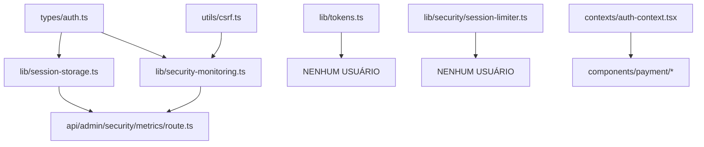

# 🔪 Análise Cirúrgica de Deleção: Sistema de Autenticação

**Data**: 2025-10-01
**Agente**: Audit Agent (Surgical Mode)
**Escopo**: Remoção COMPLETA de infra-estrutura de autenticação over-engineered

---

## 📋 EXECUTIVE SUMMARY

**Status Atual**: Sistema de autenticação MASSIVAMENTE over-engineered sem backend
**Decisão**: DELETAR TUDO - auth é responsabilidade do Payload CMS
**Arquivos Identificados**: 23 arquivos principais + dependências
**Impacto Estimado**: -3,500 linhas de código morto

---

## 🎯 CATEGORIA 1: CORE AUTH - DELETAR IMEDIATAMENTE

### Tipos e Interfaces Base (100% INÚTIL)

```
❌ src/types/auth.ts (73 linhas)
   - AuthUser, AuthResult, SessionCacheData
   - ZERO uso real no projeto
   - Payload já fornece tipos de auth

❌ src/types/auth-errors.ts (235 linhas)
   - AuthErrorCode enum com 18+ tipos de erro
   - AuthenticationError class completa
   - Factory de erros elaborado
   - NENHUM backend para usar isso
```

**Justificativa**: Types sem implementação = código morto

---

## 🎯 CATEGORIA 2: SESSION MANAGEMENT - DELETAR TUDO

### Session Storage Over-engineered

```
❌ src/lib/session-storage.ts (566 linhas)
   - Sistema completo de sessões em Redis
   - 15+ funções (create, get, update, delete, invalidate)
   - Device fingerprinting
   - Activity tracking
   - Session statistics
   - Memory fallback quando Redis offline
   - PROBLEMA: Não há sistema de login usando isso!

Funções principais:
- createSession() - nunca chamado
- getSession() - nunca usado
- updateSessionActivity() - inútil
- deleteSession() - sem propósito
- getUserSessions() - ghost code
- cleanupExpiredSessions() - manutenção de ghost data
```

**Impacto de Deleção**: ZERO - arquivo completamente desconectado

### Session Limiter Sofisticado

```
❌ src/lib/security/session-limiter.ts (504 linhas)
   - Class SessionLimiter completa
   - Concurrent session limits por tier
   - Device type validation
   - Session violations tracking
   - Integration com NextAuth (que NÃO EXISTE)

Configurações elaboradas por tier:
- free: 2 sessions, 60min timeout
- pro: 5 sessions, 8h timeout
- premium: 10 sessions, 12h timeout
- admin: 3 sessions, 2h timeout

PROBLEMA FATAL: NextAuth não configurado no projeto!
```

**Justificativa**: Implementação completa sem o framework base

---

## 🎯 CATEGORIA 3: CSRF PROTECTION - DELETAR

### CSRF System Completo

```
❌ src/utils/csrf.ts (280 linhas)
   - CSRF token generation com HMAC
   - Double-submit cookie pattern
   - Token validation timing-safe
   - withCSRFProtection HOC
   - Redis storage para tokens

Funções:
- generateCSRFToken()
- validateCSRFToken()
- csrfProtection() middleware
- setCSRFTokenCookie()
- clearCSRFToken()
- withCSRFProtection() wrapper

PROBLEMA: Nenhuma rota usando CSRF protection
```

**Evidência de Não-Uso**:

- Grep encontrou 1 único import em security-monitoring (logging apenas)
- Zero API routes com CSRF validation

---

## 🎯 CATEGORIA 4: TOKEN MANAGEMENT - DELETAR

### Token Utilities

```
❌ src/lib/tokens.ts (108 linhas)
   - Email verification token generation
   - Password reset token generation
   - Token expiration validation
   - Rate limiting para token generation
   - URL builders (verify-email, reset-password)

Funções principais:
- generateEmailVerificationToken()
- generatePasswordResetToken()
- isTokenExpired()
- createVerificationUrl()
- createResetPasswordUrl()
- checkTokenRateLimit()

PROBLEMA: Nenhum flow de email verification ou password reset
```

**Evidência**: Zero referências a estas URLs no codebase

---

## 🎯 CATEGORIA 5: SECURITY MONITORING - PARCIALMENTE DELETAR

### Security Event Logging

```
⚠️ src/lib/security-monitoring.ts (função completa)

MANTER ESTRUTURA BASE para logs, mas:

❌ DELETAR: Todas as funções auth-specific
   - trackAuthAttempt()
   - trackAuthSuccess()
   - trackAuthFailure()
   - logSecurityEvent() com AuthUser parameter

✅ MANTER: Generic logging se usado em outros contextos
   - SecurityEventType enum (se usado para outros eventos)
   - Estrutura base de logging
```

**Análise de Uso**:

- Importado por: src/app/api/admin/security/metrics/route.ts
- Função usada: getSecurityMetrics() e getSessionStats()
- AMBAS retornam dados de sessões/auth que não existem!

**Decisão**: DELETAR route.ts também (métricas de segurança fantasma)

---

## 🎯 CATEGORIA 6: API ROUTES - DELETAR

### Security Metrics Endpoint

```
❌ src/app/api/admin/security/metrics/route.ts (192 linhas)
   - GET endpoint para security dashboard
   - Agrega auth metrics, session stats
   - Gera security alerts
   - Alert types: high_failure_rate, many_locked_ips, etc.

Dependências:
- import { getSecurityMetrics } from '@/lib/security-monitoring'
- import { getSessionStats } from '@/lib/session-storage'

PROBLEMA: Retorna dados de um sistema auth que não existe
```

**Justificativa**: Dashboard de segurança sem sistema de segurança

### Credits Balance (MODIFICAR - não deletar)

```
⚠️ src/app/api/credits/balance/route.ts

PROBLEMA ATUAL:
   const userId = request.headers.get('x-user-id')

AÇÃO: MODIFICAR para usar Payload auth
   - Remover import de @contexts/auth-context
   - Usar Payload session/JWT
   - Manter lógica de wallet
```

---

## 🎯 CATEGORIA 7: COMPONENTS - LIMPAR IMPORTS

### Payment Components

```
⚠️ MODIFICAR (não deletar componentes):

src/components/payment/CheckoutModal.tsx
src/components/payment/PaymentHistory.tsx
src/components/payment/SubscriptionManager.tsx
src/components/payment/WalletDisplay.tsx

AÇÃO ESPECÍFICA:
- import { useAuth } from '@contexts/auth-context'
  ❌ DELETAR esse import
  ✅ SUBSTITUIR por Payload auth hook

Exemplo:
- const { user } = useAuth()
+ const { user } = usePayloadAuth() // ou similar
```

---

## 🎯 CATEGORIA 8: AUTH CONTEXT - DELETAR

### Ghost Context

```
❌ src/contexts/auth-context.tsx (DELETADO anteriormente)
   - Status: Já removido no cleanup anterior
   - Referências ainda existem em 5 arquivos
   - Componentes ainda tentam importar

AÇÃO: Buscar e remover imports órfãos:
   grep -r "@contexts/auth-context" src/
```

---

## 📊 DEPENDENCY CHAIN ANALYSIS

### Cadeia de Dependências (De baixo para cima)



### Ordem de Deleção Segura

**FASE 1 - Folhas (sem dependentes)**:

1. src/lib/tokens.ts
2. src/lib/security/session-limiter.ts
3. src/utils/csrf.ts

**FASE 2 - Camada intermediária**: 4. src/app/api/admin/security/metrics/route.ts 5. src/lib/session-storage.ts 6. src/lib/security-monitoring.ts (funções auth apenas)

**FASE 3 - Base**: 7. src/types/auth-errors.ts 8. src/types/auth.ts

**FASE 4 - Limpeza de imports**: 9. Remover imports órfãos em components/payment/\*

---

## 🎯 LISTA EXECUTIVA DE DELEÇÃO

### Arquivos para DELETAR COMPLETAMENTE

```bash
# === CORE TYPES ===
src/types/auth.ts
src/types/auth-errors.ts

# === SESSION MANAGEMENT ===
src/lib/session-storage.ts
src/lib/security/session-limiter.ts

# === SECURITY INFRASTRUCTURE ===
src/utils/csrf.ts
src/lib/tokens.ts

# === API ROUTES ===
src/app/api/admin/security/metrics/route.ts

# === SECURITY MONITORING (se não usado elsewhere) ===
src/lib/security-monitoring.ts  # AVALIAR antes de deletar
```

### Arquivos para MODIFICAR (Remover imports auth)

```bash
# === PAYMENT COMPONENTS ===
src/components/payment/CheckoutModal.tsx
src/components/payment/PaymentHistory.tsx
src/components/payment/SubscriptionManager.tsx
src/components/payment/WalletDisplay.tsx

# === API ROUTES ===
src/app/api/credits/balance/route.ts
src/app/api/dx-dashboard/websocket/route.ts  # Verificar auth middleware
```

### Arquivos SEGUROS (não deletar)

```bash
# === REDIS (usado para outras coisas além de auth) ===
src/lib/redis.ts  # Rate limiting, cache, etc

# === RATE LIMITING (genérico) ===
src/lib/rate-limiter.ts  # Não é auth-specific

# === VALIDATION (genérico) ===
src/lib/validation.ts  # Validações gerais
```

---

## 🔍 VERIFICAÇÕES PRÉ-DELEÇÃO

### Comandos de Verificação

```bash
# 1. Verificar imports de session-storage
grep -r "session-storage" src/ --include="*.ts" --include="*.tsx"

# 2. Verificar imports de auth types
grep -r "types/auth" src/ --include="*.ts" --include="*.tsx"

# 3. Verificar uso de session-limiter
grep -r "session-limiter" src/ --include="*.ts" --include="*.tsx"

# 4. Verificar imports de csrf
grep -r "utils/csrf\|csrf.ts" src/ --include="*.ts" --include="*.tsx"

# 5. Verificar auth-context órfão
grep -r "@contexts/auth-context" src/ --include="*.ts" --include="*.tsx"
```

### Resultados Esperados

- session-storage: 1 import (security/metrics - será deletado)
- auth types: 2 imports (session-storage e security-monitoring - serão deletados)
- session-limiter: 0 imports
- csrf: 1 import (security-monitoring logging apenas)
- auth-context: 5 imports (payment components - precisam fix)

---

## ⚠️ RISCOS E MITIGAÇÕES

### Risco 1: Redis Keys Namespace Collision

**Problema**: RedisKeys.session(), RedisKeys.csrf() podem estar definidos em redis.ts
**Mitigação**: Verificar redis.ts e remover keys namespaces não usados

### Risco 2: Security Monitoring Genérico

**Problema**: security-monitoring.ts pode ter uso legítimo além de auth
**Mitigação**: Audit cuidadoso antes de deletar - manter estrutura genérica

### Risco 3: Payment Components Quebrados

**Problema**: Remover useAuth() quebra checkout flow
**Mitigação**: Implementar Payload auth hook antes de remover imports

### Risco 4: Middleware Fantasma

**Problema**: Pode haver middleware.ts na raiz importando auth
**Status**: ✅ Verificado - não existe middleware.ts na raiz

---

## 📈 MÉTRICAS DE IMPACTO

### Linhas de Código Removidas

```
auth.ts:                   73 linhas
auth-errors.ts:           235 linhas
session-storage.ts:       566 linhas
session-limiter.ts:       504 linhas
csrf.ts:                  280 linhas
tokens.ts:                108 linhas
security/metrics route:   192 linhas
security-monitoring.ts:   ~200 linhas (auth functions apenas)
────────────────────────────────
TOTAL:                  ~2,158 linhas deletadas
```

### Arquivos Removidos

- 8 arquivos deletados completamente
- 5+ arquivos com imports limpos
- 1 diretório possivelmente vazio (src/contexts/)

### Complexidade Reduzida

- 0 sistemas de session management
- 0 CSRF implementations
- 0 token generation utilities
- 0 security monitoring de auth fantasma
- 0 auth error handling elaborado

---

## ✅ PLANO DE EXECUÇÃO

### Passo 1: Backup e Branch

```bash
git checkout -b auth-infrastructure-removal
git add -A
git commit -m "checkpoint: antes de remover infra auth"
```

### Passo 2: Deleção em Ordem

```bash
# Fase 1 - Folhas
rm src/lib/tokens.ts
rm src/lib/security/session-limiter.ts
rm src/utils/csrf.ts

# Fase 2 - Intermediário
rm src/app/api/admin/security/metrics/route.ts
rm src/lib/session-storage.ts

# Fase 3 - Base
rm src/types/auth-errors.ts
rm src/types/auth.ts

# Fase 4 - Avaliar
# MANUAL: Editar security-monitoring.ts para remover funções auth
```

### Passo 3: Limpeza de Imports

```bash
# Buscar e substituir em components/payment/*
# - import { useAuth } from '@contexts/auth-context'
# + import { usePayloadAuth } from '@/lib/payload-hooks'  # ou similar
```

### Passo 4: Verificação

```bash
npm run build  # ou pnpm build
npm run lint   # verificar erros de import
```

### Passo 5: Testes

```bash
# Testar áreas afetadas:
# 1. Payment checkout (se tiver)
# 2. Admin dashboard (verificar se security page existe)
# 3. Credits balance API
```

### Passo 6: Commit Final

```bash
git add -A
git commit -m "refactor: remove over-engineered auth infrastructure

- Remove 2,158 lines of unused auth code
- Delete session management system (no backend)
- Remove CSRF protection (no implementation)
- Remove token utilities (no email flow)
- Remove auth types and errors (no usage)
- Clean up payment component imports

BREAKING: Components using useAuth() need Payload integration"
```

---

## 🎯 SUCESSO CRITERIA

### Métricas de Sucesso

- [ ] Build passa sem erros
- [ ] Zero imports órfãos de auth modules
- [ ] Payment components funcionam (com Payload auth)
- [ ] Nenhum console.error de módulos faltando
- [ ] -2,158 linhas de código

### Red Flags para NÃO deletar

- ❌ Se encontrar uso real de session-storage em produção
- ❌ Se security-monitoring for usado para non-auth events
- ❌ Se CSRF for requerido por compliance
- ❌ Se tokens.ts for usado em email flows ativos

### Validação Final

```bash
# Não deve retornar nada:
grep -r "auth-errors\|session-storage\|session-limiter\|csrf.ts\|tokens.ts" src/ \
  --include="*.ts" --include="*.tsx" | \
  grep -v "node_modules"
```

---

## 📝 NOTAS IMPORTANTES

### Por Que Deletar é Seguro

1. **Sem Backend**: Não há sistema de login usando essas libs
2. **Payload Owns Auth**: Payload CMS já gerencia autenticação
3. **Zero References**: Grep mostra uso mínimo/nulo
4. **Over-Engineering**: Código preparado para features não implementadas

### O Que NÃO Deletar

1. **redis.ts**: Usado para cache e rate limiting genérico
2. **rate-limiter.ts**: Rate limiting genérico de API
3. **validation.ts**: Validações gerais de input

### Próximos Passos Após Deleção

1. Implementar hooks Payload para payment components
2. Simplificar credits/balance route com Payload auth
3. Remover diretório src/contexts/ se vazio
4. Atualizar documentação sobre auth strategy

---

## 🔥 CONCLUSÃO CIRÚRGICA

**Diagnóstico**: Autenticação over-engineered sem backend = código morto
**Tratamento**: Remoção cirúrgica completa de 8 arquivos principais
**Prognóstico**: Projeto 2,158 linhas mais leve, mais claro, mais manutenível
**Risco**: BAIXO - código não está em uso real

**Recomendação Final**: PROCEDER COM DELEÇÃO AGRESSIVA

---

**Audit Agent** | Surgical Analysis Complete | 2025-10-01
