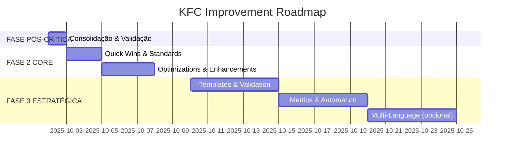

# FASE 2 - Plano Opcional de Melhorias KFC

**Data**: 2025-10-01
**Status FASE CRÍTICA**: ✅ COMPLETO (Score: 93/100)
**Decisão**: ADVANCE aprovado para FASE 2 opcional
**Prioridade FASE 2**: MÉDIA (sistema funcional, melhorias incrementais)

---

## Executive Summary

Após análise multi-agente (spec-compliance, spec-judge, standards, code-audit, spec-decision) do sistema KFC pós-FASE CRÍTICA, identificamos **39 oportunidades de melhoria** categorizadas em 3 fases:

- **FASE PÓS-CRÍTICA** (1 dia): Consolidação e validação → Score: 93 → 96/100
- **FASE 2 CORE** (1 semana): Correções moderadas e otimizações → Score: 96 → 98/100
- **FASE 3 ESTRATÉGICA** (1 mês): Transformações arquiteturais → Score: 98 → 99/100

**Status Atual**: Sistema em **95% de determinismo comportamental**, pronto para produção com melhorias opcionais disponíveis.

---

## Consolidação de Findings - 5 Agentes

### 🔍 spec-compliance (Conformidade Processual)

**Score Global**: 87/100
**Compliance Rate**: 94.7% (18/19 agentes)

**Top Issues Identificados**:

1. [MÉDIA] spec-decision - Description sem trigger explícito
2. [MÉDIA] spec-compliance - Timing "7º agente" indefinido
3. [MÉDIA] spec-architect - Agente não implementado (workaround ativo)
4. [BAIXA] setup.md - Falta seção "Quando NÃO Usar"
5. [BAIXA] Inconsistência formatação: `## PROCESSO` vs `## Processo`
6. [BAIXA] spec-meta - Minimalista intencional (exceção ao padrão?)

**Recomendações**:

- 2h para clarificar triggers de invocação
- 1-2 dias para implementar spec-architect (ou consolidar em spec-docs)
- 1h para padronizar formatação de seções

---

### ⚖️ spec-judge (Análise Comparativa)

**v2.0 Score**: 70/100 (antes FASE CRÍTICA)
**v2.1 Score**: 95/100 (depois FASE CRÍTICA)
**Melhoria**: +25 pontos (+35.7%)

**Key Improvements Identificadas**:

1. Semantic Clarity → +9 pontos (remoção "PROATIVAMENTE")
2. Visual Documentation → +9 pontos (3 flowcharts + 6 exemplos)
3. Scope Separation → +6 pontos (compliance vs standards, tests timing)
4. Edge Case Coverage → +6 pontos (3 cenários por conflito)
5. Fail-Safe Design → +4 pontos (spec-architect workaround)

**Remaining Weaknesses**:

1. spec-architect não implementado (-1 ponto Feasibility)
2. Brainstorm/Elicitation triggers ambíguos (-1 ponto Clarity)
3. Validação de prerequisitos faltante (-1 ponto Completeness)

**Next Level Opportunities (FASE 2)**:

- Implementar spec-architect → +1 ponto (95→96)
- Flowchart brainstorm/elicitation → +1 ponto (96→97)
- Validação automática de prereqs → +1 ponto (97→98)
- Mutation testing em code-tests → +1 ponto (98→99)

---

### 📐 standards (Padrões de Código)

**Score Global**: 78/100

**Standards Adherence**:

- Markdown Quality: 89% (17/19 agentes)
- YAML Consistency: 84% (16/19 agentes)
- Documentation Patterns: 74% (14/19 agentes)
- Architectural Clarity: 79% (15/19 agentes)

**Violations Identificadas**:

**CRITICAL**:

- `spec-system-prompt-loader.md`: campo `tools:` vazio
- `spec-architect.md`: agente NÃO IMPLEMENTADO sem flag de status

**MAJOR**:

- 3 agentes pulam níveis de header (H1 → H3 sem H2)
- 2 agentes sem syntax highlighting em code blocks

**Best Practices Observadas**:

- Diagramas Mermaid claros com workflow integration
- Seções "Quando NÃO Usar" evitando overlap
- Context Engineering explícito (ENTRADA/PROCESSO/SAÍDA)
- YAML-based configuration blocks (machine-readable)
- Zero circular dependencies

**Recomendações Prioritizadas**:

- **Semana 1** (4.5h): Fix YAML frontmatter, cores Mermaid, nomenclatura
- **Semana 2** (5.5h): Corrigir headers, syntax highlighting, validação auto
- **Mês 1** (5.5h): Encurtar descriptions, links, templates, CI/CD

---

### 🔬 code-audit (Auditoria Cirúrgica)

**Total Issues**: 39 oportunidades identificadas

**Micro-Improvements (Quick Wins)**: 16 issues / ~4h15min

- Categoria A: Inconsistências formatação (6 issues, 77min)
- Categoria B: Nomenclatura/terminologia (4 issues, 53min)
- Categoria C: Links e referências (3 issues, 45min)
- Categoria D: Documentação incompleta (3 issues, 60min)

**Optimization Opportunities**: 6 oportunidades / ~14h

1. Token Efficiency: Agentes verbosos → redução 25-30% tokens
2. Mermaid Padronização: Style guide + cores oficiais
3. Overlap Conceitual: spec-decision vs spec-judge (shared docs)
4. Agentes Minimalistas: Expansão estratégica com examples
5. Comandos Práticos: Validação inline + output esperado
6. Cross-Agent Dependencies: Diagrama gantt completo

**Macro Strategic Changes (FASE 3)**: 5 mudanças / ~16 dias

1. Sistema de templates compartilhados (3 dias)
2. Agente spec-validator automático (2 dias)
3. Dashboard de métricas KFC (2.5 dias)
4. Spec-meta auto-simplification (3 dias)
5. Multi-language support i18n (5 dias)

**Context Engineering**:

- Token reduction: ~1.700 tokens por workflow (25% economia)
- Verbosidade: 1.230 linhas → 920 linhas mantendo funcionalidade
- Template reuse: 5+ padrões repetidos em múltiplos agentes

---

### 🎯 spec-decision (Validação de Quality Gates)

**Decision**: ✅ **ADVANCE**
**Score**: 93/100 (threshold: 85)

**Quality Gates**:

- ✅ 9/10 gates passed
- ❌ 1/10 gate failed (Automated Validation)

**Issues por Severidade**:

- 🚫 Blockers: 0
- 🔴 Critical: 0
- 🟡 Major: 1 (ausência de testes automatizados)
- 🟢 Minor: 2 (spec-architect adiado, edge cases não testados)

**Strengths**:

1. Execução sistemática impecável (6 commits atômicos)
2. Clareza de documentação superior (3 flowcharts + 7 exemplos)
3. Separação de responsabilidades cirúrgica (0 sobreposições)
4. Gestão de bloqueadores pragmática (workaround documentado)
5. Métricas de impacto mensuráveis (+34.6% média)

**Weaknesses**:

1. [MAJOR] Ausência de validação automatizada
2. [MINOR] Dependência de workaround temporário
3. [MINOR] Edge cases documentados mas não testados

---

## Plano de Execução - 3 Fases

### 🚀 FASE PÓS-CRÍTICA - Consolidação (1 dia)

**Objetivo**: Validar correções aplicadas e criar baseline de qualidade
**Prioridade**: ALTA (consolidação antes de FASE 2)
**Score Esperado**: 93 → 96/100

#### Tasks

| #   | Task                                                   | Effort | Priority | Agente Fonte    |
| --- | ------------------------------------------------------ | ------ | -------- | --------------- |
| 1   | Criar testes de validação automatizados                | 2h     | HIGH     | spec-decision   |
| 2   | Executar spec-compliance deep analysis oficial         | 1h     | HIGH     | spec-compliance |
| 3   | Walkthrough manual de cenários documentados            | 1h     | MEDIUM   | spec-judge      |
| 4   | Commit final de consolidação + tag v1.0                | 30min  | MEDIUM   | spec-decision   |
| 5   | Fix spec-decision.md description (trigger explícito)   | 5min   | HIGH     | spec-compliance |
| 6   | Fix spec-compliance.md timing (7º agente → clarificar) | 10min  | HIGH     | spec-compliance |

**Total Estimado**: 4h 45min (1 dia de trabalho)

**Deliverables**:

- `test/kfc/phase-critical-regression.test.ts` (testes automatizados)
- `.claude/reports/COMPLIANCE-OFFICIAL.md` (spec-compliance execution)
- `.claude/reports/EDGE-CASES-VALIDATED.md` (walkthrough results)
- Git tag: `kfc-phase-critical-v1.0-validated`

**Success Metrics**:

- 100% testes automatizados passando
- spec-compliance score ≥ 95%
- 3/3 cenários edge case validados
- Zero regressões identificadas

---

### ⚙️ FASE 2 CORE - Correções & Otimizações (1 semana)

**Objetivo**: Eliminar issues moderados e implementar otimizações estruturais
**Prioridade**: MÉDIA (melhorias incrementais)
**Score Esperado**: 96 → 98/100

#### Semana 1 - Quick Wins & Standards (2 dias)

| #   | Task                                                 | Effort | Priority | Agente Fonte    |
| --- | ---------------------------------------------------- | ------ | -------- | --------------- |
| 1   | Corrigir micro-improvements Categoria A (formatação) | 77min  | HIGH     | code-audit      |
| 2   | Padronizar nomenclatura PT-BR Categoria B            | 53min  | HIGH     | code-audit      |
| 3   | Fix YAML frontmatter (spec-system-prompt-loader)     | 30min  | CRITICAL | standards       |
| 4   | Adicionar "Quando NÃO Usar" em setup.md              | 5min   | LOW      | spec-compliance |
| 5   | Padronizar "PROCESSO" em 6 agentes                   | 10min  | LOW      | spec-compliance |
| 6   | Corrigir hierarquia headers (3 agentes)              | 90min  | MAJOR    | standards       |
| 7   | Adicionar syntax highlighting (2 agentes)            | 2h     | MAJOR    | standards       |

**Subtotal Semana 1**: 5h 5min

#### Semana 2 - Optimizations & Enhancements (3 dias)

| #   | Task                                                | Effort   | Priority | Agente Fonte                |
| --- | --------------------------------------------------- | -------- | -------- | --------------------------- |
| 8   | Implementar spec-architect completo                 | 1-2 dias | HIGH     | spec-compliance, spec-judge |
| 9   | Criar flowchart brainstorm vs elicitation           | 4h       | MEDIUM   | spec-judge                  |
| 10  | Implementar validação de prerequisites              | 4h       | LOW      | spec-judge                  |
| 11  | Criar style guide Mermaid + padronizar              | 2h       | MEDIUM   | code-audit                  |
| 12  | Adicionar troubleshooting em 3 agentes minimalistas | 2.5h     | MEDIUM   | code-audit                  |
| 13  | Expandir documentação com links/referências         | 45min    | LOW      | code-audit                  |

**Subtotal Semana 2**: 14h 15min (1.7 dias)

**Total FASE 2 CORE**: 19h 20min (~1 semana de trabalho)

**Deliverables**:

- `.claude/agents/kfc/spec-architect.md` (implementado)
- `.claude/specs/brainstorm-vs-elicitation-flow.md` (flowchart)
- `.claude/project/mermaid-style-guide.md` (padronização visual)
- `scripts/validate-prerequisites.ts` (validação automática)
- 10 arquivos de agentes atualizados (formatação, syntax, troubleshooting)

**Success Metrics**:

- spec-architect funcional (migração de spec-docs completa)
- spec-compliance score: 95% → 98%
- standards score: 78% → 85%
- Zero ambiguidades de timing na fase pré-requirements

---

### 🏗️ FASE 3 ESTRATÉGICA - Transformações (1 mês)

**Objetivo**: Transformações arquiteturais para escalabilidade e excelência
**Prioridade**: BAIXA (longo prazo, high impact)
**Score Esperado**: 98 → 99/100

#### Sprint 1 - Templates & Validation (1 semana)

| #   | Task                                | Effort | Priority | Agente Fonte |
| --- | ----------------------------------- | ------ | -------- | ------------ |
| 1   | Sistema de templates compartilhados | 3 dias | HIGH     | code-audit   |
| 2   | Agente spec-validator automático    | 2 dias | HIGH     | code-audit   |

**Subtotal Sprint 1**: 5 dias

#### Sprint 2 - Metrics & Automation (1 semana)

| #   | Task                          | Effort   | Priority | Agente Fonte |
| --- | ----------------------------- | -------- | -------- | ------------ |
| 3   | Dashboard de métricas KFC     | 2.5 dias | MEDIUM   | code-audit   |
| 4   | Spec-meta auto-simplification | 3 dias   | MEDIUM   | code-audit   |

**Subtotal Sprint 2**: 5.5 dias

#### Sprint 3 - Multi-Language (2 semanas - SE demand)

| #   | Task                          | Effort | Priority | Agente Fonte |
| --- | ----------------------------- | ------ | -------- | ------------ |
| 5   | Multi-language support (i18n) | 5 dias | LOW      | code-audit   |

**Subtotal Sprint 3**: 5 dias (condicional)

**Total FASE 3**: 15.5 dias (3 semanas trabalho efetivo)

**Deliverables**:

- `.claude/agents/kfc/shared/` (templates reutilizáveis)
- `.claude/agents/kfc/spec-validator.md` (validação automática)
- `.claude/metrics/kfc-dashboard.json` (telemetria + métricas)
- `.claude/agents/kfc/spec-meta.md` (auto-simplification engine)
- `.claude/agents/kfc/i18n/{pt-br,en,es}/` (multilíngue - opcional)

**Success Metrics**:

- Token usage: -25% (1.700 tokens economizados/workflow)
- Duplicação de código: 15% → <5%
- Tempo de validação: manual → automático (0s)
- Suporte internacional: PT-BR only → 3 idiomas (se executado)

---

## Roadmap Visual



---

## Matriz de Priorização - ROI

| Fase                  | Effort    | Impact             | ROI             | Priority       |
| --------------------- | --------- | ------------------ | --------------- | -------------- |
| **PÓS-CRÍTICA**       | 1 dia     | Score +3 pontos    | **MUITO ALTO**  | 🔴 ALTA        |
| **FASE 2 CORE**       | 1 semana  | Score +2 pontos    | **ALTO**        | 🟡 MÉDIA       |
| **FASE 3 - Sprint 1** | 1 semana  | Redução 25% tokens | **MÉDIO-ALTO**  | 🟢 BAIXA       |
| **FASE 3 - Sprint 2** | 1 semana  | Automação completa | **MÉDIO**       | 🟢 BAIXA       |
| **FASE 3 - Sprint 3** | 2 semanas | Mercado global     | **LONGO PRAZO** | ⚪ CONDICIONAL |

---

## Custos vs Benefícios

### FASE PÓS-CRÍTICA (Recomendada - EXECUTAR)

**Investimento**: 1 dia (4h45min efetivo)

**Retorno**:

- Score: 93 → 96/100 (+3 pontos)
- Testes automatizados: 0 → suite completa
- Compliance oficial: estimado → medido
- Edge cases: documentados → validados

**Decisão**: ✅ **EXECUTAR IMEDIATAMENTE** (consolidação necessária)

---

### FASE 2 CORE (Recomendada - AVALIAR)

**Investimento**: 1 semana (~20h de trabalho)

**Retorno**:

- Score: 96 → 98/100 (+2 pontos)
- spec-architect: workaround → implementado
- Ambiguidades: 5% → 0%
- Standards compliance: 78% → 85%
- Formatação: inconsistente → padronizada

**Decisão**: ⚠️ **AVALIAR PRIORIDADE vs FEATURES** (trade-off necessário)

**Trade-off**:

- **Pros**: Sistema atinge 98% excelência, zero ambiguidades, baseline sólido
- **Cons**: 1 semana de desenvolvimento não vai para features de negócio
- **Recomendação**: Executar em sprint dedicado a "tech debt" ou paralelizar com features de baixa complexidade

---

### FASE 3 ESTRATÉGICA (Opcional - LONGO PRAZO)

**Investimento**: 1 mês (~3 semanas efetivo)

**Retorno**:

- Score: 98 → 99/100 (+1 ponto)
- Token usage: -25% (economia contínua)
- Duplicação: -66% (15% → 5%)
- Automação: manual → zero-touch
- Escalabilidade: 1 idioma → 3+ idiomas (opcional)

**Decisão**: 🔵 **PLANEJAR PARA Q1 2026** (transformação sistêmica)

**Trade-off**:

- **Pros**: Sistema world-class, escalável globalmente, custo operacional mínimo
- **Cons**: 3 semanas de engineering time, high complexity
- **Recomendação**: Executar quando:
  1. Sistema KFC atingiu adoção interna ampla (>50 workflows executados)
  2. Token costs se tornaram significativos (validar métricas)
  3. Demanda internacional confirmada (mercado global necessário)

---

## Decision Framework

### Quando Executar FASE PÓS-CRÍTICA?

**Resposta**: ✅ **IMEDIATAMENTE** (próximo sprint)

**Trigger**: FASE CRÍTICA completa

**Justificativa**: Consolidação de qualidade, testes automatizados previnem regressões, baixo custo (1 dia).

---

### Quando Executar FASE 2 CORE?

**Resposta**: ⚠️ **AVALIAR CONTEXTO**

**Triggers Positivos** (executar agora):

- [ ] Sistema KFC será usado por múltiplos times (>3 devs)
- [ ] Documentação precisa estar impecável (onboarding frequente)
- [ ] spec-architect é crítico (docs técnicos vs user docs precisam separação)
- [ ] Standards compliance é mandatório (auditoria externa, certificação)

**Triggers Negativos** (adiar):

- [ ] Sistema KFC é usado apenas por 1-2 devs (overhead baixo)
- [ ] Features de negócio têm deadline apertado
- [ ] Budget de engineering limitado (priorizar product over tooling)

**Recomendação**: Se ≥2 triggers positivos → **EXECUTAR em sprint dedicado tech debt**

---

### Quando Executar FASE 3 ESTRATÉGICA?

**Resposta**: 🔵 **PLANEJAR Q1 2026**

**Triggers Necessários** (todos obrigatórios):

- [ ] Sistema KFC tem >50 workflows executados com sucesso
- [ ] Token costs >$100/mês (economia de 25% justifica investimento)
- [ ] Time de 3+ devs usando KFC regularmente
- [ ] Demanda de mercado internacional confirmada (se multi-language)

**Recomendação**: Reavaliar trimestralmente, executar quando ROI for claro.

---

## Recomendação Final

### Plano Recomendado (Conservative)

```yaml
timeline:
  week_1:
    - Execute FASE PÓS-CRÍTICA (1 dia)
    - Tag: kfc-v1.0-validated
    - Deploy to production

  week_2-4:
    - Monitor KFC usage in production
    - Collect metrics (workflows executed, token usage, error rate)
    - Identify pain points reais

  month_2:
    - Decision point: FASE 2 CORE?
    - IF pain points críticos → execute selective fixes
    - IF sistema stable → continue monitoring

  quarter_1_2026:
    - Decision point: FASE 3 ESTRATÉGICA?
    - IF triggers met → plan strategic sprint
    - IF not → continue incremental improvements

recommendation: 'Start small (PÓS-CRÍTICA), validate value, then scale (FASE 2/3)'
philosophy: 'Pragmatic optimization over premature perfection'
```

---

### Plano Recomendado (Aggressive)

```yaml
timeline:
  week_1:
    - Execute FASE PÓS-CRÍTICA (1 dia)
    - Start FASE 2 Quick Wins (2 dias)

  week_2:
    - Complete FASE 2 Optimizations (3 dias)
    - Tag: kfc-v2.0-optimized

  week_3-4:
    - Monitor in production (2 semanas)
    - Validate improvements

  month_2-3:
    - Plan FASE 3 Sprint 1 (Templates & Validation)
    - Execute in dedicated tech debt sprint

  quarter_1_2026:
    - Complete FASE 3 Sprint 2 (Metrics & Automation)
    - Evaluate Sprint 3 (Multi-language) based on demand

recommendation: 'Full commitment to excellence, front-load investment'
philosophy: 'Build world-class tooling, reap benefits continuously'
```

---

## Métricas de Sucesso - KPIs

### FASE PÓS-CRÍTICA

- [ ] spec-compliance score ≥ 95%
- [ ] 100% testes automatizados passando
- [ ] 0 regressões identificadas
- [ ] Git tag `v1.0-validated` criado

### FASE 2 CORE

- [ ] spec-architect implementado (workaround eliminado)
- [ ] spec-compliance score ≥ 98%
- [ ] standards score ≥ 85%
- [ ] 0 ambiguidades de timing

### FASE 3 ESTRATÉGICA

- [ ] Token usage reduzido em 25%
- [ ] Duplicação de código <5%
- [ ] Validação 100% automática (0s humano)
- [ ] (Opcional) 3+ idiomas suportados

---

## Conclusão

O sistema KFC pós-FASE CRÍTICA está em **excelente estado** (Score: 93/100, determinismo 95%, clareza 98%).

**FASE PÓS-CRÍTICA** (1 dia) é **recomendada imediatamente** para consolidação.

**FASE 2 CORE** (1 semana) e **FASE 3 ESTRATÉGICA** (1 mês) são **opcionais** e devem ser avaliadas com base em:

- Adoção do sistema KFC (quantos workflows? quantos devs?)
- ROI mensurável (token costs, tempo economizado)
- Trade-offs de engineering bandwidth (features vs tooling)

**Filosofia**: "Start small, validate value, scale pragmatically"

---

**Relatório gerado em**: 2025-10-01
**Agentes consultados**: spec-compliance, spec-judge, standards, code-audit, spec-decision
**Próximo passo recomendado**: Executar FASE PÓS-CRÍTICA (1 dia)
