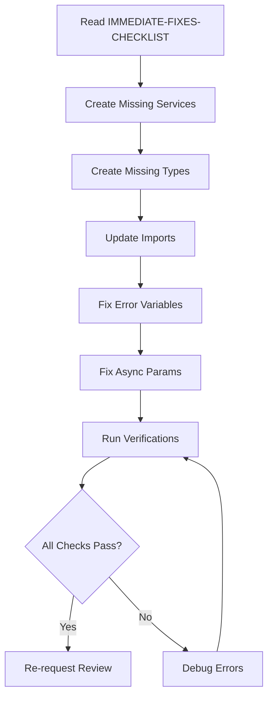
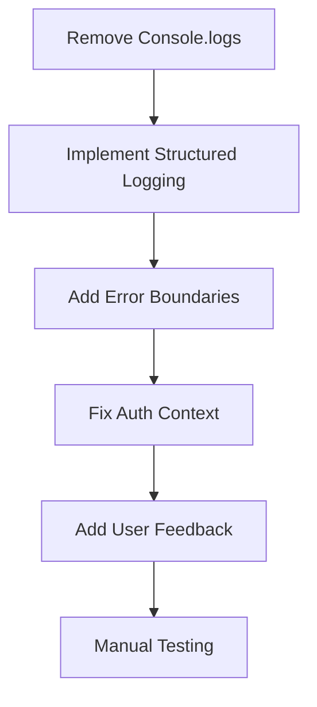

# Code Review Reports - Navigation Guide

**Review Date**: 2025-10-01
**Branch**: legacy-auth-cleanup
**Review Type**: Post-Payload CMS Cleanup
**Reviewer**: code-review agent (KFC Workflow)

---

## 📚 Report Index

This directory contains comprehensive code review documentation for the Payload CMS cleanup. Reports are organized by purpose and detail level.

### 🎯 Start Here

1. **[CODE-REVIEW-SUMMARY.md](./CODE-REVIEW-SUMMARY.md)** ⭐
   - **Who**: Managers, Team Leads, Quick Overview
   - **What**: Executive summary with scores and metrics
   - **Time**: 5 min read
   - **Status**: ❌ CHANGES REQUESTED

2. **[IMMEDIATE-FIXES-CHECKLIST.md](./IMMEDIATE-FIXES-CHECKLIST.md)** 🚨
   - **Who**: Developers assigned to fix issues
   - **What**: Step-by-step action plan (~2 hours work)
   - **Time**: 10 min read, 2 hours execution
   - **Priority**: 🔴 BLOCKER - Must complete before merge

3. **[CODE-FIX-TEMPLATES.md](./CODE-FIX-TEMPLATES.md)** 📋
   - **Who**: Developers doing the actual fixes
   - **What**: Copy-paste ready code snippets
   - **Time**: Reference during fixes
   - **Usage**: Keep open while fixing

4. **[POST-PAYLOAD-CLEANUP-CODE-REVIEW.md](./POST-PAYLOAD-CLEANUP-CODE-REVIEW.md)** 📖
   - **Who**: Developers, Architects, Auditors
   - **What**: Detailed analysis with line numbers and examples
   - **Time**: 30 min read
   - **Purpose**: Deep understanding of all issues

---

## 🔍 Quick Navigation

### By Role:

#### 👔 For Managers/Team Leads:

1. Read **CODE-REVIEW-SUMMARY.md** first
2. Review "Time to Fix" section
3. Assign developer to fix Phase 1 issues
4. Plan Phase 2 & 3 in backlog

#### 👨‍💻 For Developers (Fixing Issues):

1. Read **IMMEDIATE-FIXES-CHECKLIST.md**
2. Keep **CODE-FIX-TEMPLATES.md** open
3. Follow checklist step-by-step
4. Run verification commands
5. Refer to **POST-PAYLOAD-CLEANUP-CODE-REVIEW.md** for context

#### 🏗️ For Architects/Tech Leads:

1. Read **POST-PAYLOAD-CLEANUP-CODE-REVIEW.md** fully
2. Review "Recommended Refactoring" section
3. Note technical debt in "Lessons Learned"
4. Plan long-term improvements

---

## 📊 Review Results At-a-Glance

| Metric              | Value                | Status |
| ------------------- | -------------------- | ------ |
| **Approval Status** | CHANGES REQUESTED    | 🔴     |
| **Files Reviewed**  | 163 TypeScript files | ✅     |
| **Blocker Issues**  | 5 critical           | 🔴     |
| **Files Broken**    | 9 (5.5%)             | 🔴     |
| **Files Clean**     | 18 (11%)             | 🟢     |
| **Code Quality**    | 68/100               | 🟡     |
| **Time to Fix**     | 2-4 hours (Phase 1)  | ⏱️     |

---

## 🚨 Critical Issues Summary

### Top 5 Blockers (MUST Fix):

1. **Missing Services** - `src/services/` directory deleted but imports remain
2. **Missing Types** - `src/interfaces/` deleted, 6 files import from it
3. **Error Variables** - 8 files catch `_error` but use `error/err`
4. **Async Params** - Missing `await` in metadata generation
5. **Service Classes** - `ValidationService` instantiated but doesn't exist

**Impact**: Code won't compile, TypeScript errors, runtime crashes

**Time to Fix**: ~2 hours (see IMMEDIATE-FIXES-CHECKLIST.md)

---

## 📁 File Structure

```
.claude/reports/
├── README-CODE-REVIEW.md              ← You are here
├── CODE-REVIEW-SUMMARY.md             ← Start here (executives)
├── IMMEDIATE-FIXES-CHECKLIST.md       ← Fix guide (developers)
├── CODE-FIX-TEMPLATES.md              ← Code snippets (developers)
└── POST-PAYLOAD-CLEANUP-CODE-REVIEW.md ← Full analysis (technical)
```

---

## 🎯 Workflow for Fixing Issues

### Phase 1: Make It Compile (2 hours - REQUIRED)



**Steps**:

1. ✅ Create 6 new files (services + types)
2. ✅ Update 9 files (import fixes)
3. ✅ Fix 8 catch blocks (error variables)
4. ✅ Fix 1 async function (await params)
5. ✅ Verify with `tsc --noEmit` and `pnpm build`

**Deliverable**: Code compiles without errors

---

### Phase 2: Critical Issues (1 day - HIGH PRIORITY)



**Steps**:

- Remove 100+ console.log statements
- Replace with `logger.error()`, `logger.warn()`
- Add React error boundaries
- Replace hardcoded `userId: 'default-user'`
- Improve error messages for users

**Deliverable**: Production-ready error handling

---

### Phase 3: Code Quality (2 days - NICE TO HAVE)

**Steps**:

- Add TypeScript strict types
- Implement loading states
- Improve accessibility (ARIA)
- Add JSDoc comments
- Write unit tests

**Deliverable**: High-quality, maintainable code

---

## 📖 Report Descriptions

### 1. CODE-REVIEW-SUMMARY.md

**Purpose**: Quick overview for decision-makers
**Length**: ~5 pages
**Audience**: Managers, team leads, stakeholders
**Contains**:

- Executive summary
- Status at-a-glance
- Key findings
- Time estimates
- Approval decision

**When to Read**:

- Before assigning work
- For status updates
- For planning meetings

---

### 2. IMMEDIATE-FIXES-CHECKLIST.md

**Purpose**: Action plan to fix blocker issues
**Length**: ~8 pages
**Audience**: Developers fixing issues
**Contains**:

- Step-by-step instructions
- Time estimates per task
- Verification commands
- Progress checklist

**When to Read**:

- Before starting fixes
- During development
- To track progress

---

### 3. CODE-FIX-TEMPLATES.md

**Purpose**: Copy-paste ready code solutions
**Length**: ~10 pages
**Audience**: Developers implementing fixes
**Contains**:

- Complete file templates
- Line-by-line edits
- Find & replace patterns
- Before/after comparisons

**When to Read**:

- While fixing code
- As reference during development
- To verify changes

---

### 4. POST-PAYLOAD-CLEANUP-CODE-REVIEW.md

**Purpose**: Comprehensive technical analysis
**Length**: ~25 pages
**Audience**: Developers, architects, auditors
**Contains**:

- Detailed issue breakdown
- Code examples with line numbers
- Security analysis
- Performance review
- Refactoring recommendations
- Lessons learned

**When to Read**:

- For deep understanding
- For architectural decisions
- For code review training
- For audit purposes

---

## 🎓 Key Takeaways

### What Went Wrong:

1. ❌ Deleted directories without updating imports
2. ❌ No TypeScript compilation check after deletions
3. ❌ Copy-paste errors in error handling
4. ❌ No automated tests to catch breakage

### What Went Right:

1. ✅ Clean layout structure after Payload removal
2. ✅ UI components isolated from deleted code
3. ✅ Landing page has no dependencies on Payload

### Prevention for Future:

1. ✅ Run `tsc --noEmit` before committing large changes
2. ✅ Use IDE refactoring tools for safe renames
3. ✅ Write integration tests for critical paths
4. ✅ Add pre-commit hooks for type checking

---

## 📞 Support & Questions

### If You're Stuck:

1. **Technical Questions**: Re-read POST-PAYLOAD-CLEANUP-CODE-REVIEW.md
2. **Implementation Help**: Refer to CODE-FIX-TEMPLATES.md
3. **Priority Questions**: Check CODE-REVIEW-SUMMARY.md
4. **Process Questions**: Check IMMEDIATE-FIXES-CHECKLIST.md

### Common Questions:

**Q: How long will fixes take?**
A: Phase 1 (required): ~2 hours. See IMMEDIATE-FIXES-CHECKLIST.md.

**Q: Can we merge without fixing everything?**
A: No. Phase 1 blockers MUST be fixed. Code won't compile currently.

**Q: Which files are completely broken?**
A: 9 files with broken imports. See "Files Requiring Immediate Action" in CODE-REVIEW-SUMMARY.md.

**Q: Are there any security issues?**
A: No new security vulnerabilities introduced. See Security Analysis in full review.

**Q: What's the code quality score?**
A: 68/100 overall. See detailed breakdown in CODE-REVIEW-SUMMARY.md.

---

## ✅ Next Steps

### For Team Lead:

1. ✅ Read CODE-REVIEW-SUMMARY.md (5 min)
2. ✅ Assign developer to Phase 1 fixes (2 hours)
3. ✅ Schedule Phase 2 work in sprint backlog
4. ✅ Add technical debt tracking for stub services

### For Developer:

1. ✅ Read IMMEDIATE-FIXES-CHECKLIST.md (10 min)
2. ✅ Complete Phase 1 checklist (2 hours)
3. ✅ Run all verification commands
4. ✅ Commit fixes and re-request review
5. ✅ Document any issues encountered

### For Reviewer:

1. ✅ Wait for fixes to be applied
2. ✅ Review only changed files
3. ✅ Verify TypeScript compilation
4. ✅ Approve or request additional changes

---

## 📊 Files by Status

### 🔴 BROKEN (Can't Compile):

- `src/app/(app)/share/[token]/page.tsx`
- `src/app/(app)/results/[id]/page.tsx`
- `src/components/results/ResultsPage.tsx`
- `src/components/configuration/TierNotificationBar.tsx`
- `src/components/dashboard/ProjectsDashboard.tsx`
- `src/components/roi/ROIDashboard.tsx`
- `src/app/api/validation/route.ts`
- `src/app/api/validation/components/route.ts`
- `src/app/api/validation/components/academic-methods/route.ts`

### 🟡 NEEDS WORK (Console.logs, Mocks):

- 100+ files with console statements
- 10+ components with hardcoded data
- 15+ forms without loading states

### 🟢 CLEAN (No Issues):

- All landing page components (8 files)
- All shadcn/ui components (10 files)
- Root layout structure (3 files)

**Total**: 18 clean / 163 reviewed (11% clean rate)

---

## 🔖 Bookmarks

**Quick Links:**

- [Summary](./CODE-REVIEW-SUMMARY.md#-quick-status)
- [Blocker Issues](./CODE-REVIEW-SUMMARY.md#-critical-findings)
- [Fix Checklist](./IMMEDIATE-FIXES-CHECKLIST.md#-phase-1-make-it-compile-required---2-hours)
- [Code Templates](./CODE-FIX-TEMPLATES.md#-file-1-srcservicesanalysisadapterts-create-new-file)
- [Full Review](./POST-PAYLOAD-CLEANUP-CODE-REVIEW.md#-blocker-issues-must-fix-before-merge)

---

## 📅 Review History

| Date       | Branch              | Reviewer          | Status               | Files |
| ---------- | ------------------- | ----------------- | -------------------- | ----- |
| 2025-10-01 | legacy-auth-cleanup | code-review agent | ❌ CHANGES REQUESTED | 163   |

---

## 🤖 Generated By

**KFC Workflow - Code Review Agent**

- **Mode**: Comprehensive Post-Implementation Review
- **Focus**: Code quality, security, performance, testability
- **Standards**: TypeScript strict, Next.js 15, React best practices

---

**End of Navigation Guide**
