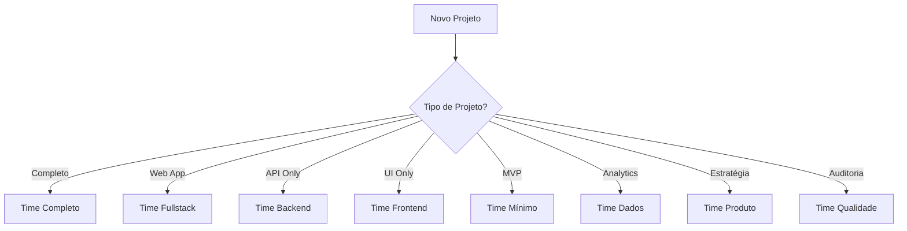

# 👥 Times PRISMA

## 📋 Visão Geral

O sistema PRISMA oferece composições pré-definidas de agentes para diferentes tipos de projetos e necessidades. Cada time é otimizado para cenários específicos, permitindo máxima eficiência e qualidade.

## 🌟 Times Disponíveis

### 1. **Time Completo** (`time-completo.yaml`)
- **Agentes**: Todos os 10 agentes
- **Ideal para**: Projetos complexos de grande escala
- **Capacidades**: Desenvolvimento fullstack, UX/UI, dados, gestão completa

### 2. **Time Fullstack** (`time-fullstack.yaml`)
- **Agentes**: 7 agentes (Alan, Bob, Sarah, Sally, Winston, James, Quinn)
- **Ideal para**: Aplicações web completas
- **Capacidades**: Frontend, backend, UX, arquitetura, qualidade

### 3. **Time Produto** (`time-produto.yaml`)
- **Agentes**: 6 agentes (Alan, Diogo, Sarah, Gabriel, Sally, Bob)
- **Ideal para**: Estratégia e análise de produto
- **Capacidades**: Pesquisa, métricas, roadmap, validação

### 4. **Time Backend** (`time-backend.yaml`)
- **Agentes**: 6 agentes (Alan, Bob, Winston, James, Quinn, Gabriel)
- **Ideal para**: APIs e serviços backend
- **Capacidades**: APIs, microserviços, performance, databases

### 5. **Time Frontend** (`time-frontend.yaml`)
- **Agentes**: 6 agentes (Alan, Sally, James, Quinn, Sarah, Gabriel)
- **Ideal para**: Interfaces e experiência do usuário
- **Capacidades**: UI/UX, SPAs, design systems, acessibilidade

### 6. **Time Qualidade** (`time-qualidade.yaml`)
- **Agentes**: 6 agentes (Alan, Quinn, James, Winston, Gabriel, Bob)
- **Ideal para**: Garantia de qualidade e testes
- **Capacidades**: Automação, performance, segurança, métricas

### 7. **Time Dados** (`time-dados.yaml`)
- **Agentes**: 6 agentes (Alan, Gabriel, James, Winston, Diogo, Quinn)
- **Ideal para**: Projetos de dados e ML
- **Capacidades**: Machine Learning, ETL, analytics, BI

### 8. **Time Mínimo** (`time-minimo.yaml`)
- **Agentes**: 4 agentes (Alan, Bob, James, Quinn)
- **Ideal para**: MVPs e protótipos rápidos
- **Capacidades**: Desenvolvimento essencial, deploy rápido

## 🔄 Como Usar os Times

### Ativação de Time
```yaml
# Para ativar um time específico
*ativar-time fullstack

# Para ver times disponíveis
*listar-times

# Para customizar um time
*customizar-time base=fullstack adicionar=[heloisa]
```

### Seleção de Time por Projeto



## 📊 Comparação de Times

| Time | Agentes | Velocidade | Qualidade | Custo | Melhor Para |
|------|---------|------------|-----------|-------|-------------|
| Completo | 10 | Média | Máxima | Alto | Projetos Enterprise |
| Fullstack | 7 | Alta | Alta | Médio | Apps Completos |
| Produto | 6 | Média | Alta | Médio | Estratégia |
| Backend | 6 | Alta | Alta | Médio | APIs/Serviços |
| Frontend | 6 | Alta | Alta | Médio | SPAs/PWAs |
| Qualidade | 6 | Média | Máxima | Médio | QA/Auditoria |
| Dados | 6 | Média | Alta | Alto | ML/Analytics |
| Mínimo | 4 | Máxima | Básica | Baixo | MVPs/POCs |

## 🎯 Workflows por Time

### Workflows Compartilhados
- `desenvolvimento-agil.yaml` - Processo ágil padrão
- `continuous-delivery.yaml` - CI/CD pipeline
- `code-review.yaml` - Revisão de código

### Workflows Especializados
- **Fullstack**: `spa-with-api.yaml`, `microservices-frontend.yaml`
- **Backend**: `api-gateway.yaml`, `event-sourcing.yaml`
- **Frontend**: `component-library.yaml`, `design-tokens.yaml`
- **Dados**: `feature-engineering.yaml`, `model-deployment.yaml`
- **Produto**: `user-research.yaml`, `ab-testing.yaml`

## 🚀 Criando Times Customizados

### Template de Time
```yaml
bundle:
  name: Time Custom
  icon: 🎯
  description: Descrição do time
  version: 1.0.0

agentes:
  - alan-diretor      # Sempre necessário
  - [outros-agentes]  # Conforme necessidade

capacidades:
  - [lista-de-capacidades]

workflows:
  - [workflows-suportados]

metricas:
  [kpis-esperados]

ideal_para:
  - [casos-de-uso]
```

## 📈 Métricas de Performance por Time

### Indicadores Chave
- **Velocity**: Capacidade de entrega
- **Qualidade**: Nível de defeitos
- **Cobertura**: Testes e documentação
- **Satisfação**: NPS e feedback
- **ROI**: Retorno sobre investimento

### Monitoramento
```yaml
metricas_time:
  coleta:
    - automatica: via Gabriel (Data Scientist)
    - manual: via Heloisa (RH)

  analise:
    - semanal: retrospectivas
    - mensal: relatórios
    - trimestral: OKRs
```

## 🤝 Colaboração Entre Times

### Handoffs Entre Times
- **Produto → Fullstack**: Especificações validadas
- **Fullstack → Qualidade**: Build para testes
- **Backend → Frontend**: APIs documentadas
- **Dados → Produto**: Insights e métricas

### Comunicação Cross-Team
- Stand-ups conjuntos
- Documentação compartilhada
- APIs bem definidas
- Contratos claros

---

*Times PRISMA - Composições otimizadas para cada desafio*
*Versão 1.0.0*