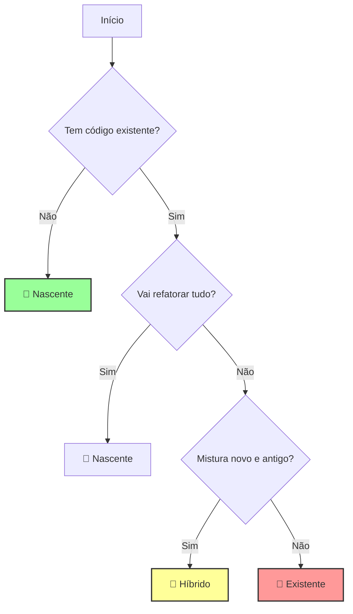
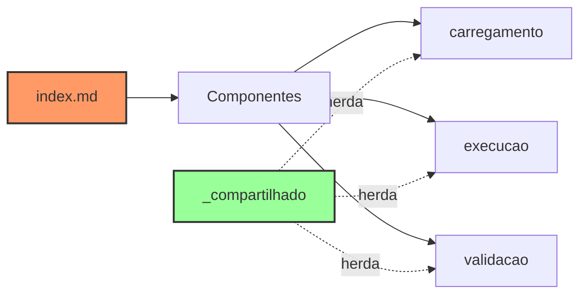

<div align="center">

```
     🌟                    ╭─────────────────────╮                    ✨
        \                  │                     │                  /
         \               ╱ │      P R I S M A    │ ╲               /
          \            ╱   │                     │   ╲            /
           \         ╱     ╰─────────────────────╯     ╲         /
            \      ╱                                     ╲      /
             \   ╱                                         ╲   /
              \ ╱                                           ╲ /
               ╱                                             ╲
              ╱                                               ╲
             ╱        🔴  🟠  🟡  🟢  🔵  🟣  🟤               ╲
            ╱                                                   ╲
           ╱             Luz branca → Espectro completo          ╲
          ╱                                                       ╲
         ╱___________________________________________________________╲
```

# 🔷 PRISMA
### **Processo Rápido de Implementação e Sistema de Metodologia Ágil**

> *"Estruturar antes de criar"*

[](https://github.com/your-repo/prisma)
[](LICENSE)
[](https://github.com/your-repo/prisma/actions)
[](https://codecov.io/gh/your-repo/prisma)

---

*Assim como um prisma decompõe a luz branca em um espectro completo de cores,*
*PRISMA decompõe projetos complexos em componentes estruturados e gerenciáveis.*

</div>

---

## 📌 O que é PRISMA?

PRISMA é um framework de desenvolvimento ágil que decompõe a complexidade dos projetos como um prisma óptico decompõe a luz branca em seu espectro completo. Assim como a luz aparentemente simples revela múltiplas frequências quando passa por um prisma, um projeto aparentemente caótico revela estruturas organizadas e gerenciáveis quando processado pelo PRISMA.

O sistema utiliza o **fabric pattern** para criar componentes reutilizáveis e manuteníveis, eliminando duplicação e garantindo consistência. Diferente de metodologias tradicionais, o PRISMA opera com um **Single Source of Truth** nativo em português brasileiro, onde cada componente existe em apenas um lugar e propaga automaticamente para onde é necessário.

## 🎯 Filosofia

Nossa filosofia central é **"Estruturar antes de criar"** - um princípio que reconhece que a excelência nasce da arquitetura, não da improvisação. Assim como um engenheiro não constrói sem calcular, desenvolvedores não deveriam codificar sem estruturar.

O PRISMA não é apenas uma ferramenta, mas um **sistema que guia você através do processo**. Com recomendações inteligentes, detecção automática de contexto e sugestões proativas, você nunca fica perdido, mesmo em projetos complexos.

---

## 🚀 Início Rápido

Comece com PRISMA em menos de 5 minutos! O sistema guiará você em cada passo.

### ⚡ 3 Passos para Começar

#### 1️⃣ Instalação (30 segundos)
```bash
# Clone ou crie a estrutura PRISMA
mkdir .prisma
cd .prisma

# Ou clone o template
git clone https://github.com/seu-repo/prisma-template .
```

#### 2️⃣ Ativação (30 segundos)
```bash
# Ative o PRISMA no seu ambiente
/prisma iniciar

# Ou use o alias em inglês
/prisma init
```

**Saída esperada:**
```
🔷 PRISMA Ativado!
💡 Sistema de Recomendações: ON
🎯 Detecção de Contexto: ON

Qual tipo de projeto você está iniciando?
1. 🌱 Nascente (projeto novo)
2. 🏢 Existente (sistema legado)
3. 🔗 Híbrido (migração gradual)

[Digite 1-3 ou deixe o PRISMA detectar automaticamente]
```

#### 3️⃣ Primeiro Comando (1 minuto)
```bash
# PRISMA detecta e recomenda
/prisma analisar

# Sistema responde:
🔍 Analisando estrutura do projeto...
✅ Detectado: Projeto Next.js com TypeScript
🎯 Workflow recomendado: Nascente
💡 Sugestão: Começar com arquitetura modular

Deseja que eu configure automaticamente? [S/n]
```

---

## 🧠 Sistema de Recomendações Inteligentes

O PRISMA nunca deixa você perdido. O sistema detecta seu contexto e oferece sugestões proativas:

### 💡 Detecção Automática

| Você diz/faz | PRISMA detecta | Ação automática |
|--------------|----------------|-----------------|
| "pronto", "feito" | Task concluída | ✅ Marca como `completed`, sugere próxima |
| "próximo", "continuar" | Progressão | ⏭️ Move para próxima task |
| "problema", "erro" | Bloqueio | 🚫 Oferece debug e alternativas |
| "não sei", hesitação | Dúvida | 💡 Ativa wizard de ajuda |
| Inatividade 30s | Possível travamento | 🎯 Oferece sugestões contextuais |

### 🎯 Recomendações Contextuais

```bash
# Exemplo: Após detectar padrão repetitivo
🚨 PADRÃO DETECTADO
Você criou 3 componentes similares manualmente.

💡 Recomendação: Usar template para acelerar
⚡ Ação rápida: Criar template agora? [S/n]
```

### 🔮 Decisões Assistidas

Quando há múltiplas opções, PRISMA ajuda a decidir:

```
🤔 DECISÃO NECESSÁRIA
Detectei que você pode seguir 3 caminhos:

1. 🚀 Caminho Rápido (2h)
   ├ Prós: Velocidade, simplicidade
   └ Contras: Menos flexível

2. 🏗️ Caminho Robusto (8h)
   ├ Prós: Escalável, completo
   └ Contras: Mais complexo

3. ⚖️ Caminho Balanceado (4h) [RECOMENDADO]
   ├ Prós: Bom custo-benefício
   └ Contras: Algumas limitações

Digite [1-3] ou 'mais' para detalhes:
```

---

## 🔄 Workflows

O PRISMA oferece três tipos de workflows, cada um otimizado para diferentes contextos:

### 🌱 Projeto Nascente
**Para desenvolvimento do zero**
- Liberdade total de arquitetura
- Templates otimizados para início rápido
- Sem amarras de código legado

```bash
/prisma workflow nascente
```

### 🏢 Projeto Existente
**Para evolução de código legado**
- Análise de impacto integrada
- Migração gradual e segura
- Respeita estruturas existentes

```bash
/prisma workflow existente
```

### 🔗 Projeto Híbrido
**Para integração novo + legado**
- Estratégias de coexistência
- Transição progressiva
- Balanceia inovação e estabilidade

```bash
/prisma workflow hibrido
```

### 📊 Como Escolher?



---

## 📁 Estrutura

```
.prisma/
├── 🎭 agentes/              # Fabric pattern de agentes
│   ├── pm/
│   │   ├── index.md         # Ponto único de entrada
│   │   └── componentes/     # Partes reutilizáveis
│   ├── dev/
│   ├── qa/
│   └── _compartilhado/      # Componentes comuns
│
├── 📋 templates/            # Templates em português
│   ├── produto/
│   ├── arquitetura/
│   └── qualidade/
│
├── 🔄 workflows/
│   ├── nascente/           # Projetos novos
│   ├── existente/          # Sistemas legados
│   └── hibrido/            # Migração gradual
│
├── 🛠️ ferramentas/
│   ├── fragmentacao/       # Divide documentos
│   ├── deteccao/          # Sistema de contexto
│   └── validacao/         # Checa integridade
│
└── 📊 config/             # Configurações
    ├── framework.md
    ├── configuracao.yaml
    └── metricas.md
```

---

## 🎯 Fabric Pattern e Single Source of Truth

### O Problema Resolvido

❌ **Antes do PRISMA:**
- Duplicação de código entre componentes
- Alterações em múltiplos lugares
- Inconsistência entre implementações
- Manutenção complexa

✅ **Com PRISMA:**
- **Single Source of Truth**: Um arquivo, uma verdade
- **Componentes Compartilhados**: Reutilização automática
- **Herança Inteligente**: Comportamentos base propagados
- **Manutenção Centralizada**: Altere uma vez, aplique em todos

### Anatomia de um Agente PRISMA



---

## 🔧 Comandos Principais

| Comando PT-BR | Descrição | Alias EN |
|---------------|-----------|----------|
| `/prisma iniciar` | Inicializa o PRISMA | `init` |
| `/prisma agente {tipo}` | Ativa agente específico | `agent` |
| `/prisma fragmentar {doc}` | Divide documento em partes | `shard` |
| `/prisma compor {template}` | Cria doc com template | `compose` |
| `/prisma analisar` | Analisa projeto atual | `analyze` |
| `/prisma recomendar` | Ativa recomendações | `recommend` |
| `/prisma pensamento-profundo` | Modo avançado com IA | `deep-think` |

### 🌐 Mapeamento Completo

Todos os comandos funcionam em português e inglês. Consulte `.prisma/docs/mapeamento-comandos.md` para lista completa.

---

## 🧠 PensamentoProfundo (Modo Avançado)

Ative o modo de análise profunda com detecção automática de contexto:

```bash
/prisma pensamento-profundo {objetivo}
# ou
/prisma pp {objetivo}
```

O sistema criará automaticamente uma hierarquia de tarefas e manterá você informado visualmente do progresso, atualizando conforme você avança.

---

## 📊 Métricas e Performance

PRISMA rastreia automaticamente:

- **Velocidade**: Tempo entre requisito e implementação
- **Qualidade**: Taxa de defeitos por fase
- **Retrabalho**: Iterações necessárias
- **Eficiência**: Código gerado vs. planejado
- **Aprendizado**: Melhoria das recomendações ao longo do tempo

---

## 🤝 Contribuindo

Adoramos contribuições! Veja como participar:

1. **Fork** o projeto
2. **Crie** sua branch (`git checkout -b feature/IncribleFeature`)
3. **Commit** suas mudanças (`git commit -m 'Add: Incredible Feature'`)
4. **Push** para a branch (`git push origin feature/IncribleFeature`)
5. **Abra** um Pull Request

### 📋 Padrões

- Código em português nos comentários
- Documentação em PT-BR
- Testes obrigatórios
- Conventional Commits

---

## 📜 Licença

Distribuído sob licença MIT. Veja `LICENSE` para mais informações.

---

## 🙏 Agradecimentos

- Inspirado no BMad Method
- Construído para a comunidade brasileira de desenvolvimento
- Otimizado para desenvolvimento assistido por IA

---

<div align="center">

**PRISMA**: Transformando complexidade em clareza, um fragmento por vez. 🔷

[Website](https://prisma.dev) | [Documentação](https://docs.prisma.dev) | [Comunidade](https://discord.gg/prisma)

</div>