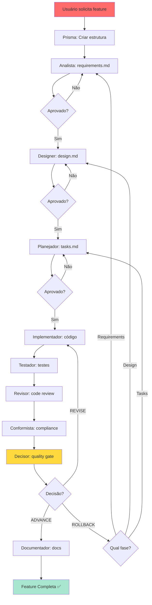

<div align="center">

```
        🌟                 ╭─────────────────────╮                 ✨
           \               ╱ │                     │ ╲               /
            \            ╱   │     P R I S M A     │   ╲            /
             \         ╱     │                     │     ╲         /
              \      ╱       ╰─────────────────────╯       ╲      /
               \   ╱                                         ╲   /
                \ ╱                                           ╲ /
                 ╱                                             ╲
                ╱           🎯 📋 🏗️ ⚡ 🧪 📚 ✅               ╲
               ╱                                                 ╲
              ╱      Sistema Modular de Agentes Especializados    ╲
             ╱            para Desenvolvimento de Software           ╲
            ╱___________________________________________________________╲
```

# 🔷 PRISMA
### **Sistema Modular de Agentes Especializados para Claude Code**

> *"Como um prisma decompõe luz em espectro completo, PRISMA decompõe desenvolvimento complexo em agentes especializados coordenados"*

[](https://github.com/your-repo/prisma)
[](LICENSE)
[](.prisma/agentes/)
[](.prisma/agentes/decisor.md)

---

*PRISMA é um framework de desenvolvimento orientado por especificações que utiliza agentes especializados para garantir qualidade incremental desde requisitos até documentação final.*

</div>

---

## 🎯 O Que É PRISMA?

**PRISMA** é um sistema modular que transforma desenvolvimento de software em um processo estruturado, rastreável e de alta qualidade através de **15 agentes especializados** coordenados pelo orquestrador **prisma**.

### 🧪 Filosofia: Qualidade Desde o Início

```yaml
abordagem_tradicional:
  especificacao: "informal ou inexistente"
  qualidade: "checagem no final"
  rastreabilidade: "manual e incompleta"
  decisoes: "ad-hoc e não documentadas"

abordagem_prisma:
  especificacao: "formal, incremental e versionada"
  qualidade: "gates incrementais integrados"
  rastreabilidade: "automática requirements → code → tests"
  decisoes: "determinísticas e documentadas"
```

---

## 🎭 Os 15 Agentes Especializados

### 🎯 **Agente Prisma** - Orquestrador Central
> *"Coordena workflow completo do conceito à documentação"*

O agente **prisma** é o maestro que orquestra todo o ciclo de vida:

1. **Inicializa workflow** para nova feature
2. **Delega** para agentes especializados conforme fase
3. **Gerencia quality gates** incrementais
4. **Coordena** transições entre fases
5. **Garante** aprovações explícitas antes de avançar

```bash
# Invocar orquestrador
/nova-especificacao
# ou
"criar especificação para {feature}"
```

---

### 📋 **Fase 1: Requirements**

#### 📝 **Analista** - Especialista em Requisitos
- Cria `requirements.md` usando formato EARS
- Define user stories e acceptance criteria
- Identifica requirements funcionais e não-funcionais
- Garante testabilidade e clareza

```yaml
output: .prisma/projeto/especificacoes/{feature}/requirements.md
formato: EARS (Easy Approach to Requirements Syntax)
aprovacao: Explícita do usuário obrigatória
```

---

### 🏗️ **Fase 2: Design**

#### 🏛️ **Designer** - Especialista em Design Técnico
- Cria `design.md` com arquitetura da solução
- Define componentes e responsabilidades
- Gera diagramas Mermaid (arquitetura, fluxo de dados)
- Documenta decisões de design

#### 🏗️ **Arquiteto** - Especialista em Arquitetura
- Documenta arquitetura técnica detalhada
- Cria ADRs (Architecture Decision Records)
- Valida escalabilidade e manutenibilidade
- Define patterns e convenções

```yaml
outputs:
  - design.md: Arquitetura da solução
  - ADRs: Decisões arquiteturais documentadas
diagramas: Mermaid (system, data flow, components)
aprovacao: Explícita após validação
```

---

### 📅 **Fase 3: Tasks**

#### 📋 **Planejador** - Especialista em Decomposição
- Cria `tasks.md` com breakdown detalhado
- Define dependências entre tarefas
- Gera diagrama de dependências (Mermaid)
- Estima complexidade e tempo

```yaml
output: tasks.md
estrutura:
  - Hierarquia de tarefas
  - Dependências explícitas
  - Critérios de aceitação por task
  - Diagrama de dependências
```

---

### ⚡ **Fase 4: Implementation**

#### 💻 **Implementador** - Especialista em Código
- Implementa código funcional seguindo tasks
- Executa **sequencialmente** (1 task por vez)
- Segue padrões e convenções do projeto
- Marca tasks como completas em `tasks.md`

```yaml
modo: SEQUENTIAL (default)
processo:
  1. Ler requirements + design + tasks
  2. Implementar task específica
  3. Marcar como completa
  4. Avançar próxima task
```

---

### 🧪 **Fase 5: Validation**

#### 🧪 **Testador** - Especialista em Testes
- Cria estratégia de testes baseada em risco
- Implementa testes unitários e integração
- Garante coverage ≥ 80%
- Valida todos acceptance criteria

#### 🧪 **Testador-Specs** - Validação 1:1
- Valida correspondência requirements ↔ testes
- Garante rastreabilidade completa
- Documenta test coverage por requirement
- Cria relatórios de validação

#### 🔍 **Revisor** - Code Review Profissional
- Analisa qualidade do código
- Identifica code smells e anti-patterns
- Valida best practices
- Pontua qualidade (score 0-10)

#### ✅ **Conformista** - Validação de Padrões
- Valida compliance com coding standards
- Verifica convenções de nomenclatura
- Checa estrutura de diretórios
- Garante consistency (≥ 90%)

```yaml
quality_gates:
  - Test Coverage: ≥ 80%
  - Code Quality Score: ≥ 8/10
  - Security Issues: 0 (critical/high)
  - Standards Compliance: ≥ 90%
```

---

### 🎯 **Fase 6: Decision**

#### ⚖️ **Decisor** - Quality Gate Orchestrator
- Toma decisões baseado em quality scores
- Retorna: **ADVANCE** | **REVISE** | **ROLLBACK**
- Documenta justificativas
- Coordena correções se necessário

```yaml
decisoes:
  ADVANCE: Todos gates passaram - avançar
  REVISE: Ajustes menores necessários
  ROLLBACK: Problemas críticos - voltar fase anterior
```

---

### 📚 **Fase 7: Documentation**

#### 📚 **Documentador** - Documentação Profissional
- Cria documentação estruturada pós-aprovação
- Gera user guides e API reference
- Documenta troubleshooting
- Publica docs/ com cross-references

```yaml
output: docs/{feature-name}/
conteudo:
  - User guides
  - API reference
  - Troubleshooting
  - ADRs (se aplicável)
```

---

### 🔧 **Agentes Auxiliares**

#### 🎯 **Elicitador** - Análise de Alinhamento
- Identifica gaps entre requisitos e arquitetura
- Detecta necessidade de elicitação profunda
- Gera prompts para brainstorming
- Valida alinhamento arquitetural

#### 💡 **Idealizador** - Facilitador de Brainstorming
- Facilita exploração estruturada de ideias
- Gera alternativas para features complexas
- Documenta opções e trade-offs
- Auxilia em decisões de design

#### 🎖️ **Juiz** - Avaliação de Candidatos
- Avalia múltiplas versões de documentos
- Seleciona melhor solução (ou combina)
- Pontua baseado em critérios objetivos
- Documenta justificativa da escolha

#### 🔍 **Auditor** - Auditoria Profunda
- Identifica micro-melhorias em specs
- Detecta macro-mudanças necessárias
- Gera relatórios detalhados de auditoria
- Propõe otimizações

#### ⚠️ **Avaliador de Riscos** - Análise de Riscos
- Analisa riscos técnicos e arquiteturais
- Avalia riscos de negócio
- Calcula probabilidade × impacto
- Propõe estratégias de mitigação

#### 🔧 **Configurador** - Setup de Projetos
- Inicializa estrutura PRISMA
- Configura padrões de qualidade
- Define workflows customizados
- Setup de ferramentas e convenções

#### 📏 **Regulador** - Enforcement de Padrões
- Valida compliance com design patterns
- Enforça coding standards
- Checa architectural patterns
- Garante consistency sistêmica

#### 🔄 **Meta** - Otimização de Specs
- Analisa e otimiza especificações
- Melhora clareza e completude
- Refina requisitos e design
- Itera até qualidade ideal

---

## 🚀 Início Rápido

### ⚡ 3 Passos para Começar

```bash
# 1. Criar nova especificação
/nova-especificacao

# 2. Descrever feature quando solicitado
"Implementar sistema de autenticação com OAuth2"

# 3. Aprovar cada fase conforme prisma orquestra
# requirements → design → tasks → implementation → validation → docs
```

### 📊 Workflow Completo



---

## 📁 Estrutura de Diretórios

```
.prisma/
├── agentes/                      # 15 agentes especializados
│   ├── prisma.md                 # Orquestrador central
│   ├── analista.md               # Requirements
│   ├── designer.md               # Design técnico
│   ├── arquiteto.md              # Arquitetura
│   ├── planejador.md             # Tasks
│   ├── implementador.md          # Código
│   ├── testador.md               # Testes
│   ├── testador-specs.md         # Validação 1:1
│   ├── revisor.md                # Code review
│   ├── conformista.md            # Compliance
│   ├── decisor.md                # Quality gates
│   ├── documentador.md           # Documentação
│   ├── elicitador.md             # Elicitação
│   ├── idealizador.md            # Brainstorming
│   ├── juiz.md                   # Avaliação
│   ├── auditor.md                # Auditoria
│   ├── avaliador-riscos.md       # Análise riscos
│   ├── configurador.md           # Setup
│   ├── regulador.md              # Enforcement
│   └── meta.md                   # Otimização
│
├── comandos/                     # Slash commands
│   ├── especificacao/
│   │   ├── nova.md               # /nova-especificacao
│   │   ├── atualizar.md          # /atualizar-especificacao
│   │   ├── validar.md            # /validar-especificacao
│   │   └── auditar.md            # /auditar-especificacao
│   ├── implementacao/
│   │   ├── paralela.md           # /implementacao-paralela
│   │   └── revisar.md            # /revisar-implementacao
│   └── testes/
│       └── executar.md           # /executar-testes
│
├── templates/                    # Templates de documentos
│   ├── requisitos.md             # Template EARS
│   ├── design.md                 # Template design
│   └── tarefas.md                # Template tasks
│
├── configuracoes/                # Configurações
│   ├── prisma.yaml               # Config workflow
│   └── language-config.yaml      # Config linguagem
│
├── projeto/                      # Especificações do projeto
│   └── especificacoes/
│       └── {feature-name}/
│           ├── requirements.md
│           ├── design.md
│           ├── tasks.md
│           ├── artifacts/
│           ├── decisions/
│           └── reports/
│
└── relatorios/                   # Relatórios gerados
    ├── auditoria/
    ├── execucao/
    ├── revisao-codigo/
    └── seguranca/
```

---

## 🎯 Comandos Disponíveis

### Especificações

```bash
/nova-especificacao              # Iniciar workflow completo
/atualizar-especificacao         # Atualizar spec existente
/validar-especificacao           # Validar spec atual
/auditar-especificacao           # Auditoria profunda
/listar-especificacoes           # Listar specs do projeto
/status-especificacao            # Status de spec específica
```

### Implementação

```bash
/implementacao-paralela          # Executar tasks em paralelo
/revisar-implementacao           # Code review completo
/executar-tarefa                 # Executar task específica
```

### Qualidade

```bash
/executar-testes                 # Executar suite de testes
/analisar-riscos                 # Análise de riscos
/decidir                         # Executar quality gate
```

### Organização

```bash
/organizar-documentacao          # Organizar docs/
/organizar-relatorios            # Organizar relatórios
```

---

## 🎓 Conceitos-Chave

### Quality Gates Incrementais

PRISMA aplica validação de qualidade **em cada fase**, não apenas no final:

```yaml
Gate 1: Requirements Review
  - requirements.md aprovado
  - Formato EARS validado
  - Testabilidade confirmada

Gate 2: Design Review
  - design.md aprovado
  - Arquitetura validada
  - Componentes bem definidos

Gate 3: Tasks Review
  - tasks.md aprovado
  - Breakdown validado
  - Dependências corretas

Gate 4: Implementation Review
  - Código implementado
  - Tasks marcadas completas
  - Padrões seguidos

Gate 5: Validation Complete
  - Testes passando (≥ 80% coverage)
  - Code review ≥ 8/10
  - Compliance ≥ 90%
  - Security issues = 0

Gate 6: Documentation Complete
  - Docs criados e publicados
  - Cross-references corretos
```

### Rastreabilidade Automática

```
Requirements → Design → Tasks → Code → Tests → Docs
     ↓            ↓        ↓       ↓       ↓       ↓
   EARS      Arquitetura  Breakdown  Impl  Coverage  API
```

### Aprovações Explícitas

O workflow **não avança** automaticamente. Cada fase requer aprovação explícita:

```
Prisma: "Requisitos prontos. Aprovar? (sim/não)"
User: "sim"
Prisma: [Avança para design]
```

---

## 🔧 Configuração

### Arquivo .prisma/configuracoes/prisma.yaml

```yaml
workflow:
  auto_advance: false           # Não avançar sem aprovação
  parallel_default: 1           # Número padrão de agentes
  quality_gates_enabled: true   # Gates habilitados

agents:
  analista:
    enabled: true
    max_parallel: 128
  designer:
    enabled: true
    max_parallel: 128
  implementador:
    mode: SEQUENTIAL            # SEQUENTIAL | PARALLEL | AUTO

quality:
  test_coverage_min: 80
  code_quality_min: 8
  security_issues_max: 0
  compliance_min: 90
```

---

## 📊 Métricas de Qualidade

PRISMA rastreia métricas em tempo real:

```yaml
especificacoes:
  - completude: % requirements implementados
  - rastreabilidade: % requirements → testes
  - aprovacoes: % specs aprovadas primeira vez

implementacao:
  - coverage: % código coberto por testes
  - quality_score: 0-10 (code review)
  - compliance: % aderência a padrões
  - security: # issues críticos

workflow:
  - cycle_time: tempo médio por fase
  - rework_rate: % specs que voltam
  - gate_pass_rate: % gates passados primeira vez
```

---

## 🚀 Casos de Uso

### 1. Nova Feature Simples

```bash
User: /nova-especificacao
Prisma: Descreva a feature
User: Adicionar botão de logout no header
Prisma: [Workflow automático com 1 agente por fase]
```

### 2. Feature Complexa (Múltiplas Perspectivas)

```bash
User: /nova-especificacao
Prisma: Descreva a feature
User: Sistema completo de pagamentos com múltiplos gateways
Prisma: Quantos agentes analistas? (recomendado: 3-5 para complexo)
User: 5
Prisma: [Invoca 5 analistas em paralelo]
Prisma: [Juiz seleciona melhor versão]
Prisma: [Continua workflow com design, tasks, etc.]
```

### 3. Implementação Paralela

```bash
User: /implementacao-paralela
Prisma: Quais tasks executar em paralelo?
User: tasks 2.1, 2.2, 2.3 (são independentes)
Prisma: [Invoca 3 implementadores]
Prisma: [Aguarda todos completarem]
Prisma: [Prossegue para validation]
```

---

## 🤝 Contribuindo

PRISMA é **open source** e **community-driven**:

1. **Fork** o repositório
2. **Clone**: `git clone https://github.com/your-repo/prisma`
3. **Branch**: `git checkout -b feature/nova-feature`
4. **Desenvolva** seguindo workflow PRISMA
5. **Quality Gates**: Garanta que todos passem
6. **Commit**: `git commit -m 'feat: adicionar nova feature'`
7. **Push**: `git push origin feature/nova-feature`
8. **Pull Request**: Abra PR com descrição detalhada

### Guidelines

- ✅ Português (pt-BR) para código e documentação
- ✅ Seguir workflow PRISMA completo
- ✅ Quality gates obrigatórios
- ✅ Testes unitários + integração
- ✅ Documentação atualizada

---

## 📜 Licença

Distribuído sob **MIT License**. Veja [LICENSE](LICENSE) para detalhes.

---

## 🙏 Agradecimentos

- **Anthropic Claude**: IA que torna tudo possível
- **Claude Code**: Infraestrutura para agentes especializados
- **Comunidade Open Source**: Inspiração constante
- **Metodologias Ágeis**: Fundamentos de qualidade iterativa

---

<div align="center">

## 🎯 Pronto para Desenvolvimento de Qualidade?

**PRISMA**: Onde 15 agentes especializados garantem qualidade desde requisitos até documentação.

### Comece Agora

```bash
/nova-especificacao
# Bem-vindo ao futuro do desenvolvimento estruturado
```

---

**🔷 PRISMA v4.0.0** | [📚 Docs](.prisma/) | [🤝 Contribuir](#-contribuindo) | [📜 Licença](#-licença)

*"Como um prisma decompõe luz em espectro completo, PRISMA decompõe desenvolvimento complexo em agentes especializados coordenados"*

</div>
