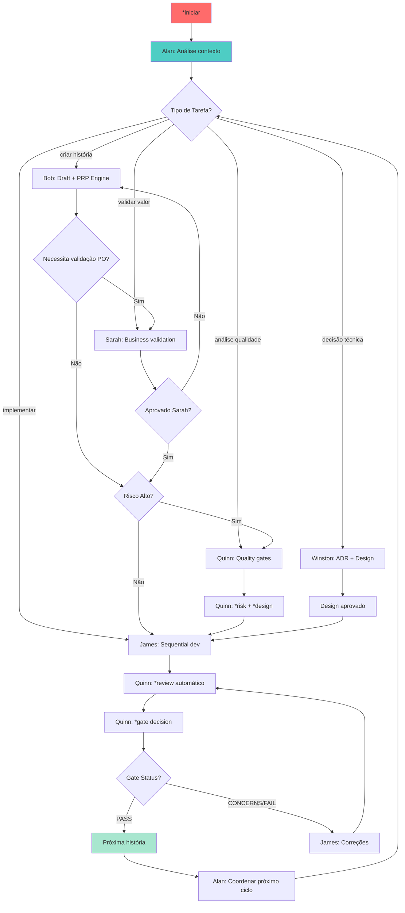

<div align="center">

```
        🌟                 ╭─────────────────────╮                 ✨
           \               ╱ │                     │ ╲               /
            \            ╱   │     P R I S M A     │   ╲            /
             \         ╱     │                     │     ╲         /
              \      ╱       ╰─────────────────────╯       ╲      /
               \   ╱                                         ╲   /
                \ ╱                                           ╲ /
                 ╱                                             ╲
                ╱           🎬 🔴 🟠 🟡 🟢 🔵 🟣               ╲
               ╱                                                 ╲
              ╱      Sistema de Subagents Especializados         ╲
             ╱            com Continuous Activation                ╲
            ╱___________________________________________________________╲
```

# 🔷 PRISMA
### **Sistema de Subagents Especializados para Claude Code CLI**

> *"Cinco especialistas sempre ativos, uma orquestração perfeita"*

[](https://github.com/your-repo/prisma)
[](LICENSE)
[](docs/architecture.md)
[](docs/qa/README.md)

---

*Como um prisma decompõe luz em espectro completo, PRISMA decompõe desenvolvimento complexo em 5 subagents especializados sempre ativos, coordenados por Alan (Diretor) com quality gates integrados.*

</div>

---

## 🎯 **ULTRATHINK**: O Que É PRISMA?

**PRISMA não é uma ferramenta - é um ecosistema vivo.**

Imagine ter uma equipe de 5 especialistas elite trabalhando 24/7 no seu projeto, cada um com expertise específica, mas coordenados por um diretor genial que nunca perde o contexto. Agora imagine que essa equipe:

- 🧠 **Nunca esquece** - continuous activation preserva contexto entre sessões
- 🔄 **Handoffs perfeitos** - transições automáticas entre especialistas sem perda
- 📋 **Documentação viva** - cada decisão vira código da arquitetura
- ⚡ **Quality gates** - qualidade não é checagem, é construção integrada
- 🎭 **Adaptação total** - cada projeto é único, PRISMA se molda

### 🧪 **A Revolução: Continuous Activation**

```yaml
tradicional:
  ativacao: "pontual, por demanda"
  contexto: "perdido entre chamadas"
  coordenacao: "manual e sujeita a erro"
  qualidade: "separada do desenvolvimento"

prisma:
  ativacao: "continuous, sempre ativos"
  contexto: "preservado automaticamente"
  coordenacao: "alan orquestra inteligentemente"
  qualidade: "quinn integra gates nativamente"
```

---

## 🎭 **Os 5 Subagents Especializados**

### 🎬 **Alan - O Diretor** (`*diretor`)
> *"O maestro que nunca sai de cena"*

- **Orquestra** todos os subagents com delegação inteligente
- **Analisa** contexto e direciona tarefas automaticamente
- **Coordena** workflows sem intervenção manual
- **Mantém** visão holística 360° do projeto

```bash
*iniciar                    # Ativa PRISMA e dashboard
*fazer [tarefa]             # Delega automaticamente
*progresso                  # Status completo do sistema
```

### 📋 **Bob - O Scrum Master** (`*bob`)
> *"Histórias que se implementam sozinhas"*

- **PRP Engine**: Product Requirements Prompts executáveis
- **Story Creation**: Épicos → histórias → tasks sequenciais
- **Context Discovery**: Detecta framework, padrões, convenções automaticamente
- **Executable Stories**: Histórias que James implementa diretamente

```bash
*criar-historia [épico]     # PRP Engine full cycle
*quebrar-epic [épico]       # Decomposição inteligente
*validar-historia [id]      # Validação estrutural
```

### ✅ **Sarah - A Product Owner** (`*sarah`)
> *"Valor de negócio em cada linha"*

- **Business Validation**: Cada feature alinhada com objetivos
- **Requirements Refinement**: Critérios de aceitação claros
- **Value Prioritization**: Backlog baseado em impacto real
- **Stakeholder Alignment**: Comunicação efetiva automática

```bash
*validar-historia [id]      # Validação de valor
*refinar-requisitos [id]    # Refinamento de critérios
*priorizar-backlog          # Priorização inteligente
```

### 💻 **James - O Developer** (`*james`)
> *"Uma tarefa por vez, perfeição sempre"*

- **Sequential Implementation**: Foco total, uma task por vez
- **Quality Pre-integration**: Código limpo desde o início
- **Context Awareness**: Entende padrões e convenções do projeto
- **Executable Handoffs**: Implementa diretamente as histórias do Bob

```bash
*implementar-historia [id]  # Implementação sequencial
*executar-tarefa [task]     # Execução focada
*debug-problema [issue]     # Resolução inteligente
```

### 🧪 **Quinn - O Test Architect** (`*quinn`)
> *"Quality gates que realmente funcionam"*

- **Risk-based Testing**: Foco em probabilidade × impacto
- **Deterministic Gates**: PASS/CONCERNS/FAIL/WAIVED com critérios claros
- **Requirements Traceability**: Mapping automático requirements → tests
- **NFR Validation**: Non-functional requirements sistematicamente validados

```bash
*risk [história]            # Análise probabilidade × impacto
*design [história]          # Estratégia de testes
*trace [história]           # Rastreabilidade completa
*nfr [história]             # Validação NFRs
*review [história]          # Review completo
*gate [história]            # Decisão determinística
```

### 🏗️ **Winston - O Architect** (`*winston`)
> *"Decisões técnicas que perduram"*

- **System Design**: Arquiteturas pragmáticas e escaláveis
- **ADRs**: Architecture Decision Records documentados
- **Technology Assessment**: Avaliações técnicas fundamentadas
- **Pragmatic Approach**: Soluções práticas, não ivory tower

```bash
*analisar-sistema [comp]    # Análise arquitetural
*criar-adr [decisão]        # Architecture Decision Record
*avaliar-tecnologia [tech]  # Assessment fundamentado
```

---

## 🚀 **Início Ultrarrápido**

### ⚡ **30 Segundos para Estar Rodando**

```bash
# 1. Ative o Alan (Diretor)
*iniciar

# 2. Deixe o PRISMA analisar seu projeto
# (Alan detecta automaticamente: linguagens, frameworks, padrões)

# 3. Comece a trabalhar
*fazer "implementar sistema de autenticação"
# Alan analisa → delega para Bob → Sarah valida → James implementa → Quinn gate
```

**Output esperado:**
```
🎬 ALAN DIRETOR PRISMA ATIVADO

📊 Análise automática do projeto:
✅ Framework: Next.js 14
✅ Auth: NextAuth.js detectado
✅ DB: PostgreSQL via Prisma
✅ UI: Tailwind + Shadcn/UI

🎯 Delegação inteligente:
   Bob → Draft história com contexto detectado
   Sarah → Validação de valor automática
   James → Implementação sequencial
   Quinn → Quality gates integrados

Como posso ajudar?
```

---

## 🔄 **Core Development Cycle**



---

## 🧠 **Sistema de Quality Gates (Quinn)**

### **4 Decisões Determinísticas**

```yaml
PASS:
  - todos_testes_passando: true
  - cobertura_minima: ">= 80%"
  - sem_riscos_altos: true
  - nfrs_atendidos: true
  - rastreabilidade_completa: true

CONCERNS:
  - riscos_medios: "6 <= risco < 9"
  - cobertura_baixa: "60% <= cobertura < 80%"
  - debt_tecnico: "acumulado mas controlado"

FAIL:
  - riscos_criticos: "risco >= 9"
  - testes_falhando: "> 10%"
  - nfrs_criticos_nao_atendidos: true

WAIVED:
  - justificativa_documentada: true
  - aprovacao_stakeholder: true
  - plano_mitigacao: defined
```

### **Risk Analysis Matrix**

```
Probabilidade × Impacto = Score de Risco

     │  1   │  2   │  3   │
─────┼──────┼──────┼──────┤
  3  │  3   │  6   │  9   │ ← FAIL
─────┼──────┼──────┼──────┤
  2  │  2   │  4   │  6   │ ← CONCERNS
─────┼──────┼──────┼──────┤
  1  │  1   │  2   │  3   │ ← PASS
─────┼──────┼──────┼──────┤
     │ Baixo│ Médio│ Alto │
        Impacto
```

---

## 🏗️ **Fabric Pattern & Zero Duplication**

### **Shared Components Architecture**

```
.prisma/agentes/
├── alan-diretor/               # Orquestrador
├── bob-scrum-master/           # Story creation + PRP Engine
├── sarah-product-owner/        # Business validation
├── james-developer/            # Sequential implementation
├── quinn-test-architect/       # Quality gates
├── winston-architect/          # Technical decisions
└── _compartilhado/             # ZERO DUPLICATION
    ├── componentes/
    │   └── hierarquia.md       # Estrutura organizacional
    ├── configuracao/
    │   ├── prisma-config.yaml  # Config central
    │   ├── agent-registry.yaml # Registry completo
    │   └── fabric-registry.yaml# Fabric management
    └── comportamentos-base.md  # Inherited behaviors
```

**Single Source of Truth garantido:**
- ✅ Cada informação existe em 1 lugar apenas
- ✅ Mudanças propagam automaticamente
- ✅ Inconsistências impossíveis por design
- ✅ Manutenção centralizada

---

## 📊 **Comandos Principais**

### **🎬 Alan (Diretor) - Orquestração**
```bash
*iniciar                    # Ativa PRISMA + dashboard
*fazer [tarefa]             # Delega automaticamente
*agente [tipo] [comando]    # Delegação específica
*progresso                  # Status todas as tarefas
*metricas                   # Dashboard de métricas
*workflow [tipo]            # Executa workflow coordenado
```

### **📋 Bob (Scrum Master) - Stories**
```bash
*criar-historia [épico]     # PRP Engine completo
*quebrar-epic [épico]       # Decomposição inteligente
*validar-historia [id]      # Validação estrutural
*preparar-sprint            # Planning sprint
```

### **✅ Sarah (Product Owner) - Business**
```bash
*validar-historia [id]      # Validação valor negócio
*refinar-requisitos [id]    # Refinement critérios
*priorizar-backlog          # Priorização baseada valor
```

### **💻 James (Developer) - Implementation**
```bash
*implementar-historia [id]  # Implementação sequencial
*executar-tarefa [task]     # Execução tarefa específica
*debug-problema [issue]     # Resolução inteligente
```

### **🧪 Quinn (Test Architect) - Quality Gates**
```bash
*risk [história]            # Análise probabilidade × impacto
*design [história]          # Estratégia testes
*trace [história]           # Rastreabilidade requirements → tests
*nfr [história]             # Validação Non-Functional Requirements
*review [história]          # Review qualidade completo
*gate [história]            # Decisão PASS/CONCERNS/FAIL/WAIVED
```

### **🏗️ Winston (Architect) - Technical Decisions**
```bash
*analisar-sistema [comp]    # Análise arquitetural completa
*criar-adr [decisão]        # Architecture Decision Record
*avaliar-tecnologia [tech]  # Assessment técnico fundamentado
```

---

## 🎯 **Documentação como Código**

### **Stories Executáveis (Bob + PRP Engine)**
```markdown
# PRP-HISTÓRIA: AUTH.001 - Sistema de Login

## Contexto Descoberto (Auto-detection)
- Framework: Next.js 14
- Auth: NextAuth.js detectado
- DB: PostgreSQL via Prisma
- UI: Tailwind + Shadcn/UI

## Persona & Valor
**Como** usuário da aplicação,
**Eu quero** fazer login de forma segura,
**Para que** possa acessar funcionalidades protegidas

## Prompt de Execução (Para James)
"Como James, implemente sistema de login usando NextAuth.js
com PostgreSQL, seguindo padrões Tailwind + Shadcn/UI do projeto,
garantindo autenticação segura e UX fluida."
```

### **Quality Gates Documentation (Quinn)**
```yaml
# docs/qa/assessments/AUTH.001-risk-20250123.md
risk_assessment:
  historia: "AUTH.001 - Sistema de Login"
  riscos_identificados:
    - autenticacao_insegura:
        probabilidade: 2
        impacto: 3
        score: 6  # CONCERNS
    - session_management:
        probabilidade: 1
        impacto: 2
        score: 2  # PASS

gate_decision: "CONCERNS"
justificativa: "Risco médio em auth requer atenção especial"
acoes_mitigacao:
  - implementar_2fa
  - audit_logs_detalhados
  - rate_limiting_robusto
```

### **Architecture Decision Records (Winston)**
```markdown
# ADR-001: Escolha do NextAuth.js

## Status
ACCEPTED

## Contexto
Sistema precisa de autenticação robusta com múltiplos providers

## Decisão
Usar NextAuth.js v4 com database sessions

## Consequências
✅ Integração nativa com Next.js
✅ Múltiplos providers suportados
✅ Security best practices built-in
⚠️ Dependência externa adicional
⚠️ Learning curve para configurações avançadas
```

---

## 🚀 **Vantagens Revolucionárias**

### **🔄 Continuous Activation vs Traditional**

| Aspecto | PRISMA Continuous | Tradicional |
|---------|------------------|-------------|
| **Ativação** | Sempre ativos | Por demanda |
| **Contexto** | Preservado sempre | Perdido entre calls |
| **Especialização** | 5 experts dedicados | 1 agente genérico |
| **Qualidade** | Gates integrados | QA separado |
| **Coordenação** | Alan automático | Manual/error-prone |
| **Memória** | Documentação persistente | Session-based |
| **Handoffs** | Automáticos fluidos | Manuais com perda |
| **Aprendizado** | Acumulativo | Reset a cada sessão |

### **⚡ Métricas de Performance**

```yaml
targets_operacionais:
  alan_director:
    - delegacao_automatica: "> 90%"
    - tempo_analise: "< 30s"
    - acuracia_delegacao: "> 95%"
    - handoffs_sucesso: "> 98%"

  quality_gates_quinn:
    - decisoes_deterministicas: "100%"
    - tempo_gate_decision: "< 5min"
    - pass_primeira_vez: "> 80%"
    - cobertura_risk_analysis: "100%"

  desenvolvimento_james:
    - implementacao_sequencial: "100%"
    - primeira_execucao_sucesso: "> 85%"
    - tempo_medio_task: "< 2h"
    - quality_pre_handoff: "> 90%"

targets_negocio:
  velocidade:
    - lead_time_epic_delivery: "< 2 semanas"
    - cycle_time_story: "< 3 dias"
    - stories_por_sprint: "tracked + trending"

  qualidade:
    - bugs_producao: "< 1 por story"
    - debt_tecnico: "< 10% tempo"
    - satisfacao_stakeholders: "> 4.5/5"
```

---

## 🔮 **Roadmap & Evolution**

### **✅ Fase Atual: Sistema Completo Implementado**
- ✅ 5 Subagents especializados com continuous activation
- ✅ Alan como diretor orquestrador inteligente
- ✅ Sistema completo de quality gates determinísticos
- ✅ PRP Engine para histórias executáveis
- ✅ Fabric pattern com `_compartilhado/` zero duplication
- ✅ Documentação como código estruturada
- ✅ Comandos `*comando` padronizados

### **🚀 Próximas Evoluções**

#### **Inteligência Adaptativa**
- [ ] Machine learning de padrões de delegação
- [ ] Predição de riscos baseada em histórico
- [ ] Auto-otimização de workflows
- [ ] Sugestões proativas contextuais

#### **Expansion Ecosystem**
- [ ] Subagents especializados por indústria
- [ ] Marketplace de especializações
- [ ] Templates workflows por domínio
- [ ] Integração CI/CD nativa

#### **Advanced Quality**
- [ ] Quality gates customizáveis por projeto
- [ ] AI-powered risk assessment
- [ ] Automated NFR validation
- [ ] Performance gates integrados

---

## 🤝 **Contribuindo**

PRISMA é **open source** e **community-driven**:

1. **Fork** o projeto
2. **Clone**: `git clone https://github.com/your-repo/prisma`
3. **Branch**: `git checkout -b feature/amazing-feature`
4. **Develop**: Siga os patterns PRISMA
5. **Test**: Todos os quality gates devem passar
6. **Commit**: `git commit -m 'feat: add amazing feature'`
7. **Push**: `git push origin feature/amazing-feature`
8. **PR**: Abra um Pull Request

### **📋 Contribution Guidelines**
- Código e documentação em português
- Quality gates obrigatórios (Quinn validação)
- Testes unitários + integração
- Continuous activation compatibility
- Fabric pattern compliance

---

## 📜 **Licença**

Distribuído sob **MIT License**. Veja `LICENSE` para detalhes completos.

---

## 🙏 **Agradecimentos & Inspiration**

- **Claude Code CLI**: Infraestrutura que torna tudo possível
- **Comunidade Brasil**: Feedback e inspiration constantes
- **Agile/Scrum Community**: Metodologias que funcionam
- **DevOps Culture**: Integration e automation mindset
- **Open Source Movement**: Standing on shoulders of giants

---

<div align="center">

## 🎬 **Ready to Transform Your Development?**

**PRISMA**: Onde 5 especialistas elite trabalham 24/7 no seu projeto com quality gates integrados e zero perda de contexto.

### **Start Your Journey**

```bash
*iniciar
# Welcome to the future of development
```

---

**🔷 PRISMA v3.0.0** | **🏗️ Architecture** | **📚 Docs** | **💬 Community** | **🚀 Roadmap**

*"Cinco especialistas, uma orquestração perfeita, qualidade integrada."*

</div>