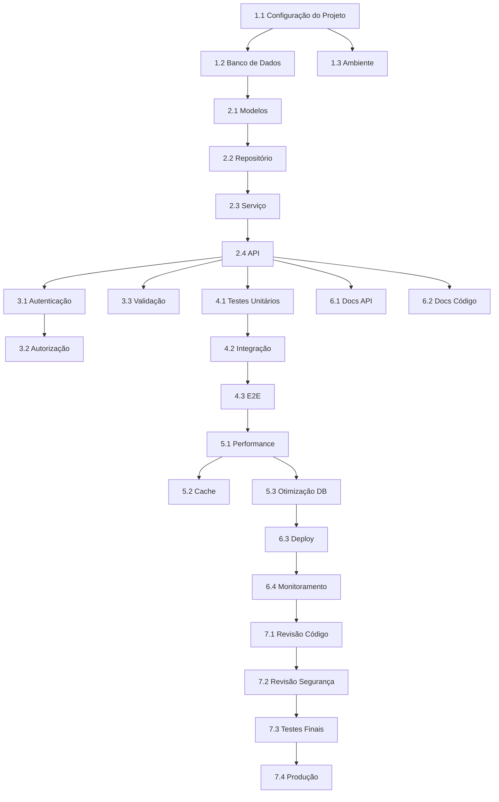

# Tarefas de Implementação - {NOME_FUNCIONALIDADE}

> **Contexto do Prisma**: Este arquivo de tarefas faz parte do Sistema Prisma de desenvolvimento orientado a especificações. Para entender o contexto completo da migração e convenções do projeto, leia `.prisma/tarefas.md`.

## Metadados

- **Nome da Funcionalidade**: {NOME_FUNCIONALIDADE}
- **Criado em**: {DATA}
- **Última Atualização**: {DATA}
- **Status**: Não Iniciado
- **Localização**: `.prisma/especificacoes/{nome-funcionalidade}/tarefas.md`
- **Baseado nos Documentos**:
  - **Requisitos**: requisitos.md v{VERSAO}
  - **Design**: design.md v{VERSAO}
- **Agentes Envolvidos**: {implementador, testador, revisor, etc.}

## Visão Geral das Tarefas

### Resumo

<!-- Breve resumo das tarefas a serem executadas -->

### Total de Tarefas: {X}

### Tempo Estimado: {Y} horas

### Prioridade: Alta | Média | Baixa

## Fase 1: Configuração e Infraestrutura

### 1.1 Configuração do Projeto

- [ ] **Tarefa**: Configurar estrutura do projeto
  - **Tempo Estimado**: 1h
  - **Dependências**: Nenhuma
  - **Responsável**: A definir
  - **Descrição**: Criar diretórios necessários e arquivos base
  - **Critérios de Aceitação**:
    - [ ] Estrutura de diretórios corresponde ao design
    - [ ] Arquivos de configuração criados
    - [ ] Dependências instaladas

### 1.2 Configuração do Banco de Dados

- [ ] **Tarefa**: Criar schema do banco de dados
  - **Tempo Estimado**: 2h
  - **Dependências**: 1.1
  - **Responsável**: A definir
  - **Descrição**: Implementar migrations do banco de dados
  - **Critérios de Aceitação**:
    - [ ] Scripts de migration criados
    - [ ] Schema corresponde ao documento de design
    - [ ] Índices criados
    - [ ] Restrições aplicadas

### 1.3 Configuração de Ambiente

- [ ] **Tarefa**: Configurar variáveis de ambiente
  - **Tempo Estimado**: 0.5h
  - **Dependências**: 1.1
  - **Responsável**: A definir
  - **Descrição**: Configurar arquivos .env e configurações específicas de ambiente
  - **Critérios de Aceitação**:
    - [ ] .env.example criado
    - [ ] Todas as variáveis necessárias documentadas
    - [ ] Validação adicionada

## Fase 2: Implementação Principal

### 2.1 Modelos de Dados

- [ ] **Tarefa**: Implementar modelos de dados
  - **Tempo Estimado**: 3h
  - **Dependências**: 1.2
  - **Responsável**: A definir
  - **Descrição**: Criar modelos correspondentes ao schema do banco de dados
  - **Critérios de Aceitação**:
    - [ ] Todos os modelos criados
    - [ ] Regras de validação implementadas
    - [ ] Relacionamentos definidos
    - [ ] Testes unitários passando

### 2.2 Camada de Repositório

- [ ] **Tarefa**: Implementar padrão de repositório
  - **Tempo Estimado**: 4h
  - **Dependências**: 2.1
  - **Responsável**: A definir
  - **Descrição**: Criar repositórios para acesso aos dados
  - **Critérios de Aceitação**:
    - [ ] Operações CRUD implementadas
    - [ ] Métodos de consulta criados
    - [ ] Tratamento de erros adicionado
    - [ ] Testes unitários passando

### 2.3 Camada de Serviço

- [ ] **Tarefa**: Implementar lógica de negócio
  - **Tempo Estimado**: 6h
  - **Dependências**: 2.2
  - **Responsável**: A definir
  - **Descrição**: Criar camada de serviço com regras de negócio
  - **Critérios de Aceitação**:
    - [ ] Todas as regras de negócio implementadas
    - [ ] Lógica de validação adicionada
    - [ ] Tratamento de erros completo
    - [ ] Testes unitários passando (>80% cobertura)

### 2.4 Endpoints da API

- [ ] **Tarefa**: Implementar camada de API
  - **Tempo Estimado**: 5h
  - **Dependências**: 2.3
  - **Responsável**: A definir
  - **Descrição**: Criar endpoints REST da API
  - **Critérios de Aceitação**:
    - [ ] Todos os endpoints implementados
    - [ ] Validação de requisições adicionada
    - [ ] Formatação de respostas correta
    - [ ] Documentação da API atualizada

## Fase 3: Segurança e Validação

### 3.1 Autenticação

- [ ] **Tarefa**: Implementar autenticação
  - **Tempo Estimado**: 3h
  - **Dependências**: 2.4
  - **Responsável**: A definir
  - **Descrição**: Adicionar middleware de autenticação
  - **Critérios de Aceitação**:
    - [ ] Autenticação JWT/Session funcionando
    - [ ] Validação de token implementada
    - [ ] Lógica de refresh token adicionada
    - [ ] Testes de segurança passando

### 3.2 Autorização

- [ ] **Tarefa**: Implementar autorização
  - **Tempo Estimado**: 3h
  - **Dependências**: 3.1
  - **Responsável**: A definir
  - **Descrição**: Adicionar controle de acesso baseado em papéis
  - **Critérios de Aceitação**:
    - [ ] Verificações de permissão implementadas
    - [ ] Validação de papéis funcionando
    - [ ] Acesso não autorizado prevenido
    - [ ] Testes de autorização passando

### 3.3 Validação de Entrada

- [ ] **Tarefa**: Implementar validação abrangente
  - **Tempo Estimado**: 2h
  - **Dependências**: 2.4
  - **Responsável**: A definir
  - **Descrição**: Adicionar validação e sanitização de entrada
  - **Critérios de Aceitação**:
    - [ ] Todas as entradas validadas
    - [ ] Prevenção de XSS implementada
    - [ ] Prevenção de SQL injection verificada
    - [ ] Testes de validação passando

## Fase 4: Testes

### 4.1 Testes Unitários

- [ ] **Tarefa**: Escrever testes unitários
  - **Tempo Estimado**: 4h
  - **Dependências**: Fase 2 completa
  - **Responsável**: A definir
  - **Descrição**: Criar suite abrangente de testes unitários
  - **Critérios de Aceitação**:
    - [ ] Todos os componentes testados
    - [ ] Cobertura > 80%
    - [ ] Casos extremos cobertos
    - [ ] Todos os testes passando

### 4.2 Testes de Integração

- [ ] **Tarefa**: Escrever testes de integração
  - **Tempo Estimado**: 4h
  - **Dependências**: 4.1
  - **Responsável**: A definir
  - **Descrição**: Testar interações entre componentes
  - **Critérios de Aceitação**:
    - [ ] Testes de integração da API escritos
    - [ ] Testes de integração do banco de dados escritos
    - [ ] Cenários de erro testados
    - [ ] Todos os testes passando

### 4.3 Testes E2E

- [ ] **Tarefa**: Escrever testes end-to-end
  - **Tempo Estimado**: 3h
  - **Dependências**: 4.2
  - **Responsável**: A definir
  - **Descrição**: Testar fluxos completos do usuário
  - **Critérios de Aceitação**:
    - [ ] Caminhos críticos testados
    - [ ] Fluxos de usuário verificados
    - [ ] Tratamento de erros testado
    - [ ] Todos os testes passando

## Fase 5: Performance e Otimização

### 5.1 Testes de Performance

- [ ] **Tarefa**: Conduzir testes de performance
  - **Tempo Estimado**: 2h
  - **Dependências**: Fase 4 completa
  - **Responsável**: A definir
  - **Descrição**: Medir e otimizar performance
  - **Critérios de Aceitação**:
    - [ ] Testes de carga completados
    - [ ] Tempos de resposta dentro do SLA
    - [ ] Gargalos identificados
    - [ ] Métricas de performance documentadas

### 5.2 Implementação de Cache

- [ ] **Tarefa**: Implementar estratégia de cache
  - **Tempo Estimado**: 3h
  - **Dependências**: 5.1
  - **Responsável**: A definir
  - **Descrição**: Adicionar cache onde apropriado
  - **Critérios de Aceitação**:
    - [ ] Camada de cache implementada
    - [ ] Invalidação de cache funcionando
    - [ ] Performance melhorada
    - [ ] Testes de cache passando

### 5.3 Otimização de Banco de Dados

- [ ] **Tarefa**: Otimizar queries do banco de dados
  - **Tempo Estimado**: 2h
  - **Dependências**: 5.1
  - **Responsável**: A definir
  - **Descrição**: Otimizar queries lentas e adicionar índices
  - **Critérios de Aceitação**:
    - [ ] Queries lentas identificadas
    - [ ] Índices otimizados
    - [ ] Performance de queries melhorada
    - [ ] Planos de execução revisados

## Fase 6: Documentação e Deploy

### 6.1 Documentação da API

- [ ] **Tarefa**: Completar documentação da API
  - **Tempo Estimado**: 2h
  - **Dependências**: Fase 2 completa
  - **Responsável**: A definir
  - **Descrição**: Documentar todos os endpoints da API
  - **Critérios de Aceitação**:
    - [ ] Documentação OpenAPI/Swagger completa
    - [ ] Exemplos fornecidos
    - [ ] Códigos de erro documentados
    - [ ] Autenticação documentada

### 6.2 Documentação do Código

- [ ] **Tarefa**: Adicionar comentários e documentação ao código
  - **Tempo Estimado**: 2h
  - **Dependências**: Fase 2 completa
  - **Responsável**: A definir
  - **Descrição**: Documentar código e arquitetura
  - **Critérios de Aceitação**:
    - [ ] Comentários JSDoc adicionados
    - [ ] Lógica complexa explicada
    - [ ] Arquitetura documentada
    - [ ] README atualizado

### 6.3 Configuração de Deploy

- [ ] **Tarefa**: Configurar pipeline de deployment
  - **Tempo Estimado**: 3h
  - **Dependências**: Fase 5 completa
  - **Responsável**: A definir
  - **Descrição**: Configurar CI/CD e deployment
  - **Critérios de Aceitação**:
    - [ ] Pipeline CI/CD configurado
    - [ ] Scripts de deployment criados
    - [ ] Configurações de ambiente definidas
    - [ ] Plano de rollback documentado

### 6.4 Configuração de Monitoramento

- [ ] **Tarefa**: Implementar monitoramento
  - **Tempo Estimado**: 2h
  - **Dependências**: 6.3
  - **Responsável**: A definir
  - **Descrição**: Adicionar logging e monitoramento
  - **Critérios de Aceitação**:
    - [ ] Logging implementado
    - [ ] Coleta de métricas configurada
    - [ ] Alertas configurados
    - [ ] Dashboards criados

## Fase 7: Revisão e Lançamento

### 7.1 Revisão de Código

- [ ] **Tarefa**: Conduzir revisão de código
  - **Tempo Estimado**: 2h
  - **Dependências**: Todas as fases completas
  - **Responsável**: A definir
  - **Descrição**: Revisar todas as mudanças de código
  - **Critérios de Aceitação**:
    - [ ] Revisão de código completada
    - [ ] Todo feedback endereçado
    - [ ] Padrões de código atendidos
    - [ ] Sem problemas críticos

### 7.2 Revisão de Segurança

- [ ] **Tarefa**: Auditoria de segurança
  - **Tempo Estimado**: 2h
  - **Dependências**: 7.1
  - **Responsável**: A definir
  - **Descrição**: Revisão de segurança e varredura de vulnerabilidades
  - **Critérios de Aceitação**:
    - [ ] Varredura de segurança completada
    - [ ] Vulnerabilidades endereçadas
    - [ ] Melhores práticas de segurança verificadas
    - [ ] Testes de penetração passando

### 7.3 Testes Finais

- [ ] **Tarefa**: Testes finais de QA
  - **Tempo Estimado**: 3h
  - **Dependências**: 7.2
  - **Responsável**: A definir
  - **Descrição**: Completar rodada final de testes
  - **Critérios de Aceitação**:
    - [ ] Todos os testes passando
    - [ ] Sem bugs críticos
    - [ ] Performance verificada
    - [ ] Aceitação do usuário completa

### 7.4 Deploy em Produção

- [ ] **Tarefa**: Deploy para produção
  - **Tempo Estimado**: 1h
  - **Dependências**: 7.3
  - **Responsável**: A definir
  - **Descrição**: Deployment em produção
  - **Critérios de Aceitação**:
    - [ ] Deploy realizado com sucesso
    - [ ] Smoke tests passando
    - [ ] Monitoramento ativo
    - [ ] Plano de rollback pronto

## Dependências entre Tarefas

## Gestão de Riscos

### Tarefas de Alto Risco

1. **Tarefa 2.3** (Camada de Serviço): Lógica de negócio complexa
   - **Mitigação**: Testes unitários rigorosos, revisão por pares
2. **Tarefa 6.3** (Deploy): Riscos de deployment em produção
   - **Mitigação**: Rollout em etapas, testes abrangentes

### Tarefas Bloqueadas

<!-- Listar quaisquer tarefas que estão atualmente bloqueadas e porquê -->

## Notas

- Tarefas podem ser executadas em paralelo onde as dependências permitirem
- Cada tarefa deve ter sua própria branch seguindo: `feature/{nome-funcionalidade}/tarefa-{numero}`
- Todos os testes devem passar antes de marcar a tarefa como completa
- Atualizar este documento conforme as tarefas forem completadas

## Status das Tarefas

Os status possíveis para cada tarefa são:

- **pendente**: Tarefa não iniciada, aguardando início
- **em_progresso**: Tarefa sendo executada atualmente
- **concluído**: Tarefa finalizada com sucesso
- **bloqueado**: Tarefa impedida de prosseguir por dependências ou problemas

## Workflow de Agentes

### Agentes Principais

- **implementador**: Responsável pela implementação do código
- **testador**: Responsável pela criação e execução de testes
- **revisor**: Responsável pela revisão de código e qualidade
- **auditor**: Responsável por auditorias de segurança e compliance
- **documentador**: Responsável pela documentação técnica

### Estrutura de Artefatos

Artefatos relacionados a esta especificação devem ser armazenados em:

- **Relatórios**: `.prisma/especificacoes/{nome-funcionalidade}/relatorios/`
- **Decisões**: `.prisma/especificacoes/{nome-funcionalidade}/decisoes/`
- **Artefatos**: `.prisma/especificacoes/{nome-funcionalidade}/artefatos/`

## Acompanhamento de Progresso

- **Total de Tarefas**: {X}
- **Concluídas**: 0
- **Em Progresso**: 0
- **Bloqueadas**: 0
- **Não Iniciadas**: {X}
- **Progresso**: 0%

---

**Última Atualização**: {DATA}
**Próxima Revisão**: {DATA}
