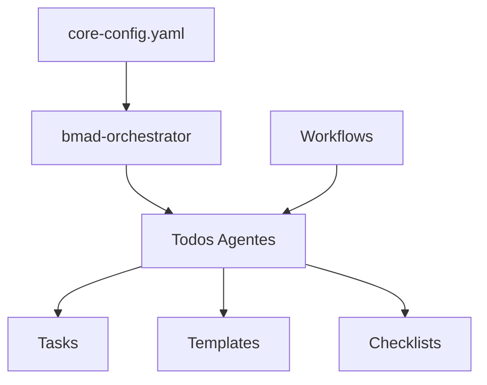
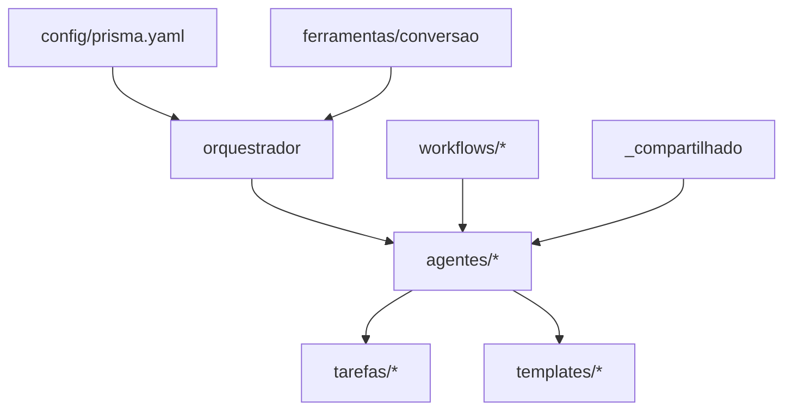

# Análise de Arquitetura Atual - BMAD & PRISMA

## 📊 Resumo Executivo
Data: 2025-09-16
Analista: Arquiteto BMAD
Status: Dois sistemas paralelos identificados necessitando unificação

## 🔍 1. Sistema BMAD (Legacy)

### Localização
`.bmad-core/`

### Estrutura Identificada
```
.bmad-core/
├── agents/                  # 9 agentes especializados
│   ├── analyst.md          # Analista de negócios
│   ├── architect.md        # Arquiteto de soluções
│   ├── bmad-master.md      # Agente mestre BMAD
│   ├── bmad-orchestrator.md # Orquestrador principal
│   ├── dev.md              # Desenvolvedor
│   ├── pm.md               # Gerente de projeto
│   ├── po.md               # Product Owner
│   ├── qa.md               # Garantia de qualidade
│   ├── sm.md               # Scrum Master
│   └── ux-expert.md        # Especialista UX
│
├── workflows/              # 6 workflows YAML
│   ├── brownfield-fullstack.yaml
│   ├── brownfield-service.yaml
│   ├── brownfield-ui.yaml
│   ├── greenfield-fullstack.yaml
│   ├── greenfield-service.yaml
│   └── greenfield-ui.yaml
│
├── templates/              # Templates em inglês
├── tasks/                  # Tarefas executáveis
├── checklists/            # Listas de verificação
├── data/                  # Base de conhecimento
└── utils/                 # Utilitários
```

### Características do BMAD
- **Idioma**: Inglês
- **Comandos**: Prefixo `*` (ex: `*agent`, `*task`)
- **Formato**: Markdown com YAML embarcado
- **Ativação**: Via comandos específicos por agente
- **Dependências**: Carregamento sob demanda

## 🔷 2. Sistema PRISMA (Novo)

### Localização
Raiz do projeto e `.prisma/`

### Estrutura Identificada
```
prisma/
├── agentes/               # Diretório criado mas vazio
│   └── meta-agente/      # Único agente parcialmente migrado
│       └── index.md
│
├── biblioteca/            # Vazio
├── contexto/             # Vazio
├── core/                 # Vazio
├── estado/               # Vazio
├── ferramentas/          # Vazio
├── integracao/           # Vazio
├── tarefas/              # Vazio
├── templates/            # Vazio
├── workflows/            # Vazio
│
├── docs/                 # Documentação inicial
│   └── (arquivos de análise sendo criados)
│
├── docs-vivos/           # Conceito de documentação dinâmica
│
├── config/               # Vazio (configuração pendente)
│
├── README.md             # Documentação PRISMA em PT-BR
└── PRISMA-QUICKSTART.md # Guia rápido com comandos
```

### Características do PRISMA
- **Idioma**: Português brasileiro nativo
- **Comandos**: Prefixo `/prisma` (ex: `/prisma agente`)
- **Filosofia**: "Estruturar antes de criar"
- **Padrão**: Fabric pattern com Single Source of Truth
- **Detecção**: Sistema inteligente de contexto

## 🔄 3. Conflitos e Duplicações

### Conflitos Identificados
1. **Namespace de Comandos**
   - BMAD: `*agent [name]`
   - PRISMA: `/prisma agente [nome]`
   - Usuários podem confundir sintaxes

2. **Estrutura de Agentes**
   - BMAD: Arquivo único por agente
   - PRISMA: Diretório por agente com componentes

3. **Idioma**
   - BMAD: Inglês completo
   - PRISMA: Português brasileiro
   - Necessita tradução consistente

### Duplicações Encontradas
- Meta-agente existe em ambos sistemas
- Conceitos de workflows similares mas incompatíveis
- Templates duplicados em estruturas diferentes

## 🔗 4. Dependências Entre Componentes

### Dependências BMAD


### Dependências PRISMA Planejadas


## 🎯 5. Pontos de Integração Necessários

### Camada de Adaptação
1. **Tradutor de Comandos**
   - Interceptar comandos BMAD (`*`)
   - Converter para PRISMA (`/prisma`)
   - Manter retrocompatibilidade

2. **Mapeamento de Agentes**
   ```yaml
   mapeamento:
     bmad-orchestrator: orquestrador
     analyst: analista
     architect: arquiteto
     dev: desenvolvedor
     pm: gerente-projeto
     po: product-owner
     qa: qualidade
     sm: scrum-master
     ux-expert: especialista-ux
   ```

3. **Conversão de Workflows**
   - greenfield-* → nascente/*
   - brownfield-* → existente/*
   - Criar novo tipo: hibrido/*

### Herança e Compartilhamento
- Implementar `_compartilhado/` para componentes comuns
- Evitar duplicação através de herança
- Single Source of Truth para cada funcionalidade

## 📋 6. Riscos e Mitigações

### Riscos Identificados
| Risco | Impacto | Probabilidade | Mitigação |
|-------|---------|---------------|-----------|
| Quebra de comandos BMAD existentes | Alto | Médio | Adaptador retrocompatível |
| Confusão durante transição | Médio | Alto | Documentação clara e mensagens de ajuda |
| Perda de funcionalidades | Alto | Baixo | Validação PO em cada fase |
| Inconsistência de tradução | Médio | Médio | Glossário único de termos |

## 🚀 7. Recomendações

### Prioridades Imediatas
1. Criar arquivo de mapeamento central
2. Implementar adaptador mínimo viável
3. Migrar orquestrador como prova de conceito
4. Validar com usuários antes de migração completa

### Estratégia de Migração
- **Fase 1**: Coexistência com adaptador
- **Fase 2**: Migração incremental de agentes
- **Fase 3**: Deprecação gradual do BMAD
- **Fase 4**: PRISMA como sistema único

## 📊 8. Métricas de Sucesso

- [ ] 100% dos comandos BMAD funcionando via adaptador
- [ ] 100% dos agentes migrados para português
- [ ] 0 funcionalidades perdidas
- [ ] Redução de 50% em duplicação de código
- [ ] Documentação 100% em português

## 📝 Conclusão

A migração BMAD → PRISMA é tecnicamente viável e trará benefícios significativos:
- Unificação de sistemas
- Interface em português nativo
- Redução de complexidade
- Manutenção simplificada

Recomenda-se proceder com a implementação em fases conforme planejado.

---
*Documento gerado por análise arquitetural em 2025-09-16*