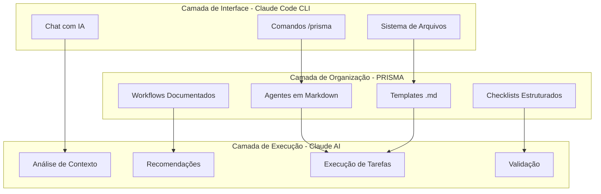
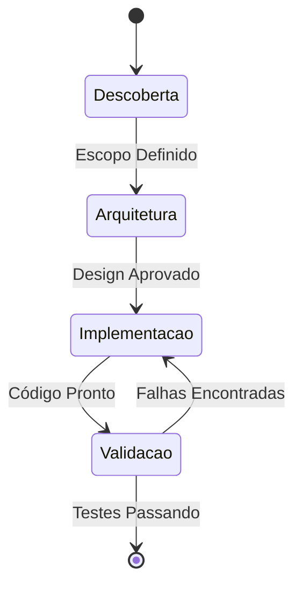

# Documento de Arquitetura - PRISMA

## 📌 Visão Geral

PRISMA é um framework metodológico para Claude Code CLI que opera 100% através de markdown e comandos de texto. Não requer programação - todas as funcionalidades são acessadas através de documentos markdown estruturados e comandos do CLI.

### Filosofia Arquitetural

- **Markdown-First**: Toda configuração e operação via arquivos .md
- **Zero Código**: Nenhuma programação necessária, apenas comandos e templates
- **Single Source of Truth**: Cada informação existe em apenas um lugar
- **Fabric Pattern**: Documentos markdown compartilhados e reutilizáveis
- **Aproveitamento do CLI**: Usa as ferramentas já disponíveis no Claude Code
- **Português Nativo**: Documentação e comandos em PT-BR como primeira língua

## 🏗️ Arquitetura Conceitual



## 🔄 Como Funciona

### 1. Estrutura de Diretórios
Tudo é organizado em pastas com arquivos markdown:

```
.prisma/
├── agentes/           # Personas e comportamentos
├── templates/         # Modelos de documentos
├── workflows/         # Fluxos de trabalho
├── checklists/        # Listas de verificação
├── fragmentos/        # Documentos divididos
└── config/           # Configurações em .md e .yaml
```

### 2. Ativação via Comando
O usuário ativa o PRISMA com comandos simples:

```bash
/prisma iniciar
/prisma agente pm
/prisma workflow nascente
/prisma checklist qualidade
```

### 3. Claude Code Interpreta
O CLI lê os arquivos markdown correspondentes e executa as instruções contidas neles.

## 🎭 Sistema de Agentes (100% Markdown)

### Como os Agentes Funcionam

Cada agente é um arquivo markdown com instruções que o Claude Code CLI interpreta:

```markdown
# Agente PM

## Ativação
Quando este arquivo é carregado, o Claude assume a persona de Product Manager.

## Comandos Disponíveis
- `criar prd`: Usa template em templates/prd.md
- `priorizar`: Aplica matriz em templates/priorizacao.md
- `roadmap`: Gera usando templates/roadmap.md

## Comportamento
- Foco em requisitos de negócio
- Linguagem clara e objetiva
- Sempre valida com stakeholders
```

### Fabric Pattern em Markdown

Componentes compartilhados entre agentes:

```
agentes/
├── _compartilhado/
│   ├── base.md          # Instruções comuns
│   ├── comandos.md      # Comandos padrão
│   └── validacoes.md    # Checklists comuns
│
├── pm/
│   └── index.md         # Importa de _compartilhado
│
├── dev/
│   └── index.md         # Importa de _compartilhado
```

## 📋 Templates e Fragmentação

### Templates Dinâmicos

Templates são arquivos markdown com placeholders:

```markdown
# PRD - [NOME_DO_PROJETO]

## Contexto
[CONTEXTO_DO_PROJETO]

## Objetivos
1. [OBJETIVO_1]
2. [OBJETIVO_2]

## Requisitos Funcionais
[LISTAR_REQUISITOS]

## Métricas de Sucesso
[DEFINIR_METRICAS]
```

### Fragmentação Automática

Documentos grandes são divididos em partes menores:

```yaml
# fragmento-config.yaml
documento: prd-completo.md
estrategia: por-secao
tamanho-maximo: 100-linhas
linkagem: bidirecional
indice: automatico
```

## 🔄 Workflows (Fluxos Documentados)

### Definição de Workflow

Workflows são sequências de passos em markdown:

```markdown
# Workflow Nascente

## Fase 1: Descoberta
- [ ] Entender o problema
- [ ] Definir escopo
- [ ] Identificar stakeholders

## Fase 2: Arquitetura
- [ ] Carregar template: arquitetura-base.md
- [ ] Preencher componentes
- [ ] Validar com checklist: arquitetura-validacao.md

## Fase 3: Implementação
- [ ] Gerar tarefas
- [ ] Acompanhar progresso
- [ ] Validar entregas
```

### Estados e Transições



## 📊 Sistema de Recomendações

### Como Funciona

O Claude Code CLI detecta padrões e sugere próximos passos baseado em:

1. **Análise de Contexto**: Lê arquivos do projeto
2. **Histórico de Comandos**: Aprende com uso anterior
3. **Templates de Padrões**: Compara com best practices
4. **Regras em Markdown**: Definidas em `config/recomendacoes.md`

### Exemplo de Regras

```markdown
# Regras de Recomendação

## Se detectar package.json
- Sugerir: workflow para projeto Node.js
- Recomendar: template de documentação JS
- Alertar: verificar dependências desatualizadas

## Se encontrar erro de tipo
- Sugerir: executar verificação de tipos
- Recomendar: adicionar tipos faltantes
- Oferecer: template de tipos comuns
```

## 🔒 Governança e Qualidade

### Checklists de Validação

Checklists garantem qualidade sem código:

```markdown
# Checklist de Qualidade

## Documentação
- [ ] README atualizado
- [ ] Comentários em decisões complexas
- [ ] Exemplos de uso incluídos

## Estrutura
- [ ] Arquivos organizados logicamente
- [ ] Nomenclatura consistente
- [ ] Sem duplicação de informação

## Processo
- [ ] PR tem descrição clara
- [ ] Testes foram executados
- [ ] Review foi solicitado
```

### Métricas via Markdown

```markdown
# Métricas do Projeto

## Velocidade
- Tasks completadas hoje: 5
- Tempo médio por task: 45min
- Bloqueios encontrados: 2

## Qualidade
- Checklists completos: 8/10
- Retrabalho necessário: 1 task
- Satisfação da equipe: 4.5/5

## Aprendizado
- Recomendações aceitas: 85%
- Padrões detectados: 12
- Melhorias sugeridas: 7
```

## 🔌 Integração com Claude Code CLI

### Comandos Nativos Aproveitados

PRISMA usa comandos já disponíveis no Claude Code:

| Comando Claude Code | Uso no PRISMA |
|-------------------|---------------|
| Leitura de arquivos | Carregar templates e agentes |
| Escrita de arquivos | Gerar documentação |
| Busca em arquivos | Análise de contexto |
| Execução de comandos | Rodar verificações |
| Chat contextual | Interação com agentes |

### Mapeamento de Comandos

```markdown
# Mapeamento PRISMA → Claude Code

## /prisma iniciar
1. Ler .prisma/config/inicial.md
2. Criar estrutura de pastas
3. Mostrar menu de opções

## /prisma agente [nome]
1. Ler .prisma/agentes/[nome]/index.md
2. Carregar componentes compartilhados
3. Aplicar persona ao chat

## /prisma template [nome]
1. Ler .prisma/templates/[nome].md
2. Solicitar preenchimento de variáveis
3. Gerar documento final
```

## 🚀 Vantagens da Abordagem Markdown-Only

### Benefícios Principais

1. **Zero Barreira de Entrada**: Não precisa saber programar
2. **Transparência Total**: Tudo é legível e editável
3. **Versionamento Simple**: Git funciona perfeitamente com .md
4. **Portabilidade**: Funciona em qualquer editor
5. **Manutenção Fácil**: Alterar texto, não código
6. **Documentação é Configuração**: Não há separação

### Comparação com Abordagens Tradicionais

| Aspecto | PRISMA | Tradicional |
|---------|---------|-------------|
| Curva de Aprendizado | Mínima | Íngreme |
| Requisitos Técnicos | Saber escrever | Saber programar |
| Debugging | Ler markdown | Debugger complexo |
| Customização | Editar .md | Modificar código |
| Dependências | Apenas Claude Code | Múltiplas libs |

## 📈 Escalabilidade

### Como Escalar com Markdown

1. **Modularização**: Dividir documentos grandes em fragmentos
2. **Herança**: Usar _compartilhado para reaproveitar
3. **Composição**: Combinar templates menores
4. **Indexação**: Criar índices automáticos
5. **Cache**: Claude Code já gerencia memória

### Limites e Soluções

| Desafio | Solução PRISMA |
|---------|---------------|
| Documentos muito grandes | Fragmentação automática |
| Muitos arquivos | Estrutura hierárquica |
| Repetição de conteúdo | Fabric pattern |
| Navegação complexa | Índices e links |
| Performance | Cache do Claude Code |

## 🔮 Evolução Futura

### Roadmap Conceitual

#### Fase 1: Fundação (Atual)
- ✅ Estrutura de diretórios
- ✅ Agentes básicos
- ✅ Templates essenciais
- ⏳ Workflows principais

#### Fase 2: Expansão
- [ ] Biblioteca de templates
- [ ] Mais tipos de agentes
- [ ] Workflows especializados
- [ ] Checklists por indústria

#### Fase 3: Inteligência
- [ ] Aprendizado de padrões
- [ ] Sugestões preditivas
- [ ] Auto-organização
- [ ] Otimização automática

#### Fase 4: Comunidade
- [ ] Marketplace de templates
- [ ] Compartilhamento de workflows
- [ ] Casos de uso documentados
- [ ] Certificação PRISMA

## 📚 Princípios de Design

### Decisões Arquiteturais

1. **Por que Markdown?**
   - Acessível a todos
   - Legível sem ferramentas
   - Versionável naturalmente
   - Editável em qualquer lugar

2. **Por que Fabric Pattern?**
   - Elimina duplicação
   - Facilita manutenção
   - Promove consistência
   - Permite evolução gradual

3. **Por que Português Nativo?**
   - Reduz barreira cognitiva
   - Aumenta precisão
   - Facilita adoção
   - Valoriza idioma local

4. **Por que Zero Código?**
   - Democratiza acesso
   - Reduz complexidade
   - Elimina bugs de código
   - Foca no processo, não na implementação

## 🎯 Casos de Uso

### Exemplos Práticos

#### Startup Iniciando Projeto
```bash
/prisma workflow nascente
# PRISMA guia desde a ideação até MVP
```

#### Empresa Migrando Sistema Legado
```bash
/prisma workflow hibrido
# PRISMA coordena migração gradual
```

#### Time Sem Desenvolvedores
```bash
/prisma agente pm
# PRISMA ajuda a estruturar requisitos
```

#### Desenvolvedor Solo
```bash
/prisma checklist full-stack
# PRISMA garante nada seja esquecido
```

---

*Documento de Arquitetura PRISMA v2.0.0*
*Framework 100% Markdown para Claude Code CLI*
*Última atualização: Janeiro 2025*