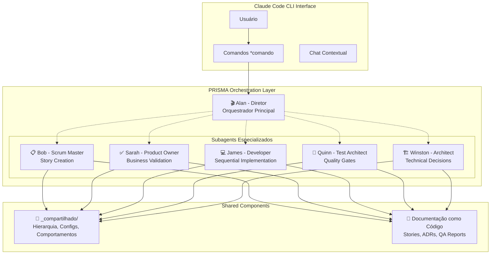
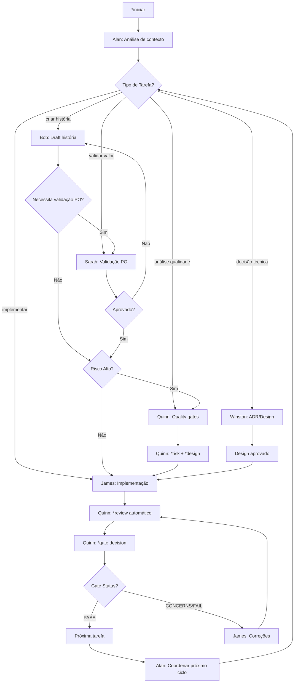
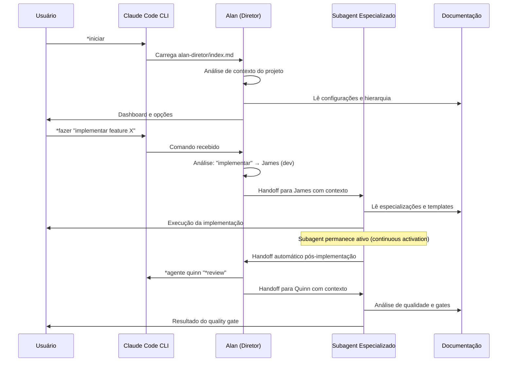

# Documento de Arquitetura - PRISMA
## Sistema de Subagents Especializados para Claude Code

## 📌 Visão Geral

PRISMA é um sistema de orquestração de subagents especializados para Claude Code CLI que opera através de arquivos markdown estruturados e comandos com sintaxe `*comando`. O sistema implementa **continuous activation** de 5 subagents especializados coordenados por Alan (Diretor), fornecendo uma experiência de desenvolvimento com qualidade integrada.

### Filosofia Arquitetural

- **Continuous Activation**: Subagents sempre ativos, nunca finalizam contexto
- **Isolated Contexts**: Cada subagent opera em contexto isolado com handoffs automáticos
- **Markdown-First**: Toda configuração e documentação via arquivos .md
- **Quality Gates**: Sistema determinístico de gates de qualidade (PASS/CONCERNS/FAIL/WAIVED)
- **Risk-based Testing**: Foco em riscos prioritários com análise probabilidade × impacto
- **Português Nativo**: Sistema desenvolvido nativamente em PT-BR
- **Zero Installation**: Aproveitamento total da infraestrutura Claude Code existente

## 🏗️ Arquitetura do Sistema PRISMA



## 🎭 Sistema de Subagents (Continuous Activation)

### Conceito Central: Continuous Activation

Diferente de sistemas tradicionais onde agentes são ativados pontualmente, o PRISMA mantém todos os 5 subagents **sempre ativos** com:

- **Contextos Isolados**: Cada subagent mantém seu próprio contexto especializado
- **Handoffs Automáticos**: Transições fluidas entre subagents sem perda de contexto
- **Memória Persistente**: Documentação markdown como sistema de memória compartilhada
- **Delegação Inteligente**: Alan analisa e direciona tarefas automaticamente

### Os 5 Subagents Especializados

#### 🎬 Alan - Diretor (Orquestrador Principal)
```yaml
papel: "Maestro da orquestração"
especialização: "Coordenação geral e delegação inteligente"
nunca_executa: "Tarefas diretas - apenas coordena e delega"
comandos_principais:
  - "*iniciar": "Ativa PRISMA e mostra dashboard"
  - "*fazer [tarefa]": "Analisa e delega automaticamente"
  - "*agente [tipo] [comando]": "Delegação específica"
  - "*progresso": "Status de todas as tarefas"
```

#### 📋 Bob - Scrum Master (prisma-sm)
```yaml
papel: "Story creation & Epic breakdown specialist"
especialização: "Criação de histórias executáveis com PRP Engine"
continuous_activation: true
comandos_especializados:
  - "*criar-historia": "Draft história completa"
  - "*quebrar-epic": "Decomposição de épicos"
  - "*validar-historia": "Validação estrutural"
  - "*preparar-sprint": "Planejamento sprint"
engine: "PRP (Product Requirements Prompts) para histórias executáveis"
```

#### ✅ Sarah - Product Owner (prisma-po)
```yaml
papel: "Business value & Requirements validation specialist"
especialização: "Validação de valor e refinamento de requisitos"
continuous_activation: true
comandos_especializados:
  - "*validar-historia": "Validação de valor de negócio"
  - "*refinar-requisitos": "Refinamento de critérios"
  - "*priorizar-backlog": "Priorização baseada em valor"
foco: "Garantir alinhamento com objetivos de negócio"
```

#### 💻 James - Developer (prisma-dev)
```yaml
papel: "Sequential implementation & Task execution specialist"
especialização: "Implementação sequencial uma tarefa por vez"
continuous_activation: true
comandos_especializados:
  - "*implementar-historia": "Implementação completa"
  - "*executar-tarefa": "Execução de tarefa específica"
  - "*debug-problema": "Resolução de problemas"
filosofia: "Uma tarefa por vez, com foco em qualidade"
```

#### 🧪 Quinn - Test Architect (prisma-qa)
```yaml
papel: "Risk analysis & Quality gates specialist"
especialização: "Sistema completo de quality gates e análise de riscos"
continuous_activation: true
comandos_especializados:
  - "*risk": "Análise de riscos (probabilidade × impacto)"
  - "*design": "Design da estratégia de testes"
  - "*trace": "Rastreabilidade requirements → tests"
  - "*nfr": "Validação Non-Functional Requirements"
  - "*review": "Review completo de qualidade"
  - "*gate": "Decisão determinística de quality gate"
decisoes: ["PASS", "CONCERNS", "FAIL", "WAIVED"]
```

#### 🏗️ Winston - Architect (prisma-arch)
```yaml
papel: "System design & Technical decisions specialist"
especialização: "Decisões técnicas e ADRs (Architecture Decision Records)"
continuous_activation: true
comandos_especializados:
  - "*analisar-sistema": "Análise arquitetural completa"
  - "*criar-adr": "Architecture Decision Record"
  - "*avaliar-tecnologia": "Assessment técnico fundamentado"
foco: "Decisões técnicas pragmáticas e bem documentadas"
```

## 🔄 Estrutura de Diretórios Real

```
.prisma/
├── agentes/
│   ├── alan-diretor/               # Orquestrador principal
│   │   ├── index.md               # Definição completa do Alan
│   │   ├── sistema-delegacao.md   # Lógica de delegação
│   │   ├── comandos.yaml          # Mapeamento de comandos
│   │   └── coordenacao-workflows.yaml
│   │
│   ├── bob-scrum-master/          # Scrum Master
│   │   ├── index.md               # Especialização completa
│   │   └── prp-engine.md          # PRP Engine integrado
│   │
│   ├── sarah-product-owner/       # Product Owner
│   │   └── index.md               # Especialização completa
│   │
│   ├── james-developer/           # Developer
│   │   └── index.md               # Especialização completa
│   │
│   ├── quinn-test-architect/      # Test Architect
│   │   └── index.md               # Especialização completa
│   │
│   ├── winston-architect/         # Architect
│   │   └── index.md               # Especialização completa
│   │
│   └── _compartilhado/            # Shared Components
│       ├── componentes/
│       │   └── hierarquia.md      # Estrutura organizacional
│       ├── configuracao/
│       │   ├── prisma-config.yaml # Configuração central
│       │   ├── agent-registry.yaml # Registry dos agentes
│       │   └── fabric-registry.yaml # Fabric pattern
│       └── comportamentos-base.md  # Comportamentos comuns
│
└── logs/                          # Event sourcing (se habilitado)
```

## 🔄 Workflows de Desenvolvimento Coordenados

### Core Development Cycle



### Quality Gates System (Quinn)

```yaml
quality_gates:
  decisoes: ["PASS", "CONCERNS", "FAIL", "WAIVED"]

  criterios_pass:
    - todos_testes_passando: true
    - cobertura_minima: ">= 80%"
    - sem_riscos_altos: true
    - nfrs_atendidos: true
    - rastreabilidade_completa: true

  criterios_fail:
    - riscos_criticos: "probabilidade × impacto >= 9"
    - testes_falhando: "> 10%"
    - nfrs_nao_atendidos: "críticos"

  criterios_concerns:
    - riscos_medios: "probabilidade × impacto >= 6"
    - cobertura_baixa: "< 60%"
    - debt_tecnico: "acumulado"

  waived:
    - justificativa_documentada: true
    - aprovacao_stakeholder: true
    - plano_mitigacao: true
```

## 📊 Sistema de Comandos PRISMA

### Sintaxe de Comandos: `*comando`

O PRISMA usa a sintaxe `*comando` para todos os comandos:

#### Comandos do Alan (Diretor)
```bash
*iniciar                    # Ativa PRISMA e mostra dashboard
*fazer [tarefa]             # Delega automaticamente baseado em análise
*agente [tipo] [comando]    # Delegação específica para subagent
*progresso                  # Status de todas as tarefas ativas
*metricas                   # Dashboard de métricas do projeto
*workflow [tipo]            # Executa workflow coordenado
```

#### Comandos Especializados dos Subagents
```bash
# Bob (Scrum Master)
*criar-historia [épico]     # Cria história com PRP Engine
*quebrar-epic [épico]       # Decomposição de épico
*validar-historia [id]      # Validação estrutural

# Sarah (Product Owner)
*validar-historia [id]      # Validação de valor de negócio
*refinar-requisitos [id]    # Refinamento de critérios
*priorizar-backlog          # Priorização baseada em valor

# James (Developer)
*implementar-historia [id]  # Implementação sequencial
*executar-tarefa [task]     # Execução de tarefa específica
*debug-problema [issue]     # Resolução de problemas

# Quinn (Test Architect) - Sistema completo de Quality Gates
*risk [história]            # Análise probabilidade × impacto
*design [história]          # Design estratégia de testes
*trace [história]           # Rastreabilidade requirements → tests
*nfr [história]             # Validação Non-Functional Requirements
*review [história]          # Review completo de qualidade
*gate [história]            # Decisão PASS/CONCERNS/FAIL/WAIVED

# Winston (Architect)
*analisar-sistema [componente]  # Análise arquitetural
*criar-adr [decisão]            # Architecture Decision Record
*avaliar-tecnologia [tech]      # Assessment técnico
```

## 🔧 Integração com Claude Code CLI

### Mapeamento de Comandos Claude Code → PRISMA

```yaml
aproveitamento_claude_code:
  ferramentas_nativas:
    Read: "Carregamento de configurações e documentação"
    Write: "Geração de documentação e relatórios"
    Edit: "Atualização de arquivos de configuração"
    MultiEdit: "Atualizações em lote"
    Bash: "Execução de comandos do sistema"
    TodoWrite: "Tracking de progresso de tarefas"
    Grep: "Busca em codebase para análise de contexto"
    Glob: "Descoberta de arquivos e padrões"

  subagent_system:
    continuous_activation: "Subagents nunca finalizam contexto"
    isolated_contexts: "Cada subagent mantém especialização"
    automatic_handoffs: "Transições automáticas coordenadas por Alan"
    persistent_memory: "Documentação markdown como memória"
```

### Fluxo de Ativação



## 🏛️ Fabric Pattern Implementation

### Shared Components (`_compartilhado/`)

```yaml
fabric_pattern:
  objetivo: "Eliminar duplicação e garantir consistência"
  implementacao:
    hierarquia.md: "Estrutura organizacional e níveis hierárquicos"
    comportamentos-base.md: "Comportamentos comuns herdados por todos"
    configuracao/:
      prisma-config.yaml: "Configuração central do sistema"
      agent-registry.yaml: "Registry completo dos subagents"
      fabric-registry.yaml: "Gestão do fabric pattern"

componentes_por_agente:
  especializacao_unica:
    - "Cada agente tem index.md com especialização completa"
    - "Comandos específicos bem definidos"
    - "Workflows de colaboração documentados"
    - "Métricas de sucesso individuais"

  heranca_compartilhada:
    - "Comportamentos base do _compartilhado/"
    - "Acesso à hierarquia organizacional"
    - "Configurações centralizadas"
    - "Padrões de comunicação"
```

## 📋 Documentação como Código

### Stories, ADRs e QA Reports

```yaml
documentacao_estruturada:
  stories:
    localizacao: "docs/stories/"
    formato: "{epic}.{story}-{title}.md"
    conteudo:
      - contexto_descoberto_automaticamente
      - persona_valor_negocio
      - requisitos_funcionais_prp
      - criterios_aceitacao_executaveis
      - tasks_sequenciais_james
      - prompt_execucao_direto

  qa_assessments:
    localizacao: "docs/qa/assessments/"
    formato: "{epic}.{story}-{type}-{YYYYMMDD}.md"
    tipos: ["risk", "design", "trace", "nfr", "review"]
    evidencias: "obrigatorias_para_gates"

  architecture_decisions:
    localizacao: "docs/architecture/"
    formato: "ADR-{numero}-{titulo}.md"
    estrutura:
      - contexto_problema
      - opcoes_consideradas
      - decisao_tomada
      - consequencias_documentadas
```

## 🚀 Vantagens da Arquitetura PRISMA

### Benefícios Únicos

```yaml
continuous_activation:
  - "Subagents sempre ativos eliminam overhead de inicialização"
  - "Handoffs automáticos preservam contexto entre especialistas"
  - "Memória persistente via documentação markdown"
  - "Coordenação inteligente pelo Alan sem intervenção manual"

quality_integrated:
  - "Quality gates determinísticos em cada história"
  - "Risk-based testing focado em prioridades"
  - "Rastreabilidade automática requirements → tests"
  - "NFRs validados sistematicamente"

zero_installation:
  - "100% markdown - nenhuma dependência externa"
  - "Aproveitamento total da infraestrutura Claude Code"
  - "Portabilidade completa entre projetos"
  - "Versionamento natural com git"

especialização_real:
  - "5 subagents com expertise bem definida"
  - "Delegação inteligente baseada em contexto"
  - "Workflows coordenados automaticamente"
  - "Aprendizado contínuo de padrões"
```

### Comparação com Outras Abordagens

| Aspecto | PRISMA | Ferramentas Tradicionais |
|---------|---------|--------------------------|
| **Ativação** | Continuous (sempre ativo) | Pontual (por demanda) |
| **Contexto** | Preservado entre handoffs | Perdido entre chamadas |
| **Especialização** | 5 subagents especializados | Agente único genérico |
| **Qualidade** | Gates integrados nativamente | QA como processo separado |
| **Coordenação** | Alan orquestra automaticamente | Coordenação manual |
| **Documentação** | Documentação É o código | Documentação separada |
| **Instalação** | Zero (apenas markdown) | Dependências múltiplas |
| **Aprendizado** | Acumulativo via documentação | Session-based apenas |

## 🔮 Roadmap e Evolução

### Fase Atual: Sistema Completo Implementado ✅

- ✅ 5 Subagents especializados com continuous activation
- ✅ Alan como diretor orquestrador
- ✅ Sistema completo de quality gates (Quinn)
- ✅ PRP Engine para histórias executáveis (Bob)
- ✅ Fabric pattern com `_compartilhado/`
- ✅ Documentação como código estruturada
- ✅ Comandos `*comando` padronizados

### Próximas Evoluções

#### Inteligência Adaptativa
- [ ] Aprendizado de padrões de delegação
- [ ] Otimização automática de workflows
- [ ] Predição de riscos baseada em histórico
- [ ] Sugestões proativas de melhorias

#### Expansão de Domínio
- [ ] Subagents especializados por indústria
- [ ] Templates de workflows por tipo de projeto
- [ ] Quality gates customizáveis por contexto
- [ ] ADRs com templates especializados

#### Comunidade e Ecosystem
- [ ] Marketplace de especializações
- [ ] Sharing de workflows entre projetos
- [ ] Métricas comparativas entre projetos
- [ ] Certificação PRISMA para especialistas

## 📊 Métricas e Observabilidade

### KPIs do Sistema PRISMA

```yaml
metricas_operacionais:
  alan_director:
    - taxa_delegacao_automatica: "> 90%"
    - tempo_medio_analise: "< 30s"
    - acuracia_delegacao: "> 95%"
    - handoffs_bem_sucedidos: "> 98%"

  quality_gates_quinn:
    - decisoes_deterministicas: "100%"
    - tempo_gate_decision: "< 5min"
    - taxa_pass_primeira_vez: "> 80%"
    - cobertura_risk_analysis: "100%"

  desenvolvimento_james:
    - tasks_implementadas_sequencialmente: "100%"
    - taxa_primeira_execucao_sucesso: "> 85%"
    - tempo_medio_por_task: "< 2h"
    - quality_pre_handoff: "> 90%"

metricas_negocio:
  velocidade:
    - stories_por_sprint: "tracked"
    - lead_time_epic_to_delivery: "< 2 semanas"
    - cycle_time_story: "< 3 dias"

  qualidade:
    - bugs_em_producao: "< 1 por story"
    - debt_tecnico_controlado: "< 10% tempo"
    - satisfacao_stakeholders: "> 4.5/5"
```

---

*Documento de Arquitetura PRISMA v3.0.0*
*Sistema de Subagents Especializados com Continuous Activation*
*Claude Code CLI + Quality Gates + Risk-based Development*
*Última atualização: Janeiro 2025*