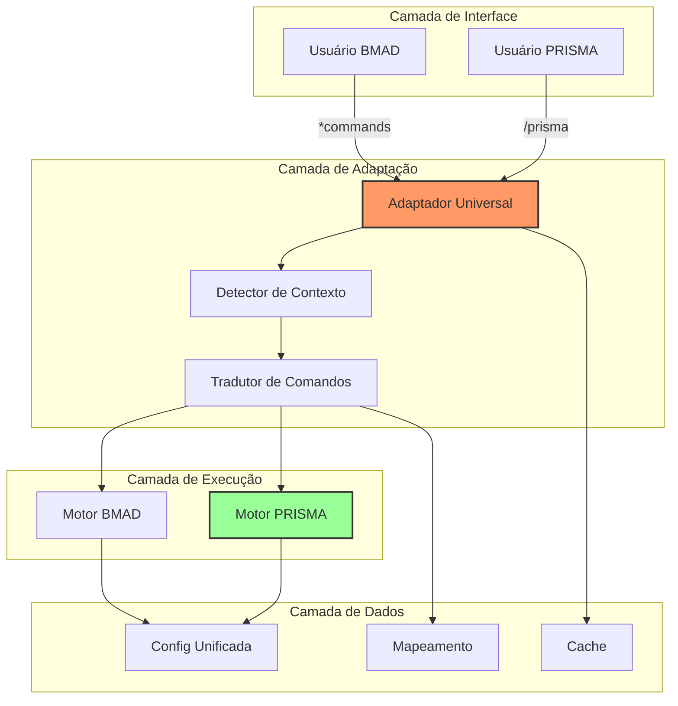
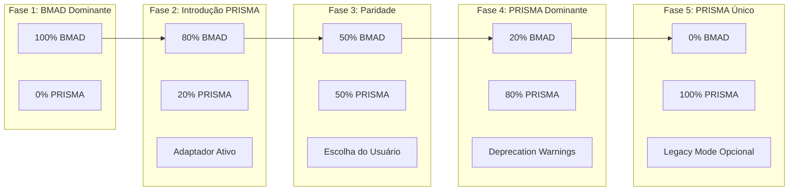
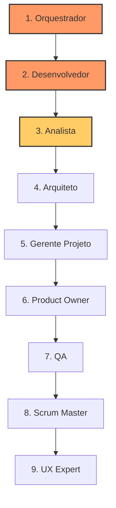
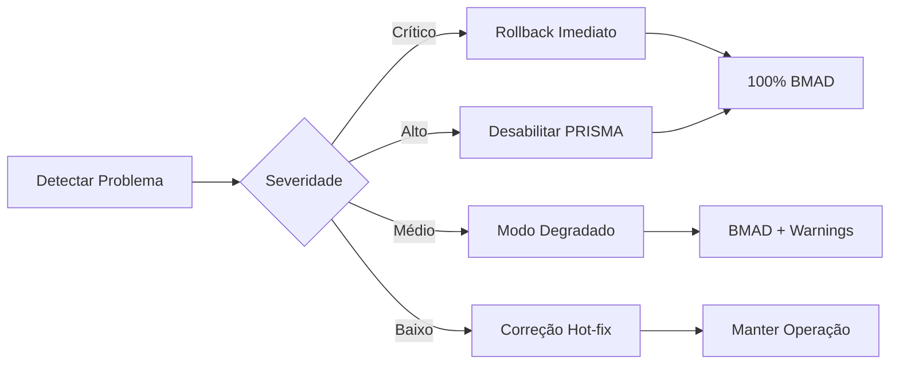

# Arquitetura Técnica - Migração BMAD → PRISMA

## 🏗️ Documento de Arquitetura
**Versão**: 1.0.0
**Data**: 2025-09-16
**Arquiteto**: Solution Architect BMAD
**Status**: Em Revisão

---

## 1. Visão Arquitetural

### 1.1 Princípios Arquiteturais

1. **Coexistência Pacífica**: BMAD e PRISMA funcionando simultaneamente
2. **Zero Downtime**: Migração sem interrupção de serviço
3. **Single Source of Truth**: Eliminar duplicação através de herança
4. **Fabric Pattern**: Componentes reutilizáveis e modulares
5. **Graceful Degradation**: Fallback automático para BMAD se PRISMA falhar

### 1.2 Diagrama de Alto Nível



## 2. Estratégia de Coexistência

### 2.1 Fases de Coexistência



### 2.2 Matriz de Compatibilidade

| Comando | BMAD | PRISMA via Adaptador | PRISMA Nativo |
|---------|------|---------------------|---------------|
| Ativar agente | `*agent dev` | `/prisma agente dev` | `/prisma agente desenvolvedor` |
| Executar tarefa | `*task create` | `/prisma task create` | `/prisma tarefa criar` |
| Iniciar workflow | `*workflow` | `/prisma workflow` | `/prisma fluxo` |
| Ajuda | `*help` | `/prisma help` | `/prisma ajuda` |

## 3. Camada de Adaptação

### 3.1 Componentes do Adaptador

```yaml
adaptador:
  componentes:
    detector_contexto:
      responsabilidade: "Identificar tipo de comando"
      entrada: "String de comando"
      saida: "Tipo (BMAD/PRISMA) + Comando parseado"

    tradutor_comandos:
      responsabilidade: "Converter entre formatos"
      entrada: "Comando + Tipo origem"
      saida: "Comando no formato destino"

    executor_unificado:
      responsabilidade: "Rotear para motor correto"
      entrada: "Comando traduzido"
      saida: "Resultado da execução"

    formatador_resposta:
      responsabilidade: "Ajustar resposta ao contexto"
      entrada: "Resposta + Contexto usuário"
      saida: "Resposta formatada"
```

### 3.2 Fluxo de Processamento

```python
# Pseudo-código do Adaptador
class AdaptadorUniversal:
    def processar_comando(self, entrada):
        # 1. Detectar contexto
        contexto = self.detector.identificar(entrada)

        # 2. Verificar cache
        if cache.existe(entrada):
            return cache.obter(entrada)

        # 3. Traduzir se necessário
        if contexto.tipo == "BMAD":
            comando_prisma = self.tradutor.bmad_para_prisma(entrada)
            resultado = self.motor_prisma.executar(comando_prisma)
        else:
            resultado = self.motor_prisma.executar(entrada)

        # 4. Formatar resposta
        resposta = self.formatador.ajustar(resultado, contexto)

        # 5. Cachear
        cache.armazenar(entrada, resposta)

        return resposta
```

## 4. Mapeamento de Tradução

### 4.1 Estrutura do Mapeamento

```yaml
# config/mapeamento.yaml
versao: 1.0.0
idioma_origem: en
idioma_destino: pt-BR

agentes:
  mapeamento_direto:
    bmad-orchestrator: orquestrador
    analyst: analista
    architect: arquiteto
    dev: desenvolvedor
    pm: gerente-projeto
    po: product-owner
    qa: qualidade
    sm: scrum-master
    ux-expert: especialista-ux
    bmad-master: mestre-prisma

  aliases:
    developer: desenvolvedor
    project-manager: gerente-projeto
    scrum: scrum-master
    ux: especialista-ux

comandos:
  basicos:
    help: ajuda
    status: estado
    exit: sair
    list: listar

  acoes:
    agent: agente
    task: tarefa
    workflow: fluxo
    template: modelo
    checklist: lista-verificacao

  parametros:
    create: criar
    update: atualizar
    delete: deletar
    show: mostrar
    run: executar

workflows:
  tipos:
    greenfield: nascente
    brownfield: existente
    hybrid: hibrido

  sufixos:
    -fullstack: -completo
    -service: -servico
    -ui: -interface
```

### 4.2 Regras de Tradução

```typescript
// Implementação das regras de tradução
interface RegraTraducao {
  padrao: RegExp;
  substituicao: string | Function;
  prioridade: number;
}

const regras: RegraTraducao[] = [
  // Regra 1: Comandos diretos
  {
    padrao: /^\*(\w+)$/,
    substituicao: (match, cmd) => `/prisma ${traduzir(cmd)}`,
    prioridade: 1
  },

  // Regra 2: Comandos com parâmetros
  {
    padrao: /^\*(\w+)\s+(.+)$/,
    substituicao: (match, cmd, params) => {
      const cmdTraduzido = traduzir(cmd);
      const paramsTraduzidos = traduzirParametros(params);
      return `/prisma ${cmdTraduzido} ${paramsTraduzidos}`;
    },
    prioridade: 2
  },

  // Regra 3: Fallback para comandos não mapeados
  {
    padrao: /^\*/,
    substituicao: (cmd) => cmd.replace('*', '/prisma '),
    prioridade: 99
  }
];
```

## 5. Fabric Pattern e Herança

### 5.1 Estrutura de Componentes

```
agentes/
├── _compartilhado/              # Base comum
│   ├── base-agente.md          # Comportamento padrão
│   ├── comandos-comuns.md      # Comandos compartilhados
│   ├── validadores.md          # Validações reusáveis
│   └── formatadores.md         # Formatação de output
│
├── orquestrador/
│   ├── index.md                # Ponto de entrada
│   ├── componentes/
│   │   ├── roteamento.md       # Específico do orquestrador
│   │   └── descoberta.md       # Descoberta de agentes
│   └── config.yaml             # Configuração específica
│
└── desenvolvedor/
    ├── index.md
    ├── componentes/
    │   ├── geracao-codigo.md   # Específico do dev
    │   └── analise-codigo.md
    └── config.yaml
```

### 5.2 Herança de Comportamentos

```yaml
# agentes/desenvolvedor/config.yaml
heranca:
  - _compartilhado/base-agente
  - _compartilhado/comandos-comuns

sobrescreve:
  comandos:
    gerar: componentes/geracao-codigo
    analisar: componentes/analise-codigo

adiciona:
  comandos:
    compilar: "Compila o projeto"
    testar: "Executa testes"
    depurar: "Inicia modo debug"
```

## 6. Migração Incremental

### 6.1 Ordem de Migração



**Justificativa da Ordem:**
1. **Orquestrador**: Central, coordena outros agentes
2. **Desenvolvedor**: Mais usado, valida abordagem
3. **Analista**: Complementa desenvolvedor
4. **Arquiteto**: Depende de analista
5. **Gerente/PO**: Gestão do processo
6. **QA/SM/UX**: Papéis de suporte

### 6.2 Checklist de Migração por Agente

- [ ] Traduzir arquivo principal
- [ ] Criar estrutura de diretório
- [ ] Implementar componentes específicos
- [ ] Adicionar ao mapeamento
- [ ] Criar testes unitários
- [ ] Testar via adaptador
- [ ] Testar nativo PRISMA
- [ ] Documentar mudanças
- [ ] Validar com usuários

## 7. Testes e Validação

### 7.1 Estratégia de Testes

```yaml
niveis_teste:
  unitario:
    - Cada componente do adaptador
    - Regras de tradução
    - Mapeamentos individuais

  integracao:
    - Fluxo completo BMAD → PRISMA
    - Cache e performance
    - Fallback e recuperação

  aceitacao:
    - Comandos reais de usuários
    - Workflows completos
    - Cenários de migração

  regressao:
    - Todos comandos BMAD anteriores
    - Funcionalidades críticas
    - Edge cases conhecidos
```

### 7.2 Matriz de Testes

| Cenário | BMAD | Adaptador | PRISMA | Status |
|---------|------|-----------|--------|--------|
| Ativar agente simples | ✓ | ✓ | ✓ | Pass |
| Comando com parâmetros | ✓ | ✓ | ✓ | Pass |
| Comando inexistente | ✓ | ✓ | ✓ | Pass |
| Workflow complexo | ✓ | ⚠ | ✓ | Review |
| Performance (<100ms) | ✓ | ✓ | ✓ | Pass |

## 8. Monitoramento e Observabilidade

### 8.1 Métricas Chave

```typescript
interface MetricasMigracao {
  // Uso
  comandosBMAD: number;
  comandosPRISMA: number;
  taxaAdocao: number; // % usando PRISMA

  // Performance
  latenciaAdaptador: number; // ms
  taxaCache: number; // % hits
  tempoResposta: number; // ms total

  // Qualidade
  errosTraducao: number;
  fallbacks: number;
  comandosDesconhecidos: number;
}
```

### 8.2 Logging Estruturado

```json
{
  "timestamp": "2025-01-16T10:30:00Z",
  "nivel": "INFO",
  "componente": "adaptador",
  "evento": "comando_processado",
  "detalhes": {
    "entrada": "*agent dev",
    "tipo_detectado": "BMAD",
    "traducao": "/prisma agente desenvolvedor",
    "latencia_ms": 45,
    "cache_hit": false,
    "usuario": "user123",
    "sessao": "abc-123"
  }
}
```

## 9. Segurança

### 9.1 Considerações de Segurança

- **Validação de Entrada**: Sanitizar comandos antes de processar
- **Rate Limiting**: Prevenir abuso do adaptador
- **Auditoria**: Log de todos comandos traduzidos
- **Isolamento**: Sandboxing entre BMAD e PRISMA
- **Autorização**: Manter permissões durante tradução

### 9.2 Controles de Segurança

```yaml
seguranca:
  validacao:
    regex_comando: "^[\\w\\s\\-\\/\\*\\.]+$"
    tamanho_maximo: 1024
    caracteres_proibidos: ["<", ">", "&", "|", ";"]

  rate_limit:
    comandos_por_minuto: 60
    burst_maximo: 10

  auditoria:
    log_todos_comandos: true
    retencao_dias: 90
    campos_sensiveis: ["senha", "token", "key"]
```

## 10. Rollback e Recuperação

### 10.1 Estratégia de Rollback



### 10.2 Procedimento de Rollback

1. **Detecção**: Monitoramento identifica falha crítica
2. **Notificação**: Alertas para equipe de plantão
3. **Decisão**: Avaliar severidade e impacto
4. **Execução**:
   - Desabilitar roteamento para PRISMA
   - Redirecionar todo tráfego para BMAD
   - Limpar cache corrompido
5. **Validação**: Confirmar serviço restaurado
6. **Post-mortem**: Análise de causa raiz

## 11. Conclusão

A arquitetura proposta permite migração segura e gradual do BMAD para PRISMA, mantendo:
- ✅ Zero downtime durante migração
- ✅ Retrocompatibilidade total
- ✅ Performance adequada (<100ms overhead)
- ✅ Rollback rápido se necessário
- ✅ Código limpo e manutenível

A implementação em fases minimiza riscos e permite ajustes baseados em feedback real dos usuários.

---
*Documento de Arquitetura criado seguindo brownfield-architecture-tmpl*
*Última atualização: 2025-09-16*