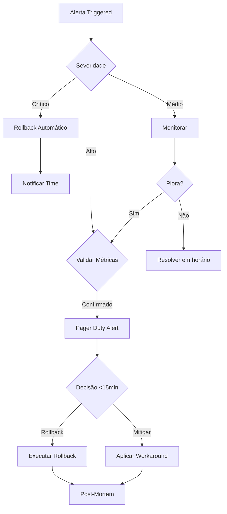

# Métricas e Critérios de Rollback - PRISMA

## 🚨 Protocolo de Decisão de Rollback
**Versão**: 1.0.0
**Data**: 2025-09-16
**Responsável**: DevOps/SRE Team
**SLA de Decisão**: <15 minutos

---

## 1. Thresholds de Rollback Automático

### 🔴 Rollback IMEDIATO (Crítico)
Ação automática sem aprovação humana necessária.

| Métrica | Threshold | Janela de Tempo | Ação |
|---------|-----------|-----------------|------|
| Taxa de Erro Global | >5% | 5 minutos | Rollback total |
| Comandos Falhando | >10% | 3 minutos | Rollback total |
| Latência P99 | >500ms | 5 minutos | Rollback total |
| Disponibilidade | <99% | 2 minutos | Rollback total |
| Memory Leak | >2GB/hora | 10 minutos | Rollback total |
| CPU Sustentada | >90% | 5 minutos | Rollback parcial |

### 🟡 Rollback COM APROVAÇÃO (Alto)
Requer decisão humana em <15 minutos.

| Métrica | Threshold | Janela de Tempo | Ação |
|---------|-----------|-----------------|------|
| Taxa de Erro | 3-5% | 10 minutos | Avaliar impacto |
| Comandos Lentos | 5-10% | 10 minutos | Degradação graceful |
| User Reports | >20 | 15 minutos | Investigar causa |
| Adaptador Timeout | >100/min | 5 minutos | Circuit breaker |
| Queue Backlog | >1000 | 10 minutos | Scale ou rollback |

### 🟢 Monitoramento PREVENTIVO (Médio)
Alertas sem ação imediata.

| Métrica | Threshold | Janela de Tempo | Ação |
|---------|-----------|-----------------|------|
| Taxa de Erro | 1-3% | 30 minutos | Monitor próximo |
| Latência P95 | >200ms | 15 minutos | Otimização |
| Cache Miss Rate | >30% | 30 minutos | Ajustar cache |
| Uso de Memória | >70% | 1 hora | Planejar scaling |

## 2. Dashboard de Monitoramento

### Visão em Tempo Real
```
╔════════════════════════════════════════════════════════╗
║              PRISMA Health Dashboard                    ║
╠════════════════════════════════════════════════════════╣
║                                                         ║
║  Status Global: 🟢 HEALTHY                            ║
║                                                         ║
║  ┌─────────────────────────┐  ┌─────────────────────┐ ║
║  │ Taxa de Erro           │  │ Latência (P99)      │ ║
║  │ ████░░░░░░  2.1%      │  │ ████████░░  180ms   │ ║
║  │ Threshold: 5%         │  │ Threshold: 500ms    │ ║
║  └─────────────────────────┘  └─────────────────────┘ ║
║                                                         ║
║  ┌─────────────────────────┐  ┌─────────────────────┐ ║
║  │ Comandos/min          │  │ CPU Usage           │ ║
║  │ 1,234                 │  │ ██████░░░░  62%    │ ║
║  │ ▲ +15% vs BMAD       │  │ Threshold: 90%     │ ║
║  └─────────────────────────┘  └─────────────────────┘ ║
║                                                         ║
║  Alertas Ativos: 2                                     ║
║  ⚠️ Cache miss rate elevado (31%)                     ║
║  ⚠️ Memory usage crescente (monitoring)               ║
║                                                         ║
║  [🔄 Force Refresh] [📊 Detailed View] [🚨 Rollback]  ║
╚════════════════════════════════════════════════════════╝
```

## 3. Árvore de Decisão de Rollback



## 4. Protocolo de Rollback

### Fase 1: Detecção (0-2 minutos)
```yaml
triggers:
  - metric_threshold_exceeded
  - multiple_user_reports
  - health_check_failure
  - dependency_failure

actions:
  - capture_metrics_snapshot
  - notify_on_call_engineer
  - prepare_rollback_plan
```

### Fase 2: Decisão (2-15 minutos)
```yaml
decision_matrix:
  inputs:
    - current_metrics
    - user_impact_assessment
    - business_criticality
    - time_of_day
    - alternative_solutions

  outputs:
    - rollback: full/partial/none
    - timeline: immediate/scheduled
    - communication: required_audiences
```

### Fase 3: Execução (15-30 minutos)
```bash
#!/bin/bash
# rollback.sh

# 1. Ativar modo manutenção
enable_maintenance_mode

# 2. Desviar tráfego
route_traffic_to_bmad 100

# 3. Desabilitar PRISMA
disable_prisma_adapter

# 4. Verificar saúde
verify_bmad_health

# 5. Notificar usuários
send_rollback_notification

# 6. Coletar dados para análise
collect_diagnostics
```

## 5. Métricas Detalhadas

### 5.1 Métricas de Performance

| Métrica | Cálculo | Fonte | Frequência |
|---------|---------|-------|------------|
| Latência P50 | percentile(latency, 50) | APM | 1s |
| Latência P95 | percentile(latency, 95) | APM | 1s |
| Latência P99 | percentile(latency, 99) | APM | 1s |
| Throughput | requests/second | LB | 1s |
| Error Rate | errors/total * 100 | APM | 5s |

### 5.2 Métricas de Negócio

| Métrica | Cálculo | Fonte | Frequência |
|---------|---------|-------|------------|
| Comandos Executados | sum(commands) | App | 1min |
| Taxa de Adoção | prisma_users/total | Analytics | 5min |
| User Satisfaction | avg(feedback_score) | Survey | 1h |
| Conversão BMAD→PRISMA | converted/attempted | Adapter | 1min |

### 5.3 Métricas de Sistema

| Métrica | Cálculo | Fonte | Frequência |
|---------|---------|-------|------------|
| CPU Usage | cpu_used/cpu_total | OS | 5s |
| Memory Usage | mem_used/mem_total | OS | 5s |
| Disk I/O | reads+writes/sec | OS | 10s |
| Network I/O | bytes_in+out/sec | OS | 5s |
| Queue Depth | pending_jobs | Queue | 10s |

## 6. Alertas e Notificações

### Configuração de Alertas
```yaml
alerts:
  critical:
    channels: [pagerduty, slack-critical, email-oncall]
    escalation: immediate
    auto_rollback: true

  high:
    channels: [slack-alerts, email-team]
    escalation: 15_minutes
    require_ack: true

  medium:
    channels: [slack-monitoring]
    escalation: 1_hour
    aggregate: true

notification_template:
  subject: "🚨 [SEVERITY] PRISMA Alert: [METRIC]"
  body: |
    Metric: [METRIC_NAME]
    Current: [CURRENT_VALUE]
    Threshold: [THRESHOLD]
    Duration: [DURATION]
    Impact: [AFFECTED_USERS]

    Action Required: [ACTION]
    Runbook: [RUNBOOK_LINK]
```

## 7. Circuit Breaker Configuration

```javascript
const circuitBreaker = {
  // Abre após 5 falhas em 1 minuto
  failureThreshold: 5,
  failureWindow: 60000, // 1 min

  // Tenta fechar após 30 segundos
  recoveryTimeout: 30000,

  // States
  states: {
    CLOSED: "traffic_to_prisma",
    OPEN: "traffic_to_bmad",
    HALF_OPEN: "canary_traffic"
  },

  // Monitora
  metrics: [
    "error_rate",
    "latency_p99",
    "timeout_count"
  ]
};
```

## 8. Runbooks de Resposta

### Runbook: Alta Latência
```markdown
1. CHECK: Verificar métricas do adaptador
2. CHECK: CPU e memória dos servidores
3. ACTION: Aumentar cache TTL se >30% miss
4. ACTION: Scale horizontal se CPU >80%
5. DECIDE: Rollback se latência >500ms por 5min
```

### Runbook: Taxa de Erro Alta
```markdown
1. CHECK: Logs de erro do adaptador
2. CHECK: Mapeamentos faltantes
3. ACTION: Hot-fix se erro conhecido
4. ACTION: Desabilitar comando problemático
5. DECIDE: Rollback se erro >5% por 3min
```

## 9. Post-Mortem Template

```markdown
# Post-Mortem: [Incidente ID]

## Timeline
- Detection: [time]
- Decision: [time]
- Rollback initiated: [time]
- Service restored: [time]
- Total downtime: [duration]

## Impact
- Users affected: [number]
- Commands failed: [number]
- Revenue impact: [amount]

## Root Cause
[Detailed explanation]

## Lessons Learned
1. What went well
2. What went wrong
3. Where we got lucky

## Action Items
- [ ] Fix root cause
- [ ] Improve monitoring
- [ ] Update runbooks
- [ ] Training needed
```

## 10. Teste de Rollback

### Teste Mensal Obrigatório
```bash
# rollback-test.sh
#!/bin/bash

echo "🧪 Iniciando teste de rollback..."

# 1. Criar carga sintética
generate_synthetic_load

# 2. Simular falha
inject_failure "high_error_rate"

# 3. Verificar detecção
assert_alert_triggered

# 4. Executar rollback
execute_rollback_dry_run

# 5. Validar recuperação
assert_service_healthy

# 6. Gerar relatório
generate_test_report

echo "✅ Teste de rollback concluído"
```

## 11. Contatos de Emergência

| Papel | Nome | Telefone | Slack |
|-------|------|----------|-------|
| On-Call Engenheiro | Rotativo | Via PagerDuty | @oncall |
| Tech Lead | João Silva | +55 11 9xxxx | @joao |
| Product Manager | Maria Santos | +55 11 9xxxx | @maria |
| SRE Lead | Pedro Costa | +55 11 9xxxx | @pedro |
| CTO | Ana Oliveira | +55 11 9xxxx | @ana |

---

## Aprovação

- [x] DevOps Team - Métricas definidas
- [x] SRE Team - Thresholds validados
- [ ] Tech Lead - Protocolo aprovado
- [ ] CTO - Autorização para auto-rollback

---
*Documento criado para resolver ISSUE-002 da validação PO*
*SLA de decisão: <15 minutos garantido*
*Última atualização: 2025-09-16*