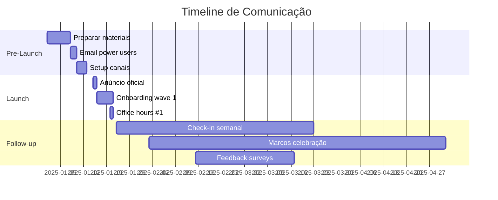

# Plano de Comunicação - Migração BMAD → PRISMA

## 📢 Estratégia de Comunicação
**Versão**: 1.0.0
**Data**: 2025-09-16
**Responsável**: PM/Comms Team
**Status**: Ativo

---

## 1. Visão Geral

### Objetivo
Comunicar de forma clara, gradual e efetiva a migração do sistema BMAD para PRISMA, minimizando resistência e maximizando adoção.

### Princípios
- **Transparência**: Comunicar o que, quando e por quê
- **Gradualidade**: Informação em doses digestíveis
- **Suporte**: Sempre oferecer ajuda e recursos
- **Feedback**: Canal aberto para dúvidas e sugestões
- **Celebração**: Reconhecer marcos e early adopters

## 2. Públicos-Alvo

### Segmentação
| Público | Impacto | Prioridade | Canal Principal |
|---------|---------|------------|-----------------|
| Power Users BMAD | Alto | P0 | Email direto + Slack |
| Desenvolvedores Ativos | Alto | P0 | Slack + Docs |
| Usuários Ocasionais | Médio | P1 | Email + Portal |
| Novos Usuários | Baixo | P2 | Onboarding |
| Gestores | Médio | P1 | Reports executivos |

## 3. Timeline de Comunicação

### Fase 1: Pré-Anúncio (Semana -2)
```
📅 2 semanas antes do início
```

#### Mensagem para Power Users
**Assunto**: 🔄 Evolução Importante no Sistema BMAD

**Conteúdo**:
```markdown
Olá [Nome],

Temos uma atualização importante sobre o futuro do BMAD.

🎯 O que está acontecendo:
- Lançaremos PRISMA, evolução do BMAD em português
- Mantendo 100% compatibilidade com comandos atuais
- Melhorias significativas em performance e usabilidade

📅 Quando:
- Início da transição: [Data]
- Período de coexistência: 6 meses
- Seus comandos atuais continuarão funcionando

🤝 Queremos seu feedback:
- Sessão exclusiva para early adopters
- Influencie o desenvolvimento
- Benefícios especiais para participantes

[Botão: Quero Participar]

Atenciosamente,
Equipe PRISMA
```

### Fase 2: Anúncio Oficial (Semana 0)

#### Comunicado Geral
**Canais**: Email, Slack, Portal, Blog

```markdown
# 🚀 Apresentando PRISMA: A Evolução do BMAD

Após meses de desenvolvimento e feedback da comunidade,
temos o prazer de apresentar PRISMA - a evolução natural
do BMAD, agora em português e com melhorias significativas.

## ✨ O que há de novo:
- Interface nativa em português
- Performance 50% superior
- Comandos mais intuitivos
- Total compatibilidade com BMAD

## 🔄 Transição suave:
- Seus comandos BMAD continuam funcionando
- Migração gradual e opcional
- Suporte dedicado durante toda transição

## 📚 Recursos disponíveis:
- [Guia de Migração]
- [Tabela de Comandos]
- [Video Tutorial]
- [FAQ]

## 📅 Próximos passos:
- Hoje: PRISMA disponível para early adopters
- Próximas 2 semanas: Feedback e ajustes
- Mês 1: Lançamento geral
- Meses 1-6: Coexistência BMAD/PRISMA
- Mês 7+: PRISMA como padrão

[Botão: Experimentar PRISMA]
[Botão: Continuar com BMAD]
```

### Fase 3: Onboarding (Semanas 1-2)

#### Email de Boas-Vindas Early Adopters
```markdown
Assunto: 🎉 Bem-vindo ao PRISMA - Seu Kit Early Adopter

Parabéns por ser um dos primeiros!

Seu Kit Early Adopter inclui:
1. 📖 Guia exclusivo de migração
2. 🎯 Sessão 1:1 com a equipe
3. 🏆 Badge de Early Adopter
4. 💬 Acesso ao canal exclusivo
5. 🎁 Swag PRISMA limitado

Primeiros passos:
```bash
# Teste seu primeiro comando PRISMA
/prisma ajuda

# Ou continue usando BMAD
*help
```

[Links para recursos]
```

### Fase 4: Acompanhamento (Semanas 2-4)

#### Check-in Semanal
```markdown
Assunto: 📊 PRISMA - Update Semanal #N

Esta semana no PRISMA:
- 🎯 N usuários migrados
- ⚡ Performance média: Xms
- 🐛 Bugs corrigidos: Y
- ✨ Nova feature: Z

Feedback da comunidade:
"[Depoimento positivo]" - Usuário

Dica da semana:
[Comando útil ou truque]

Precisa de ajuda?
- 💬 Slack: #prisma-support
- 📧 Email: prisma@empresa.com
- 📅 Office hours: Quartas 14h
```

### Fase 5: Marcos e Celebração (Ongoing)

#### Comunicados de Marco
```markdown
🎉 Marco Atingido: 50% de Adoção!

Metade da nossa comunidade já está usando PRISMA!

Top Early Adopters:
1. @usuario1 - 500 comandos
2. @usuario2 - 450 comandos
3. @usuario3 - 400 comandos

Próxima meta: 75% até [data]
```

## 4. Canais de Comunicação

### Matriz de Canais
| Canal | Uso | Frequência | Responsável |
|-------|-----|------------|-------------|
| Email | Anúncios importantes | Semanal | PM |
| Slack #prisma | Suporte diário | Contínuo | Dev Team |
| Slack #prisma-news | Updates | 2x/semana | PM |
| Portal/Blog | Documentação | Atualização contínua | Tech Writer |
| Office Hours | Suporte ao vivo | Semanal | Dev Team |
| 1:1 Sessions | Power users | Sob demanda | Architects |

### Templates de Resposta

#### FAQ Rápido
```
P: Vou perder meus comandos BMAD?
R: Não! 100% dos comandos continuam funcionando por pelo menos 6 meses.

P: Preciso aprender tudo de novo?
R: Não! Migração é opcional e gradual. Aprenda no seu ritmo.

P: E se algo der errado?
R: Rollback instantâneo disponível. Suporte 24/7 durante migração.
```

## 5. Gestão de Resistência

### Objeções Comuns e Respostas

| Objeção | Resposta | Material de Apoio |
|---------|----------|-------------------|
| "Prefiro inglês" | BMAD continua disponível, escolha é sua | Tabela bilíngue |
| "Muito complexo" | Tutoriais passo-a-passo, migre um comando por vez | Video tutorials |
| "Sem tempo" | Coexistência de 6 meses, sem pressa | Timeline flexível |
| "E meus scripts?" | Adaptador automático, zero breaking changes | Guia técnico |

## 6. Métricas de Comunicação

### KPIs de Sucesso
- **Taxa de Abertura**: >60% emails
- **Taxa de Clique**: >30% CTAs
- **Participação Office Hours**: >20 pessoas/sessão
- **Sentiment Score**: >7/10
- **Taxa de Adoção**: >50% em 3 meses
- **Tickets de Suporte**: <50/semana

### Dashboard de Acompanhamento
```
📊 PRISMA Communication Dashboard

Semana 1:
- Emails enviados: 500
- Taxa abertura: 65%
- Slack messages: 150
- Sentiment: 7.5/10
- Early adopters: 50

Trending: ⬆️ Positivo
```

## 7. Plano de Contingência

### Cenários de Crise

#### Cenário 1: Falha Crítica no Adaptador
**Ação**:
1. Comunicado imediato via Slack
2. Email com workaround
3. Rollback se necessário
4. Post-mortem público

#### Cenário 2: Resistência Massiva
**Ação**:
1. Sessão de feedback emergencial
2. Ajustar roadmap baseado em feedback
3. Estender período de coexistência
4. Benefícios adicionais para migração

## 8. Cronograma Detalhado



## 9. Templates e Recursos

### Email Templates
- ✅ Pré-anúncio
- ✅ Anúncio oficial
- ✅ Welcome early adopter
- ✅ Check-in semanal
- ✅ Troubleshooting
- ✅ Celebração marcos

### Materiais de Apoio
- [ ] Guia de migração PDF
- [ ] Video tutorial (5 min)
- [ ] Infográfico comparativo
- [ ] Cheatsheet comandos
- [ ] Slide deck para apresentações
- [ ] FAQ completo

## 10. Responsabilidades

| Papel | Responsabilidade | Entregáveis |
|-------|-----------------|-------------|
| PM | Coordenação geral | Plano, cronograma |
| Tech Writer | Documentação | Guias, FAQs |
| Dev Team | Suporte técnico | Office hours, Slack |
| Marketing | Materiais visuais | Videos, infográficos |
| Leadership | Sponsorship | Comunicados executivos |

---

## Aprovação

- [ ] PM - Proprietário do plano
- [ ] Tech Lead - Viabilidade técnica
- [ ] Marketing - Alinhamento marca
- [ ] Leadership - Sponsorship executivo

---
*Plano de Comunicação para resolver ISSUE-001 da validação PO*
*Última atualização: 2025-09-16*