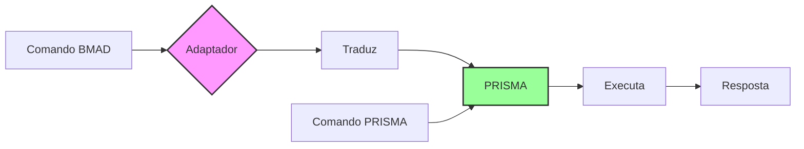
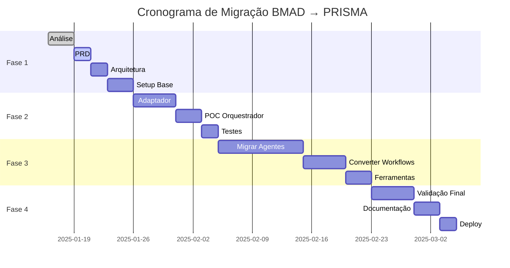

# PRD - Migração BMAD para PRISMA

## 📋 Documento de Requisitos do Produto
**Versão**: 1.0.0
**Data**: 2025-09-16
**Autor**: Gerente de Projeto BMAD
**Status**: Em Revisão

---

## 1. Visão Geral

### 1.1 Objetivo
Migrar completamente o sistema BMAD (Business Method for Agile Development) em inglês para o novo sistema PRISMA (Processo Rápido de Implementação e Sistema de Metodologia Ágil) em português brasileiro, mantendo total retrocompatibilidade durante a transição.

### 1.2 Problema a Resolver
- Dois sistemas paralelos causando confusão e duplicação
- BMAD em inglês limita adoção por equipes brasileiras
- Manutenção duplicada aumenta custos e complexidade
- Falta de Single Source of Truth gera inconsistências

### 1.3 Solução Proposta
Sistema unificado PRISMA com:
- Interface nativa em português brasileiro
- Retrocompatibilidade total com comandos BMAD
- Arquitetura fabric pattern eliminando duplicações
- Migração incremental sem interrupção de serviço

## 2. Requisitos Funcionais

### 2.1 Requisitos Críticos (P0)

#### RF-001: Camada de Adaptação
- **Como** usuário BMAD existente
- **Quero** continuar usando comandos com `*`
- **Para** não precisar reaprender o sistema imediatamente

**Critérios de Aceitação:**
- [ ] Comando `*agent architect` funciona normalmente
- [ ] Comando é traduzido internamente para `/prisma agente arquiteto`
- [ ] Resposta mantém formato esperado pelo usuário

#### RF-002: Migração de Agentes
- **Como** desenvolvedor
- **Quero** todos os 9 agentes BMAD migrados
- **Para** ter funcionalidade completa em PRISMA

**Agentes para Migrar:**
1. bmad-orchestrator → orquestrador
2. analyst → analista
3. architect → arquiteto
4. dev → desenvolvedor
5. pm → gerente-projeto
6. po → product-owner
7. qa → qualidade
8. sm → scrum-master
9. ux-expert → especialista-ux

#### RF-003: Single Source of Truth
- **Como** mantenedor do sistema
- **Quero** cada funcionalidade em apenas um lugar
- **Para** facilitar manutenção e evitar inconsistências

### 2.2 Requisitos Importantes (P1)

#### RF-004: Sistema de Detecção Inteligente
- Detectar automaticamente se comando é BMAD ou PRISMA
- Sugerir comando correto em caso de erro
- Aprender padrões de uso do usuário

#### RF-005: Documentação Bilíngue
- Manter documentação em português como padrão
- Incluir tabela de conversão BMAD → PRISMA
- Exemplos em ambos formatos durante transição

#### RF-006: Ferramentas de Conversão
- Conversor automático de templates BMAD → PRISMA
- Validador de integridade pós-migração
- Fragmentador de documentos grandes

### 2.3 Requisitos Desejáveis (P2)

#### RF-007: Métricas de Adoção
- Rastrear uso de comandos BMAD vs PRISMA
- Identificar agentes mais utilizados
- Gerar relatórios de migração

#### RF-008: Modo de Treinamento
- Tutorial interativo para novos comandos
- Comparação lado a lado BMAD/PRISMA
- Gamificação do aprendizado

## 3. Requisitos Não-Funcionais

### 3.1 Performance
- **RNF-001**: Adaptador deve adicionar < 100ms de latência
- **RNF-002**: Conversão de comandos em tempo real
- **RNF-003**: Cache de traduções frequentes

### 3.2 Compatibilidade
- **RNF-004**: 100% dos comandos BMAD devem funcionar
- **RNF-005**: Suporte a ambos sistemas por mínimo 6 meses
- **RNF-006**: Rollback possível a qualquer momento

### 3.3 Usabilidade
- **RNF-007**: Mensagens de erro em português claro
- **RNF-008**: Sugestões contextuais automáticas
- **RNF-009**: Documentação com exemplos práticos

### 3.4 Manutenibilidade
- **RNF-010**: Código modular com componentes reutilizáveis
- **RNF-011**: Testes automatizados para cada agente
- **RNF-012**: Logs detalhados de conversão

## 4. Estrutura Alvo

### 4.1 Organização de Diretórios
```
prisma/
├── agentes/                # Agentes em PT-BR
│   ├── orquestrador/
│   ├── analista/
│   ├── arquiteto/
│   ├── desenvolvedor/
│   ├── gerente-projeto/
│   ├── product-owner/
│   ├── qualidade/
│   ├── scrum-master/
│   ├── especialista-ux/
│   └── _compartilhado/     # Componentes comuns
│
├── workflows/              # Fluxos de trabalho
│   ├── nascente/          # greenfield
│   ├── existente/         # brownfield
│   └── hibrido/           # novo tipo
│
├── templates/             # Templates PT-BR
│   ├── produto/
│   ├── arquitetura/
│   └── qualidade/
│
├── ferramentas/
│   └── conversao/         # Adaptadores
│       ├── adaptador.md
│       ├── conversor.md
│       └── validador.md
│
└── config/
    ├── prisma.yaml        # Config principal
    └── mapeamento.yaml    # BMAD → PRISMA
```

### 4.2 Fluxo de Migração



## 5. Fases de Implementação

### Fase 1: Fundação (Sprint 1)
- [ ] Análise arquitetural completa
- [ ] Criação de PRD e documentação técnica
- [ ] Setup de configuração base
- [ ] Implementação do adaptador

### Fase 2: Migração Piloto (Sprint 2)
- [ ] Migrar orquestrador como POC
- [ ] Testar retrocompatibilidade
- [ ] Ajustar adaptador conforme necessário
- [ ] Documentar processo

### Fase 3: Migração Completa (Sprints 3-4)
- [ ] Migrar demais 8 agentes
- [ ] Converter workflows
- [ ] Traduzir templates
- [ ] Criar ferramentas auxiliares

### Fase 4: Validação e Deploy (Sprint 5)
- [ ] Testes de aceitação completos
- [ ] Documentação final
- [ ] Treinamento de usuários
- [ ] Go-live com suporte paralelo

## 6. Critérios de Sucesso

### 6.1 KPIs Primários
- **Compatibilidade**: 100% comandos BMAD funcionando
- **Migração**: 100% agentes em português
- **Qualidade**: 0 funcionalidades perdidas
- **Adoção**: 50% usuários usando PRISMA em 3 meses

### 6.2 KPIs Secundários
- **Performance**: Latência < 100ms no adaptador
- **Documentação**: 100% em português
- **Satisfação**: NPS > 8 dos usuários
- **Manutenção**: 50% redução em duplicação

## 7. Riscos e Mitigações

| Risco | Impacto | Prob. | Mitigação |
|-------|---------|-------|-----------|
| Resistência à mudança | Alto | Alta | Manter BMAD funcionando, migração gradual |
| Bugs no adaptador | Alto | Média | Testes extensivos, rollback rápido |
| Tradução inconsistente | Médio | Alta | Glossário único, revisão por nativos |
| Performance degradada | Médio | Baixa | Cache agressivo, otimização contínua |
| Documentação incompleta | Baixo | Média | Documentar durante desenvolvimento |

## 8. Stakeholders

### 8.1 Principais
- **Usuários BMAD**: Precisam continuar trabalhando sem interrupção
- **Novos Usuários**: Querem sistema em português
- **Equipe de Desenvolvimento**: Implementará a migração
- **Equipe de Manutenção**: Manterá sistema pós-migração

### 8.2 Influenciadores
- **Gerência**: Aprova recursos e prazos
- **Arquitetos**: Definem padrões técnicos
- **QA**: Valida qualidade da migração

## 9. Dependências

### 9.1 Técnicas
- Acesso completo ao código BMAD
- Ambiente de teste isolado
- Ferramentas de CI/CD configuradas

### 9.2 Recursos
- 2 desenvolvedores full-time por 5 sprints
- 1 QA dedicado nas fases 3-4
- 1 Technical writer para documentação

## 10. Cronograma



## 11. Anexos

### Anexo A: Glossário de Tradução
| BMAD | PRISMA |
|------|--------|
| agent | agente |
| task | tarefa |
| workflow | fluxo/workflow |
| template | template/modelo |
| checklist | lista de verificação |
| help | ajuda |
| status | estado |

### Anexo B: Comandos Equivalentes
| Comando BMAD | Comando PRISMA |
|--------------|----------------|
| `*help` | `/prisma ajuda` |
| `*agent dev` | `/prisma agente desenvolvedor` |
| `*task create-doc` | `/prisma tarefa criar-doc` |
| `*workflow brownfield` | `/prisma fluxo existente` |

---

## Aprovações

- [ ] Product Owner
- [ ] Arquiteto Técnico
- [ ] Gerente de Projeto
- [ ] Equipe de Desenvolvimento

---
*PRD criado seguindo template brownfield-prd-tmpl*
*Última atualização: 2025-09-16*