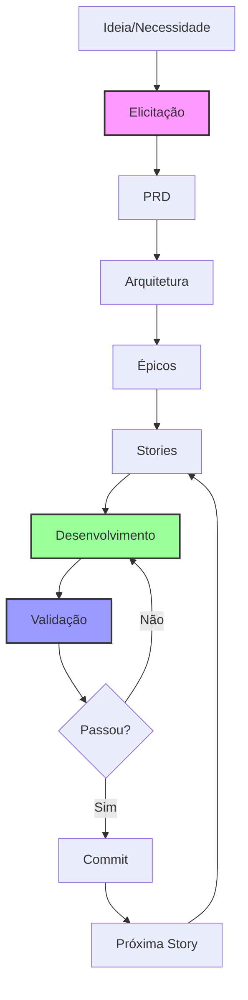

## Processo Rápido de Implementação e Sistema de Metodologia Ágil

### Versão: 1.0.0
### Data: Janeiro 2025
### Status: Ativo

---

## 📌 Sumário Executivo

### O Problema
Ferramentas de IA como Claude Code são extremamente poderosas para gerar código, mas sofrem de uma limitação crítica: **contexto limitado**. Em projetos grandes, a IA:
- Perde o fio da meada entre conversas
- Refaz trabalho já realizado
- Cria inconsistências arquiteturais
- Não consegue manter visão holística
- Força desenvolvedores a re-explicar contexto constantemente

### A Solução
PRISMA é um framework metodológico que transforma a limitação de contexto da IA em vantagem, através de **documentação estruturada como memória externa**.

**Princípio Core: "Documente primeiro, codifique com IA depois"**

### Valor Único
- **IA com Memória**: Documentação estruturada serve como contexto persistente
- **Desenvolvimento Focado**: Uma story por vez, escopo claro
- **Qualidade Garantida**: Checklists e validações automáticas
- **Zero Código do Framework**: Opera 100% via markdown e comandos

---

## 🎯 Visão do Produto

### Declaração de Visão
> "PRISMA permite que desenvolvedores aproveitem todo o poder da IA para criar e manter projetos complexos, eliminando a perda de contexto através de documentação estruturada que guia o desenvolvimento."

### Missão
Democratizar o desenvolvimento assistido por IA, permitindo que projetos de qualquer tamanho sejam desenvolvidos com consistência, qualidade e velocidade.

### Princípios Fundamentais

#### Princípios Core do PRISMA
1. **Documentação é Código**: A documentação não descreve o sistema, ela É o sistema
2. **Contexto Limitado é Feature**: Stories pequenas = IA focada = Melhor resultado
3. **Estrutura Liberta**: Constraints adequados aumentam criatividade e qualidade
4. **Transparência Total**: Tudo em markdown, legível e editável por qualquer um

#### Princípios de Engenharia de Software
5. **KISS (Keep It Simple, Stupid)**: Complexidade é inimiga da manutenibilidade
   - Comandos simples e intuitivos (`/prisma [ação]`)
   - Estrutura de arquivos óbvia e previsível
   - Documentação que qualquer um entende sem explicação

6. **YAGNI (You Aren't Gonna Need It)**: Construir apenas o necessário agora
   - Foco no MVP funcional primeiro
   - Features adicionadas apenas por demanda real comprovada
   - Evitar over-engineering preventivo

7. **Dependency Inversion Principle**: Depender de abstrações, não de concretizações
   - Templates como contratos entre componentes
   - Agentes intercambiáveis via interface comum
   - Workflows plugáveis sem modificar core

8. **Open/Closed Principle**: Aberto para extensão, fechado para modificação
   - Novos agentes sem alterar sistema base
   - Templates customizáveis sem quebrar originais
   - Extensibilidade total via markdown

9. **Fail Fast**: Detectar e reportar problemas imediatamente
   - Validação em cada checkpoint antes de prosseguir
   - Feedback instantâneo e acionável
   - Bloqueio de progressão em erros críticos

---

## 👥 Usuários e Personas

### Persona Primária: Desenvolvedor com Claude Code
**Características:**
- Usa Claude Code CLI diariamente
- Frustra-se com re-explicações de contexto
- Quer aproveitar IA mas manter controle
- Valoriza documentação mas odeia mantê-la

**Dores:**
- "A IA esquece o que fizemos ontem"
- "Passo mais tempo explicando do que codando"
- "O projeto ficou inconsistente"
- "Não confio na IA para tarefas grandes"

**Ganhos com PRISMA:**
- IA sempre sabe o contexto
- Desenvolvimento acelerado
- Consistência garantida
- Confiança para tarefas complexas

### Persona Secundária: Tech Lead
**Características:**
- Gerencia time pequeno/médio
- Preocupa-se com qualidade e padrões
- Quer escalar sem perder controle
- Busca produtividade sustentável

**Dores:**
- "Cada dev faz de um jeito"
- "Documentação sempre desatualizada"
- "Onboarding demora semanas"
- "Débito técnico cresce rápido"

**Ganhos com PRISMA:**
- Padrões automáticos
- Documentação sempre atual
- Onboarding em horas
- Débito técnico controlado

### Persona Terciária: Product Manager Técnico
**Características:**
- Entende tecnologia mas não programa
- Precisa especificar com precisão
- Quer validar ideias rapidamente
- Busca comunicação clara com devs

**Dores:**
- "Não consigo especificar direito"
- "Devs não entendem o que quero"
- "Demora muito para ver resultado"
- "Requisitos se perdem"

**Ganhos com PRISMA:**
- Especifica em markdown estruturado
- Templates guiam criação
- Vê progresso story por story
- Requisitos rastreáveis

### Persona Crítica: Desenvolvedor Júnior
**Características:**
- 0-2 anos de experiência
- Inseguro sobre decisões arquiteturais
- Quer aprender melhores práticas
- Medo de introduzir bugs

**Dores:**
- "Não sei se estou fazendo certo"
- "Demoro muito pesquisando como fazer"
- "Tenho medo de quebrar algo em produção"
- "Senior não tem tempo para me mentorar"

**Ganhos com PRISMA:**
- **Learning Mode**: Explicações passo a passo
- **Mistake Prevention**: Evita erros comuns automaticamente
- **Guided Workflow**: Nunca fica perdido
- **Mentoria Embutida**: Aprende enquanto desenvolve
- **Confiança**: Validações impedem erros críticos

**Exemplo de Interação Júnior:**
```
/prisma executar story-login --level=junior --learning

🎓 Modo Júnior + Aprendizado Ativado!

📚 Vamos criar um sistema de login seguro.
Vou te guiar passo a passo e explicar o porquê de cada decisão.

Primeiro, você sabe por que não devemos guardar senhas em texto puro?
[Explicar / Já sei / Pular]

> Explicar

💡 Senhas em texto puro são um risco enorme porque:
1. Se o banco vazar, todas as senhas ficam expostas
2. Admins podem ver senhas dos usuários
3. Logs podem expor senhas acidentalmente

Por isso usamos "hashing" - uma função matemática irreversível.
Vamos usar bcrypt que é o padrão da indústria.

Pronto para continuar? [S/n]
```

---

## 🔧 Requisitos Funcionais

### RF001: Sistema de Comandos
**Descrição:** Interface via comandos /prisma no Claude Code CLI

**Comandos Essenciais:**
```bash
/prisma init              # Inicializa projeto
/prisma elicitar         # Sessão de descoberta
/prisma criar [tipo]      # Cria documentos (prd, epic, story)
/prisma executar [story]  # Desenvolve story
/prisma validar          # Roda checklists
/prisma commit           # Commita com padrão
```

**Critérios de Aceitação:**
- [ ] Comandos funcionam em PT-BR e EN
- [ ] Autocomplete disponível
- [ ] Help contextual
- [ ] Feedback claro de execução

### RF002: Gestão de Documentação
**Descrição:** Criação e manutenção de documentação estruturada

**Funcionalidades:**
- Templates para PRD, Arquitetura, Stories
- Fragmentação automática de docs grandes
- Links bidirecionais entre documentos
- Versionamento integrado

**Critérios de Aceitação:**
- [ ] Templates cobrem casos comuns
- [ ] Fragmentação preserva contexto
- [ ] Links atualizados automaticamente
- [ ] Histórico rastreável

### RF003: Sistema de Stories
**Descrição:** Divisão de trabalho em unidades gerenciáveis

**Estrutura:**
```markdown
# Story [ID]: [Título]
## Contexto
Link para épico e PRD
## Objetivo
O que deve ser alcançado
## Tarefas
- [ ] Task específica 1
- [ ] Task específica 2
## Validação
- [ ] Critério de aceite 1
- [ ] Critério de aceite 2
```

**Critérios de Aceitação:**
- [ ] Stories são autocontidas
- [ ] Contexto claro e limitado
- [ ] Progresso rastreável
- [ ] Validação automática

### RF004: Agentes Especializados
**Descrição:** Personas que a IA assume para diferentes tarefas

**Agentes Base:**
- **PM**: Elicitação e especificação
- **Dev**: Implementação e código
- **QA**: Testes e validação
- **Reviewer**: Revisão e qualidade

**Critérios de Aceitação:**
- [ ] Cada agente tem comportamento único
- [ ] Transição suave entre agentes
- [ ] Contexto preservado
- [ ] Especialização clara

### RF005: Modos de Execução
**Descrição:** Diferentes níveis de autonomia da IA

**Modos:**
1. **YOLO**: IA executa autonomamente
2. **Guiado**: Usuário valida cada passo
3. **Híbrido**: YOLO com checkpoints

**Critérios de Aceitação:**
- [ ] Modo configurável por story
- [ ] Fallback para guiado em caso de dúvida
- [ ] Log completo de decisões
- [ ] Rollback disponível

### RF006: Sistema de Validação
**Descrição:** Checklists e validações automáticas

**Tipos de Validação:**
- Pre-commit: Antes de commitar código
- Code review: Durante revisão
- Story complete: Ao finalizar story
- Epic complete: Ao finalizar épico

**Critérios de Aceitação:**
- [ ] Checklists executados automaticamente
- [ ] Falhas bloqueiam progresso
- [ ] Feedback claro do que falhou
- [ ] Sugestões de correção

### RF007: Detecção de Contexto
**Descrição:** Análise automática do projeto

**Detecta:**
- Tipo de projeto (web, API, mobile)
- Stack tecnológica
- Padrões existentes
- Estado atual

**Critérios de Aceitação:**
- [ ] Detecção precisa em 90% dos casos
- [ ] Sugestões baseadas em contexto
- [ ] Aprende com correções
- [ ] Não invasivo

### RF008: Sistema de Recomendações
**Descrição:** Sugestões proativas baseadas em contexto

**Tipos de Recomendação:**
- Próxima story a executar
- Templates relevantes
- Checklists aplicáveis
- Melhorias de código

**Critérios de Aceitação:**
- [ ] Recomendações contextuais
- [ ] Taxa de aceitação > 70%
- [ ] Aprende com feedback
- [ ] Não intrusivo

### RF009: Sistema de Estado Persistente
**Descrição:** Memória de longo prazo entre sessões de IA

**Arquivos de Estado:**
```yaml
.prisma-core/
├── session-state.yaml      # Estado atual da sessão
├── context-cache.yaml      # Cache de informações descobertas
├── project-memory.yaml     # Memória permanente do projeto
└── execution-history.yaml  # Histórico completo de execuções
```

**Critérios de Aceitação:**
- [ ] Auto-save a cada checkpoint
- [ ] Recuperação automática de estado
- [ ] Versionamento de estados
- [ ] Limpeza automática de cache antigo

### RF010: Hierarquia de Execução Multi-Nível
**Descrição:** Organização hierárquica de trabalho para contexto gerenciável

**Estrutura:**
```
FASES → CHECKPOINTS → TASKS → SUBTASKS
```

**Exemplo Visual:**
```
📝 FASE 1: Análise e Planejamento                       [IN_PROGRESS]
├── CHECKPOINT 1: Requisitos elicitados                 [COMPLETED]
│   ├── TASK 1.1: Elicitação inicial                   [COMPLETED]
│   └── TASK 1.2: Validação com stakeholders           [COMPLETED]
└── CHECKPOINT 2: Arquitetura definida                  [60%]
    ├── TASK 2.1: Design de componentes                [COMPLETED]
    └── TASK 2.2: Decisões de tecnologia               [IN_PROGRESS]
```

**Critérios de Aceitação:**
- [ ] Visualização em árvore no terminal
- [ ] Status em tempo real
- [ ] Progresso percentual por nível
- [ ] Navegação entre níveis

### RF011: Sistema de Validation Gates
**Descrição:** Checkpoints obrigatórios com critérios de validação

**Tipos de Gates:**
```yaml
QUALITY_GATE:
  status: PASS | CONCERNS | FAIL | WAIVED
  criteria:
    - code_coverage: "> 80%"
    - no_critical_bugs: true
    - documentation_complete: true
  approval_required: USER | AUTO
```

**Critérios de Aceitação:**
- [ ] Gates configuráveis por projeto
- [ ] Critérios objetivos e mensuráveis
- [ ] Bloqueio de progressão em FAIL
- [ ] Histórico de decisões de gate

### RF012: Métodos Avançados de Elicitação
**Descrição:** 26 métodos sofisticados para descoberta de requisitos

**Métodos Principais:**
1. **Tree of Thoughts Deep Dive**: Exploração em profundidade
2. **Stakeholder Round Table**: Múltiplas perspectivas
3. **Red Team vs Blue Team**: Análise adversarial
4. **Hindsight Reflection**: Análise retrospectiva
5. **Meta-Prompting Analysis**: Análise de meta-níveis
6. **Devil's Advocate**: Questionamento crítico
7. **Six Thinking Hats**: Perspectivas diversas
8. **SWOT Analysis**: Forças, fraquezas, oportunidades, ameaças
9. **User Journey Mapping**: Mapeamento de jornada
10. **Scenario Planning**: Planejamento de cenários

**Critérios de Aceitação:**
- [ ] Seleção automática baseada em contexto
- [ ] Combinação de múltiplos métodos
- [ ] Templates para cada método
- [ ] Resultados estruturados

### RF013: Cache Inteligente de Contexto
**Descrição:** Sistema de cache que preserva descobertas importantes

**Estrutura de Cache:**
```yaml
discovered_context:
  technical:
    last_updated: "timestamp"
    cached_findings:
      stack: "Next.js + TypeScript + PostgreSQL"
      patterns: ["Repository", "Factory", "Observer"]
      conventions: ["camelCase", "ESLint rules"]
  business:
    last_updated: "timestamp"
    cached_findings:
      domain_terms: {...}
      business_rules: {...}
      stakeholders: {...}
```

**Critérios de Aceitação:**
- [ ] TTL configurável por tipo de cache
- [ ] Invalidação inteligente
- [ ] Compressão de dados grandes
- [ ] Busca rápida em cache

### RF014: Modos de Execução Adaptativos
**Descrição:** Diferentes níveis de autonomia baseados em risco

**Modos Disponíveis:**
```yaml
EXECUTION_MODES:
  YOLO_PLUS:
    description: "Total autonomia com rollback"
    risk_threshold: "low"
    checkpoints: "automatic"

  GUIDED_SMART:
    description: "IA sugere, usuário aprova importantes"
    risk_threshold: "medium"
    checkpoints: "selective"

  PAIR_PROGRAMMING:
    description: "IA e usuário trabalham juntos"
    risk_threshold: "high"
    checkpoints: "all"
```

**Critérios de Aceitação:**
- [ ] Seleção automática baseada em risco
- [ ] Override manual sempre disponível
- [ ] Logs detalhados de decisões
- [ ] Métricas de efetividade por modo

### RF015: Sistema de Rollback e Recovery
**Descrição:** Recuperação automática de estados anteriores

**Funcionalidades:**
- Snapshot automático antes de cada fase
- Rollback granular (subtask, task, checkpoint, fase)
- Merge inteligente de mudanças
- Recovery automático em falhas críticas

**Critérios de Aceitação:**
- [ ] Rollback em < 5 segundos
- [ ] Zero perda de dados
- [ ] Histórico completo de snapshots
- [ ] Testes de recovery automáticos

### RF016: Decision Audit Trail (Segurança Inter-Agente)
**Descrição:** Rastreabilidade completa de decisões entre agentes para prevenir vulnerabilidades

**Estrutura do Audit Trail:**
```yaml
decision_record:
  id: "DEC-2025-001"
  session: 3
  agent: "DEV"
  timestamp: "2025-01-15T10:00:00Z"
  action: "Implemented input sanitization"
  rationale: "Prevent XSS attacks"
  security_impact: "HIGH"
  dependencies: ["AUTH-MODULE", "USER-INPUT"]
  cannot_modify_without: ["Security Review", "QA Approval"]
  related_decisions: ["DEC-2025-000"]
```

**Prevenção de Vulnerabilidades:**
- **Security Regression**: Bloqueia remoção de código de segurança
- **Logic Bombs**: Protege validações de business rules
- **Data Integrity**: Preserva constraints críticas
- **Auth Bypasses**: Impede criação de rotas desprotegidas

**Critérios de Aceitação:**
- [ ] Toda decisão crítica é registrada
- [ ] Alertas quando agente tenta reverter decisão de segurança
- [ ] Visualização de decisões relacionadas
- [ ] Aprovação obrigatória para override

### RF017: Workflows Adaptativos por Experiência
**Descrição:** Diferentes workflows otimizados por nível de experiência do desenvolvedor

**Níveis Disponíveis:**
```yaml
EXPERIENCE_LEVELS:
  junior:
    name: "Guided Step-by-Step"
    features:
      - explicações_detalhadas: true
      - validações_frequentes: true
      - sugestões_best_practices: true
      - links_documentação: true
      - modo_why_we_do_this: true

  pleno:
    name: "Balanced Autonomy"
    features:
      - checkpoints_importantes: true
      - detecção_antipatterns: true
      - validação_crítica: true

  senior:
    name: "Fast Track"
    features:
      - apenas_segurança: true
      - override_disponível: true
      - modo_yolo: true
```

**Critérios de Aceitação:**
- [ ] Auto-detecção de nível baseada em histórico
- [ ] Progressão automática conforme experiência
- [ ] Override manual sempre disponível
- [ ] Métricas de efetividade por nível

### RF018: Learning Mode
**Descrição:** Modo educacional que explica decisões e ensina melhores práticas

**Funcionalidades:**
```markdown
🎓 LEARNING MODE FEATURES:
- Explicação do "porquê" antes do "como"
- Links para documentação relevante
- Comparação de abordagens (prós/contras)
- Exercícios práticos opcionais
- Quizzes de validação de entendimento
```

**Exemplo de Interação:**
```
📚 CONCEITO: Vamos implementar Rate Limiting
❓ Por quê: Protege API de abuso e garante disponibilidade

🔍 ABORDAGENS POSSÍVEIS:
1. Token Bucket (Recomendado)
   ✅ Permite burst | ✅ Flexível | ❌ Mais complexo

2. Fixed Window
   ✅ Simples | ❌ Permite burst no limite | ❌ Menos justo

💡 Quer que eu explique como Token Bucket funciona? [S/n]
```

**Critérios de Aceitação:**
- [ ] Explicações adaptadas ao contexto
- [ ] Profundidade configurável
- [ ] Skip disponível para usuários experientes
- [ ] Tracking de conceitos aprendidos

### RF019: Mistake Prevention System
**Descrição:** Sistema proativo que previne erros comuns baseado em padrões

**Categorias de Prevenção:**
```yaml
mistake_patterns:
  security:
    - pattern: "hardcoded_credentials"
      severity: "CRITICAL"
      prevention: "Use environment variables"
      auto_fix: true

  performance:
    - pattern: "n_plus_one_query"
      severity: "HIGH"
      prevention: "Use eager loading"
      education: "query_optimization.md"

  architecture:
    - pattern: "god_object"
      severity: "MEDIUM"
      prevention: "Apply Single Responsibility"
      refactor_suggestion: true
```

**Ações Preventivas:**
1. **Detecção em Tempo Real**: Análise durante desenvolvimento
2. **Sugestão Automática**: Oferece correção imediata
3. **Educação Contextual**: Explica o problema
4. **Refatoração Guiada**: Ajuda a corrigir

**Critérios de Aceitação:**
- [ ] Detecção com < 95% de falsos positivos
- [ ] Sugestões acionáveis
- [ ] Modo não-intrusivo disponível
- [ ] Aprendizado com feedback

### RF020: Inter-Agent Communication Protocol
**Descrição:** Protocolo para garantir contexto entre diferentes agentes

**Estrutura de Handoff:**
```yaml
agent_handoff:
  from: "DEV"
  to: "QA"
  timestamp: "2025-01-15T15:00:00Z"

  context_transfer:
    completed_work:
      - "Authentication implemented"
      - "Rate limiting added"

    critical_decisions:
      - "Used JWT for stateless auth"
      - "Bcrypt with 12 rounds for passwords"

    pending_issues:
      - "Need load testing for rate limiter"

    security_notes:
      - "CORS configured for specific domains only"
      - "Input sanitization on all user endpoints"

    do_not_modify:
      - file: "auth/middleware.js"
        reason: "Security-critical validation"
        override_requires: "Security team approval"
```

**Critérios de Aceitação:**
- [ ] Handoff automático entre agentes
- [ ] Contexto preservado integralmente
- [ ] Visualização de decisões anteriores
- [ ] Alertas para modificações críticas

### RF021: Event Sourcing em Markdown
**Descrição:** Sistema de registro de eventos como fonte única da verdade

**Estrutura de Eventos:**
```yaml
.prisma/events/
├── 2025-01-15/
│   ├── session-001-events.md
│   ├── session-002-events.md
│   └── daily-summary.yaml
└── event-store.yaml

# Formato do evento
event:
  id: "EVT-2025-001"
  timestamp: "2025-01-15T10:00:00Z"
  type: "DECISION_MADE"
  agent: "DEV"
  action: "Implemented authentication"
  context:
    story: "story-1.2"
    phase: "IMPLEMENTATION"
  impact: "HIGH"
  reversible: false
```

**Funcionalidades:**
- Replay completo de decisões
- Time-travel debugging
- Auditoria total de ações
- Análise de padrões de desenvolvimento

**Critérios de Aceitação:**
- [ ] Todos os eventos são imutáveis
- [ ] Capacidade de replay desde qualquer ponto
- [ ] Query de eventos por tipo/agente/tempo
- [ ] Compactação automática de eventos antigos

### RF022: Context Engineering Integration
**Descrição:** Framework PRP (Product Requirements Prompts) integrado para desenvolvimento orientado por contexto

**Comandos Principais:**
```bash
/prisma generate-prp [story]     # Gera PRP a partir de story
/prisma execute-prp [prp-file]   # Executa PRP com validação
/prisma validate-prp [output]    # Valida resultado contra PRP
```

**Estrutura PRP:**
```markdown
# PRP: [Feature Name]

## CONTEXT
- Current state analysis
- Dependencies identified
- Constraints documented

## REQUIREMENTS
- Functional requirements
- Non-functional requirements
- Acceptance criteria

## EXAMPLES
- Input/Output examples
- Edge cases
- Error scenarios

## IMPLEMENTATION BLUEPRINT
- Step-by-step plan
- Validation gates
- Rollback points
```

**Critérios de Aceitação:**
- [ ] Geração automática de PRPs a partir de stories
- [ ] Research automático de codebase
- [ ] Examples-driven development
- [ ] Validation gates em cada fase

### RF023: Living Documentation Pattern
**Descrição:** Documentação executável que se auto-valida e mantém sincronizada com código

**Características:**
```yaml
living_doc:
  type: "executable_markdown"
  features:
    - auto_validation: true
    - example_testing: true
    - sync_checking: true
    - version_tracking: true

  validation_rules:
    - examples_must_run: true
    - links_must_resolve: true
    - code_blocks_must_parse: true
    - references_must_exist: true
```

**Funcionalidades:**
- Markdown que executa comandos
- Exemplos que viram testes automáticos
- Sincronização bidirecional doc ↔ código
- Alertas de documentação desatualizada

**Critérios de Aceitação:**
- [ ] Todos os exemplos em docs são testáveis
- [ ] Detecção automática de drift
- [ ] CI/CD valida documentação
- [ ] Métricas de "doc health"

---

## 📊 Requisitos Não-Funcionais

### RNF001: Performance
- Inicialização < 3 segundos
- Resposta a comandos < 1 segundo
- Geração de story < 30 segundos
- Execução de checklist < 10 segundos

### RNF002: Usabilidade
- Zero curva de aprendizado para quem usa Claude Code
- Documentação autoexplicativa
- Mensagens de erro claras e acionáveis
- Sugestões sempre úteis

### RNF003: Confiabilidade
- Nunca perde trabalho
- Rollback sempre disponível
- Estado consistente
- Recuperação automática de erros

### RNF004: Manutenibilidade
- Tudo em markdown
- Sem dependências externas
- Versionamento simples via git
- Customização sem código

### RNF005: Portabilidade
- Funciona em qualquer OS com Claude Code
- Agnóstico a linguagem de programação
- Exportável para outros formatos
- Sem lock-in

---

## 🎯 Casos de Uso Detalhados

### UC001: Iniciar Novo Projeto

**Ator:** Desenvolvedor
**Pré-condição:** Claude Code instalado
**Fluxo Principal:**
1. Dev executa `/prisma init`
2. PRISMA detecta contexto do projeto
3. PRISMA sugere workflow (nascente/existente/híbrido)
4. Dev confirma ou ajusta
5. PRISMA cria estrutura de pastas
6. PRISMA gera templates iniciais
7. Dev recebe confirmação e próximos passos

**Fluxo Alternativo:**
- 3a. Projeto não detectado → PRISMA pergunta tipo
- 4a. Dev quer customizar → PRISMA abre wizard

**Pós-condição:** Projeto estruturado e pronto para desenvolvimento

### UC002: Desenvolver Story

**Ator:** Desenvolvedor
**Pré-condição:** Story definida e priorizada
**Fluxo Principal:**
1. Dev executa `/prisma executar story-X.Y`
2. PRISMA carrega contexto (PRD + Arquitetura + Story)
3. PRISMA ativa agente Dev
4. IA desenvolve conforme story
5. PRISMA executa validações
6. Dev revisa resultado
7. PRISMA prepara commit

**Fluxo Alternativo:**
- 4a. Modo guiado → Dev valida cada passo
- 5a. Validação falha → IA corrige e retenta
- 6a. Dev pede ajustes → IA refina

**Pós-condição:** Story implementada e validada

### UC003: Elicitar Requisitos

**Ator:** Product Manager / Desenvolvedor
**Pré-condição:** Ideia ou necessidade identificada
**Fluxo Principal:**
1. Usuário executa `/prisma elicitar`
2. PRISMA ativa agente PM
3. PRISMA faz perguntas exploratórias
4. Usuário responde iterativamente
5. PRISMA sintetiza requisitos
6. PRISMA sugere épicos e stories
7. Usuário valida e ajusta

**Fluxo Alternativo:**
- 3a. Usuário tem doc → PRISMA analisa e extrai
- 5a. Requisitos vagos → PRISMA pede clarificação

**Pós-condição:** Requisitos documentados e estruturados

### UC004: Prevenir Vulnerabilidade Inter-Agente

**Ator:** Desenvolvedor / IA (Agente)
**Pré-condição:** Agente tentando modificar código de sessão anterior
**Fluxo Principal:**
1. Agente DEV2 tenta remover validação implementada por DEV1
2. PRISMA consulta Decision Audit Trail
3. PRISMA detecta que código tem flag de segurança
4. PRISMA bloqueia modificação
5. PRISMA mostra contexto da decisão original
6. PRISMA sugere alternativa segura ou pede aprovação

**Fluxo Alternativo:**
- 6a. Dev tem autorização → PRISMA registra override com justificativa
- 6b. Dev cancela → PRISMA mantém código original

**Exemplo Real:**
```yaml
⚠️ MODIFICAÇÃO BLOQUEADA

Você está tentando remover:
  sanitizeInput(userInput)

Esta função foi adicionada na Sessão #3 por segurança:
  - Agente: DEV1
  - Razão: "Prevenir XSS attacks"
  - Impacto: CRÍTICO
  - Data: 2025-01-14

Para remover, você precisa:
  1. Aprovação do Security Team
  2. Ou justificativa documentada

Ação: [Cancelar / Justificar / Solicitar Aprovação]
```

**Pós-condição:** Código crítico protegido, vulnerabilidade prevenida

### UC005: Desenvolver como Júnior com Learning Mode

**Ator:** Desenvolvedor Júnior
**Pré-condição:** Dev com pouca experiência iniciando story
**Fluxo Principal:**
1. Júnior executa `/prisma executar story-X --learning`
2. PRISMA detecta nível júnior (histórico ou declarado)
3. PRISMA ativa Guided Workflow + Learning Mode
4. Para cada tarefa, PRISMA:
   - Explica o conceito antes da implementação
   - Mostra múltiplas abordagens com prós/contras
   - Previne erros comuns proativamente
   - Valida entendimento com perguntas
5. PRISMA executa implementação com júnior
6. PRISMA explica o que foi feito e por quê
7. Júnior confirma entendimento

**Fluxo Alternativo:**
- 4a. Júnior já conhece → Skip para próximo conceito
- 5a. Erro detectado → PRISMA explica e ajuda corrigir

**Pós-condição:** Story implementada E júnior aprendeu conceitos

---

## 🔄 Fluxo de Trabalho Completo



---

## 🌟 Padrões Únicos do PRISMA

### Pattern: "Executable Markdown"
**Descrição:** Documentação que não apenas descreve, mas executa

**Características:**
- Blocos de código em markdown são executáveis
- Exemplos se tornam testes automáticos
- Comandos documentados podem ser rodados diretamente

**Exemplo:**
```markdown
<!-- Em um arquivo de documentação -->
## Como criar um usuário

```bash
/prisma executar criar-usuario --nome="João" --email="joao@example.com"
```

<!-- Este bloco pode ser executado diretamente -->
<!-- PRISMA valida se o exemplo ainda funciona -->
```

### Pattern: "Contextual Templates"
**Descrição:** Templates que se adaptam inteligentemente ao contexto

**Características:**
- Placeholders inteligentes que detectam contexto
- Herança automática via fabric pattern
- Especialização progressiva

**Estrutura:**
```yaml
template:
  base: "_compartilhado/base-template.md"
  context_aware:
    - if: "project.type == 'api'"
      include: "api-specific-sections.md"
    - if: "project.type == 'web'"
      include: "web-specific-sections.md"
  placeholders:
    PROJECT_NAME: "${auto-detect}"
    TECH_STACK: "${analyze-package.json}"
```

### Pattern: "Hierarchical State Machine"
**Descrição:** Máquina de estados hierárquica para gerenciar progressão

**Características:**
- Estados aninhados (FASE → CHECKPOINT → TASK → SUBTASK)
- Transições automáticas baseadas em validação
- Rollback granular em qualquer nível

**Visualização:**
```
STATE: FASE_1
  ├─ STATE: CHECKPOINT_1 [COMPLETED]
  │   ├─ STATE: TASK_1 [COMPLETED]
  │   └─ STATE: TASK_2 [COMPLETED]
  └─ STATE: CHECKPOINT_2 [IN_PROGRESS]
      ├─ STATE: TASK_3 [COMPLETED]
      └─ STATE: TASK_4 [IN_PROGRESS]
          ├─ SUBTASK_1 [COMPLETED]
          └─ SUBTASK_2 [PENDING]
```

### Pattern: "Decision Journal"
**Descrição:** Registro imutável de todas as decisões tomadas

**Características:**
- Cada decisão tem contexto, rationale e impacto
- Decisões são linkadas e rastreáveis
- Impossível deletar, apenas deprecar

**Formato:**
```markdown
## DECISION-2025-001
**Date:** 2025-01-15
**Agent:** ARCH
**Type:** Technical
**Impact:** HIGH

### Decision
Use PostgreSQL instead of MongoDB

### Context
- High relational data requirements
- ACID compliance needed
- Team expertise in SQL

### Consequences
- Need migration strategy
- Update ORM configuration
- Adjust deployment scripts

### Status: ACTIVE
```

### Pattern: "Progressive Disclosure"
**Descrição:** Informação revelada conforme necessidade e experiência

**Características:**
- Júniors veem explicações detalhadas
- Plenos veem informações relevantes
- Seniors veem apenas decisões críticas

**Implementação:**
```yaml
content:
  always_show: "Core information"

  junior_addon:
    explanation: "Why we do this..."
    examples: ["example1", "example2"]
    warnings: ["common mistake 1"]

  pleno_addon:
    alternatives: ["option A", "option B"]
    trade_offs: "Performance vs simplicity"

  senior_addon:
    edge_cases: ["rare scenario 1"]
    optimization: "Advanced techniques"
```

## 🏗️ Arquitetura de Execução Hierárquica

### Estrutura de Decomposição do Trabalho

```
┌─────────────────────────────────────────────────────────┐
│                        PROJETO                          │
├─────────────────────────────────────────────────────────┤
│                                                         │
│  ┌───────────────────────────────────────────────┐     │
│  │                   FASE 1                      │     │
│  │  ┌─────────────────────────────────────────┐  │     │
│  │  │         CHECKPOINT 1.1                  │  │     │
│  │  │  ┌───────────────────────────────────┐  │  │     │
│  │  │  │      TASK 1.1.1                  │  │  │     │
│  │  │  │  ┌─────────────────────────────┐  │  │  │     │
│  │  │  │  │   SUBTASK 1.1.1.1          │  │  │  │     │
│  │  │  │  └─────────────────────────────┘  │  │  │     │
│  │  │  └───────────────────────────────────┘  │  │     │
│  │  └─────────────────────────────────────────┘  │     │
│  └───────────────────────────────────────────────┘     │
└─────────────────────────────────────────────────────────┘
```

### Benefícios da Hierarquia

1. **Contexto Limitado**: Cada nível tem escopo claro e gerenciável
2. **Progresso Visual**: Sempre visível onde estamos
3. **Validação Incremental**: Gates em cada checkpoint
4. **Rollback Granular**: Voltar apenas o necessário
5. **Paralelização**: Tasks independentes executam simultaneamente

### Exemplo Prático de Execução

```bash
/prisma executar fase-1
```

```
📝 FASE 1: Sistema de Autenticação                      [25%]
│
├── ✅ CHECKPOINT 1: Setup inicial                      [COMPLETED]
│   ├── ✅ TASK 1.1: Configurar ambiente               [COMPLETED]
│   │   ├── ✅ SUBTASK 1.1.1: Instalar dependências
│   │   └── ✅ SUBTASK 1.1.2: Configurar variáveis
│   └── ✅ TASK 1.2: Estrutura de pastas              [COMPLETED]
│
├── 🔄 CHECKPOINT 2: Implementação core                 [IN_PROGRESS - 60%]
│   ├── ✅ TASK 2.1: Modelo de usuário                 [COMPLETED]
│   └── 🔄 TASK 2.2: JWT implementation                [IN_PROGRESS]
│       ├── ✅ SUBTASK 2.2.1: Gerar tokens
│       └── ⏳ SUBTASK 2.2.2: Validar tokens
│
└── ⏸️ CHECKPOINT 3: Testes e validação                 [PENDING]
    ├── ⏸️ TASK 3.1: Testes unitários
    └── ⏸️ TASK 3.2: Testes de integração

💡 Próxima ação: Completar SUBTASK 2.2.2
⏱️ Tempo estimado: 15 minutos
🎯 Progresso total: 25% (5 de 20 tasks)
```

---

## 🧠 Metodologias Avançadas

### Context Engineering vs Prompt Engineering
**Context Engineering** é sobre estruturar o ambiente para sucesso, não apenas o prompt.

**Diferenças Fundamentais:**
| Aspecto | Prompt Engineering | Context Engineering |
|---------|-------------------|-------------------|
| Foco | Texto do prompt | Ambiente completo |
| Escopo | Uma interação | Sessão inteira |
| Persistência | Volátil | Documentada |
| Reusabilidade | Limitada | Total |

### Claude Code CLI Integration Avançada
**Recursos Poderosos do Claude Code:**

```bash
# Custom Slash Commands
/prisma [comando]              # Namespace próprio

# MCP Servers Integration
mcp__ide__getDiagnostics      # Diagnósticos do código
mcp__ide__executeCode         # Execução no Jupyter
mcp__shadcn__list_items       # Componentes UI

# Subagents Especializados
/prisma task --subagent="spec-impl"    # Implementação
/prisma task --subagent="spec-test"    # Testes
```

### Parallel Development com Git Worktrees
**Desenvolvimento simultâneo de múltiplas features:**

```bash
# Setup inicial
/prisma parallel-setup feature-auth feature-api feature-ui

# Estrutura criada
project/
├── main/                    # Branch principal
├── worktree-auth/          # Feature authentication
├── worktree-api/           # Feature API
└── worktree-ui/            # Feature UI

# Execução paralela
/prisma parallel-dev "story-*.md" 3   # 3 stories simultâneas
```

### PRP Framework (Product Requirements Prompts)
**Desenvolvimento orientado por prompts estruturados:**

```markdown
# Workflow PRP
1. /prisma generate-prp story-1.2.md
   → Analisa story
   → Pesquisa codebase
   → Gera PRP completo

2. /prisma execute-prp PRPs/auth.md
   → Valida pré-condições
   → Executa implementação
   → Aplica validation gates

3. /prisma validate-prp output/
   → Testa contra exemplos
   → Verifica acceptance criteria
   → Gera relatório
```

### Examples-Driven Development
**Exemplos como especificação executável:**

```yaml
example_spec:
  input:
    user: "john@example.com"
    password: "SecurePass123!"

  expected_output:
    status: 200
    body:
      token: "JWT_TOKEN"
      user:
        email: "john@example.com"
        role: "user"

  edge_cases:
    - input: {user: "invalid"}
      output: {status: 400, error: "Invalid email"}

    - input: {password: "short"}
      output: {status: 400, error: "Password too weak"}
```

## 📈 Métricas de Sucesso

### Métricas de Adoção
- **MAU** (Monthly Active Users): 1000+ em 6 meses
- **Retenção**: 70% após 30 dias
- **NPS**: > 50

### Métricas de Produtividade
- **Velocidade**: 3x mais rápido que desenvolvimento tradicional
- **Retrabalho**: < 10% das stories
- **Bugs em Produção**: Redução de 60%

### Métricas de Qualidade
- **Cobertura de Testes**: > 80%
- **Documentação Atualizada**: 100%
- **Débito Técnico**: Redução de 40%

### Métricas de Satisfação
- **Developer Experience**: 4.5/5
- **Facilidade de Uso**: 4.7/5
- **Recomendação**: 85% recomendariam

---

## 🚀 Roadmap de Implementação

### Fase 0: Foundation Plus (Semana 1-2) 🆕
- [x] Estrutura base de diretórios
- [x] Comandos essenciais
- [x] Templates básicos
- [x] **Princípios de Engenharia documentados**
- [ ] **Event Sourcing básico** (RF021)
- [ ] **Context Engineering framework** (RF022)
- [ ] **Living Documentation setup** (RF023)

### Fase 1: Core Foundation (Mês 1)
- [ ] **Sistema de Estado Persistente** (RF009)
- [ ] **Hierarquia FASES → CHECKPOINTS → TASKS** (RF010)
- [ ] **Cache Inteligente básico** (RF013)
- [ ] **Decision Audit Trail** (RF016)
- [ ] Workflow nascente
- [ ] Agente Dev com Learning Mode

### Fase 2: Context Management (Mês 2)
- [ ] **Validation Gates** (RF011)
- [ ] **Modos de Execução Adaptativos** (RF014)
- [ ] **Sistema de Rollback** (RF015)
- [ ] **Inter-Agent Protocol** (RF020)
- [ ] **PRP Generator** integrado
- [ ] Visual Progress Tracking

### Fase 3: Advanced Intelligence (Mês 3)
- [ ] **26 Métodos de Elicitação** (RF012)
- [ ] **Workflows por Experiência** (RF017)
- [ ] **Learning Mode completo** (RF018)
- [ ] **Mistake Prevention System** (RF019)
- [ ] Parallel Development setup
- [ ] Claude Code CLI deep integration

### Fase 4: Patterns & Optimization (Mês 4)
- [ ] **Executable Markdown** completo
- [ ] **Contextual Templates** engine
- [ ] **Progressive Disclosure** system
- [ ] **Decision Journal** automation
- [ ] Cache preditivo com ML
- [ ] Performance optimization

### Fase 5: Enterprise Features (Mês 5-6)
- [ ] Multi-agente colaborativo
- [ ] Compliance automation (SOX, GDPR)
- [ ] Team synchronization
- [ ] Analytics dashboard
- [ ] Git worktrees automation
- [ ] CI/CD integration

### Fase 6: Comunidade & Escala (Mês 7+)
- [ ] Marketplace de templates
- [ ] Compartilhamento de workflows
- [ ] Casos de sucesso por indústria
- [ ] Certificação PRISMA
- [ ] Plugins para IDEs
- [ ] SaaS offering

---

## 🔍 Análise de Riscos

### Riscos Técnicos

| Risco | Probabilidade | Impacto | Mitigação |
|-------|--------------|---------|-----------|
| Limitações do Claude Code | Baixa | Alto | Design modular, fallbacks |
| Performance com projetos grandes | Média | Médio | Fragmentação, cache |
| Conflitos com outros tools | Baixa | Baixo | Namespace próprio |

### Riscos de Adoção

| Risco | Probabilidade | Impacto | Mitigação |
|-------|--------------|---------|-----------|
| Resistência à mudança | Média | Alto | Onboarding gradual, benefícios claros |
| Curva de aprendizado | Baixa | Médio | Documentação, tutoriais |
| Ceticismo sobre IA | Média | Alto | Casos de sucesso, modo guiado |

### Riscos de Negócio

| Risco | Probabilidade | Impacto | Mitigação |
|-------|--------------|---------|-----------|
| Dependência do Claude | Alta | Alto | Abstração, múltiplos backends |
| Mudanças na API | Média | Médio | Versionamento, adaptadores |
| Competidores | Média | Médio | Diferenciação, comunidade |

---

## 🎨 Experiência do Usuário

### Princípios de UX
1. **Clareza**: Sempre óbvio o que fazer
2. **Feedback**: Resposta imediata a ações
3. **Progressão**: Sensação de avanço constante
4. **Controle**: Usuário sempre no comando
5. **Delícia**: Pequenos momentos de satisfação

### Jornada do Usuário

```
Descoberta → Experimentação → Adoção → Maestria → Evangelização
    ↓             ↓              ↓          ↓            ↓
"Interessante" "Funciona!"  "Essencial" "Expert"  "Compartilho"
```

### Momentos de Delícia
- ✨ Primeira story executada com sucesso
- ✨ Detecção automática acerta contexto
- ✨ Validação pega bug antes de commit
- ✨ Recomendação economiza horas
- ✨ Projeto cresce sem ficar caótico

---

## 📁 Estrutura de Diretórios Refinada

```
.prisma/
├── 📚 docs/                      # Documentação principal
│   ├── architecture.md           # Arquitetura do sistema
│   ├── prd.md                    # Product Requirements Document
│   └── getting-started.md        # Tutorial para iniciantes
│
├── 🧠 core/                      # Core do sistema
│   ├── engine/                   # Engines de execução
│   │   ├── progression.yaml      # Engine de progressão hierárquica
│   │   ├── validation.yaml       # Engine de validação
│   │   └── rollback.yaml         # Engine de rollback
│   ├── state/                    # Estado persistente
│   │   ├── session-state.yaml    # Estado da sessão atual
│   │   ├── project-state.yaml    # Estado geral do projeto
│   │   └── snapshots/            # Snapshots para rollback
│   └── events/                   # Event sourcing
│       ├── 2025-01-15/          # Eventos por data
│       └── event-store.yaml      # Store principal
│
├── 📖 biblioteca/                # Knowledge base
│   ├── conhecimento/            # Documentação de conhecimento
│   │   ├── claude-code.md       # Guide do Claude Code CLI
│   │   ├── engenharia-contexto.md # Context Engineering
│   │   └── metodologias.md      # Metodologias avançadas
│   ├── patterns/                # Padrões documentados
│   │   ├── executable-markdown.md
│   │   ├── contextual-templates.md
│   │   └── decision-journal.md
│   └── examples/                # Exemplos práticos
│       ├── api-project/
│       ├── web-app/
│       └── migration/
│
├── 🎭 agentes/                   # Agentes especializados
│   ├── _compartilhado/          # Base comum (fabric pattern)
│   │   ├── base.md              # Comportamento base
│   │   ├── comandos.md          # Comandos padrão
│   │   └── validacoes.md        # Validações comuns
│   ├── pm/                      # Product Manager
│   │   ├── index.md             # Entry point
│   │   └── componentes/         # Componentes específicos
│   ├── dev/                     # Developer
│   │   ├── index.md
│   │   ├── junior-mode.md       # Modo para júniors
│   │   └── componentes/
│   ├── qa/                      # Quality Assurance
│   └── arch/                    # Architect
│
├── 📋 templates/                 # Templates reutilizáveis
│   ├── stories/                 # Templates de stories
│   │   ├── story-api.md
│   │   ├── story-ui.md
│   │   └── story-data.md
│   ├── prp/                     # PRP templates
│   │   └── prp-base.md
│   ├── docs/                    # Documentation templates
│   └── _smart/                  # Templates contextuais
│       └── context-aware.yaml
│
├── 🔄 workflows/                 # Workflows documentados
│   ├── nascente/                # Projeto novo
│   │   ├── index.md
│   │   ├── fase-1-discovery.md
│   │   └── checkpoints.yaml
│   ├── existente/               # Projeto legado
│   ├── hibrido/                 # Migração gradual
│   └── _shared/                 # Workflows compartilhados
│       └── validation-gates.yaml
│
├── ✅ checklists/                # Listas de verificação
│   ├── pre-commit.md            # Antes de commitar
│   ├── code-review.md           # Durante review
│   ├── deployment.md            # Antes de deploy
│   ├── security.md              # Segurança
│   └── junior-mistakes.md       # Erros comuns de júniors
│
├── 🔒 security/                  # Segurança e auditoria
│   ├── audit-trail/             # Decision audit trail
│   │   ├── decisions/           # Decisões registradas
│   │   └── config.yaml          # Configuração de audit
│   ├── permissions.yaml         # Permissões de agentes
│   └── overrides/               # Overrides autorizados
│
├── 📊 metrics/                   # Métricas e analytics
│   ├── performance/             # Métricas de performance
│   ├── quality/                 # Métricas de qualidade
│   ├── learning/                # Métricas de aprendizado
│   └── dashboards/              # Dashboards visuais
│
└── ⚙️ config/                    # Configurações
    ├── prisma-config.yaml        # Config principal
    ├── agents-config.yaml        # Config de agentes
    ├── workflows-config.yaml     # Config de workflows
    └── learning-config.yaml      # Config de learning mode
```

### Princípios da Estrutura

1. **Hierarquia Clara**: Pastas organizadas por função
2. **Fabric Pattern**: `_compartilhado` e `_shared` para reuso
3. **Event Sourcing**: Eventos organizados por data
4. **State Management**: Estado em múltiplos níveis
5. **Security First**: Pasta dedicada para segurança
6. **Metrics Ready**: Estrutura para analytics desde início

---

## 📚 Apêndices

### A. Glossário
- **Story**: Unidade de trabalho autocontida
- **Épico**: Conjunto de stories relacionadas
- **Fabric Pattern**: Herança via markdown compartilhado
- **YOLO Mode**: Execução autônoma da IA
- **Elicitação**: Descoberta de requisitos

### B. Referências
- Claude Code CLI Documentation
- Agile Manifesto
- Domain-Driven Design
- The Mythical Man-Month
- Clean Architecture

### C. Decisões de Design
1. **Markdown-only**: Acessibilidade e transparência
2. **PT-BR nativo**: Reduzir barreira cognitiva
3. **Zero código**: Foco na metodologia
4. **Stories pequenas**: Contexto gerenciável
5. **Documentação ativa**: Docs que executam

---

## 📝 Controle de Versão

| Versão | Data | Autor | Mudanças |
|--------|------|-------|----------|
| 1.0.0 | Jan/2025 | PRISMA Team | Versão inicial do PRD |

---

*PRD PRISMA - O framework que dá memória à IA*
*"Documente primeiro, codifique com IA depois"*