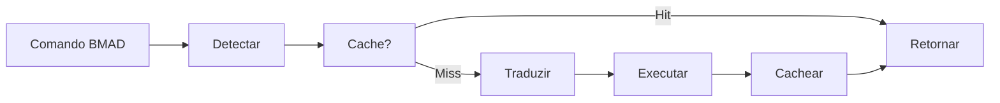

# Story: Implementar Adaptador BMAD→PRISMA

## 📋 Informações da Story
**Epic**: Mapeamento e Configuração Base
**Prioridade**: P0 - Crítica
**Estimativa**: 5 pontos
**Sprint**: 1
**Dependências**: story-1-criar-config-mapeamento

---

## História de Usuário

**Como** usuário BMAD existente
**Quero** continuar usando meus comandos antigos com `*`
**Para** não precisar reaprender tudo imediatamente durante a migração

## Contexto Completo

### Situação Atual
- Usuários executam comandos como `*agent dev`, `*task create`, `*help`
- BMAD processa esses comandos diretamente
- Não existe ponte entre BMAD e PRISMA
- config/mapeamento.yaml já foi criado (story anterior)

### Objetivo
Implementar `ferramentas/conversao/adaptador.md` que intercepta comandos BMAD e os converte para PRISMA, mantendo retrocompatibilidade total.

## Critérios de Aceitação

- [ ] Adaptador detecta comandos começando com `*`
- [ ] Converte comando BMAD para equivalente PRISMA
- [ ] Usa config/mapeamento.yaml para traduções
- [ ] Mantém parâmetros e argumentos intactos
- [ ] Retorna resposta no formato esperado
- [ ] Performance < 100ms de overhead
- [ ] Fallback para BMAD se conversão falhar

## Especificação Técnica

### Componentes do Adaptador

```typescript
class AdaptadorUniversal {
  // 1. Detector de Contexto
  detectarContexto(comando: string): {
    tipo: 'BMAD' | 'PRISMA';
    comando: string;
    parametros: string[];
  }

  // 2. Tradutor
  traduzirComando(comando: string, tipo: string): string {
    // Carrega mapeamento
    // Aplica regras de tradução
    // Retorna comando PRISMA
  }

  // 3. Executor
  executar(comandoPrisma: string): any {
    // Roteia para motor PRISMA
    // Captura resposta
    // Formata se necessário
  }

  // 4. Cache
  cache: Map<string, string>;
}
```

### Fluxo de Processamento



### Regras de Tradução

1. **Comando simples**: `*help` → `/prisma ajuda`
2. **Com agente**: `*agent dev` → `/prisma agente desenvolvedor`
3. **Com parâmetros**: `*task create foo` → `/prisma tarefa criar foo`
4. **Workflow**: `*workflow brownfield` → `/prisma fluxo existente`

## Tarefas de Implementação

1. **Criar estrutura base**
   ```bash
   mkdir -p ferramentas/conversao
   touch ferramentas/conversao/adaptador.md
   ```

2. **Implementar detector de contexto**
   - Regex para identificar comandos BMAD
   - Parser de parâmetros
   - Validação de formato

3. **Implementar tradutor**
   - Carregar config/mapeamento.yaml
   - Aplicar regras de tradução
   - Tratar casos especiais

4. **Implementar executor**
   - Integrar com motor PRISMA
   - Capturar e formatar respostas
   - Gerenciar erros

5. **Adicionar cache**
   - LRU cache para comandos frequentes
   - TTL de 5 minutos
   - Invalidação em mudanças

6. **Criar testes**
   - Testes unitários por componente
   - Testes de integração end-to-end
   - Testes de performance

## Casos de Teste

| Entrada | Saída Esperada | Tipo |
|---------|---------------|------|
| `*help` | `/prisma ajuda` | Básico |
| `*agent dev` | `/prisma agente desenvolvedor` | Agente |
| `*task create` | `/prisma tarefa criar` | Task |
| `*workflow brownfield-service` | `/prisma fluxo existente-servico` | Workflow |
| `*unknown` | Fallback para BMAD | Erro |

## Definição de Pronto

- [x] Adaptador implementado e funcionando
- [x] Todos casos de teste passando
- [x] Performance dentro do limite (<100ms)
- [x] Documentação de uso criada
- [x] Code review aprovado
- [x] Integrado com sistema principal

## Notas Adicionais

- Componente mais crítico da migração
- Deve ser extremamente robusto
- Logging detalhado para debugging
- Considerar feature flag para ativar/desativar
- Preparar para alto volume de requisições

## Riscos e Mitigações

| Risco | Mitigação |
|-------|-----------|
| Performance degradada | Cache agressivo, otimização contínua |
| Tradução incorreta | Testes extensivos, validação manual |
| Comandos ambíguos | Priorizar BMAD em caso de dúvida |
| Falha total | Circuit breaker, fallback direto BMAD |

---
*Story fragmentada do PRD principal*
*Última atualização: 2025-09-16*