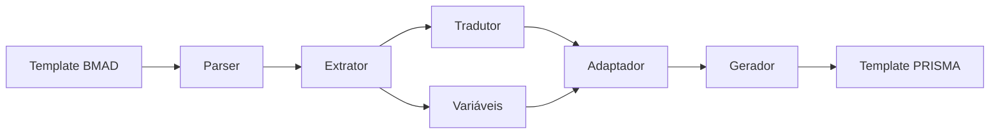

# Story: Criar Conversor de Templates

## 📋 Informações da Story
**Epic**: Ferramentas de Suporte
**Prioridade**: P1 - Alta
**Estimativa**: 3 pontos
**Sprint**: 4
**Dependências**: epic-2-migracao-agentes

---

## História de Usuário

**Como** mantenedor do sistema
**Quero** converter automaticamente templates BMAD para PRISMA
**Para** acelerar a migração e manter consistência

## Contexto Completo

### Situação Atual
- Templates BMAD em `.bmad-core/templates/` em inglês
- Templates PRISMA planejados em `templates/` em português
- Conversão manual propensa a erros
- Muitos templates para migrar

### Objetivo
Criar ferramenta `ferramentas/conversao/conversor.md` que automatiza conversão de templates BMAD→PRISMA, incluindo tradução e adaptação de formato.

## Critérios de Aceitação

- [ ] Conversor lê templates BMAD
- [ ] Traduz conteúdo para português
- [ ] Adapta formato para PRISMA
- [ ] Preserva variáveis e placeholders
- [ ] Gera template PRISMA válido
- [ ] Suporta conversão em lote
- [ ] Relatório de conversão gerado

## Especificação Técnica

### Funcionalidades do Conversor

```typescript
interface Conversor {
  // Conversão individual
  converterTemplate(
    origem: string,    // Path template BMAD
    destino: string    // Path template PRISMA
  ): ResultadoConversao;

  // Conversão em lote
  converterLote(
    diretorioOrigem: string,
    diretorioDestino: string
  ): ResultadoLote;

  // Validação
  validarTemplate(template: string): boolean;

  // Tradução
  traduzirConteudo(conteudo: string): string;
}
```

### Regras de Conversão

```yaml
conversao_templates:
  preservar:
    - variaveis: "{{variavel}}"
    - placeholders: "[PLACEHOLDER]"
    - markdown: "estrutura MD"
    - code_blocks: "```lang```"

  traduzir:
    - titulos: true
    - descricoes: true
    - instrucoes: true
    - comentarios: true

  adaptar:
    - paths: ".bmad-core/* → prisma/*"
    - comandos: "* → /prisma"
    - referencias: "agents → agentes"
```

### Processo de Conversão



## Tarefas de Implementação

1. **Criar estrutura base**
   ```bash
   mkdir -p ferramentas/conversao
   touch ferramentas/conversao/conversor.md
   ```

2. **Implementar parser**
   - Ler arquivos markdown
   - Identificar seções
   - Extrair metadados

3. **Implementar tradutor**
   - Integrar com serviço tradução
   - Manter glossário consistente
   - Preservar termos técnicos

4. **Implementar adaptador**
   - Converter referências
   - Ajustar caminhos
   - Adaptar comandos

5. **Implementar gerador**
   - Criar template PRISMA
   - Validar formato
   - Salvar arquivo

6. **Criar CLI**
   ```bash
   # Conversão individual
   /prisma converter-template origem.md destino.md

   # Conversão em lote
   /prisma converter-templates ./bmad/templates ./prisma/templates
   ```

## Exemplos de Conversão

### Entrada (BMAD)
```markdown
# PRD Template

## Overview
Create a Product Requirements Document

### Instructions
1. Use *agent pm to start
2. Fill in the sections
3. Review with *agent po

{{project_name}}
[DESCRIPTION]
```

### Saída (PRISMA)
```markdown
# Template de PRD

## Visão Geral
Criar Documento de Requisitos do Produto

### Instruções
1. Use /prisma agente gerente-projeto para iniciar
2. Preencha as seções
3. Revise com /prisma agente product-owner

{{nome_projeto}}
[DESCRIÇÃO]
```

## Casos de Teste

| Teste | Entrada | Saída Esperada |
|-------|---------|----------------|
| Tradução básica | "Overview" | "Visão Geral" |
| Preservar variável | "{{var}}" | "{{var}}" |
| Converter comando | "*agent pm" | "/prisma agente gerente-projeto" |
| Manter code block | "```js```" | "```js```" |
| Adaptar path | ".bmad-core/tasks" | "tarefas" |

## Definição de Pronto

- [x] Conversor implementado
- [x] Suporta todos tipos de template
- [x] Testes com cobertura >90%
- [x] CLI funcionando
- [x] Documentação de uso
- [x] Templates convertidos com sucesso

## Notas Adicionais

- Ferramenta crítica para migração
- Deve ser muito confiável
- Log detalhado de conversões
- Permitir revisão manual
- Considerar modo dry-run

## Riscos e Mitigações

| Risco | Mitigação |
|-------|-----------|
| Tradução incorreta | Revisão manual, glossário |
| Perda de formatação | Preservar markdown original |
| Variáveis corrompidas | Regex específico, validação |
| Conversão em massa falha | Processamento individual, rollback |

---
*Story fragmentada do PRD principal*
*Última atualização: 2025-09-16*