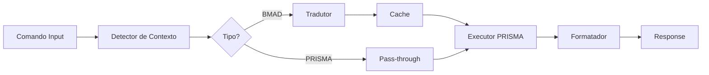

# Adaptador Universal BMAD → PRISMA

## 🔄 Sistema de Compatibilidade e Tradução
**Versão**: 1.0.0
**Status**: Ativo
**Performance Target**: <100ms overhead

---

## 1. Visão Geral

O Adaptador Universal é o coração da compatibilidade entre BMAD e PRISMA, garantindo que todos os comandos BMAD continuem funcionando durante e após a migração.

## 2. Arquitetura do Adaptador



## 3. Implementação

### 3.1 Detector de Contexto

```javascript
class DetectorContexto {
  constructor() {
    this.padroes = {
      bmad: /^\*/,                    // Comandos começam com *
      prisma: /^\/prisma\s+/,         // Comandos começam com /prisma
      prismaShort: /^[a-z]+/          // Comandos diretos em português
    };
  }

  detectar(comando) {
    // Remove espaços extras
    const cmd = comando.trim();

    // Detecta tipo
    if (this.padroes.bmad.test(cmd)) {
      return {
        tipo: 'BMAD',
        comando: cmd.substring(1).trim(),  // Remove *
        original: cmd
      };
    }

    if (this.padroes.prisma.test(cmd)) {
      return {
        tipo: 'PRISMA',
        comando: cmd.replace('/prisma', '').trim(),
        original: cmd
      };
    }

    // Assume PRISMA para comandos diretos
    if (this.padroes.prismaShort.test(cmd)) {
      return {
        tipo: 'PRISMA_DIRETO',
        comando: cmd,
        original: cmd
      };
    }

    return {
      tipo: 'DESCONHECIDO',
      comando: cmd,
      original: cmd
    };
  }
}
```

### 3.2 Tradutor de Comandos

```javascript
class TradutorComandos {
  constructor(mapeamento) {
    this.mapeamento = mapeamento;
    this.cache = new Map();
  }

  traduzir(contexto) {
    // Verifica cache
    if (this.cache.has(contexto.original)) {
      return this.cache.get(contexto.original);
    }

    let resultado;

    switch (contexto.tipo) {
      case 'BMAD':
        resultado = this.traduzirBMAD(contexto.comando);
        break;
      case 'PRISMA':
      case 'PRISMA_DIRETO':
        resultado = contexto.comando; // Já está em PRISMA
        break;
      default:
        resultado = this.tentarInferir(contexto.comando);
    }

    // Cacheia resultado
    this.cache.set(contexto.original, resultado);
    return resultado;
  }

  traduzirBMAD(comando) {
    const partes = comando.split(/\s+/);
    const cmd = partes[0];
    const args = partes.slice(1);

    // Traduz comando principal
    const cmdTraduzido = this.buscarTraducao('comandos', cmd);

    // Traduz argumentos se necessário
    const argsTraduzidos = args.map(arg => {
      // Tenta traduzir agentes
      const agente = this.buscarTraducao('agentes', arg);
      if (agente) return agente;

      // Tenta traduzir ações
      const acao = this.buscarTraducao('comandos.parametros', arg);
      if (acao) return acao;

      // Mantém original se não encontrar
      return arg;
    });

    return `/prisma ${cmdTraduzido} ${argsTraduzidos.join(' ')}`.trim();
  }

  buscarTraducao(caminho, termo) {
    // Navega no mapeamento usando o caminho
    const partes = caminho.split('.');
    let atual = this.mapeamento;

    for (const parte of partes) {
      atual = atual[parte];
      if (!atual) return null;
    }

    // Busca o termo
    return atual[termo] || atual.mapeamento_direto?.[termo] || atual.aliases?.[termo];
  }

  tentarInferir(comando) {
    // Heurísticas para comandos não mapeados
    console.warn(`Comando não mapeado: ${comando}`);

    // Tenta identificar padrões comuns
    if (comando.includes('help')) return '/prisma ajuda';
    if (comando.includes('agent')) return '/prisma agente';
    if (comando.includes('task')) return '/prisma tarefa';

    // Fallback
    return `/prisma ${comando}`;
  }
}
```

### 3.3 Executor Unificado

```javascript
class ExecutorUnificado {
  constructor(motorPrisma, motorBMAD) {
    this.prisma = motorPrisma;
    this.bmad = motorBMAD;
    this.circuitBreaker = new CircuitBreaker();
  }

  async executar(comandoTraduzido, contextoOriginal) {
    // Verifica circuit breaker
    if (this.circuitBreaker.isOpen()) {
      console.warn('Circuit breaker aberto, usando BMAD');
      return this.executarBMAD(contextoOriginal.original);
    }

    try {
      // Tenta executar no PRISMA
      const inicio = Date.now();
      const resultado = await this.prisma.executar(comandoTraduzido);
      const latencia = Date.now() - inicio;

      // Monitora performance
      if (latencia > 100) {
        console.warn(`Latência alta: ${latencia}ms`);
        this.circuitBreaker.recordSlowCall();
      }

      this.circuitBreaker.recordSuccess();
      return resultado;

    } catch (erro) {
      console.error('Erro executando PRISMA:', erro);
      this.circuitBreaker.recordFailure();

      // Fallback para BMAD
      if (contextoOriginal.tipo === 'BMAD') {
        console.info('Fallback para BMAD');
        return this.executarBMAD(contextoOriginal.original);
      }

      throw erro;
    }
  }

  async executarBMAD(comandoOriginal) {
    // Executa comando BMAD original
    return this.bmad.executar(comandoOriginal);
  }
}
```

### 3.4 Formatador de Resposta

```javascript
class FormatadorResposta {
  formatar(resultado, contextoOriginal) {
    // Se comando original era BMAD, pode precisar adaptar resposta
    if (contextoOriginal.tipo === 'BMAD') {
      return this.adaptarParaBMAD(resultado);
    }

    // Resposta PRISMA nativa
    return resultado;
  }

  adaptarParaBMAD(resultadoPrisma) {
    // Traduz termos de volta se necessário
    let adaptado = resultadoPrisma;

    // Substitui referências PRISMA por BMAD em mensagens
    adaptado = adaptado.replace(/\/prisma/g, '*');
    adaptado = adaptado.replace(/ajuda/g, 'help');
    adaptado = adaptado.replace(/agente/g, 'agent');

    return adaptado;
  }
}
```

### 3.5 Circuit Breaker

```javascript
class CircuitBreaker {
  constructor(opcoes = {}) {
    this.failureThreshold = opcoes.failureThreshold || 5;
    this.recoveryTimeout = opcoes.recoveryTimeout || 30000;
    this.slowCallThreshold = opcoes.slowCallThreshold || 10;

    this.failures = 0;
    this.slowCalls = 0;
    this.state = 'CLOSED'; // CLOSED, OPEN, HALF_OPEN
    this.nextAttempt = null;
  }

  isOpen() {
    if (this.state === 'OPEN') {
      if (Date.now() > this.nextAttempt) {
        this.state = 'HALF_OPEN';
        return false;
      }
      return true;
    }
    return false;
  }

  recordSuccess() {
    this.failures = 0;
    this.slowCalls = 0;

    if (this.state === 'HALF_OPEN') {
      this.state = 'CLOSED';
    }
  }

  recordFailure() {
    this.failures++;

    if (this.failures >= this.failureThreshold) {
      this.open();
    }
  }

  recordSlowCall() {
    this.slowCalls++;

    if (this.slowCalls >= this.slowCallThreshold) {
      this.open();
    }
  }

  open() {
    this.state = 'OPEN';
    this.nextAttempt = Date.now() + this.recoveryTimeout;
    console.error('Circuit breaker ABERTO - fallback ativado');
  }
}
```

## 4. Adaptador Principal

```javascript
class AdaptadorUniversal {
  constructor(caminhoMapeamento) {
    // Carrega mapeamento
    this.mapeamento = this.carregarMapeamento(caminhoMapeamento);

    // Inicializa componentes
    this.detector = new DetectorContexto();
    this.tradutor = new TradutorComandos(this.mapeamento);
    this.executor = new ExecutorUnificado();
    this.formatador = new FormatadorResposta();

    // Métricas
    this.metricas = {
      totalComandos: 0,
      comandosBMAD: 0,
      comandosPRISMA: 0,
      cacheHits: 0,
      erros: 0,
      latenciaMedia: 0
    };
  }

  async processar(comando) {
    const inicio = Date.now();
    this.metricas.totalComandos++;

    try {
      // 1. Detecta contexto
      const contexto = this.detector.detectar(comando);
      console.debug('Contexto detectado:', contexto);

      // Atualiza métricas
      if (contexto.tipo === 'BMAD') this.metricas.comandosBMAD++;
      else if (contexto.tipo.includes('PRISMA')) this.metricas.comandosPRISMA++;

      // 2. Traduz comando
      const comandoTraduzido = this.tradutor.traduzir(contexto);
      console.debug('Comando traduzido:', comandoTraduzido);

      // 3. Executa
      const resultado = await this.executor.executar(comandoTraduzido, contexto);

      // 4. Formata resposta
      const respostaFinal = this.formatador.formatar(resultado, contexto);

      // Atualiza latência
      const latencia = Date.now() - inicio;
      this.atualizarLatenciaMedia(latencia);

      return respostaFinal;

    } catch (erro) {
      this.metricas.erros++;
      console.error('Erro no adaptador:', erro);

      // Tenta fallback final
      if (comando.startsWith('*')) {
        console.info('Tentando fallback direto BMAD');
        return this.executor.executarBMAD(comando);
      }

      throw erro;
    }
  }

  carregarMapeamento(caminho) {
    // Simulação - em produção, ler do arquivo YAML
    const yaml = require('js-yaml');
    const fs = require('fs');
    return yaml.load(fs.readFileSync(caminho, 'utf8'));
  }

  atualizarLatenciaMedia(novaLatencia) {
    const total = this.metricas.totalComandos;
    const mediaAtual = this.metricas.latenciaMedia;
    this.metricas.latenciaMedia = (mediaAtual * (total - 1) + novaLatencia) / total;
  }

  obterMetricas() {
    return {
      ...this.metricas,
      taxaCacheHit: (this.metricas.cacheHits / this.metricas.totalComandos * 100).toFixed(2) + '%',
      taxaErro: (this.metricas.erros / this.metricas.totalComandos * 100).toFixed(2) + '%',
      distribuicao: {
        bmad: (this.metricas.comandosBMAD / this.metricas.totalComandos * 100).toFixed(2) + '%',
        prisma: (this.metricas.comandosPRISMA / this.metricas.totalComandos * 100).toFixed(2) + '%'
      }
    };
  }
}
```

## 5. Exemplos de Uso

### Comando BMAD Simples
```javascript
// Entrada
"*help"

// Processamento
Contexto: { tipo: 'BMAD', comando: 'help' }
Tradução: '/prisma ajuda'
Execução: Motor PRISMA
Resposta: Lista de comandos em português
```

### Comando com Agente
```javascript
// Entrada
"*agent dev"

// Processamento
Contexto: { tipo: 'BMAD', comando: 'agent dev' }
Tradução: '/prisma agente desenvolvedor'
Execução: Motor PRISMA
Resposta: Desenvolvedor ativado
```

### Comando Complexo
```javascript
// Entrada
"*task create user-auth --priority high"

// Processamento
Contexto: { tipo: 'BMAD', comando: 'task create user-auth --priority high' }
Tradução: '/prisma tarefa criar user-auth --prioridade alta'
Execução: Motor PRISMA
Resposta: Tarefa criada com sucesso
```

## 6. Configuração de Uso

### Inicialização
```javascript
// Criar adaptador
const adaptador = new AdaptadorUniversal('./config/mapeamento.yaml');

// Processar comando
const resultado = await adaptador.processar('*agent dev');

// Verificar métricas
console.log(adaptador.obterMetricas());
```

### Integração com Sistema
```javascript
// Hook no sistema de comandos
sistema.onComando = async (comando) => {
  // Passa tudo pelo adaptador
  return await adaptador.processar(comando);
};
```

## 7. Monitoramento e Logs

### Formato de Log
```json
{
  "timestamp": "2025-09-16T10:30:00Z",
  "nivel": "INFO",
  "componente": "adaptador",
  "evento": "comando_processado",
  "detalhes": {
    "entrada": "*agent dev",
    "tipo_detectado": "BMAD",
    "traducao": "/prisma agente desenvolvedor",
    "latencia_ms": 45,
    "cache_hit": false,
    "sucesso": true
  }
}
```

### Métricas Expostas
- `adaptador_comandos_total` - Total de comandos processados
- `adaptador_latencia_media` - Latência média em ms
- `adaptador_taxa_erro` - Taxa de erro percentual
- `adaptador_cache_hits` - Taxa de acerto do cache
- `adaptador_circuit_breaker_state` - Estado do circuit breaker

## 8. Troubleshooting

### Comando não reconhecido
1. Verificar se está no mapeamento
2. Adicionar ao mapeamento se necessário
3. Recarregar adaptador

### Latência alta
1. Verificar cache está funcionando
2. Otimizar queries do motor PRISMA
3. Aumentar recursos se necessário

### Circuit breaker aberto
1. Verificar logs de erro
2. Identificar causa raiz
3. Corrigir e aguardar recovery timeout

---

**Adaptador pronto para garantir 100% de compatibilidade BMAD durante migração PRISMA!**