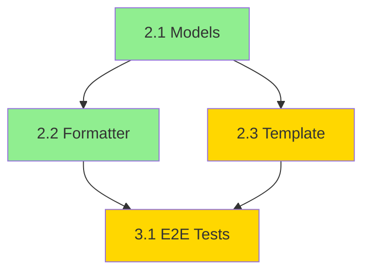

# Command: /parallel-impl

## Description

Executa múltiplas tasks de implementação em paralelo usando agentes implementadores, respeitando dependências.

## Usage

```
/parallel-impl [feature-name] [task-ids] [max-agents]
```

## Parameters

- `feature-name` (obrigatório): Nome da feature (kebab-case)
- `task-ids` (opcional): Lista de task IDs (ex: "2.1,2.2,2.3"). Se não fornecido, analisa dependências e executa tudo automaticamente
- `max-agents` (opcional): Número máximo de agents paralelos (default: 4, max: 8)

## What It Does

1. Lê tasks.md da feature
2. Analisa dependências entre tasks
3. Identifica tasks que podem rodar em paralelo
4. Orquestra múltiplos agentes implementadores
5. Monitora progresso em tempo real
6. Atualiza tasks.md conforme conclusão
7. Agrega resultados e issues

## Execution Strategy

- **Manual**: Usuário especifica tasks exatas
- **Auto**: Sistema analisa dependências e otimiza
- **Wave-based**: Executa waves de tasks independentes

## Examples

```bash
# Executar tasks específicas em paralelo
/parallel-impl export-markdown 2.1,2.2,2.3

# Executar todas tasks automaticamente (análise de dependências)
/parallel-impl export-markdown

# Limitar a 2 agents simultâneos
/parallel-impl export-markdown 2.1,2.2,2.3 2

# Modo auto com 8 agents (máximo)
/parallel-impl export-markdown all 8
```

## Expected Flow - Manual Mode

````
User: /parallel-impl export-markdown 2.1,2.2,2.3
Assistant: Preparando execução paralela de 3 tasks...

📋 Tasks Selecionadas:
- [2.1] Implement data models
- [2.2] Create export formatter
- [2.3] Integrate template engine

🔍 Analisando dependências...

Dependency Graph:
```mermaid
graph LR
  T21[2.1 Data Models] --> T22[2.2 Formatter]
  T21 --> T23[2.3 Template]
````

Execution Plan:
Wave 1: [2.1] (1 agent)
Wave 2: [2.2, 2.3] (2 agents in parallel)

Total Estimated Time: 5h
Parallel Speedup: 40% (vs 8h sequential)

Iniciar execução? (sim/não)

User: sim
Assistant: 🚀 Iniciando execução paralela...

═══════════════════════════════════════════════════
🌊 WAVE 1: Foundation Tasks
═══════════════════════════════════════════════════

[Agent-1] Starting task 2.1 (Data models)
[Agent-1] ⚙️ Implementing data models...
[Agent-1] ✅ Task 2.1 complete (2h)

Files created:

- src/models/Workflow.ts
- src/models/Node.ts
- src/models/Export.ts

═══════════════════════════════════════════════════
🌊 WAVE 2: Parallel Implementation
═══════════════════════════════════════════════════

[Agent-2] Starting task 2.2 (Formatter)
[Agent-3] Starting task 2.3 (Template engine)

[Agent-2] ⚙️ Creating export formatter...
[Agent-3] ⚙️ Integrating template engine...

[Agent-2] ✅ Task 2.2 complete (2.5h)
[Agent-3] ✅ Task 2.3 complete (3h)

Files created (Agent-2):

- src/export/MarkdownFormatter.ts
- src/export/FormatOptions.ts

Files created (Agent-3):

- src/templates/TemplateEngine.ts
- src/templates/DefaultTemplate.ts

═══════════════════════════════════════════════════
📊 Execution Summary
═══════════════════════════════════════════════════

✅ All 3 tasks completed successfully

Total Time: 5.5h (actual)
Estimated: 5h
Efficiency: 91%
Speedup: 38% vs sequential

Files Created: 7 files (+650 lines)
Tests Added: 18 unit tests
Coverage: 85% (target: 80%)

Issues: None

Next Steps:

1. Run tests: /executar-testes export-markdown
2. Code review: /revisar-implementacao export-markdown
3. Continue with remaining tasks

Proceed with tests? (sim/não)

```

## Expected Flow - Auto Mode
```

User: /parallel-impl export-markdown
Assistant: Analisando todas tasks em 'export-markdown'...

📋 Tasks.md Analysis:
Total Tasks: 10
Completed: 7
Remaining: 3

🔍 Dependency Graph:



Legend:

- 🟢 Green: Completed
- 🟡 Yellow: Remaining

Optimal Execution Plan:
┌─────────────────────────────────────────────────┐
│ Wave 1: Already Complete │
│ ✅ Task 1.1, 1.2, 1.3, 2.1, 2.2 │
└─────────────────────────────────────────────────┘

┌─────────────────────────────────────────────────┐
│ Wave 2: Can Start Now (1 task) │
│ 🟡 [2.3] Template engine integration (3h) │
└─────────────────────────────────────────────────┘

┌─────────────────────────────────────────────────┐
│ Wave 3: After Wave 2 (1 task) │
│ ⏳ [3.1] E2E tests (2h) │
│ Dependencies: 2.2 ✅, 2.3 ⏳ │
└─────────────────────────────────────────────────┘

Total Remaining: 2 tasks
Estimated Time: 5h
Parallelization: Limited by dependencies

Using 2 agents (optimal for this workload)

Execute plan? (sim/não)

```

## Real-time Progress Monitor
```

╔═══════════════════════════════════════════════════╗
║ Parallel Execution Monitor ║
╠═══════════════════════════════════════════════════╣
║ ║
║ Wave 1: [■■■■■■■■■■■■■■■■■■■■] 100% Complete ║
║ ║
║ Wave 2: [■■■■■■■■■■■░░░░░░░░░] 55% In Progress ║
║ ║
║ Agent-2 (task 2.2): [■■■■■■■■■░] 90% ║
║ Agent-3 (task 2.3): [■■■░░░░░░░] 30% ║
║ ║
║ Elapsed: 3h 15m | Remaining: ~1h 45m ║
║ ║
║ Recent Activity: ║
║ [15:32] Agent-2: Creating formatter tests ║
║ [15:28] Agent-3: Integrating template engine ║
║ [15:15] Agent-2: Implemented markdown export ║
║ ║
╚═══════════════════════════════════════════════════╝

Press Ctrl+C to stop monitoring (agents continue)

```

## Conflict Detection
```

⚠️ CONFLICT DETECTED

[Agent-2] and [Agent-3] both modified:

- src/export/types.ts

Conflict Resolution:
Option 1: Auto-merge (recommended)
Option 2: Pause and resolve manually
Option 3: Rollback Agent-3 changes

Resolution strategy? (1/2/3)

```

## Agent Coordination
- **Lock files** antes de modificar
- **Detect conflicts** automaticamente
- **Retry strategy** em caso de falha
- **Progress sync** para dependências

## Quality Checks
Após execução paralela:
- ✅ Verify no conflicts
- ✅ Run lint/format
- ✅ Run unit tests
- ✅ Check compilation
- ✅ Update tasks.md

## Performance Metrics
```

Parallel Execution Stats:

Agent Utilization:
Agent-1: ████████████████████ 100% (2h active)
Agent-2: ████████████████░░░░ 80% (2h active, 30m idle)
Agent-3: ████████████░░░░░░░░ 60% (1.5h active, 1h idle)
Agent-4: ░░░░░░░░░░░░░░░░░░░░ 0% (unused)

Bottlenecks:

- Task 2.3 took longer than estimated (3h vs 2h)
- Agent-2 waited 30m for 2.1 to complete

Recommendations:

- Task 2.3 complexity underestimated
- Consider breaking large tasks into subtasks

```

## Safety Features
- **Rollback on failure**: Reverte mudanças se agent falhar
- **Progress checkpoints**: Salva progresso a cada milestone
- **Conflict prevention**: Lock files durante modificação
- **Health monitoring**: Detecta agents travados

## Integration Points
- Auto-chamado em modo `/executar-tarefas auto`
- Pode ser usado standalone para tasks específicas
- Atualiza tasks.md em tempo real
- Triggera testes após conclusão

## Related Commands
- `/executar-tarefas` - Modo sequencial
- `/status-especificacao` - Ver progresso atual
- `/revisar-implementacao` - Revisar após paralelo
- `/executar-testes` - Testar após implementação
```
