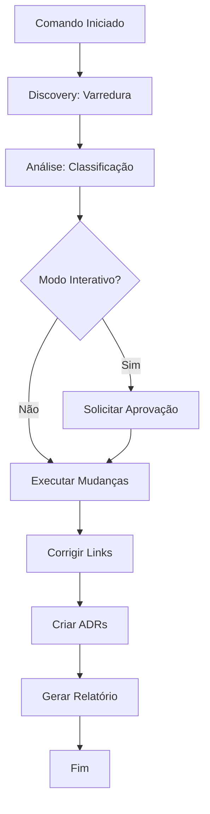

# Comando: Organizar Documentação

**Comando**: `/organizar-documentacao` ou `/organize-docs`

## 📋 Descrição

Este comando realiza uma varredura completa do repositório para identificar, organizar e padronizar toda a documentação existente de acordo com os padrões do sistema Prisma.

## 🎯 Objetivos

1. **Identificar** documentação fora do padrão ou mal localizada
2. **Organizar** arquivos nas pastas corretas
3. **Padronizar** nomenclatura e estrutura
4. **Arquivar** documentação obsoleta
5. **Criar** índices e mapas de navegação
6. **Detectar** decisões arquiteturais não documentadas

## 🔍 Processo de Varredura

### Fase 1: Discovery (Descoberta)

```yaml
varredura:
  locais_principais:
    - "./" (raiz - READMEs soltos)
    - "src/" (documentação inline)
    - "docs/" (documentação de usuário)
    - ".prisma/" (documentação técnica)
    - ".claude/" (documentação legada)

  padrões_busca:
    - "*.md"
    - "*.mdx"
    - "README*"
    - "CHANGELOG*"
    - "CONTRIBUTING*"
    - "LICENSE*"
    - "**/README.md"
    - "**/docs/**"
```

### Fase 2: Análise e Classificação

```yaml
classificacao:
  tipos_documento:
    user_docs:
      audiencia: "Usuários finais, API consumers"
      destino: "docs/"
      exemplos:
        - API reference
        - Setup guides
        - Tutorials

    technical_docs:
      audiencia: "Desenvolvedores, arquitetos"
      destino: ".prisma/projeto/"
      exemplos:
        - Architecture patterns
        - Coding standards
        - Tech stack

    spec_docs:
      audiencia: "Agentes, feature developers"
      destino: ".prisma/projeto/especificacoes/{feature}/"
      exemplos:
        - requirements.md
        - design.md
        - tasks.md

    decision_docs:
      audiencia: "Time futuro, decisores"
      destino: "docs/decisions/"
      exemplos:
        - ADRs
        - Trade-off analysis

    legacy_docs:
      audiencia: "Histórico"
      destino: "docs/archive/"
      exemplos:
        - Tecnologias removidas
        - Features descontinuadas
```

## 📊 Matriz de Decisão

### Como o comando decide onde colocar cada documento:

| Pergunta | Resposta → Ação |
|----------|------------------|
| **Quem é a audiência?** | |
| Usuários finais? | → `docs/` |
| Desenvolvedores internos? | → `.prisma/projeto/` |
| Agentes Prisma? | → `.prisma/projeto/especificacoes/` |
| Time futuro (decisões)? | → `docs/decisions/` |
| **O que documenta?** | |
| Código/implementação? | → `.prisma/projeto/` |
| Produto/features? | → `docs/` |
| Decisões/trade-offs? | → `docs/decisions/` |
| **Está obsoleto?** | |
| Tecnologia removida? | → `docs/archive/{tech}/` |
| Feature descontinuada? | → `docs/archive/{feature}/` |

## 🛠️ Execução do Comando

### Sintaxe

```bash
/organizar-documentacao [opções]
```

### Opções

```yaml
opcoes:
  --dry-run:
    descricao: "Simula execução sem mover arquivos"
    default: false

  --verbose:
    descricao: "Mostra detalhes de cada arquivo processado"
    default: false

  --interactive:
    descricao: "Pergunta antes de cada mudança"
    default: true

  --auto-archive:
    descricao: "Arquiva automaticamente docs obsoletos"
    default: false

  --create-adrs:
    descricao: "Cria ADRs para decisões detectadas"
    default: true

  --fix-links:
    descricao: "Corrige links quebrados automaticamente"
    default: true
```

## 📝 Relatório de Saída

### O comando gera um relatório detalhado:

```markdown
# Relatório de Organização de Documentação

## 📊 Resumo Executivo
- Total de arquivos analisados: X
- Arquivos movidos: Y
- Arquivos arquivados: Z
- ADRs criados: W
- Links corrigidos: V

## 🔍 Documentação Encontrada

### ✅ Bem Localizados (X arquivos)
- [Lista de arquivos já no lugar correto]

### ⚠️ Mal Localizados (Y arquivos)
| Arquivo | Local Atual | Local Correto | Razão |
|---------|-------------|---------------|--------|
| ... | ... | ... | ... |

### 🗄️ Para Arquivar (Z arquivos)
| Arquivo | Motivo | Destino Archive |
|---------|--------|-----------------|
| ... | Tecnologia removida | docs/archive/... |

## 🔗 Links Quebrados Detectados
- Total: X links quebrados
- Corrigidos automaticamente: Y
- Requerem atenção manual: Z

## 📝 ADRs Detectados

### Decisões Não Documentadas
1. **Migração Prisma → Drizzle**
   - Detectado em: [arquivos]
   - ADR sugerido: 004-migrate-to-drizzle.md

2. **Remoção NextAuth**
   - Detectado em: [arquivos]
   - ADR sugerido: 005-remove-nextauth.md

## 🎯 Ações Tomadas
1. [Lista de todas as ações executadas]

## ⚠️ Ações Pendentes
1. [Lista de ações que requerem intervenção manual]

## 📚 Estrutura Final
```
[Visualização em árvore da nova estrutura]
```
```

## 🤖 Agentes Utilizados

O comando utiliza múltiplos agentes em paralelo:

```yaml
agentes:
  fase_discovery:
    - auditor: "Analisa qualidade e localização atual"
    - conformista: "Verifica conformidade com padrões"

  fase_classificacao:
    - documentador: "Classifica tipo de documentação"
    - arquiteto: "Identifica decisões arquiteturais"

  fase_organizacao:
    - documentador: "Move e organiza arquivos"
    - conformista: "Valida nova estrutura"

  fase_finalizacao:
    - documentador: "Cria índices e navegação"
    - decisor: "Aprova mudanças finais"
```

## 🔄 Workflow de Execução



## 💡 Exemplos de Uso

### Exemplo 1: Varredura Completa com Aprovação

```bash
/organizar-documentacao --interactive --verbose
```

Output esperado:
```
🔍 Iniciando varredura de documentação...

📁 Analisando ./README.md
   ✅ Bem localizado (documentação raiz)

📁 Analisando ./src/services/README.md
   ⚠️ Mal localizado
   → Deveria estar em: .prisma/projeto/architecture/services.md
   → Razão: Documentação técnica de arquitetura

   Mover arquivo? (y/n): y
   ✅ Movido com sucesso

[... continua para cada arquivo ...]

📊 Relatório final gerado em: .prisma/relatorios/doc-organization-2025-01-15.md
```

### Exemplo 2: Dry Run para Análise

```bash
/organizar-documentacao --dry-run
```

Output esperado:
```
🔍 Modo DRY RUN - Nenhum arquivo será movido

Análise completa:
- 45 arquivos bem localizados
- 12 arquivos mal localizados
- 8 documentos obsoletos para arquivar
- 3 ADRs não documentados detectados

Execute sem --dry-run para aplicar mudanças.
```

### Exemplo 3: Correção Automática

```bash
/organizar-documentacao --interactive=false --auto-archive --fix-links
```

## 🎯 Regras de Detecção

### Detectar Documentação Obsoleta

```yaml
obsoleto_quando:
  - arquivo_contém: ["Prisma ORM", "NextAuth", "Payload CMS"]
  - path_contém: ["prisma/", "auth/", "payload/"]
  - não_referenciado_por: 30_dias
  - tecnologia_em: ".prisma/configuracoes/prisma.yaml → migrations.completed"
```

### Detectar ADRs Não Documentados

```yaml
adr_triggers:
  keywords:
    - "migrate from X to Y"
    - "remove", "abandon", "deprecate"
    - "choosing between", "decided to use"
    - "doesn't work with", "incompatible"

  ação:
    - Extrair contexto
    - Gerar ADR template
    - Solicitar aprovação
```

### Detectar Links Quebrados

```yaml
link_check:
  tipos:
    - Links internos (arquivo não existe)
    - Links de seção (#header não existe)
    - Links externos (404)
    - Referencias de código (arquivo movido)
```

## ⚙️ Configuração

### Arquivo de Configuração: `.prisma/configuracoes/doc-organizer.yaml`

```yaml
doc_organizer:
  enabled: true

  scan_paths:
    - "./"
    - "src/"
    - "docs/"
    - ".prisma/"

  ignore_paths:
    - "node_modules/"
    - ".git/"
    - "dist/"
    - "build/"

  rules:
    enforce_kebab_case: true
    require_readme: true
    max_file_size_mb: 10

  archive:
    auto_archive_after_days: 90
    keep_archive_for_days: 365

  adr:
    auto_generate: true
    require_approval: true
    template: "default"

  reporting:
    generate_report: true
    report_path: ".prisma/relatorios/"
    include_metrics: true
```

## 📈 Métricas de Sucesso

O comando rastreia:

1. **Cobertura de Documentação**: % de features documentadas
2. **Qualidade de Links**: % de links funcionais
3. **Conformidade**: % seguindo padrões
4. **Atualização**: Idade média dos documentos
5. **ADR Coverage**: % de decisões documentadas

## 🚨 Tratamento de Erros

```yaml
erros_comuns:
  arquivo_em_uso:
    ação: "Tentar novamente ou pular"

  permissão_negada:
    ação: "Solicitar permissões ou pular"

  link_ambíguo:
    ação: "Solicitar clarificação do usuário"

  conflito_merge:
    ação: "Manter ambas versões para revisão manual"
```

## 🔐 Segurança

- Nunca move arquivos críticos (.env, credentials, etc)
- Cria backup antes de mudanças grandes
- Mantém histórico de todas as mudanças
- Permite rollback completo

## 🎉 Benefícios

1. **Organização**: Documentação sempre no lugar certo
2. **Descoberta**: Fácil encontrar qualquer documento
3. **Manutenção**: Links sempre funcionais
4. **Compliance**: Padrões sempre seguidos
5. **Histórico**: Decisões sempre documentadas

---

**Nota**: Este comando é essencial para manter a saúde da documentação do projeto e deve ser executado regularmente (sugestão: semanalmente ou após grandes mudanças).